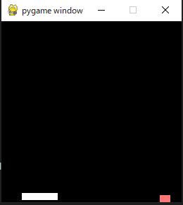

# Purpose
this repogitory is run to study reinforcement learning.
thus, we apply the tech to control Self-discipline system.

# contents
1. basic: that is the code to check fundamental reinforcement theology.
2. documents: that is the note of reinforcement-learning.
3. pole-problem: that is the code to try the feinforcement learning.

# cite
in this repogitory, oss 'pygame-learning-environment' is used.
[https://github.com/ntasfi/PyGame-Learning-Environment](https://github.com/ntasfi/PyGame-Learning-Environment) 

# References
when studying RL, I refer to any other web-site.  
show the reference site.  

[AI compass](https://ai-compass.weeybrid.co.jp/)
this site indicates many ai knowledge with insight.

[星の本棚](https://yagami12.hatenablog.com/entry/2019/02/22/210608)
this site shows nice tips about reinforcement learning.
