# Purpose

this repogitory is run to study reinforcement learning.
thus, we apply the tech to control Self-discipline system.

# contents

1. basic: that is the code to check fundamental reinforcement theology.
2. documents: that is the note of reinforcement-learning.
3. pole-problem: that is the code to try the feinforcement learning.

Using Environment

- Open Gym
- Or Gym

## problems

### ball cather

this is the behavior of q-learning agent.

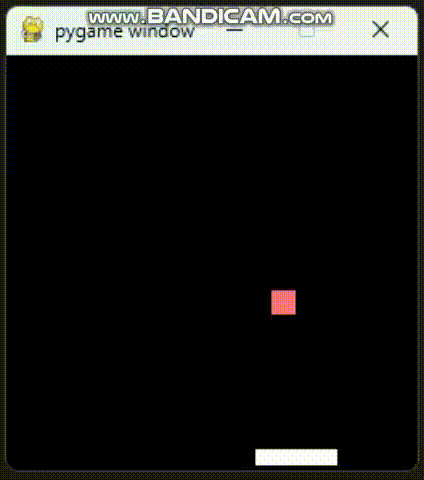

### pole cart

with using dqn, the motion is completed.

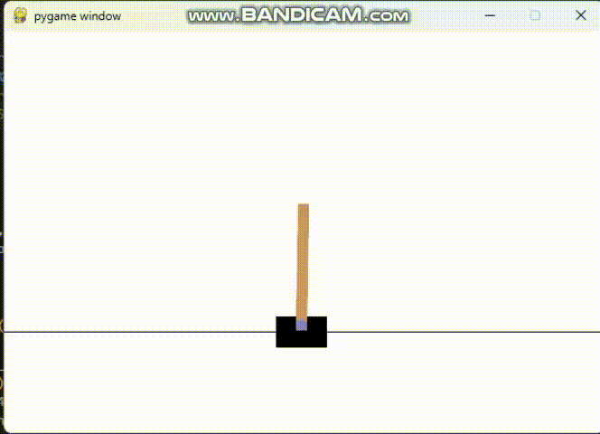

### pendulum

this is the behavior of SAC.

### luna-landing

this is the behavior of SAC.
DDPG can't work well.

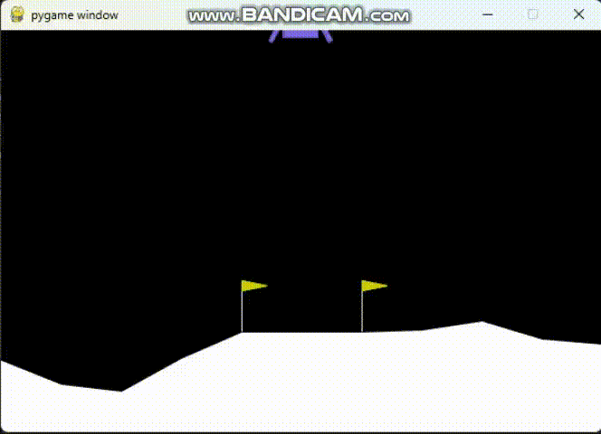

### robo-walking

this is the behavior of actor-critic.

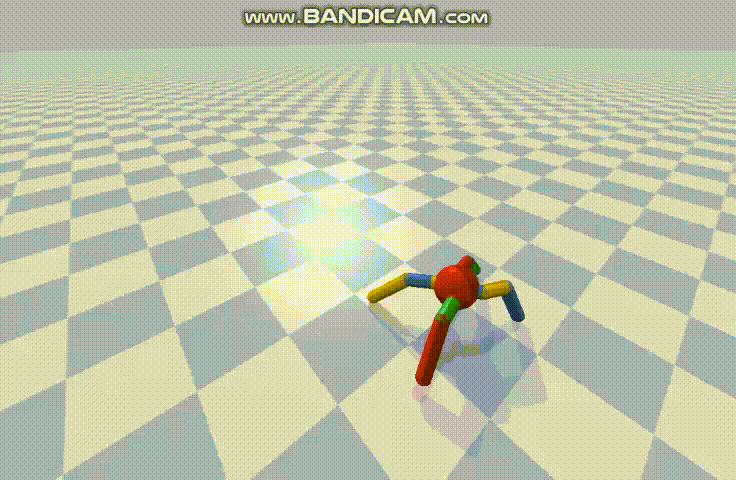

### BipedalWalkerHardcore
with using sac, the agent gradually walk...

the agent of this walker is based on just fnn model.  
essencially, the progress of train isn't proceed well.  

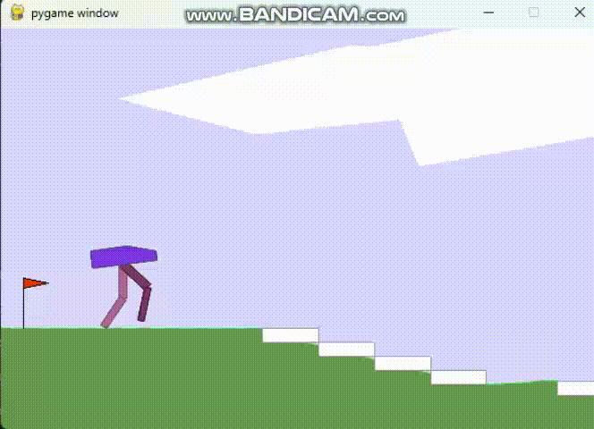

at the next, the agent is composed based on transformer.  
this agent size isn't large.  
but, the progress of train proceed as expected.  
so that, i find ,in RL , the architecture is important.  
unfortunately, the agent don't use both legs.
this would be owing to short of exploration.

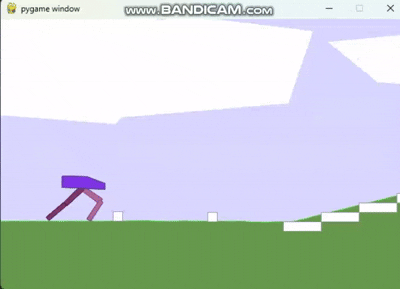

### TSP

this is the behavior of PointerNet.
not good....

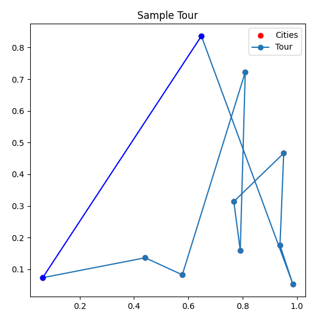

this is the result with using 3 methods.

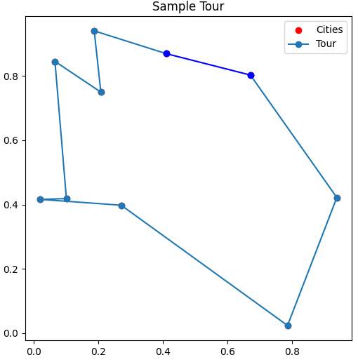

### JSSP
using Actor-critc framework.
and, the model is composed with Transformer Network.
learn how short the total job become.

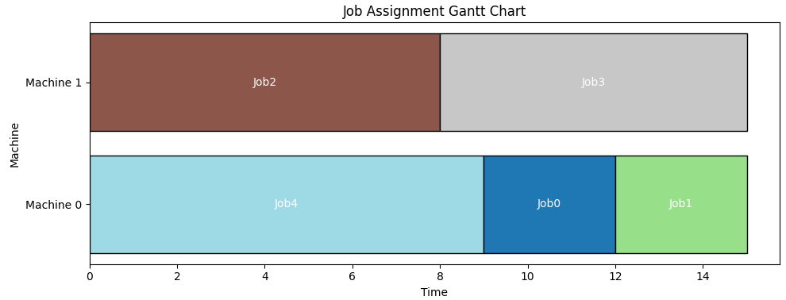

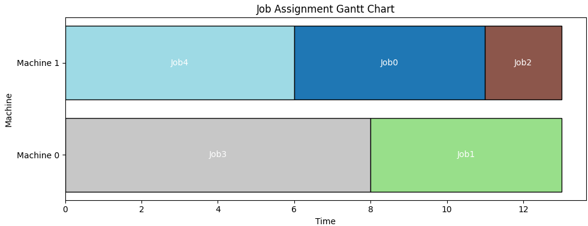

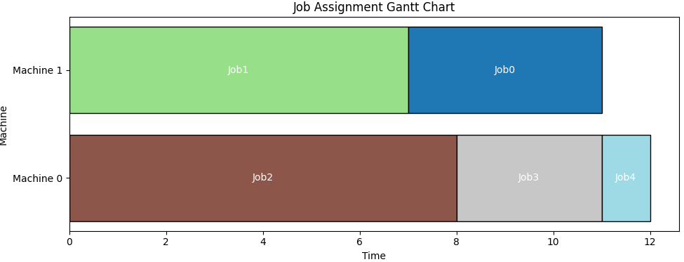

### imitation learning - behavior clone

when imitation learning is utilized, i check the effect.  
in this case, reward is improved when using imitation learning.  

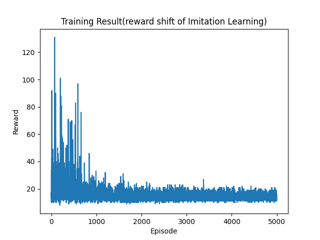

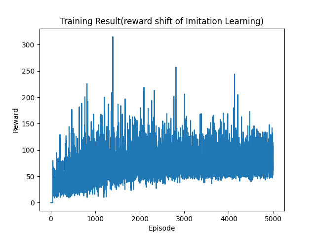

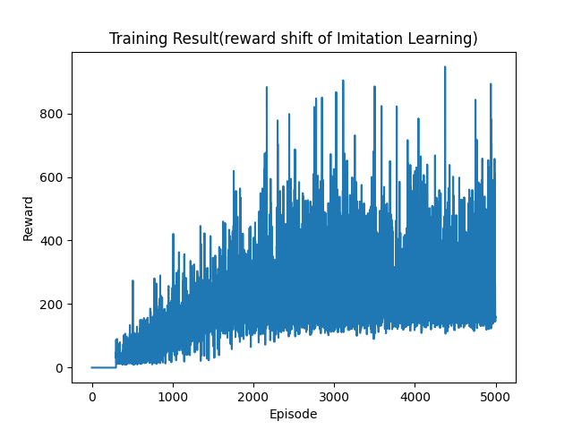

### IRL-GAIL
with using stable_baselines3 and imitation, agent is trained with gail.
the reward is given as below.

| trial no | reward |
| ------- | ------- |
| 1st | 289.0 |
| 2nd | 295.0 |
| 3rd | 278.0 |

### arranging boxes

when using ddqn, ai agent can arrange boxes toward restricted space.

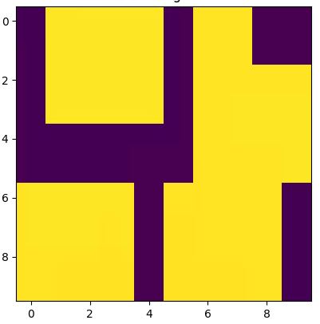

# cite

in this repogitory, oss 'pygame-learning-environment' is used.
[https://github.com/ntasfi/PyGame-Learning-Environment](https://github.com/ntasfi/PyGame-Learning-Environment)

deep mind archives!

very nice site!

[google-deepmind/deepmind-research: This repository contains implementations and illustrative code to accompany DeepMind publications](https://github.com/google-deepmind/deepmind-research/tree/master)

# References

when studying RL, I refer to any other web-site.
show the reference site.

[AI compass](https://ai-compass.weeybrid.co.jp/)
this site indicates many ai knowledge with insight.

[星の本棚](https://yagami12.hatenablog.com/entry/2019/02/22/210608)
this site shows nice tips about reinforcement learning.
