# [Purpose](https://github.com/Shinichi0713/Reinforce-Learning-Study)

A study repository for Reinforcement Learning (RL) and Multi-Agent Reinforcement Learning (MARL) with Python implementations (DQN, SAC, QMIX, CTDE). Includes theory notes, code examples (OpenAI Gym, PettingZoo), and applications to self-discipline systems.

# contents

1. basic: that is the code to check fundamental reinforcement theology.
2. docs: that is the note of reinforcement-learning.
3. multi-agent: codes and result of experiments regarding MARL.

Using Environment

- Open Gym
- Or Gym
- Muti Agent

# my work

I am writing a book on reinforcement learning.

The book is designed for beginners to learn reinforcement learning step by step, covering everything from the basics to practical applications.

It is published on Amazon Kindle, so please feel free to check it out if you are interested.

[Amazon.co.jp: 実践!強化学習入門: Pythonで動かしながら理解する AI学習書 (AI関係書籍) eBook : 3 Sons Lover: Kindleストア](https://www.amazon.co.jp/%E5%AE%9F%E8%B7%B5-%E5%BC%B7%E5%8C%96%E5%AD%A6%E7%BF%92%E5%85%A5%E9%96%80-Python%E3%81%A7%E5%8B%95%E3%81%8B%E3%81%97%E3%81%AA%E3%81%8C%E3%82%89%E7%90%86%E8%A7%A3%E3%81%99%E3%82%8B-AI%E5%AD%A6%E7%BF%92%E6%9B%B8-AI%E9%96%A2%E4%BF%82%E6%9B%B8%E7%B1%8D-ebook/dp/B0FH4VKHLJ)

## My Codes

The repository of my scratch code is stored in next URL:

[Shinichi0713/Reinforce-Learning-Study: this is the codes which is in accordance with reinforcement-learning](https://github.com/Shinichi0713/Reinforce-Learning-Study)

On the other hand, I have LLM repository also.

[Shinichi0713/LLM-fundamental-study: this site is the fundamental page of LLM-mechanism](https://github.com/Shinichi0713/LLM-fundamental-study)

Please look.

## problems

### Gird World with Dyna-Q

with using Dyna-Q, train agent to update the model.

below shows trainstion of reward vs episode.

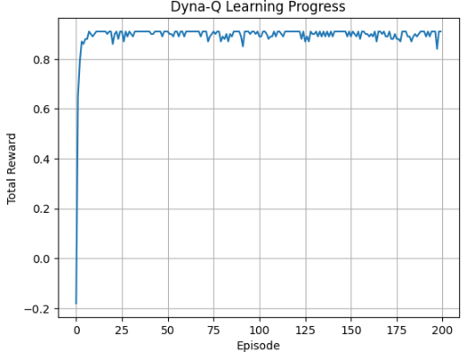

### ball cather

this is the behavior of q-learning agent.

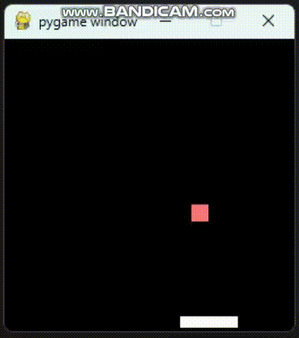

### pole cart

with using dqn, the motion is completed.

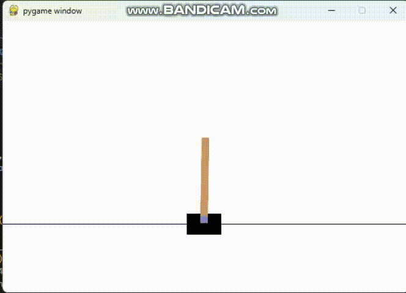

### pendulum

this is the behavior of SAC.

### luna-landing

this is the behavior of SAC.
DDPG can't work well.

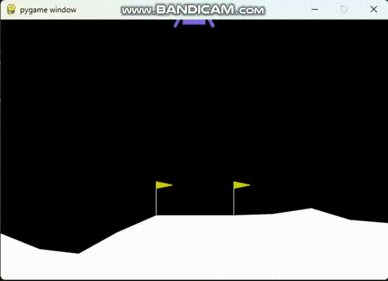

### robo-walking

this is the behavior of actor-critic.

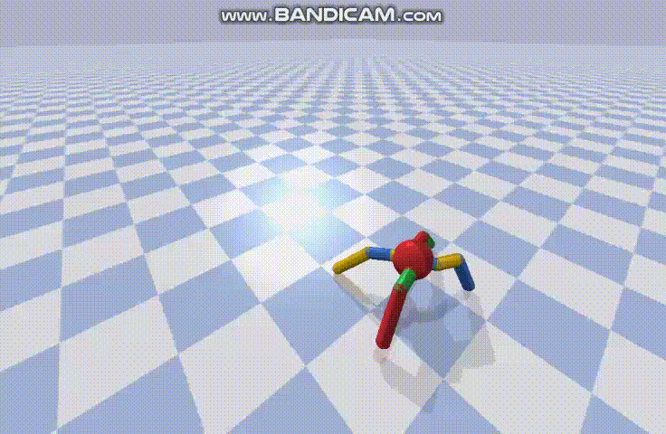

### BipedalWalkerHardcore

with using sac, the agent gradually walk...

the agent of this walker is based on just fnn model.
essencially, the progress of train isn't proceed well.

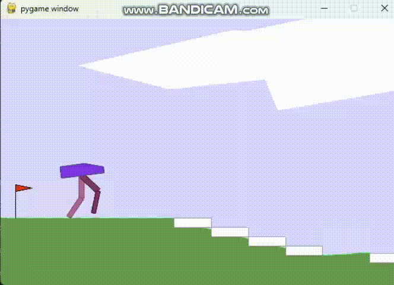

at the next, the agent is composed based on transformer.
this agent size isn't large.
but, the progress of train proceed as expected.
so that, i find ,in RL , the architecture is important.
unfortunately, the agent don't use both legs.
this would be owing to short of exploration.

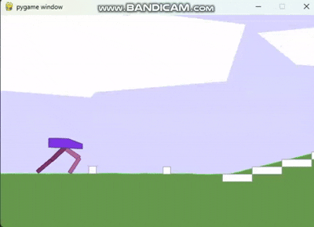

### TSP

this is the behavior of PointerNet.
not good....

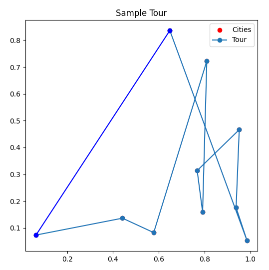

this is the result with using 3 methods.

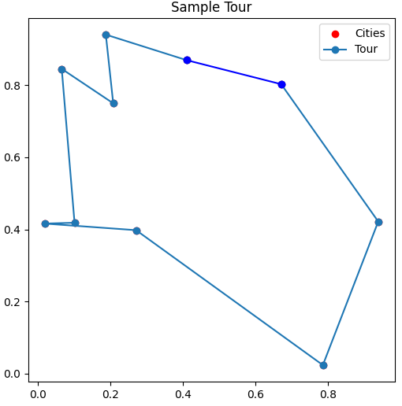

### JSSP

using Actor-critc framework.
and, the model is composed with Transformer Network.
learn how short the total job become.

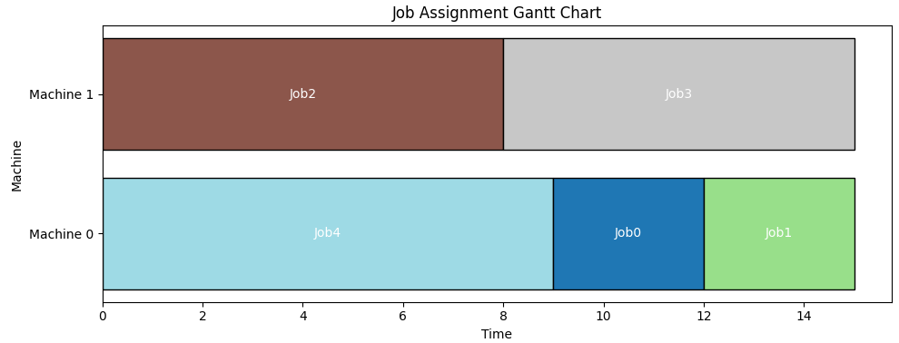

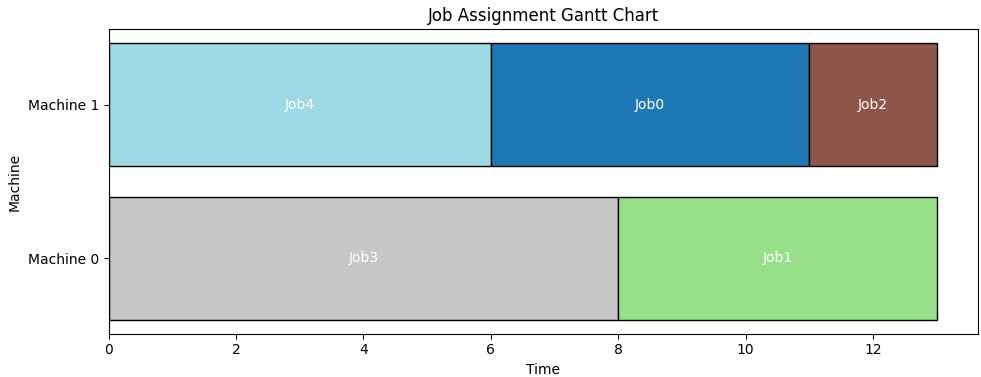

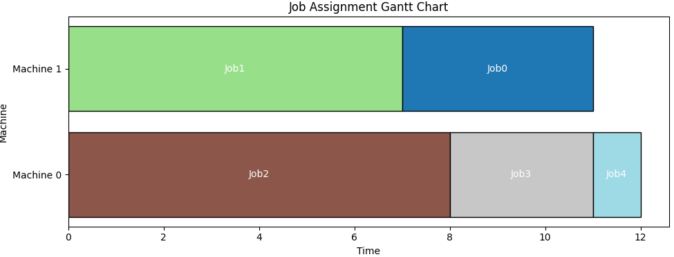

### imitation learning - behavior clone

when imitation learning is utilized, i check the effect.
in this case, reward is improved when using imitation learning.

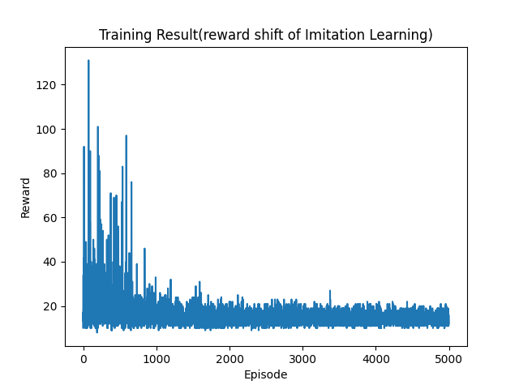

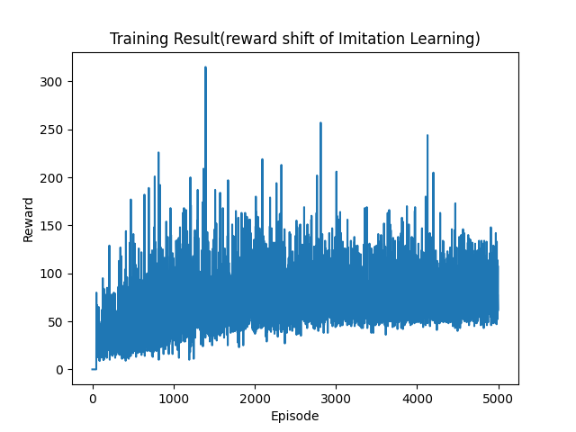

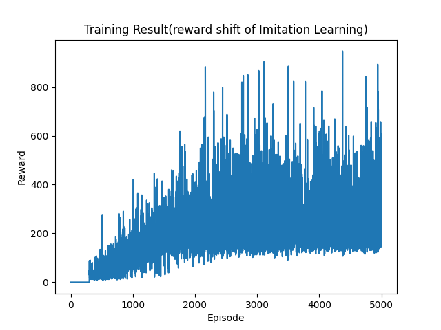

### IRL-GAIL

with using stable_baselines3 and imitation, agent is trained with gail.
the reward is given as below.

| trial no | reward |
| -------- | ------ |
| 1st      | 289.0  |
| 2nd      | 295.0  |
| 3rd      | 278.0  |

### arranging boxes

when using ddqn, ai agent can arrange boxes toward restricted space.

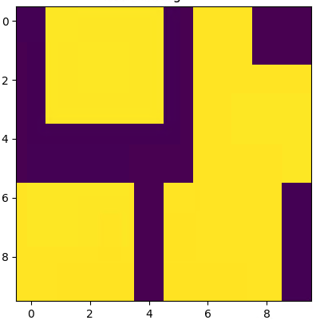

### Summary: Reward Design

**Key idea:**  
In reinforcement learning (RL), tasks where rewards only come after many actions are much harder to learn than tasks where rewards arrive quickly. This is because delayed rewards weaken the learning signal and make it hard to know which actions were actually good.

__1. Intuitive reasons why delayed rewards are hard__

- **Credit assignment problem:**  
  When a sequence of actions leads to a reward only at the end, it’s unclear which specific actions contributed most to success. The agent struggles to assign “credit” correctly to earlier actions.

- **Exploration becomes inefficient:**  
  If rewards are rare and delayed, the agent may never stumble upon the right sequence of actions by random exploration. It’s like trying to learn chess when you only find out if you won dozens of moves later.

- **Weak learning signal:**  
  Temporal difference (TD) errors and policy gradients become small when rewards are sparse and delayed, slowing down learning and making updates less informative.

__2. Mathematical explanation (MDP perspective)__

- In an MDP, the discounted return is  
  $$
  G_t = \sum_{k=0}^\infty \gamma^k R_{t+k+1}.
  $$
- If a large reward $R_T$ only appears after many steps $T$, then  
  $$
  G_0 \approx \gamma^{T-1} R_T.
  $$
- With discount factor $\gamma < 1$, $\gamma^{T-1}$ decays quickly as $T$ grows:
  - Large $T$ → small $G_0$ → weak value function signal.
- TD error $\delta_t = R_{t+1} + \gamma V(S_{t+1}) - V(S_t)$ becomes dominated by value differences rather than rewards, reducing the influence of actual reward feedback.

__3. Policy gradient perspective__

- Policy gradient updates scale roughly with $G_t$:
  $$
  \nabla_\theta J(\theta) \propto \mathbb{E}_\pi[G_t \nabla_\theta \log \pi_\theta(A_t \mid S_t)].
  $$
- If $G_t$ is small (due to delayed rewards), gradients are small → slow learning.
- Variance also increases, making learning unstable.

__4. Experimental result__

You compared two reward designs in a robot delivery task:

- **Case 1:** Reward only when grasping an object and when delivering it to the goal.
- **Case 2:** Additional shaping rewards when the robot adjusts its output toward the object or goal.

Result:  
Case 2 (with shaping rewards) learned successfully; the robot learned to grasp objects and move them to the goal.  
Case 1 (only sparse terminal rewards) failed to even learn grasping reliably.

### Multi-Agent example

We implemented DQN training using two Rock-Paper-Scissors agents as a multi-agent example problem. We visualized two aspects:

The trend of Agent 1's average reward (Learning stability).

The trend of Agent 1's final Q-values (Learned action strategy).

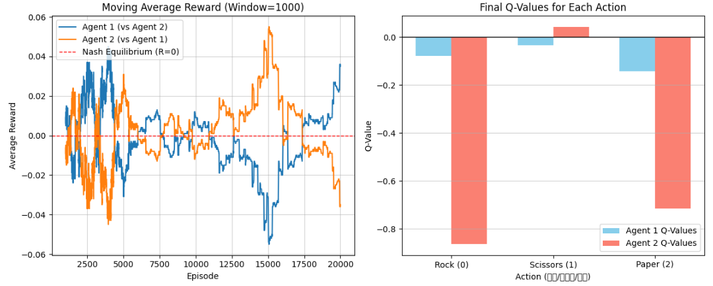

MARL implementation is descripted as below URL:

[Reinforce-Learning-Study/miulti-agent/readme.md at main · Shinichi0713/Reinforce-Learning-Study](https://github.com/Shinichi0713/Reinforce-Learning-Study/blob/main/miulti-agent/readme.md)

#### MARL warehouse

new theme is considering.
the environment is displayed as next.

I have been working on the Warehouse Problem, where the task is to have two agents deliver items to designated locations within a warehouse.

Initially, I approached this using QMIX, but I encountered a situation where either both agents would fail to move, or only one of them would operate. I concluded that a lack of exploration was the primary cause.

After switching to HSAC (Heterogeneous Soft Actor-Critic), the agents began to cooperate and function properly. This experience has truly highlighted the critical importance of exploration in reinforcement learning.

with using QMIX, the agents doesn't work.

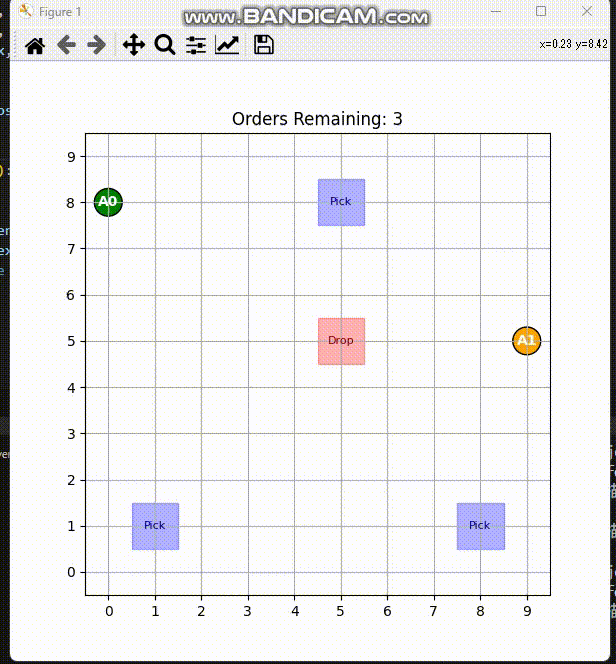

with using HASAC, lulti-agent systems have started to operate in coordination with each other.

#### MARL adventure

This is a cooperative Multi-Agent Reinforcement Learning (MARL) example focusing on **information sharing** and **continuous coordination**. The core challenge is to efficiently cover an unknown area by pooling decentralized knowledge.

__Environment and Setup__

| Item                  | Details                                                                                                                                       |
| :-------------------- | :-------------------------------------------------------------------------------------------------------------------------------------------- |
| **Environment** | An**unknown grid map** representing a disaster site where critical targets are hidden.                                                  |
| **Observation** | Each drone has a**very narrow sensor range** (e.g., only adjacent cells), leading to significant local **partial observability**. |
| **Agents**      | Multiple search drones (or mobile sensor robots).                                                                                             |
| **Actions**     | Movement (Up, Down, Left, Right, Stay).                                                                                                       |
| **Goal**        | **Maximize map coverage efficiency** by minimizing the time required to fully explore the entire map (minimizing unexplored area).      |

__Learning Objectives and Cooperation Points__

1. Information Sharing and Distributed Knowledge

* **Necessity for Coordination:** Without sharing information about previously explored areas, agents will inefficiently perform **redundant searches**.
* **Learning Goal:** Agents must learn to integrate their local observations into a **common global knowledge map (shared memory)** and use this map to choose a strategy that prioritizes moving toward **unexplored locations**.

2. Optimal Coverage and Spatial Load Balancing

* **Nature of Coordination:** This task emphasizes **positive cooperation** ("dividing up the unexplored area") rather than negative cooperation ("avoiding collisions").
* **Learning Goal:** The drone swarm must learn a **spatial load-balancing strategy**: maintaining an **appropriate distance** from each other to avoid overcrowding while cooperatively segmenting the search area to maximize the overall coverage rate.

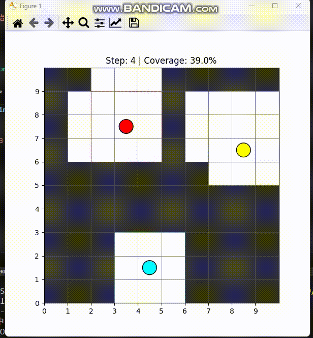

## Fundamental Knowledge

### Roles of Memory in Deep Reinforcement Learning (DRL)

Memory—often referred to as a **Replay Buffer** or **Experience Replay**—is essential in DRL for three primary mathematical and practical reasons: **stabilizing training** and **improving efficiency**.

#### 1. Breaking Data Correlation (I.I.D. Assumption)

Deep learning models (neural networks) are optimized under the assumption that training data is **Independent and Identically Distributed (i.i.d.)**.

* **The Problem:** In reinforcement learning, an agent acts sequentially, meaning the "current state" is highly correlated with the "previous state." Training directly on this sequential data causes the network to overfit to specific temporal patterns, leading to unstable training or divergence.
* **The Role of Memory:** By storing past experiences in memory and performing **random sampling**, we break the temporal correlations, satisfying the i.i.d. assumption and stabilizing the learning process.

#### 2. Reuse of Valuable Experiences (Improving Sample Efficiency)

In RL, obtaining a "reward" often requires many steps, making experiences with significant rewards extremely valuable.

* **The Problem:** If data is discarded immediately after a single action, the agent would need an enormous amount of trial and error to replicate that same "success story."
* **The Role of Memory:** Storing rare successes or critical failures allows the agent to learn from them repeatedly, enabling it to become proficient with fewer total interactions with the environment.

### 3. Enabling Off-policy Learning

Algorithms like DQN (Deep Q-Network) utilize **Off-policy learning**, which allows the agent to learn from data generated by a version of itself that is different from its current policy (i.e., its past self or other agents).

* **The Role of Memory:** By looking back at historical records ("I acted this way before and failed"), the agent can evaluate and refine its current decision-making strategy.

## MARL

## Centralized vs. Decentralized Learning

In Reinforcement Learning, "Centralized Learning" and "Decentralized Learning" refer to structural differences in **"who processes the information and where the command center for learning is located."**

The following outlines their characteristics within the context of Multi-Agent Reinforcement Learning (MARL).

### 1. Centralized Training

This style involves **collecting data (observations, actions, rewards) from all agents into a single location to train a single, massive intelligence.**

* **Mechanism:** Learning is based on a "Global State" that integrates information from all agents. To use a football (soccer) analogy, it is like a manager overseeing the entire pitch and giving synchronized instructions to all players.
* **Pros:** * Directly learns complex interactions between agents (e.g., "Since Agent A moved right, I will move left").
* Theoretically, it is the most likely to reach an optimal global solution.
* **Cons:** * **Curse of Dimensionality:** As the number of agents increases, the combinations of information grow exponentially, making computation unfeasible.
* **Execution Constraints:** Since it assumes access to everyone’s information during training, it often requires constant communication between all agents during execution.

### 2. Decentralized Training

This is a style where **each agent learns independently based solely on its own experience.**

* **Mechanism:** Other agents are treated as "part of the environment" (like moving obstacles), and each agent updates its network individually.
* **Pros:** * High scalability because the computational load is distributed per agent.
* Resilient to privacy concerns and communication limits since interaction with others is not required for training.
* **Cons:** * **Non-stationarity Problem:** Because others change their behavior while an agent is learning, the "rules of the world" appear to change arbitrarily from the AI's perspective, making learning highly unstable.
* Cooperative behavior relies on chance, making high-level coordination difficult to achieve.

### 3. Hybrid: Centralized Training, Decentralized Execution (CTDE)

Currently the most popular approach for tasks like cooperative drone control, **CTDE** combines the best of both worlds.

* **Concept:** **"Practice (Training) involves everyone reviewing game tapes together to reflect, but the Match (Execution) is handled by each individual's judgment."**
* **Features:** * **Training:** Centralized training is performed, refining the "Critic" by considering the actions of others.
* **Execution:** Decentralized execution is performed, where the "Actor" acts quickly based only on its own local sensor data.
* **Representative Examples:** QMIX, MADDPG.

### Summary Comparison

| Feature                      | Centralized                   | Decentralized                | CTDE (Hybrid)                      |
| ---------------------------- | ----------------------------- | ---------------------------- | ---------------------------------- |
| **Data Aggregation**   | Always centralized            | Distributed per agent        | Centralized only during training   |
| **Learning Stability** | High (Global view)            | Low (Others are moving)      | Medium to High (Balanced)          |
| **Execution Autonomy** | Low (Requires comms)          | High (Operates alone)        | High (Operates alone)              |
| **Primary Use Cases**  | Small-scale precision control | Large-scale independent envs | **Multi-drone coordination** |

**Conclusion:** Regarding the choice between centralized or decentralized, the modern MARL consensus is that **CTDE (Centralized Training, Decentralized Execution)** is the most efficient and practical solution.

## MARL Learning Methodologies

The major frameworks for cooperative learning in MARL are categorized into three types based on how they handle information and the learning process. While **CTDE** is the current standard, here are the characteristics of each:

### 1. Decentralized Training, Decentralized Execution (DTDE)

The simplest form where each agent treats others as "part of the environment" (like moving walls) and learns/executes independently.

* **Mechanism:** Each agent runs a single-agent algorithm (e.g., DQN, PPO) independently (Independent RL).
* **Pros:** Simple algorithm; the structure remains the same regardless of the number of agents.
* **Challenges:** Environment instability (non-stationarity) makes convergence difficult.

### 2. Centralized Training, Centralized Execution (CTCE)

Treats all agents as one "giant AI," processing all observations and actions collectively.

* **Mechanism:** All observations are merged into one input vector, and all actions are defined in one giant joint action space.
* **Pros:** Theoretically can learn the most optimal cooperative combinations.
* **Challenges:** Curse of dimensionality makes computation impossible as agents increase; requires constant communication during execution.

### 3. Centralized Training, Decentralized Execution (CTDE)

**The current de facto standard.** It shares information only during training and maintains independence during execution.

* **Mechanism:** * **Training (Centralized):** A Critic or Mixing Network "cheats" by looking at the states and actions of all agents to accurately evaluate each action.
* **Execution (Decentralized):** Each agent uses only its own network (Actor) to decide actions based on local info.
* **Representative Methods:** **MADDPG** (Individual critics see others' actions), **QMIX/VDN** (Individual values integrated into a team value).
* **Pros:** Stable learning; works in environments with weak communication infrastructure (e.g., field-deployed drones).

### 4. Communication-based Learning

A framework where agents encourage cooperation by sending "messages" to one another.

* **Mechanism:** Includes a network layer to exchange vectorized information (communication protocols) before selecting an action.
* **Pros:** Allows agents to know the status of teammates outside their field of view, enabling high-level coordination.
* **Representative Methods:** **CommNet**, **DIAL**.

### 5. Hierarchical / Role-based Learning

Dividing agents into a "Manager" (commander) and "Workers" (executors), or assigning specific "Roles."

* **Mechanism:** Separates the AI that sets long-term goals from the AI that performs specific operations (e.g., drone movement).
* **Pros:** Efficiently learns complex, long-term tasks.
* **Representative Methods:** **ROMA** (Dynamic role learning).

For more detail, please come in [here](https://github.com/Shinichi0713/Reinforce-Learning-Study/tree/main/miulti-agent).

## atari boxing

Here is a concise summary of why the agent approaches the opponent but fails to punch, along with potential fixes:

### **Probable Causes**

* **Reward Traps (Local Optima):** The proximity reward might be too "easy" to earn. The agent learns that staying near the opponent is a safe way to maximize rewards without the risk of missing a punch or being counter-attacked.
* **Sparse Scoring Reward:** Actual hits that result in game points are rare. The agent hasn't yet linked the "punch" action with the "score" reward, favoring the consistent "proximity" reward instead.
* **Excessive Action Penalty:** If the penalty for missing or punching at a distance is too high, the agent learns to "fear" punching, choosing to do nothing to avoid negative feedback.
* **Spatial Perception Limits:** The CNN might not be capturing the tiny pixel changes (like the tip of the glove) necessary to understand the exact range required for a successful hit.

### **Recommended Fixes**

* **Zero-out Proximity Rewards at Close Range:** Once the agent is within striking distance, stop giving rewards for closeness. This forces the agent to punch to get any further points.
* **Boost Punch Action Bias:** Greatly increase the reward for the "punch" action itself when within the `CLOSE_THRESHOLD`, regardless of whether it scores a point.
* **Increase Entropy (`ent_coef`):** Raise the entropy coefficient during training to encourage more exploration (i.e., "trying out" different actions like punching when close).
* **Stricter Proximity Threshold:** Lower the distance required to trigger "closeness" to ensure the agent is truly within striking range before receiving bonuses.

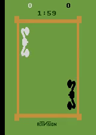

## Wizard War
Wizard War is a simple multi-agent game where wizards (players) move around and shoot magic bullets at each other. The goal is to defeat enemy wizards while avoiding being hit yourself.

In early training, agents learned unnatural behaviors:
- They rushed into enemies to kill them even if it meant dying, because the reward for killing an enemy was much larger than the penalty for dying.
- They often shot allies instead of enemies, because friendly kills gave the same reward as enemy kills.

To fix this, we improved the reward design:
- Added a large death penalty (`-50`) and a small survival reward (`+0.1`) to encourage staying alive.
- Added a large penalty (`-50`) for suspected friendly fire (dying right after shooting).

After retraining, the agent now approaches enemies safely while firing bullets, avoiding reckless charges and unnecessary friendly fire, resulting in more natural gameplay.

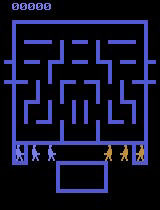

## Pursuit
Pursuit is a game where pursuers and an evader are separated, and the pursuers cooperate to chase the evader.A single player cannot solve the task alone, and the pursuers do not receive a reward unless they surround the evader.I implemented the pursuers using the MAPPO algorithm.
Initially, I implemented them as standard CNN-based agents, but even with MAPPO, they were unable to achieve team coordination.I considered the issues to be a lack of global and relational information from the observed images, as well as insufficient accuracy in the positional information captured by the CNN.Therefore, I changed the agents to Transformers and modified the reward structure to give rewards for gathering and cooperating.

repogitory: https://github.com/Shinichi0713/Reinforce-Learning-Study/tree/main/miulti-agent/petting_zoo/src/4_pursuit

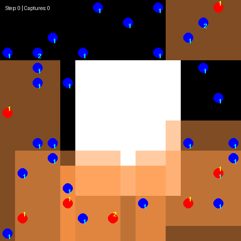

# cite

in this repository, oss 'pygame-learning-environment' is used.
[https://github.com/ntasfi/PyGame-Learning-Environment](https://github.com/ntasfi/PyGame-Learning-Environment)

deep mind archives!

very nice site!

[google-deepmind/deepmind-research: This repository contains implementations and illustrative code to accompany DeepMind publications](https://github.com/google-deepmind/deepmind-research/tree/master)

# References

when studying RL, I refer to any other web-site.
show the reference site.

[AI compass](https://ai-compass.weeybrid.co.jp/)
this site indicates many ai knowledge with insight.

[星の本棚](https://yagami12.hatenablog.com/entry/2019/02/22/210608)
this site shows nice tips about reinforcement learning.

# blog

I publish technical articles focused on Reinforcement Learning related technics on my blog. Feel free to visit and have a read.

[writer&#39;s blog](https://yoshishinnze.hatenablog.com/)
