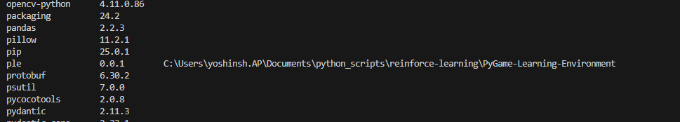
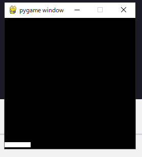

実行するために下記のコマンドを実行し、必要な環境をインストールしておきます。
```
pip install gym_ple
git clone https://github.com/ntasfi/PyGame-Learning-Environment.git
cd PyGame-Learning-Environment/
pip install -e .
```



この [https://github.com/ntasfi/PyGame-Learning-Environment](https://github.com/ntasfi/PyGame-Learning-Environment) は、「**PyGame Learning Environment（PLE）」**という、  
**強化学習（Reinforcement Learning, RL）向けのゲーム環境集**を提供するPythonライブラリのGitHubリポジトリです。

---

## 概要

- **PyGame Learning Environment（PLE）** は、  
  強化学習エージェントの研究や実験のために設計された、シンプルなゲーム環境のコレクションです。
- ゲームは**PyGame**（Pythonの2Dゲームライブラリ）で実装されています。
- **OpenAI Gym**のようなAPIインターフェースで、強化学習アルゴリズムと簡単に組み合わせて使うことができます。

---

## 主な特徴

- **複数のシンプルなゲーム**（Catcher, FlappyBird, Pixelcopter, Pong, Snake, etc.）が含まれている
- **エージェントが観測できる情報**や**アクション**を簡単に取得・操作できる
- **リワード設計**や**環境のリセット**など、RL実験に必要な機能が揃っている
- **軽量で高速**、セットアップが簡単

---

## 使い道

- 強化学習アルゴリズムの開発・テスト・ベンチマーク
- 強化学習の入門教材や、研究用の環境
- OpenAI Gymよりも小規模・高速な実験環境を求める場合に最適

---

## 利用例（Python）

```python
from ple import PLE
from ple.games.catcher import Catcher

game = Catcher()
env = PLE(game, fps=30, display_screen=True)
env.init()

while not env.game_over():
    action = env.getActionSet()[0]  # 例: エージェントのアクション
    reward = env.act(action)
```

---

## 公式説明（READMEより抜粋・意訳）

> PyGame Learning Environment (PLE) is a simple RL environment using PyGame.  
> It is designed for quick prototyping and testing of RL agents on various games implemented in PyGame.

---

## 類似プロジェクト

- [OpenAI Gym](https://gym.openai.com/)
- [Arcade Learning Environment (ALE)](https://github.com/mgbellemare/Arcade-Learning-Environment)

---

## まとめ

**PyGame Learning Environment**は、PyGame製の簡易ゲームを使って強化学習アルゴリズムの開発・テストができるPythonライブラリです。  
OpenAI Gymよりも軽量で、RLの学習や研究のための実験環境として広く利用されています。

---

以上です。
https://github.com/ntasfi/PyGame-Learning-Environment

### 学習
以下コマンド
```
python dqn_agent.py
```

## 結果
動作しました



```python
from ple import PLE
from ple.games.catcher import Catcher
import time

game = Catcher(width=256, height=256)
env = PLE(game, fps=30, display_screen=True)
env.init()

for episode in range(3):
    env.reset_game()
    while not env.game_over():
        action = env.getActionSet()[0]  # 例: 左に動かす
        env.act(action)
        time.sleep(0.02)
env.close()
```

