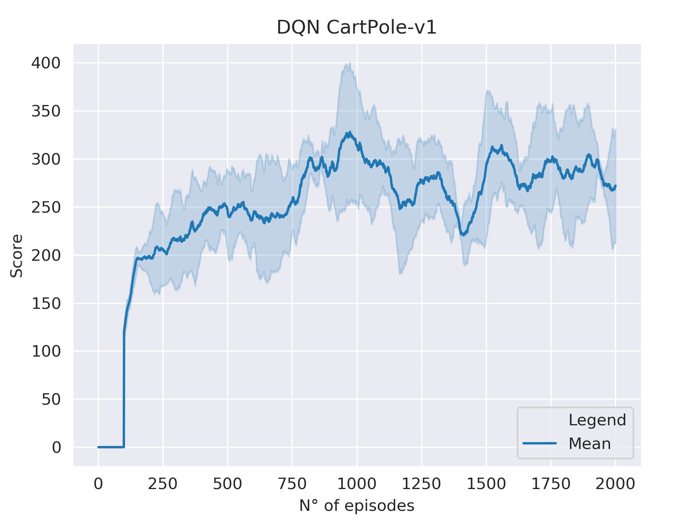

CNNベースの強化学習エージェントの行動精度がよくない（＝学習がうまく進まない、性能が出ない）場合、主な原因は以下のようなものが考えられます。

---

## 1. **入力画像の前処理が不適切**
- 画像サイズが小さすぎたり、大きすぎたり、ノイズが多い。
- グレースケール化や正規化（0〜1スケーリング）がされていない。
- 画像のレイアウトや情報がCNNで抽出しにくい形になっている。

## 2. **CNNの構造がタスクに合っていない**
- 層が浅すぎる／深すぎる。
- チャンネル数やカーネルサイズが不適切。
- 入力に対して出力次元が合っていない。

## 3. **ハイパーパラメータの問題**
- 学習率（lr）が大きすぎる／小さすぎる。
- バッチサイズが小さすぎる／大きすぎる。
- エージェントの探索率（ε-greedyのε）が低すぎてすぐに局所解に陥る。

## 4. **強化学習アルゴリズムの設計ミス**
- 報酬設計が不適切（Sparse rewardやnegative rewardばかりなど）。
- エピソード長が短すぎて十分な経験が得られていない。
- 行動空間や状態空間の設計が複雑すぎる、または単純すぎる。

## 5. **学習データの多様性不足**
- エピソード数やステップ数が少ない。
- 探索が十分でなく、特定のパターンばかり学習している。

## 6. **実装上のバグ**
- 損失計算やbackwardのミス。
- 勾配クリッピングやoptimizerの設定ミス。
- replay bufferや経験蓄積のバグ。

## 7. **環境自体の問題**
- 環境の状態遷移や報酬が正しく設計されていない。
- renderやresetのタイミングが間違っている。

---

### よくあるチェックポイント

- **入力画像を実際に表示して、人間が見て状態が分かるか確認する**
- **CNNの出力（特徴量）や中間層を可視化する**
- **学習曲線（報酬、損失）をプロットして、学習が進んでいるか確認する**
- **探索率（ε）や学習率（lr）を変えてみる**
- **報酬設計を見直す**
- **学習ステップ数やエピソード数を増やす**

---

### まとめ

CNNベースの強化学習エージェントの精度が上がらない場合、  
**「入力前処理」「CNN構造」「ハイパーパラメータ」「報酬設計」「探索」「実装バグ」**  
のいずれかに問題があることが多いです。  
まずは入力画像の可視化・学習曲線の確認・ハイパーパラメータの見直しから始めるのがおすすめです。

---
## Conv2d
```
torch.nn.Conv2d(in_channels, out_channels, kernel_size, stride=1, padding=0, dilation=1, groups=1, bias=True, padding_mode='zeros', device=None, dtype=None)
```

In the simplest case, the output value of the layer with input size $(N, C_{in}, H, W)$ と出力 $(N, C_{out}, H_{out}, W_{out})$は簡単に以下のように示すことができる。


```python
# With square kernels and equal stride
m = nn.Conv2d(16, 33, 3, stride=2)
# non-square kernels and unequal stride and with padding
m = nn.Conv2d(16, 33, (3, 5), stride=(2, 1), padding=(4, 2))
# non-square kernels and unequal stride and with padding and dilation
m = nn.Conv2d(16, 33, (3, 5), stride=(2, 1), padding=(4, 2), dilation=(3, 1))
input = torch.randn(20, 16, 50, 100)
output = m(input)
```


## 別取り組みの結果

CartPole-v1について確認すると。


https://github.com/lmarza/CartPole-CNN

vision-cnnを用いる場合と、画像を用いない場合での性能の比較は以下のようになった

__画像を用いない場合__  



__画像を用いる場合__  


## 結論
1. やはり画像のみでは棒の機微をとらえることが難しかった・・・？


## 教えてLangGraph

良い質問です。  
**結論から言うと、通常は「環境から与えられるstate（数値ベクトル）」で判断する方が、画像で判断するよりも精度が高くなります。**

---

## 理由

### 1. state（数値ベクトル）で判断する場合
- CartPole-v1のstateは、カートの位置・速度、ポールの角度・角速度などの**物理量（4次元の連続値ベクトル）**です。
- これらは**強化学習エージェントが直接、最適な方策を学びやすい情報**です。
- 情報が「圧縮されていて」「ノイズが少なく」「学習効率が良い」です。

### 2. 画像で判断する場合
- 画像はピクセル値の集合（たとえば84×84×3など）です。
- 画像からカートやポールの位置・角度などを**自分で推論しなければならず、より難しい認識問題**になります。
- 状態情報が間接的かつ冗長・ノイズも多く、学習が難しいです。
- 通常、同じネットワークサイズや学習時間では、**画像入力の方が精度が低くなりやすい**です。

---

## 実際の研究・実験でも

- OpenAI GymのCartPole-v1など、**環境が「state」を与えてくれる場合は、stateをそのまま使う方が圧倒的に効率的で精度も高い**です。
- 画像入力は「現実のロボットやゲームのようにstateが直接得られない場合」に仕方なく使われます。
- 画像入力で高精度を目指すにはより大規模なネットワークや大量のデータ・計算資源が必要です。

---

## まとめ

- **state（数値ベクトル）入力の方が精度が高く、学習も速い**  
- 画像入力は難易度が高く、精度はstate入力より下がるのが一般的

---

### 参考
- CartPole-v1のstateは4次元ベクトル（cart position, cart velocity, pole angle, pole velocity at tip）です。
- 画像入力は「End-to-End学習」や「視覚認識能力の評価」などの研究目的で使われることが多いです。

---

**結論：  
CartPole-v1では、state入力の方が画像入力よりも精度が良いです。**

## 考察

CartPoleに比べて、状態量で検知する場合、精度は改善する。
このあたり、もしかすると、Gridにも現れているかもしれない。
Gridで判定させた場合の精度はCartPoleに比べて、まだ精度は悪くなかった。
このことを併せて考えると、CNNでも画像の正体を認識する必要がある場合と、情報が圧縮されたGridで認識する場合で精度が大きく異なる。


