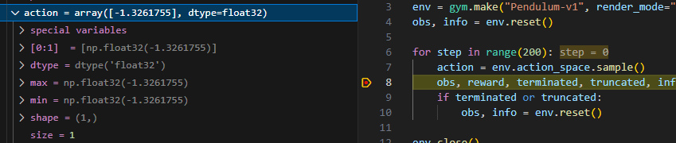
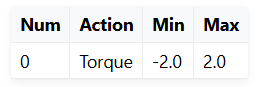

強化学習の環境に求められる主な機能を箇条書きでまとめます。

---

- **状態（state）の管理と返却**
  - 現在の環境の状態を表現し、エージェントに提供できること

- **行動（action）の受付**
  - エージェントからの行動入力を受け付けること

- **状態遷移の実行**
  - エージェントの行動に応じて、環境の状態を適切に更新できること

- **報酬（reward）の計算と返却**
  - 行動の結果として得られる報酬を計算し、エージェントに返却できること

- **エピソードの終了判定**
  - ゴール到達や失敗など、エピソードの終了条件を判定できること

- **リセット機能**
  - 新しいエピソードを開始するために、環境を初期状態にリセットできること

- **行動空間・状態空間の定義**
  - 取り得る行動や状態の範囲・型を明示できること

- **ランダム性やシードの管理**
  - 再現性のために乱数シードの設定や管理ができること

- **レンダリング（可視化）機能（任意）**
  - 環境の状態や動作を可視化できる機能（学習のデバッグや評価のため）

---

## 環境

### 行動空間

トルク値で-2～2。

