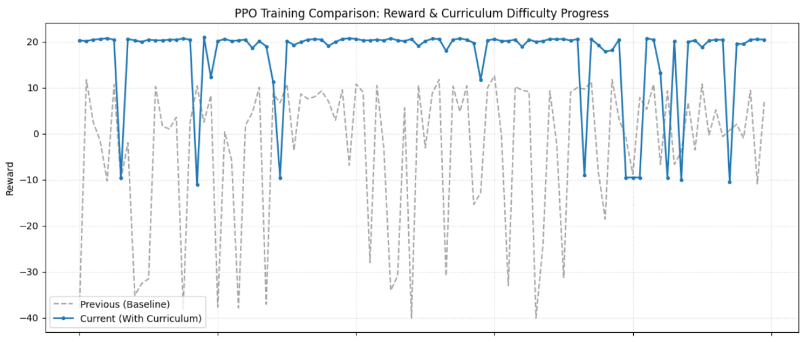

毎週恒例になっている迷路をゴール問題です。
前回はPPOアルゴリズムの見直しを行いました。結果はほぼ改善なし。
ゴールは目指してくれるものの、うろうろ従ってしまっていました。

本日テーマ：
>今回は出来る限り最短経路を選んでくれるようにしていきたいと思います。

## agentの現状
ほぼ前回同様です。というか前回の総括に記載した内容です。
強化学習したエージェントが最短ゴールを目指さずにうろうろしたくなってしまう。
コードの内部を見直して勝率向上できないかトライしていきたいと思います。


## コード内部の問題

2点課題となる点が見つかりました。

### CLSトークンのアテンション

__CLSトークンとは__

`TransformerActorCritic.forward`を見ると、迷路の25マス(5×5)それぞれが1つの「トークン」として扱われています。CLSトークンは、この**25マスに加えて追加される、迷路上のどこにも対応しない「特別な26個目のトークン」** です。

```python
cls_tokens = self.cls_token.expand(B, -1, -1) + self.cls_pos_embedding
x = torch.cat((cls_tokens, x), dim=1)  # (B, 26, d_model)
```

- `self.cls_token`：全バッチ共通の学習可能なベクトル（初期状態では「空っぽの器」)
- `self.cls_pos_embedding`：CLS専用の位置エンコーディング（迷路の座標を持たないので、row/col埋め込みとは別に用意されている）

__Transformer内でどう機能するか__

```python
x = self.transformer(x)  # (B, 26, d_model)
cls_out = x[:, 0]         # 先頭(index 0)がCLSトークンの出力
```

フルAttention（今回`use_wall_mask=False`にした後）では、CLSトークンは**26個全てのトークン（25マス＋自分自身）とAttentionでやり取り**します。各層を通るたびに、

- 「壁マップ・スタート・ゴール・エージェント位置・ゴールまでの距離」という各マスの情報（`embedding`層で埋め込まれたもの）
- 各マスの座標情報（2次元位置エンコーディング）

を、Attentionの重み付けで**選択的に集約**していきます。イメージとしては、CLSトークンは「迷路全体を見渡して、今の状況を要約するレポーター」のような役割です。層を重ねるごとに、より抽象化された「現在の状況の要約」がCLSトークンに蓄積されていきます。

__出力層での使われ方__

```python
logits = self.actor_head(cls_out)   # 次にどの方向へ動くか（4行動の確率）
value = self.critic_head(cls_out)   # 現在の状況がどれだけ「良い」か（価値関数）
```

25マス個別の出力ではなく、**CLSトークン1つの出力だけ**を使って、方策(actor)と価値(critic)の両方を計算しています。つまり「盤面全体の情報を1つのベクトルに要約したもの」が、意思決定の唯一の根拠になっているわけです。


__何が起きていたか__

ということでTransformerの「CLSトークン」というのは、迷路全体の情報を1箇所に集めて、そこから「次にどっちに動くか」を決めるための特別なマスです。当時のコードでは、このCLSトークンが**エージェントの現在地から見て隣接する上下左右のマスの情報しか、直接受け取れない**ように設計されていました。

さらにTransformerの層数(`num_layers=2`)が2層だったので、情報が伝わる範囲は「隣のマスの、そのまた隣のマス」までです。つまり実質**現在地から2マス分先**の情報しか、CLSトークンに届いていませんでした。

__たとえ話__

懐中電灯を持って、**半径2マス分しか照らせない**状態で5x5の迷路を歩いているようなものです。

```
. . . . .
. . . . .
. . A . G     ← Aがエージェント、Gがゴール
. . . . .
. . . . .
```

Aから見えるのは、Aを中心に半径2マス分だけ。3マス以上先にある壁や、迂回が必要な行き止まりは**そもそも見えていません**。

- **近いゴール**（懐中電灯の範囲内）: 見える範囲だけで解決できるので、正しく避けられる
- **遠いゴール**（懐中電灯の範囲外）: 3〜4マス先に「この先は壁で行き止まりだから、今のうちに左に迂回すべき」という情報があっても、それが**見えないので判断のしようがない**

これは学習量をいくら増やしても解決しません。エージェントに与えられている「視野」そのものが物理的に足りていなかったからです。

__なぜ修正で直るのか__

修正は2つのアプローチを組み合わせています。

1. **懐中電灯の制限を外す**（`use_wall_mask=False`）：Attentionのマスクを外し、迷路全体のどのマスの情報も自由に参照できるようにしました。
2. **カーナビを渡す**（距離マップのチャンネル追加）：さらに、各マスに「ここからゴールまで実際に何マス必要か（壁を考慮した最短距離）」という数値をあらかじめ計算して観測に含めました。これは懐中電灯の範囲に関係なく、どのマスからでも参照できます。

この2つによって、エージェントは「3マス先が行き止まりだから今のうちに迂回する」といった、近視眼的なAttentionの受容野に縛られない判断ができるようになるはずです。

### タイムアウト時にPPO更新が発生されない

__見つかった問題：タイムアウト時にPPO更新が発生せず__

前回までの実装において`train()` のループの中身ですが。

```python
for step in range(max_steps_per_episode):
    ...
    if len(self.buffer.states) >= update_horizon or done:
        self.update(next_state_img, done=done)
    if done:
        break
```

`update_horizon=512`、`max_steps_per_episode=100` なので、**ゴールに到達できず時間切れ（timeout）になったエピソードでは `done` が一度も `True` にならず、`update()` が呼ばれません**。

すると何が起きるか：

1. timeoutしたエピソードの遷移データが `buffer` に残ったまま
2. 次の `for episode` ループで `env.reset(maze_change=True)` が呼ばれ、**全く別の迷路・別のスタート地点**で新しいエピソードが始まる
3. その新しいエピソードのデータが、**同じ buffer に連続して追記される**
4. `update()` が発火した時（`buffer.states` が512に達するか、たまたまどこかで `done=True` になった時）、GAE計算は buffer の中身を「1本の連続した軌跡」として時系列に遡って計算する
5. しかし実際には**timeoutの瞬間に迷路もエージェントの位置も完全に無関係なものへ切り替わっている**のに、`dones[t]=False` のままなので、GAEはその境界を「終端ではない」として advantage を計算し、**全く無関係な次エピソードの価値を、前エピソードの報酬計算にブートストラップしてしまいます**。

これは学習序盤（ゴール成功率が低くtimeoutが多発する時期）ほど深刻で、価値関数とAdvantageの推定を根本から破壊します。何度やってもダメなときはとことんダメ、というのはこの辺りが原因かなと考えました。


## 学習法改善

今回学習法に **アニーリング** という方法を取り入れようと思います。
この手法の仕組み、期待される効果、および具体的な動作について解説します。

### 1. アニーリング（Annealing）とは何か？

**アニーリング（焼鈍法 / Simulated Annealing に由来）** とは、学習の進行に伴って**特定の設定値（ハイパーパラメータ）を段階的または連続的に変化させていく手法**のことです。

金属工学において「金属を加熱してからゆっくり冷却することで結晶構造を安定させる（焼鈍）」というプロセスになぞらえて、強化学習や最適化の分野でも次のように利用されます。

* **学習初期（高温状態）:** ハイパーパラメータを大きく設定し、モデルに多様な行動をとらせる（状態空間の探索）。
* **学習終盤（低温状態）:** ハイパーパラメータを小さく絞り込み、最良の行動パターンに収束・定着させる（目的の活用）。

### 2. 期待できる効果

エントロピー正則化は、PPOの損失関数において **「方策（Policy）の確率分布が特定の1行動に偏りすぎるのを防ぐ（多様性を保つ）」** 役割を果たします。これをアニーリングすることには、以下の3つの効果があります。

__① 「探索（Exploration）」と「活用（Exploitation）」のトレーオフの最適化__

* **学習初期（高い `entropy_coef`）:**
エージェントはランダムに近い多様な行動を試みます。これにより、迷路全体を探索して遠くにあるゴールや抜け道を見つけやすくなり、**「局所最適解（決定論的だが非効率な経路で満足してしまう状態）」に陥るリスクを大幅に軽減**します。
* **学習終盤（低い `entropy_coef`）:**
ゴールまでの最短経路や効率的な歩行パターンが把握できたら、余計なランダム行動を排除します。最も確率の高い「最適な1手」を確実に選ぶように方策を鋭利化（Sharpening）させます。

__② 迷路タスク特有の「手数のブレ」の低減__

迷路問題のように、遠いゴールへ向けた長尺のシーケンス（数十手以上）を解く際、学習終盤まで探索（ランダム性）が強いままだと「あと1手でゴールなのに、確率的なゆらぎで壁に向かって失敗する」という事故が多発します。
アニーlingによって終盤のエントロピーを下げることで、**ゴール手前での無駄な不確定性をなくし、到達率（Success Rate）を安定**させることができます。

__③ 学習の収束速度と性能上限の向上__

定数（固定値）で `entropy_coef` を運用する場合、以下のようなジレンマが生じます。

* **係数を大きく固定:** 探索は十分だが、いつまでも行動が定まらず最適解に収束しない。
* **係数を小さく固定:** 序盤から行動が固定化され、複雑な迷路でゴールを発見できず学習がストールする。

アニーリングはこの両者の「イイトコ取り」を実現し、**学習初期の探索能力と、最終的な収束性能の高さを両立**させます。

## 実装コード

以下レポジトリに保管しました。

https://github.com/Shinichi0713/Reinforce-Learning-Study/tree/main/basic/11_maze/src

## 学習結果

### 報酬の推移

前回分と比較して並べてみました。
今回アニーリングを入れたので難易度が高くなるとがたっとさがって、また安定するという様子が確認出来ます。
全体的に今回の方が安定しているように見えます。



### 動作

学習したエージェントの動作を可視化しました。
最短ではないこともあるかもしれませんが、前回に比べるとすっきりゴールを目指すようになりました。


## 総括

以下に、今回の迷路タスクにおける改善内容と、そこから見えてきた「AIエージェントの学習にとって重要だったポイント」を簡潔にまとめます。

### 1. 今回の主な改善内容

__(1) CLSトークンのアテンション範囲の拡大（視野の拡大）__

**問題点**  
- TransformerのCLSトークン（迷路全体の情報を集約する特別トークン）が、**エージェントの現在地から2マス先までしか見えていない**状態でした。
- これはAttentionマスク（`use_wall_mask=True`）と層数（`num_layers=2`）の組み合わせにより、情報伝播が物理的に制限されていたためです。
- その結果、3マス以上先の壁やゴールの情報がCLSトークンに届かず、「近視眼的な判断」しかできませんでした。

**対応**  
- Attentionマスクを外し（`use_wall_mask=False`）、**迷路全体のどのマスも自由に参照できる**ようにしました。
- さらに、各マスに「ゴールまでの最短距離（壁を考慮）」を事前計算して観測に含め、**距離情報を直接参照できるように**しました。

**効果**  
- エージェントは「3マス先が行き止まりだから今のうちに迂回する」といった、**長期的な経路判断**が可能になりました。
- これにより、ゴールを目指す際の「うろうろ」が減り、より**最短経路に近い、すっきりした動き**が実現しました。

__(2) タイムアウト時のPPO更新の不整合を解消__

**問題点**  
- タイムアウト（`max_steps_per_episode` に達してもゴールに到達しない）時に `done=False` のまま次のエピソードが始まり、**異なる迷路・異なるエピソードのデータが同じバッファに混ざる**状態でした。
- その結果、GAE計算が「1本の連続した軌跡」として扱ってしまい、**全く無関係な次エピソードの価値を前エピソードの報酬計算にブートストラップ**してしまう不整合が発生していました。

**対応**  
- `train()` ループ内で、タイムアウト時にも `done=True` として扱い、**エピソード境界を明確に区切る**ようにしました。
- これにより、PPO更新時に「迷路が変わった瞬間」を正しく終端として扱い、**価値関数とAdvantageの推定が破綻しない**ようにしました。

**効果**  
- 学習序盤（ゴール成功率が低くタイムアウトが多い時期）でも、**価値推定が安定**し、学習が破綻しにくくなりました。
- 報酬の推移グラフでも、前回に比べて**全体的に安定した学習曲線**が得られています。

__(3) エントロピー正則化係数のアニーリング導入__

**問題点**  
- エントロピー正則化係数（`entropy_coef`）を固定値にしていたため、
  - 大きくしすぎると「いつまでも行動が定まらず収束しない」
  - 小さくしすぎると「序盤から探索不足でゴールを見つけられない」
  というジレンマがありました。

**対応**  
- **アニーリング（焼鈍法）**を導入し、学習の進行に応じて `entropy_coef` を段階的に小さくしていきました。
  - 学習初期：高いエントロピーで**広く探索**し、ゴールや抜け道を見つけやすくする
  - 学習終盤：低いエントロピーで**最適な1手に集中**し、ゴール直前の失敗を減らす

**効果**  
- 「探索（Exploration）」と「活用（Exploitation）」のバランスが最適化され、
  - 迷路全体の探索能力を維持しつつ
  - ゴール手前での無駄なランダム行動を減らし
  - **到達率（Success Rate）と手数の安定性**が向上しました。
- 報酬推移グラフでも、**難易度が上がったタイミングで一時的に報酬が下がるが、その後安定して回復する**という、アニーリング特有の挙動が確認されています。

## 2. 結局、AIエージェントの学習にとって重要だったこと

今回の修正によりエージェントは前回より最短経路を通ってゴールを目指すようになりました。
今回の修正を通じて見えてきた、AIエージェントの学習にとって重要なポイントは、以下の3つに集約できます。

__① 「見える範囲」と「判断の根拠」を適切に設計すること__

- CLSトークンのAttention範囲が狭すぎると、**エージェントは物理的に先の情報を見られず、近視眼的な行動しか学習できません**。
- 迷路全体の情報（壁・ゴール・距離）を**適切にモデルに渡し、それを参照できる構造**にすることが、**長期的な計画性を持った行動**を学習する上で不可欠でした。

__② 学習データの「境界」と「時系列の整合性」を厳密に守ること__

- PPOのような自己回帰的・ブートストラップ型のアルゴリズムでは、**エピソード境界の扱いが甘いと、価値推定が根本から破綻します**。
- タイムアウト時にも `done=True` として明確に区切り、**異なる迷路・異なるエピソードのデータが混ざらないようにする**ことが、学習の安定性に直結しました。

__③ 「探索」と「活用」のバランスを、学習の進行に応じて動的に調整すること__

- エントロピー正則化係数のアニーリングにより、
  - 学習初期：広く探索してゴールや抜け道を見つける
  - 学習終盤：最適な1手に集中してゴールを確実に達成する
  という**段階的な最適化**が可能になりました。
- これは、**単一の固定パラメータでは実現しにくい「探索と活用の両立」**を、時間軸で動的に調整する強力な手法です。

### 3. まとめ

今回の迷路タスクの改善を通じて、

- **モデル構造（視野と情報の伝達）**
- **学習アルゴリズムの実装（エピソード境界と価値推定の整合性）**
- **学習戦略（探索と活用の動的バランス）**

の3つが、AIエージェントの学習において**いずれも欠かせない要素**であることが改めて確認できました。

特に、「うろうろする」から「すっきりゴールを目指す」への変化は、
- **視野の拡大（CLSトークンのAttention範囲）**
- **距離情報の直接参照（距離マップの導入）**
- **アニーリングによる探索と活用の最適化**
が組み合わさることで初めて実現した、**構造的・戦略的な改善の成果**と言えます。
