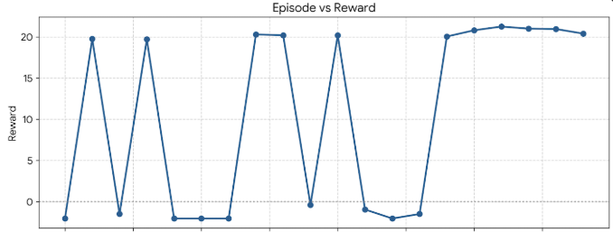
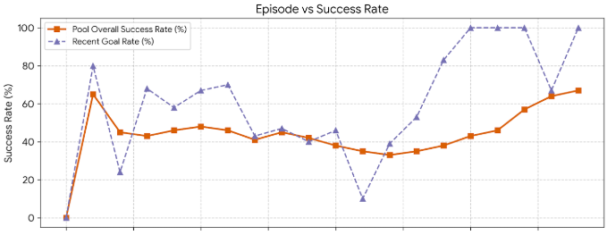
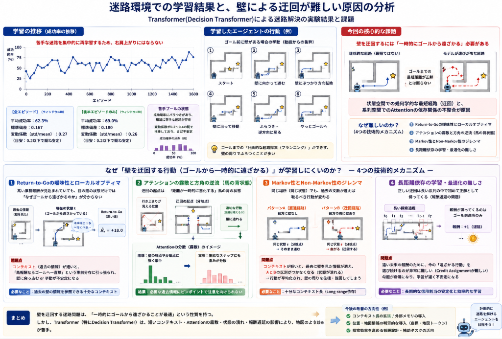

本日は毎週恒例の迷路解決の強化学習についてです。

前回の実装では以下に取り組みました。
- モデルのパラメータ見直し(モデルのレイヤ数を増加)
- 強化学習の問題を統計を取り、不得手な問題を集中的に解かせる。

目指しているのは安定的に、スラスラ問題を解くことだったのですが、まだそういう状態になっていません。

本日テーマ：
>強化学習モデルの見直しを行い、改善するか確認する。

## 現状課題
ゴール前でうろうろするが一番気になっているポイントでした。
その他、ゴールが壁に囲まれる場合にゴールできなくなることがありました。

## 改善案と対策

### 1. 距離感が正確につかめていない

現在、今のモデルは学習可能な絶対位置埋め込み（25マスそれぞれに個別のベクトルを学習）です。
以前紹介した[位置エンコーディングの記事](https://yoshishinnze.hatenablog.com/entry/2026/08/27/043000)でも触れましたが2Dの絶対位置埋め込みは2DのRoPEに比べて距離の埋め込みが分かりづらい状態にあります。

レアな配置であるゴールが壁に囲まれるようなケースでは、エージェントからすると見たことがない、というケースになりやすいと思います。
「壁が右にある」という関係性をマスごとに独立して学習し直す必要があり、特にサンプル数が少ないレアな配置（ゴールが壁で囲まれているケースなど）では学習効率が悪い可能性があります。2D RoPEは相対位置関係をAttentionの計算そのものに組み込むため、この点は改善が見込めます。

一点補足すると、この症状には「そもそもゴールが壁でほぼ囲まれる配置が生成頻度として少なく学習データが薄い」「終盤でもエントロピーが残っていて同じ場所で右往左往する」といった別要因も併存している可能性がありますが、2D RoPEへの変更自体は理にかなっており、副作用も少ないので実装します。

### 2. うろうろ

同じようなシチュエーションを見た場合に行ったり来たりということがあります。
状況としては、過去見たことあるが、どっちが良かったか分からないというシチュエーションです。

このシチュエーションですが、こと迷路という話で言うと全く意味がありません。探索した同じ場所に来るということで状況が改善する可能性がゼロだからです。
そして、同じ場所をうろうろすることに対してペナルティを与えていませんでした。やってほしい行動ではありませんが、やっても良いというように認識することになります。

行ったり来たりという状況に対してペナルティを与えるようにしていきます。

## 実装法

### 1. 2D RoPEの実装方法

__基本のアイデア__

通常のAttentionでは、「このマスとあのマスが近いか遠いか」を教えるために、各マスに専用の"住所ラベル"（位置埋め込み）を貼り付けて、それを特徴量に**足し算**していました。

2D RoPEはこれとは全く違うアプローチを取ります。位置情報を足し算するのではなく、**QとK（Attentionで「似ているか」を測る2つのベクトル）そのものを、位置に応じて回転させる**という方法です。

__なぜ「回転」なのか__

2次元ベクトルを角度θだけ回転させる操作には、面白い性質があります。ベクトルAをθ_A回転させたものと、ベクトルBをθ_B回転させたものの内積（≒似ている度合い）は、**θ_Aとθ_Bの"差"だけ**で決まります。絶対的な角度がいくつであろうと関係ありません。

これをマスの座標に応用します。「行番号・列番号」を回転角度として使うと：

- クエリ側のマス（今いる場所）のベクトルを、そのマスの座標に応じて回転
- キー側のマス（比較対象）のベクトルを、そのマスの座標に応じて回転
- 2つの内積を取ると、**「2マスの座標の差」＝相対位置だけに依存する値**になる

つまり「(1,1)から見て(2,3)」も「(0,0)から見て(1,2)」も、相対的な位置関係(+1,+2)が同じなら、Attentionの計算結果が完全に一致します。これが前回の単体テストで確認した性質です。

__具体的な実装のポイント__

**① 行用と列用にhead_dimを半分ずつ割り当てる**

5×5の迷路は2次元なので、回転角度も「行方向」と「列方向」の2種類必要です。1つのベクトル（head_dim次元）を前半・後半に分割し、

- 前半：行番号を使って回転
- 後半：列番号を使って回転

とすることで、1本のベクトルに縦・横両方の位置情報を独立に埋め込みます。

**② CLSトークンは「回転なし」**

CLSトークンは特定のマスに対応しないので、座標を持ちません。そこで**回転角度0（＝何も回転させない）**として扱いました。これは「CLSは迷路のどこにも属さない特別な観測者」という位置づけとして自然な設計です。

**③ nn.TransformerEncoderLayerが使えないので自作**

PyTorchの標準Transformer層はRoPEに対応していないため、QueryとKeyを射影した直後に回転を挟む、独自のAttention層を実装しました。全体の骨組み（LayerNorm→Attention→残差→LayerNorm→FFN→残差、というnorm_first構成）は元の設計をそのまま踏襲し、Attention部分だけを差し替えています。

**④ 事前計算しておく**

5×5という盤面サイズは固定なので、「行r・列cのマスにはこの回転角度」という対応表は、モデル構築時に一度だけ計算してbufferとして保持しています（毎回計算し直す必要がない）。

### 2. 出戻りペナルティの実装のポイント

__何が問題だったか__

`deterministic=True`（greedy）で評価すると、確率的サンプリングより成功率が**低くなる**という逆転現象が見つかりました。これは、方策が特定の2マスの間を**永遠に行ったり来たりする決定的なループ**にハマっていることを示していました。確率的サンプリングは「たまたま」そのループから逸脱して抜け出せることがありますが、greedyは毎回同じ判断をするので、一度ループに入ると絶対に抜け出せません。

__なぜ既存の報酬だけでは不十分だったか__

すでに「ゴールに近づいたら+0.25」「遠ざかったら-0.30」という報酬がありましたが、これは**方向**にしか注目していません。「さっきいた場所に**戻ってきた**」という事実そのものには、何のペナルティも課していませんでした。

拮抗した局面（ゴールがほぼ壁で囲まれていて、正しい進入路がギリギリ有利、というくらいの差しかない場面）では、この「方向だけの評価」では往復を明確に損だと教えきれず、モデルが「行って戻る」を安全策として選び続けてしまう余地が残っていた、というのが実装上のポイントです。

__実装のポイント__

**① 「直近何手訪れたか」を直接見る**

`self.history`（これまで訪れたマスの履歴）の直近`revisit_window`(=6)手を見て、今から移動しようとしているマスが、その中に**すでに含まれているか**を判定します。座標の差ではなく、「最近そこにいたかどうか」という**時間的な情報**を直接使っているのがポイントです。

```python
if next_state in self.history[-self.revisit_window:]:
    step_reward += self.revisit_penalty
```

**② 既存の報酬に「上乗せ」する形にした**

進む/戻るの方向判定（progress/regress）を置き換えるのではなく、それに**追加で**ペナルティを足す設計にしました。これにより、単純な1往復（2手）だけでなく、3マスや4マスを使った少し複雑な巡回ループも、巡回の中に「以前いたマスへの復帰」が含まれる限り検出して罰することができます。

**③ ウィンドウ幅にすこし余裕を持たせた**

「直前の1手だけ」ではなく6手分見ているのは、単純な1往復だけでなく、もう少し長い周期のループ（A→B→C→A→B→C…のような3マス巡回など）も拾えるようにするためです。

**④ 結果として何が変わったか**

単体テストで確認した通り、往復ループの合計収支が、修正前の「1往復あたり実質+0.05（得）」から、修正後は「1往復あたり実質-0.30〜-0.60（明確な損）」に変わりました。方策が往復を選ぶ理由がなくなるよう、報酬の勾配そのものを変えた、というのがこの修正の本質です。

## 学習

### 学習の推移

今回のコードで学習した推移を示します。
前回記事で苦手な迷路を集中的に解かせるようにしているので、右肩上がりということは期待しづらくなっています。





また、苦手を保持するプールに対しても内容確認しました。
苦手としてものにバラつきがある場合、極端に苦手な迷路が存在するということになります。
現在は成功確率の分散÷平均で見ています。
目安は0.2付近程度であれば、安定していると設定しています。

```
[全エピソード]
  ウィンドウ数: 40
  各ウィンドウの成功率: ['72%', '62%', '58%', '26%', '40%', '62%', '68%', '56%', '60%', '68%', '66%', '60%', '48%', '52%', '76%', '54%', '56%', '38%', '44%', '46%', '52%', '52%', '44%', '44%', '62%', '50%', '34%', '74%', '72%', '78%', '64%', '78%', '88%', '96%', '96%', '80%', '88%', '76%', '76%', '76%']
  平均成功率: 62.3%
  標準偏差: 0.167
  変動係数(std/mean): 0.27  (目安: 0.2以下なら概ね安定、0.4以上ならまだ不安定)

[後半エピソードのみ（収束後の安定性の目安）]
  ウィンドウ数: 20
  各ウィンドウの成功率: ['52%', '52%', '44%', '44%', '62%', '50%', '34%', '74%', '72%', '78%', '64%', '78%', '88%', '96%', '96%', '80%', '88%', '76%', '76%', '76%']
  平均成功率: 69.0%
  標準偏差: 0.180
  変動係数(std/mean): 0.26  (目安: 0.2以下なら概ね安定、0.4以上ならまだ不安定)
```

### 学習したエージェントの行動

今回のコードで学習したエージェント動作の動画です。
まだ、ちょっとふらりとします。


ゴールがあったとして、壁によって回り込みが必要な場合に方向だけではダメで、経路のプランニングが必要となるのでしょうが、現在のTransformerのままでは解決が難しいのかもしれません。


### 今回モデルで困難となっている原因について考察

何度やってもダメだったので、大きな方針転換が必要となってきていると感じています。
今回の問題で解くに正解率が低いと感じたのはゴール前に壁があるようなケースでした。つまりゴールまでの何もない場合の最短距離が正解でないこと。

この問題の核心は、**「状態空間での幾何学的な最短経路（迂回）」と「系列空間でのAttentionの依存関係」の間に強い不整合が生じる点**にあります。

Transformerなどの系列モデリング手法が「壁を迂回するために一時的にゴールから遠ざかる行動」を学習する際の難しさを、さらに解像度を上げて**4つの技術的メカニズム**に分解して分析します。

__1. Return-to-Go (RTG) 条件付けの曖昧性とローカルオプティマ__

Transformerは「これから得る予定の累積報酬（Return-to-Go: $\hat{R}_t$）」を条件として入力し、行動を予測します。

* **高報酬データのコンテキスト認識:**
ゴールに到達したエキスパート軌跡において、迂回中のあるステップ $t$ での $\hat{R}_t$（例: $+18.0$）は高く維持されています。しかし、その瞬間の局所的な状態（State）だけを見ると、「ゴールと逆方向を向いている」「マンハッタン距離が増加している」という特徴を示します。
* **ショートコンテキスト（短い文脈ウィンドウ）時の崩壊:**
コンテキスト長 $K$ が短い場合、モデルは「なぜ高報酬 $\hat{R}_t$ が指定されているのに、状態 $s_t$ はゴールから遠ざかっているのか」を過去の軌跡（壁の存在を認識した過去のステップ）から参照できません。
* **結果:**
モデルは「高報酬を得るならゴールに一直線に向かうべきだ」というデータ全体の強い事前分布（Prior）に引きずられ、壁に突っ込む行動を選択するか、または高報酬条件（$\hat{R}_t$）と矛盾する行動を出力して挙動が不安定化します。

__2. 馬の背（Saddle Point）状態でのアテンションの霧散と方角の逆流__

迂回行動の起点（「そのまま進むと行き止まりなので、反転・直行して横に逸れる」と決断するポイント）では、ゴールへの幾何学的距離（ユークリッド距離/マンハッタン距離）が局所的に極大値（悪化）を取ります。

* **状態表現の勾配:**
通常のゴール指向タスクでは、状態表現 $s_t$ からゴールへの距離の減少が行動選択の強力なバイアス（勾配）になります。しかし迂回地点では、**「最適な行動（迂回）」が「距離を悪化させる行動」と完全に一致**します。
* **Attentionの分散:**
この「局所的悪化」を正当化するためには、「過去に壁の存在を確認したトークン（$s_{t-m}$）」に対して強固なAttentionを向ける必要があります。
しかし、探索中の軌跡には「壁に沿ってうろうろした無駄なステップ」なども混ざるため、キー・クエリ（$QK^T$）の内積計算において、真に必要な「壁の端点・障害物の位置」にピンポイントでAttentionの重みを集中させることが困難になります（アテンションの霧散）。

__3. Markov性とNon-Markov性のジレンマ（Markovian Fallacy）__

迷路構造自体は完全観測であればマルコフ決定過程（MDP）ですが、**「迂回」という計画・意図は系列上で強力な非マルコフ性（Long-range Dependency）を帯びます**。

* **状態の重複とポリシーの混同:**
迷路内の同じ座標 $s$（例えば分岐点）にいる時：
* **パターンA（直進経路）**: 前方に壁がないのでそのまま進む。
* **パターンB（迂回経路）**: 前方の奥に壁があることを過去に知っているため、あえて曲がる。


* **系列長不足による状態の退廃:**
コンテキストが短く、過去に壁を見たという履歴がウィンドウ外に押し出されると、モデルから見て「パターンA」と「パターンB」の区分がつかなくなります（同一の状態 $s$ として潰れる）。
結果として、DTは両者の行動を平均化したような曖昧な確率分布を出力し、壁の周りを往復・旋回するデッドロック（Stuck）に陥ります。



## 総括

今回の取り組みと結果を、できるだけ簡潔にまとめると以下のようになります。

### 1. 今回の改善内容（何を変えたか）

**2D RoPEの導入**  
- 従来：各マスに学習可能な絶対位置埋め込み（Learned APE）を加算。
- 今回：Query/Keyベクトルを「行・列の座標に応じて回転」させる **2D RoPE** を実装。
  - これにより、Attention計算で**相対位置（マス間の距離・方向）**が自動的に抽出される。

**出戻りペナルティの追加**  
- これまで：ゴールに近づく/遠ざかる方向のみを報酬で評価。
- 今回：**直近6手以内に訪れたマスに戻る行動**に明示的なペナルティを追加。
  - 往復ループの合計報酬を「得」から「明確な損」に変える設計。

### 2. 結果として何が起きたか

**エージェントの挙動**  
- 以前よりは安定したが、**依然としてゴール前でうろうろする**。
- 特に「ゴールが壁に囲まれ、回り込みが必要な迷路」で苦戦。
- 2D RoPEと出戻りペナルティだけでは、**「壁を迂回する計画」を安定して立てる段階には至っていない**。

### 3. なぜまだうまくいっていないのか

考察で示した通り、**Transformerベースの強化学習が「壁を迂回する」という非マルコフ的な計画を安定して学習するのは本質的に難しい**、という構造的な問題が残っています。

主な要因は以下の4点です。

1. **Return-to-Go（RTG）条件付けの曖昧性**  
   - 迂回中は「ゴールから遠ざかる」のに「RTGは高い」という矛盾が生じ、  
     短いコンテキストではモデルが「なぜ高報酬なのに遠ざかるのか」を理解できない。

2. **Attentionの霧散と局所最適の罠**  
   - 迂回地点では「最適行動＝距離を悪化させる行動」となるが、  
     Attentionが過去の壁情報に集中しきれず、局所的に「ゴールに近づく」行動を選びがち。

3. **Markov性とNon-Markov性のジレンマ**  
   - 迷路自体はMDPだが、「迂回」という意図は長距離依存（Non-Markov）。  
   - コンテキストが短いと「過去に壁を見たかどうか」の履歴が失われ、  
     同じ座標でも「直進すべきか」「迂回すべきか」が混同される。

4. **状態空間の幾何学と系列空間のAttentionの不整合**  
   - 幾何学的には「一度遠ざかってから回り込む」のが正解だが、  
     Transformerは「直近の状態列」からしか情報を取れないため、  
     長期的な迂回計画を安定して立てるのが難しい。

### 4. 結論

- **2D RoPE**と**出戻りペナルティ**は、  
  - 位置表現の精度向上  
  - 明らかに無駄な往復行動の抑制  
  という点では理にかなった改善であり、副作用も少ない。
- しかし、**「壁を迂回する」という長期的な計画を安定して学習する**には、  
  - コンテキスト長の拡大  
  - RTG設計の見直し  
  - あるいはTransformer以外のアーキテクチャ（計画専用モジュールの追加など）  
  といった、より根本的な方針転換が必要な段階に来ている、というのが今回の結論です。

