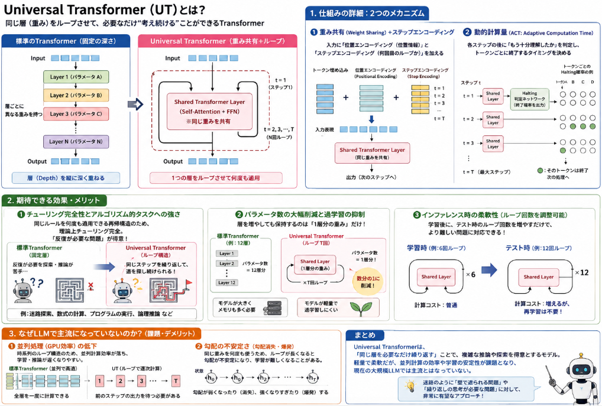
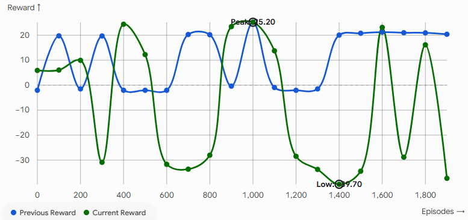

今回は毎度の迷路シリーズです。
ここまでTransformerを採用、位置エンコーダをRoPEに変更など試して、前回更に報酬設計変更を行いました。
ですが、迂回が必要となるような迷路に対してうまく解くことが出来ませんでした。

ということで、解き方を再度転換させようと思います。

本日テーマ：
>Universal Transformerを使ってみて、改善するか確認してみる。


## 課題

ゴール前が壁で遮られたようなケースでうまく経路を見つけられないことが多いようです。

壁にさえぎられた時の検討が、ノーマルのTransformerが得意な修飾のような系列データの解析だけでは解けていないのか、というのが現状感じている課題です。

## 先行研究の振り返り

過去Transformerのレイヤを反復計算させることで問題を解くという論文がありました。
論文で説明されていた手法は**Universal Transformer (UT)** です。

Universal Transformer 自体はなかなか年代物で、2018年（論文発表はICLR 2019）にGoogle BrainのMostafa Dehghaniらによって提案されたモデルです。
先程の表現をより詳細に言うと、**「標準のTransformerに、RNN（循環神経網）のような『時間の経過（反復処理）』の概念を組み込んだモデル」** です。

通常のTransformerが「層（Depth）を縦方向に深く重ねていく」構造なのに対し、Universal Transformerは「1つの層（重み）をループさせて何度も再帰的に適用する」 という大きな違いがあります。



### 1. Universal Transformerの仕組み

UTの基本構造は、主に **「重み共有（Weight Sharing）」** と **「動的計算（Dynamic Halting）」** の2つのメカニズムによって成り立っています。

```
【標準のTransformer】            【Universal Transformer】
 Input                             Input
   │                                 │
 [Layer 1] (パラメータA)          ┌─► [Shared Layer] (パラメータ共有)
   │                             │   │
 [Layer 2] (パラメータB)          └───┤ (N回ループ / 動的に停止)
   │                                 │
 [Layer 3] (パラメータC)            Output
   │
 Output

```

__① 重み共有（Weight Sharing Across Depth）__

通常のTransformerでは、1層目、2層目、3層目…と層ごとに異なるパラメータ（Self-AttentionやFFNの重み）を保持します。

これに対しUTでは、**単一のTransformerブロック（Self-Attention + FFN）を定義し、それをすべてのステップ（N回）で繰り返し適用**します。

* **入力時:** トークン情報に「位置エンコーディング（Positional Encoding）」だけでなく、現在何ループ目かを示す「ステップエンコーディング（Step Encoding）」を足し合わせて入力します。
* **計算:** 同じ重みを使って $t=1, 2, \dots, T$ と状態を更新していきます。

__② 動的計算量 / Adaptive Computation Time (ACT)__

通常のモデルは全トークンに対して固定の層数（例: 12層）の計算を行いますが、UTは**トークンごと・入力データごとに計算回数（ループ数）を動的に変化**させることができます。

これを実現するために **ACT (Adaptive Computation Time)** という仕組みを採用しています。

* 各ループの終わりで、各トークンが「もう計算を終了してよいか（Halting Probability）」を判定する小さなネットワークを実行します。
* **簡単な単語・構造:** 少ないループ数（例: 2~3回）で早期に計算を打ち切り、次の処理へ送る。
* **複雑な単語・構造:** 納得いく表現が得られるまで何回もループ（例: 8~10回）させて深く思考する。

### 2. 期待できる効果とメリット

Universal Transformer構造を導入することで、以下の大きな効果が得られます。

__① チューリング完全性と「アルゴリズム的タスク（推論・伝播）」の獲得__

標準のTransformer（固定層数）は「入力長に対して計算量が固定の順伝播型ネットワーク」であるため、複雑な論理推論やグラフの探索（BFS/DFS）、数式処理などの「反復計算が必要なタスク」を一般化して解くのが苦手です。

UTは再帰構造（RNN構造）を持つため、理論上**チューリング完全（Turing-Complete）** となり、**「同じローカルルールを何度も適用して解くアルゴリズム的なタスク」に対して圧倒的な強さ** を発揮します。

__② パラメータ数の大幅削減と過学習の抑制__

層を重ねても保持するパラメータは「1層分」だけで済むため、層数を増やしても（ループ数を増やしても）メモリ上のモデルサイズは増えません。

* **モデルの軽量化:** 通常の6層〜12層モデルに比べてパラメータ数を数分の一に削減できます。
* **汎化性能の向上:** パラメータが少ないため過学習（Overfitting）しにくく、少量のデータや強化学習環境でも学習が安定しやすくなります。

__③ インファレンス時（テスト時）の柔軟性__

学習時には少ないループ数（例: 6回）で学習させておき、テスト時により複雑な問題が出た際に**モデルを再学習することなくループ回数だけを増やす（例: 12回にする）** といった調整が可能です。


### 3. なぜLLM（ChatGPT等）で全面的に使われていないのか？

非常に優れた理論を持つUTですが、現在のGPT-4などの大規模言語モデル（LLM）で主流になっていない理由もあります。

* **並列処理（GPU効率）の低下:**
通常のTransformerは全層をパイプライン化して高速に並列計算できますが、UTは「前のステップの出力を次のステップの入力にする」という時系列的なループが発生するため、GPUの並列計算効率が落ち、学習・推論速度が遅くなりやすい側面があります。
* **勾配爆発・消失の制御:**
RNNと同様に「同じ重みを何度も掛ける」ため、ループ数が多くなると勾配が不安定になりやすく、学習のハイパーパラメータ調整がややシビアになります。


## 対策案

Attentionを「壁を考慮した隣接マスのみ」に戻し、反復計算として機能させるUniversal Transformerをメインに据えてみようと思います。

言語に比べると今回のタスクは容易です。言語のように理解する上で観点を変える必要がないからです。
なので場所を理解して、壁は迂回する、ゴールの経路を目指すというタスクを、頭の中でシミュレーションするような今回の方法がうまくはまるのではと考えています。

以前、`use_wall_mask=True`で実装していた「隣接マスのみに注意を向けるAttention」を思い出してください。あれを**層数を迷路の直径分（5x5なら8層程度）まで増やして**使えば、まさに「隣のマスの価値を見て、自分の価値を更新する」という計算を、**1層＝1ホップ**として、強制的に繰り返させることができます。これはVINが畳み込みで実現している価値伝播と、原理的に同じことをAttentionでやっているだけです。

さらに一歩進めて、**全層で同じ重みを共有**（1つのAttention層を8回繰り返し適用する、"Universal Transformer"的な構成）にすれば、VINが「同じ畳み込みカーネルをK回繰り返す」ことで実現している **「どのマスでも同じ伝播規則が成り立つ」という帰納バイアス** も再現できます。パラメータ数も減るので学習も安定しやすくなります。

その他気になっている点は、PPOの報酬信号は「間接的」で「弱い」という点です。

PPOでは、モデルは行動した後にもらえる、遅れた・ノイズの多いスカラー報酬からしか学べません。「ch4を正しく読んだかどうか」と「最終的な報酬が上がったかどうか」の因果関係を、何百・何千回もの試行錯誤の中から間接的に発見しなければならず、非常にサンプル効率が悪い学習方法だと言えます。

これは**アーキテクチャを変えるだけでは解決しません**。せっかく正解のBFS距離を持っているので、これを直接の教師信号として使わない手はありません。

各マスのトークン表現から「このマスのゴールまでの距離は何か」を予測する小さなヘッドを追加し、真のBFS距離との誤差(MSE)を**PPOの損失に補助項として足す**ことで評価する観点を増やそうかと思います。
PPOの弱点を補填できるのではと期待します。

```
total_loss = policy_loss + value_loss係数×value_loss - entropy係数×entropy
             + distance_loss係数×distance_prediction_loss   ← 追加
```

### CLSトークンの扱い

その他、もう1点課題ではないかと考えているポイントがあります。
ゴールまでの経路を見る上で「CLSトークンのアテンションマスクが全層で固定されていること」です。

__精度を阻害している4つの主要ポイント__

* **1. 【最重要】CLSトークンが「足元1ホップ」しか見えていない**
`_build_attn_mask` 内で、CLSトークン（インデックス0）のアテンションマスクが毎層「エージェントの現在位置＋上下左右1マス」に固定されています。
* **何が起きているか:** グリッドセル間（1〜N）では層を重ねるごとに 1ホップ, 2ホップ... と遠くの価値情報が伝播していきますが、**CLSトークンはどの層でも「足元の初期情報」しか受け取れません**。
* **結果:** 8層かけて迷路の反対側から迂回路の価値が伝播してきても、Policy/Valueを出力する `cls_out` にはその情報が届かず、近視眼的な判断しかできなくなっています。


* **2. 2D RoPE と CLSトークンの不整合**
CLSトークンは空間上の座標を持たない抽象トークンですが、`rope_cos`, `rope_sin` のインデックス0が適用されてしまっています。これにより、アテンション計算時にCLSと各セルの相対位置関係が歪む原因になります。
* **3. 迷路の最大パス長に対して `num_layers`（ホップ数）が不足している**
`grid_size=5` であっても、複雑な壁で大きく迂回する場合、ゴールまでの最短パス長が 12〜15ホップ 以上になることがあります。`num_layers=8`（かつ `use_wall_mask=True`）では、物理的に8マス分しか情報が届かないため、遠い迂回路の先にあるゴール情報を読み取れません。
* **4. 入力への正解距離マップ（`obs[4]`）の与え方**
入力に正解のBFS距離マップを与えてしまうと、モデルが自力で壁を通した価値伝播アルゴリズムを再現するのではなく、「入力された距離チャンネルの勾配だけを見る」というショートカット（過学習）を起こしやすくなります。


## 実装

前節で挙げたUniversal Transformerの実装をまず行った上で、CLSトークンの対処を行います。

### Universal Transformerの実装

主要な変更箇所は以下です。
特に大物が`1`と`2`です。

1. `RoPETransformerEncoder`に重み共有(Universal Transformer化)オプションを追加
2. `TransformerActorCritic`の既定値を「壁マスク使用＋層数を迷路の直径程度」に変更
3. 各マスのゴールまでの距離を予測する補助ヘッドを追加し、PPOの損失に補助ロスとして組み込む
 

__1. 重み共有(Universal Transformer化)__

`RoPETransformerEncoder`に`share_weights`引数を追加。`True`にすると、独立したN層ではなく**1つの層を重み共有したままN回繰り返し適用**します。検証の通り、`num_layers=8`でパラメータ数が約1/5.6(285,574→51,270)に抑えられ、「同じ伝播規則をどこでも繰り返す」というVIN的な帰納バイアスを再現しています。

__2. 既定構成の変更__

`TransformerActorCritic`・`TransformerPPOAgent`の既定値を変更：
- `use_wall_mask`: `False` → **`True`**（隣接マスのみへのAttentionに戻す）
- `num_layers`: `2` → **`8`**（5x5迷路の直径をカバー）
- `share_weights`: 新規追加、既定**`True`**

これにより「1層＝1ホップの価値伝播」を8回繰り返す構造になり、VINの畳み込み+maxの反復に相当する計算をAttentionで再現しています。

__3. 距離予測補助ロス__

`TransformerActorCritic.forward`に`return_aux=True`オプションを追加し、各マスのトークン表現(CLSを除く25マス分)から`distance_head`でそのマスの正しいBFS距離を予測、真値(`obs[4]`)とのMSEを計算できるようにしました。`TransformerPPOAgent.update()`でこれを呼び出し、`distance_loss_coef`(既定0.1)で重み付けしてPPOの損失に加算しています(壁マスは予測対象から除外)。

主立つ変更点 1 + 2 の実装は以下の通り。

```python
class RoPETransformerEncoder(nn.Module):
    def __init__(self, d_model, nhead, dim_feedforward, num_layers, dropout=0.1,
                 share_weights=False):
        """
        share_weights=True にすると、num_layers個の独立した層ではなく、
        「1つの層を重み共有したままnum_layers回繰り返し適用する」→ Universal Transformer的な構成になる。
        壁マスク(use_wall_mask=True)と組み合わせ、num_layersを迷路の直径程度まで増やすことで、Attentionを
        「1層=1ホップの価値伝播」として機能させることを狙っている。
        """
        super().__init__()
        self.share_weights = share_weights
        self.num_layers = num_layers
        if share_weights:
            self.shared_layer = RoPEEncoderLayer(d_model, nhead, dim_feedforward, dropout=dropout)
            self.layers = None
        else:
            self.layers = nn.ModuleList([
                RoPEEncoderLayer(d_model, nhead, dim_feedforward, dropout=dropout)
                for _ in range(num_layers)
            ])
            self.shared_layer = None

    def forward(self, x, rope_cos, rope_sin, attn_mask=None):
        if self.share_weights:
            # 指定のレイヤ数繰り返す。(パラメータは使いまわし)
            for _ in range(self.num_layers):
                x = self.shared_layer(x, rope_cos, rope_sin, attn_mask=attn_mask)
        else:
            for layer in self.layers:
                x = layer(x, rope_cos, rope_sin, attn_mask=attn_mask)
        return x
```

### CLS削除

CLSトークンを廃止し、**「最終層におけるエージェント位置のセル表現」を直接抽出して Policy / Critic Head に渡す設計**に変更するのが最もスマートで強力です。

これにより、層を重ねるごとにエージェント位置のトークンへ全方向から迂回路の情報が集約され、RoPEの座標問題も解消されます。

__1. `_build_attn_mask` の修正（CLSを排除）__

```python
def _build_attn_mask(self, wall_map, B, device):
    """
    N×N のセル間のみの隣接マスクを作成（CLS用処理を削除）
    """
    H = W = self.grid_size
    N = self.num_tokens
    wall_flat = wall_map.reshape(B, N)

    adjacency = torch.zeros(B, N, N, dtype=torch.bool, device=device)
    not_wall_i = (wall_flat[:, self.neighbor_i] == 0)
    not_wall_j = (wall_flat[:, self.neighbor_j] == 0)
    connected = not_wall_i & not_wall_j
    batch_idx = torch.arange(B, device=device).unsqueeze(1).expand(-1, self.neighbor_i.shape[0])
    adjacency[batch_idx, self.neighbor_i.expand(B, -1), self.neighbor_j.expand(B, -1)] = connected
    
    diag_idx = torch.arange(N, device=device)
    adjacency[:, diag_idx, diag_idx] = True

    return adjacency.unsqueeze(1)  # (B, 1, N, N)

```

__2. `forward` 処理の修正__

CLSトークンを結合せず、エージェント位置のトークンから行動を決定します。

```python
def forward(self, x, return_aux=False):
    if x.dim() == 3:
        x = x.unsqueeze(0)

    B, C, H, W = x.shape
    wall_map = x[:, self.wall_channel_idx, :, :]
    agent_map = x[:, 3, :, :]
    distance_target = x[:, self.distance_channel_idx, :, :].reshape(B, -1)

    agent_pos_flat = agent_map.reshape(B, -1).argmax(dim=1)  # (B,)
    x = x.permute(0, 2, 3, 1).contiguous().reshape(B, H * W, C)  # (B, N, C)

    x = self.embedding(x)  # (B, N, d_model)

    # CLSトークンの結合処理を廃止
    if self.use_wall_mask:
        attn_mask = self._build_attn_mask(wall_map, B, x.device)
    else:
        attn_mask = None

    # RoPEの適用（N個のセル表現に対して直接適用）
    # ※rope_cos, rope_sin の先頭1つ(CLS用)を除いた N個分 を使用
    rope_cos = self.rope_cos[1:] if self.rope_cos.size(0) == self.num_tokens + 1 else self.rope_cos
    rope_sin = self.rope_sin[1:] if self.rope_sin.size(0) == self.num_tokens + 1 else self.rope_sin

    x = self.transformer(x, rope_cos, rope_sin, attn_mask=attn_mask)  # (B, N, d_model)

    # CLSの代わりに「最終層のエージェント位置のトークン表現」を取得
    batch_range = torch.arange(B, device=x.device)
    agent_out = x[batch_range, agent_pos_flat]  # (B, d_model)

    logits = self.actor_head(agent_out)
    value = self.critic_head(agent_out)

    if return_aux:
        distance_pred = self.distance_head(x).squeeze(-1)  # (B, N)
        return logits, value.squeeze(-1), distance_pred, distance_target

    return logits, value.squeeze(-1)

```

## 学習の結果

### 学習の推移

前回と今回でエポックごとの報酬を比較しました。
今回が明らかに良くない状態のようです。




### agentの動作

学習後のエージェントの動作を確認します。
前回より悪化しています。
同じパラメータを何度も使って、経路を長期で考えるという方法には課題があるようです。


### 敗因分析

後付けですが、今回良くなかった理由を考えました。

1. 反復ステップ（「いま何回目の計算か」）の情報の欠如
 
通常の Transformer では、1層目、2層目、3層目がそれぞれ「初期特徴抽出」「ローカル伝播」「広域集約」といった層ごとの役割を自然に分担して学習します。
- share_weights=True の問題: 全く同じパラメータの層をループさせるため、モデルは「いまが1ホップ目の伝播なのか、10ホップ目の伝播なのか」を判別できません。
- 本来必要な工夫: Universal Transformer の原論文（Dehghani et al.）などでは、何回目の反復かを示す Step Embedding（時間的・層的エンコーディング） を毎ステップ加算して入力します。これが無いと、1層目（初期状態）と10層目（伝播完了状態）で全く同じ変換を強制されるため、モデルの表現力が著しく制約されます。

2. 残差接続（Residual Connection）によるスケール漂流と勾配問題

TransformerLayer は x = x + Dropout(SubLayer(Norm(x))) という残差構造を持っています。
- スケール膨張: 同じ重みの残差接続を 8〜16 回繰り返すと、層を経るごとに内部ベクトル $x$ のノルム（大きさ）が徐々に膨れ上がり、LayerNorm を挟んでいても Attention logits のスケールが歪んでいきます。
- 勾配消失・爆発: BPTT（時間方向の逆伝播）と同様に、同じ行列を8回通過する勾配パスが生じるため、PPOの勾配更新が非常に不安定になります。PPOはポリシーの更新が少しブレるだけで学習が崩壊しやすいため、この不安定さが直撃したと考えられます。


## 総括

今回のまとめを行います。

__今回の取り組みのエッセンス__

- **目的**  
  迷路タスクで「壁を迂回する経路探索」を、Transformerで「1層＝1ホップの価値伝播」として解くこと。
- **手段**  
  - Universal Transformer（UT）風に「1つのTransformer層を共有して反復適用」し、VINのように「同じ伝播規則をどこでも繰り返す」帰納バイアスを再現。
  - Attentionを「隣接マスのみ」に制限（`use_wall_mask=True`）し、層数（≒ホップ数）を迷路の直径程度（8層）まで増やした。
  - CLSトークンを廃止し、最終層の「エージェント位置のセル表現」から行動を決定する設計に変更。

__結果と敗因__

- **結果**：報酬曲線が前回より悪化し、実際の迷路探索も劣化。
- **主な敗因**（ご自身の分析を踏まえた整理）
  1. **反復ステップ情報の欠如**  
     UTでは「いま何回目の反復か」を表す**Step Embedding**を加えるのが基本ですが、それを入れず、**同じ重みを同じ変換として8回繰り返した**ため、  
     - 初期状態（1ホップ目）と伝播完了状態（8ホップ目）を区別できず、  
     - 層ごとの役割分担（初期特徴抽出→ローカル伝播→広域集約）が学習できなかった。
  2. **残差接続のスケール・勾配問題**  
     - 同じ残差構造を8回繰り返すと、内部ベクトルのノルムが膨れ上がり、Attentionのスケールが歪みやすい。  
     - 同じ行列を8回通る勾配パスができ、PPOのような敏感な強化学習では**勾配が不安定になり学習が崩壊しやすい**。

__まとめ__

- **しかし実装が不十分**：  
  UTの本質である**Step Embeddingによる時間情報の付与**と、**残差接続のスケール制御（例：LayerNormの工夫、ACTなど）** を入れなかったため、PPOの不安定さに直撃し、学習が悪化した。

次回もう少し実装見直してリトライしてみます。
