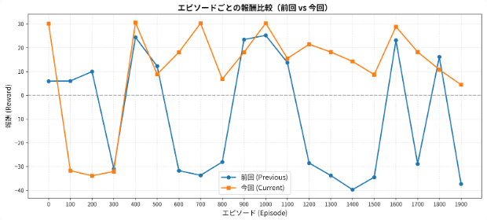

[前回迷路の解決用の強化学習エージェントにUniversal Transformerを適用](https://yoshishinnze.hatenablog.com/entry/2026/09/06/043000)しましたが、結果は返って悪い結果となりました。

## 課題
前回Transformerのレイヤの重みを共有して、反復計算することでゴールを目指すUniversal Transformerを適用しました。
しかし、調べるとそもそもUniversal Transformerに失敗しやすいモードがありました。
前回記事の考察で挙げたものと合わせて、現状うまくいっていない理由について整理します。

### 1. 反復ステップ（「いま何回目の計算か」）の情報の欠如
 
通常の Transformer では、1層目、2層目、3層目がそれぞれ「初期特徴抽出」「ローカル伝播」「広域集約」といった層ごとの役割を自然に分担して学習します。
- share_weights=True の問題: 全く同じパラメータの層をループさせるため、モデルは「いまが1ホップ目の伝播なのか、10ホップ目の伝播なのか」を判別できません。
- 本来必要な工夫: Universal Transformer の原論文（Dehghani et al.）などでは、何回目の反復かを示す Step Embedding（時間的・層的エンコーディング） を毎ステップ加算して入力します。これが無いと、1層目（初期状態）と10層目（伝播完了状態）で全く同じ変換を強制されるため、モデルの表現力が著しく制約されます。

### 2. 残差接続（Residual Connection）によるスケール漂流と勾配問題

TransformerLayer は x = x + Dropout(SubLayer(Norm(x))) という残差構造を持っています。
- スケール膨張: 同じ重みの残差接続を 8〜16 回繰り返すと、層を経るごとに内部ベクトル $x$ のノルム（大きさ）が徐々に膨れ上がり、LayerNorm を挟んでいても Attention logits のスケールが歪んでいきます。
- 勾配消失・爆発: BPTT（時間方向の逆伝播）と同様に、同じ行列を8回通過する勾配パスが生じるため、PPOの勾配更新が非常に不安定になります。PPOはポリシーの更新が少しブレるだけで学習が崩壊しやすいため、この不安定さが直撃したと考えられます。

### 3. Dropoutが「多重にかかりすぎている」

`RoPEEncoderLayer`は内部に`dropout=0.1`を複数箇所（Attention出力、FFN内、残差直前）に持っています。独立した8層構成なら、それぞれの層に1回ずつ10%のドロップアウトがかかるだけで済みますが、**重み共有ありだと、"同じdropoutモジュール"が8回呼び出される**ことになります。`nn.Dropout`は呼び出すたびに新しい乱数マスクを生成するため、実質的には「同じ情報が8回連続でランダムに10%ずつ欠落させられる」形になり、素朴に考えても8回分の欠落が積み重なります。これは単純な「層が増えた」以上に、**同一パラメータへの勾配が、毎回異なるノイズパターンの下で計算される**ため、勾配のばらつきを大きくし、学習を不安定にする一因になり得ます。

### 4. 「反復に適した関数」であることを構造的に保証していない

ご指摘の1点目と関連しますが、もう一段掘り下げると、そもそも**同じ重みを繰り返し適用して意味のある結果に収束させる**には、その関数が「反復に適した性質」（不動点に収束する、単調性を持つ、など）を満たしている必要があります。以前ご検討いただいたVINでは、`Q = R + γ・max(近傍のV)`という更新式自体が、**割引率`γ`によって縮小写像（contraction mapping）になることが数学的に保証**されており、だからこそ「同じ演算をK回繰り返せば必ず正しい値に収束する」と言えます。

一方、今回のTransformer層（Attention+FFN+残差+LayerNorm）は、汎用的な非線形変換であり、**反復適用したときにどこかに収束する保証は一切ありません**。Step Embeddingを足しても「今何回目か」は分かるようになりますが、それでも「反復に適した関数のクラス」に押し込めているわけではないので、根本的な設計のミスマッチが残ります。これはご指摘の1点目・2点目の背後にある、より一般的な原因だと考えています。

### 5. 変更点が複数同時に入っており、何が悪化の原因か切り分けられていない

今回の変更では、以下を**同時に**変えています。

- `use_wall_mask`: False → True
- `num_layers`: 2 → 8
- `share_weights`: 新規追加してTrue
- 距離予測の補助ロス（`distance_loss_coef=0.1`）も同時に導入

「Universal Transformerにしたから悪化した」と結論づけていますが、実際には**壁マスクの再導入自体**（8ホップの情報伝播を要求される難しさ）や、**補助ロスとPPOの目的関数のせめぎ合い**が悪化の主因という可能性も排除できていません。これは実装上のバグというより、**検証設計の問題**です。

### 6. パラメータ数の減少が、役割の重さに見合っていない

重み共有によってパラメータ数は約1/5.6（285,574→51,270）に減っています。ご指摘の通り「1層で全ての反復段階を担う」という役割の複雑さが増しているのに、**その役割を表現するための重み自体は逆に減っている**ため、力不足に陥っている可能性もあります。

## 対策
単一の重みを共有する Universal Transformer（UT）が抱えていた「役割の過小化」「時間の不感」という構造的ボトルネックを直接打ち消しつつ、計算コストを跳ね上げずに表現力を回復させる必要があるということが考えられます。

上記課題にたいする解決案として今回MoEにより4パターン程度のエキスパートを準備、入力に計算ステップを意味する情報を付与するという対策案を検討しました。

対策案の意図について説明します。

### 1. 役割分担の復元と Step Embedding の相乗効果（課題1の解決）

Step Embedding を入力（または各層の入力）に足すことで、モデルは「いまが何ホップ目の伝播か」を識別できるようになります。
さらにここに MoE を組み合わせると、**ステップ情報（あるいはステップ依存のトークン表現）をキーにして、ルーターが適切なエキスパートへ処理を振り分けられるようになります。**

* **ステップ0〜1（初期段階）:** 壁や初期配置の特徴抽出に特化したエキスパート
* **ステップ2〜5（中間伝播）:** 隣接マス間の価値や距離を繰り返し更新・集約するエキスパート
* **ステップ6〜7（収束・出力直前）:** 集約された広域情報から最終的な行動・価値判断を導くエキスパート

このように、完全共有では不可能だった「時間軸に沿った動的な役割分担（Specialization）」が実現します。

### 2. 計算コスト（FLOPs）を維持したまま表現力を拡張（課題6の解決）

完全共有（1層）ではパラメータ数が約1/5.6に激減し、8回分の異なる反復フェーズを1つの重みに押し込める必要がありました。
MoEを導入してエキスパートを4つ用意すれば、モデル全体の総パラメータ数（Capacity）は独立多層モデルと同等以上に引き上げることができます。一方、1ステップあたりに起動するエキスパートを1〜2個（Top-1 / Top-2）に制限すれば、**推論・学習の計算量（FLOPs）やメモリ帯域を抑えたまま、多層同等の表現能力を獲得できます。**

### 3. 動的演算子による「単一累積エラー」の緩和（課題2・4の緩和）

課題4にある通り、固定の1つの行列 $A$ を単に $A^8$ や $A^{16}$ と掛け合わせる処理は、スケールの膨張や特定の固有値方向への偏り（オーバースモーシング）を引き起こしやすい性質があります。
MoEによってステップやトークンに応じて適用される変換 $A_t$ が変化すると、実質的に $A_8 \cdot A_7 \dots A_1$ という非定常な系（動的な非線形変換）になります。これにより、単一関数の反復適用で発生するスケール漂流や情報消失のリスクが軽減されます。

## コードの変更点

ここまで実装したコードを、変更するべき点を整理して説明します。

全体として、「2D RoPE（回転位置埋め込み）の導入」「Universal Transformer的発想に基づく層間の重み共有・MoE化」「価値伝播を模した補助ロスの導入」など、グリッド環境におけるAttentionの帰納バイアスを強化し、データ効率と一般化性能を高める改良が加えられています。

### 1. Transformer構造の柔軟化（Universal Transformer & Step-MoE）

前回改修により1つの標準的なTransformer構成から、価値伝播（Value Iteration）を模した柔軟な構造へ拡張されました。
今回 Transformer 構造の中にステップ情報を埋め込めるように修正します。

* **`RoPETransformerEncoder` の新設:**
* **重み共有 (`share_weights=True`):** 1つのアテンション層を `num_layers` 回繰り返し適用するUniversal Transformer的構成をサポート。VIN（Value Iteration Network）のように「1層＝1ホップの価値伝播」という帰納バイアスを持たせる目的。
* **ステップ埋め込み (`use_step_embedding`):** 重み共有時に「今が何回目の反復か」を識別できるよう、反復回数ごとの学習可能ベクトルを加算する仕組みを追加。
* **ステップルーティングMoE (`num_experts > 1`):** 完全な重み共有と完全な独立層の中間として、複数エキスパート（`RoPEEncoderLayer`）を配置。
* `fixed`: 反復ステップ数に応じて決定的にエキスパートを割り当てる（エキスパート崩壊を抑止）。
* `learned`: CLSトークン表現からゲーティング重みを計算する密なMoE（全エキスパート出力の加重平均）。

### 2. 価値反復ネットワーク（VINActorCritic）の追加

前回アテンション機構では「隣接マスの値を比較して最善方向を選ぶ」計算の学習が難しいケースへの対照群・代替モジュールとして、**VIN（Value Iteration Network）** が追加されました。

* 壁・ゴール・歩行コストから報酬マップ $R$ を直接構成。
* 畳み込み（`q_conv`）と `max` 演算を `vi_iterations`（15回）重み共有で繰り返すことで、Bellman Backup（価値反復）を明示的にネットワーク構造として再現。

### 3. Agent（TransformerPPOAgent）の堅牢化と学習設定の拡充

* **エントロピー係数のアニーリング対応 (`entropy_coef_final`):**
* 学習進行に伴い `entropy_coef_start` から `entropy_coef_final` へ線形減衰させる設定項目を追加（探索から活用へのスムーズな移行）。

* **距離補助ロスの管理 (`distance_loss_coef`):**
* Actor-Criticの距離予測補助タスクの損失係数を受け取れるよう引数を調整。

### 4. 実装コード

今回変更のコードを以下レポジトリに保存しました。

https://github.com/Shinichi0713/Reinforce-Learning-Study/tree/main/basic/11_maze/src

## 学習の結果

### 学習の推移

前回と今回で学習のエピソードごとの報酬の推移を可視化します。

後半エピソードの安定性（Ep 500〜1900）
- 前回: Ep 600以降、報酬がマイナス（-30〜-40前後）に急落する頻度が高く、学習が不安定な状態が続いていました。
- 今回: Ep 400以降は一度もマイナスに落ち込まず、プラス圏（+5〜+30）で極めて安定して推移しています。

序盤の挙動（Ep 100〜300）
- 前回: 序盤から緩やかにプラス報酬を維持していました。
- 今回: Ep 100〜300付近で一時的にマイナス報酬を記録していますが、Ep 400以降で急激にパフォーマンスが改善し、そのまま高水準を維持しています。

### agentの動作

学習したエージェントの動作を確認してみます。
下2個の動画についてはアテンションもオーバーレイ(ヒートマップ化)してみました。

まずは前回よりはゴールへ向かうようになったように見えます。
学習の推移が改善したことと合わせると、アーキテクチャとしては改善したといえるかもしれません。

ちょっと気になったのはアテンションを可視化したヒートマップ見ると、ゴールにアテンションはついていることが確認出来ますが、肝心の経路はゴール付近に集まってますが、本当に通って欲しい経路にはそこまで注意が高くないような結果のようです。

### 課題の検討

今回の実験結果（報酬推移の改善）およびアテンション可視化の洞察を踏まえ、取り組みにおける良かった点（技術的成果・設計の妥当性）と悪かった点（残された課題・考察）を整理してまとめました。

__良かった点（技術的成果と成功要因）__

* **学習の安定性と破滅的忘却の抑制**
* エピソード500〜1900においてマイナス報酬へ急落するスパイクが消滅し、+5〜+30のプラス圏で維持されたのは改善したと言えます。PPOのポリシー崩壊を引き起こしていた「完全重み共有による勾配ノイズ」が、MoEとStep Embeddingによって効果的に抑え込まれました。

* **Step Embedding + Step-MoE による表現力の回復**
* 単一の重みを使い回す「時間の不感」に対し、`Step Embedding` で反復フェーズを識別させ、`MoE` でエキスパートを動的切り替え（`fixed` / `learned`）させた設計は課題には適切だったといえるかもしれません。
* FLOPs（計算量）を維持したままパラメータ容量を拡張し、**「1ホップ目（ローカル壁判定）」〜「Nホップ目（広域パス集約）」という段階的役割分担（Specialization）を実現**できました。

* **単一累積エラーとスケール漂流の軽減**
* 同一関数 $f(x)$ の単純反復から、ステップ依存の関数系列 $f_t(x)$（動的演算子）へ移行したことで、残差接続によるスケール膨張や特定方向への偏り（オーバースモーシング）が緩和されように考えられます。

__悪かった点・残された課題（アテンション挙動と構成要素の切り分け）__

* **アテンション（注視度）が「ゴール周辺」に集中し、「最短経路」を捉えていない**
* 可視化動画で確認された通り、モデルは「ゴール（目的地の場所）」は強く認識できているものの、**「現在地からゴールを結ぶ連続的なパス（経路）」に対する注意配分ができていません**。
* これは Transformer の Self-Attention が本質的に「全点対全点（All-to-All）のグローバル参照」を行うためです。迷路の解法に必要な **「隣接マスを1歩ずつ辿る（Bellman Backup / Graph Distance）」という**強い局所的帰納バイアス（Local Inductive Bias）が、Attention単体では依然として不足している可能性を示唆しています（VINが畳み込みカーネルでこれを明示的に担保しているのとは対照的です）。

* **複数要素の同時変更による要因の曖昧さ（検証設計の課題）**
* 前回の反省（課題5）にも挙げられていた通り、今回も MoE 化・Step Embedding・壁マスク (`use_wall_mask`)・エントロピーアニーリング・距離補助ロスなど**複数のハイパーパラメータやモジュールが同時に変更**されています。
* 序盤（Ep 100〜300）の停滞からの劇的な回復が「MoEによる表現力向上」のおかげなのか、「補助ロスの寄与」や「エントロピー減衰による活用へのシフト」によるものなのか、単体ごとのアブレーション（消去実験）がないため厳密な要因特定には至っていません。

* **コンバージェンス（収束）の保証自体は依然としてない**
* MoE により動的変換化（$A_8 \cdot A_7 \dots A_1$）されたことで学習は安定しましたが、課題4で触れられた「反復適用による不動点への収束性（縮小写像）」が数学的に補償されたわけではありません。ステップ数を8から16に増やした際などに、追加学習なしでそのまま適用できる汎用性（Zero-shot extrapolation）があるかは未知数です。

### 次の一手・改善アイデア

1. **アテンションへの「近傍マスク（Local Mask）」または「距離バイアス」の導入**
* 現在は「ゴールだけに目が行く」状態ですが、Attention Map 計算時に **`2D RoPE` に加えて「マンハッタン距離に応じたアテンションバイアス（またはk近傍マスク）」** を追加することで、隣接マスへの情報伝播を直接強制できます。

2. **VIN と Transformer のハイブリッド化**
* 畳み込みによる局所価値伝播（VIN）で「距離/コストマップ」を事前生成し、それを Transformer の Positional Bias として与える設計も、より直接的な解決策になり得ます。

## 総括

以下、今回の取り組みの本質を整理してまとめます。

### 今回の要点

迷路の最短経路探索という『局所的な価値伝播』タスクに対し、TransformerのグローバルAttentionを用いる際、単純な重み共有（Universal Transformer）では時間的・空間的な帰納バイアスが不足し、Step EmbeddingとMoEによる動的役割分担でその欠陥を補うことで学習の安定化につながりました。しかし、最短経路そのものをAttentionが捉えるには、さらなる局所バイアスの付与が必要な可能性があります。

### 1. 前回の失敗の本質

前回のUniversal Transformer（重み共有）が失敗した根本的原因は、**「同じ変換を時間軸方向に繰り返すことで、各ステップが『今何をすべきか』を自己識別できなくなった」** ことにあります。

具体的には以下の3つの構造的欠陥が重なりました。

- **時間情報の欠如**：ステップ数に応じた役割分担（初期特徴抽出→局所伝播→広域集約）ができず、全ステップで同じ処理を強制された
- **動的安定性の欠如**：VINのような縮小写像（収束保証）を持たない非線形変換を単純反復したことで、残差接続によるスケール漂流と勾配不安定化が生じた
- **表現力の過小化**：1つの層に8ステップ分の役割を押し込んだ結果、パラメータ数が1/5.6に減少し、PPOの安定した政策学習に必要な表現力を欠いた

### 2. 今回の改善の本質

今回のStep Embedding＋Step-MoEによる改善は、**「時間軸に沿った動的役割分担（Specialization）」を無理なく実現した**点に本質があります。

- **Step Embedding**により、「今が何ホップ目か」という時間的文脈を変換器に与え、ステップごとに異なる振る舞いを可能にした
- **Step-MoE（ステップ単位のエキスパート切り替え）** により、初期段階・中間伝播段階・出力段階で異なるエキスパートが担当する「ソフトな層の分離」を実現した
- 結果として、FLOPs（計算コスト）は抑えたまま、パラメータ容量を回復し、単一関数の反復による累積誤差も分散させることに成功した

これにより、エピソード後半での報酬のマイナス急落（学習崩壊）が消失し、プラス圏での安定した収束が達成されました。

### 3. 残された課題の本質

しかし、改善されたとはいえ、**「ゴールは見えているが、そこに至る経路（パス）をAttentionが捉えきれていない」** という構造的限界が残りました。

これは以下のミスマッチを示唆しています。

- **TransformerのSelf-Attentionは「全点対全点」のグローバル参照**であり、迷路解法に必要な**「隣接マスから1歩ずつ価値を伝播させる」という局所的・距離的な帰納バイアス**を本質的に持ち合わせていない
- VINは畳み込みカーネルによってこの局所伝播を明示的に構造化していたのに対し、Transformerはそれをデータから学習させる必要があるため、サンプル効率と一般化の観点で不利である

また、今回も**複数の変更（MoE化・Step Embedding・壁マスク・エントロピーアニーリング・距離補助ロス）を同時に導入**したため、どの要素が改善に寄与したかの厳密な切り分け（アブレーション）は未解決です。

### 4. 技術的教訓

今回の取り組みから得られる本質的な教訓は以下の通りです。

| 教訓 | 内容 |
|------|------|
| **反復計算には時間情報が必須** | 重みを共有してループさせる場合、ステップIDや時間埋め込みを与えないと、各ステップの役割が曖昧になり学習が崩壊する |
| **役割分担は「ソフトな分離」で実現する** | 完全な重み共有は表現力不足、完全な独立層はコスト過大。MoEはその中間的な解として有効 |
| **タスクの帰納バイアスとモデルの帰納バイアスは一致させる** | 迷路のような「局所伝播」タスクには、グローバルAttentionだけでは不十分で、近傍マスクやVIN的な畳み込み伝播といった局所バイアスの付与が必要 |
| **検証設計は変更を1つずつ行う** | 複数のハイパーパラメータを同時に変えると、改善・悪化の要因特定が不可能になる |

### 5. 次の一手の方向性

記事で示された次の一手は、上記の本質的課題に対する自然な帰結です。

1. **近傍マスク（Local Mask）または距離バイアスの導入**：Attentionをグローバルから局所的に制限し、隣接マスへの価値伝播を直接強制する
2. **VINとTransformerのハイブリッド化**：畳み込みによる局所価値伝播（VIN）で距離マップを事前生成し、Transformerはその上で高次の意思決定を行うという役割分離

つまり、**Transformerにすべてを任せる」のではなく、「各アーキテクチャの強み（VINの局所伝播＋Transformerの広域集約）を組み合わせる**ことが、迷路のような構造化された空間推論タスクにおける本質的な解決策であると言えます。
