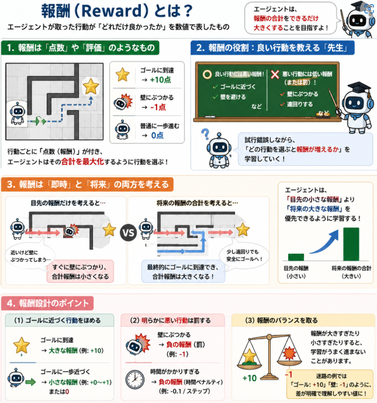

[前回構築した環境コード](https://yoshishinnze.hatenablog.com/entry/2025/10/28/043000)ですが、これだけだとまだ強化学習として機能しません。
環境から与えられる報酬という概念が存在しないからです。

そこで本日は報酬についての説明と環境コードに報酬を実装していこうと思います。

本日テーマ：
>環境コードに報酬を実装していく

## 報酬とは？

強化学習における「報酬」は、**エージェント（学習する主体）が取った行動が「どれだけ良かったか」を数値で表したもの**です。
※因みに報酬の設計指針については[このリンクの記事](https://note.com/novel_fowl5247/n/ned0295a80f8c)をご参考頂ければと思います。

### 1. 報酬は「点数」や「評価」のようなもの

- 迷路の例で言うと：
  - ゴールに到達 → **+10点**（とても良い）
  - 壁にぶつかる → **-1点**（良くない）
  - 普通に一歩進む → **0点**（普通）

このように、行動ごとに「点数」が付きます。  
エージェントは、**この点数（報酬）の合計をできるだけ大きくするように行動を選ぶ**ことを目指します。

### 2. 報酬の役割：良い行動を教える「先生」

報酬は、エージェントにとっての「先生」のような役割をします。

- 良い行動（ゴールに近づく、壁を避ける）には**高い報酬**を与える
- 悪い行動（壁にぶつかる、遠回りする）には**低い報酬（または罰）** を与える

エージェントは、試行錯誤しながら「どの行動を選ぶと報酬が増えるか」を学習していきます。

### 3. 報酬は「即時」と「将来」の両方を考える

強化学習では、**その場で得られる報酬（即時報酬）**だけでなく、**将来もらえる報酬の合計**を最大化することを目指します。

- 例：  
  少し遠回りでも安全なルートを選ぶ方が、  
  最終的にゴールにたどり着く確率が高く、合計報酬が大きくなる。

エージェントは「目先の小さな報酬」より「将来の大きな報酬」を優先できるように学習します。

### 4. 報酬設計のポイント

__(1) ゴールに近づく行動をほめる__
- ゴールに到達 → 大きな報酬
- ゴールに一歩近づく → 小さな報酬（または0）

__(2) 明らかに悪い行動は罰する__
- 壁にぶつかる → 負の報酬（罰）
- 時間がかかりすぎる → 負の報酬（時間ペナルティ）

__(3) 報酬のバランスを取る__
- 報酬が大きすぎたり小さすぎたりすると、学習がうまく進まないことがあります。
- 迷路の例では「ゴール: +10」「壁: -1」のように、差が明確で理解しやすい値にしています。



## 報酬実装のキーポイント

これまで構築してきた迷路環境コードにおいて、報酬を定義する際の手順とキーポイントをまとめます。

### 1. 報酬を定義する基本手順

__ステップ1：目標を明確にする__
- 例：**「ゴールに最短で到達する」** ことをエージェントに学習させたい。

__ステップ2：どの行動・状態に報酬を与えるか決める__
- ゴール到達 → 大きな正の報酬
- 壁衝突 → 負の報酬（罰）
- 通常移動 → 0（中立）

__ステップ3：報酬の値を決める__
- ゴール: +10
- 壁: -1
- 通常: 0

__ステップ4：コード内で報酬を返す場所を実装する__
- `step()` メソッド内で、行動後の状態に応じて `reward` を計算し、返す。

>__step()__  
>step は、強化学習の環境が「1ステップ進む」ためのメソッドです。
>もう少し具体的に言うと：
>エージェントが「どの行動を選んだか」を受け取り、
>その結果として「次にどの状態になるか」「どのくらい報酬がもらえるか」「終わったかどうか」を返すメソッドです。

### 2. コード内での報酬定義の具体例

実際にstep()を実装していきます。

```python
def step(self, action):
    # ... 行動に応じて next_state を計算 ...

    # 1. 壁にぶつかったか？
    if not self._is_valid_move(next_state):
        next_state = self.state
        reward = -1  # 壁衝突の罰

    # 2. ゴールに到達したか？
    elif self.maze[next_state[0]][next_state[1]] == 'G':
        reward = 10  # ゴール到達の報酬
        self.done = True

    # 3. それ以外（通常移動）
    else:
        reward = 0

    self.state = next_state
    return self.state, reward, self.done
```

### 3. 報酬設計のキーポイント

__(1) ゴールへの到達を「最も高く評価」する__
- ゴール到達報酬（+10）は、他の報酬に比べて十分に大きい値にします。
- エージェントが「ゴールを目指す」ことが最優先になるようにします。

__(2) 明らかに悪い行動には「罰」を与える__
- 壁衝突（-1）は、ゴール報酬に比べて小さな負の値ですが、「避けるべき行動」であることを明確にします。
- 罰が強すぎると探索が進まないため、バランスを取ります。

__(3) 通常行動は「0」で中立に__
- 通常の移動は報酬0とし、特別な評価を与えません。
- これにより、エージェントは「ゴールに近づく経路」を自然に選ぶようになります。

__(4) 報酬は「その場の結果」に基づいて与える__
- 報酬は、行動直後の状態（壁にぶつかったか、ゴールか、通常か）に基づいて即座に与えます。
- 将来の報酬の合計は、強化学習アルゴリズム（Q学習など）が内部で計算します。

### 4. 設計上の注意点

__(1) 報酬の差を明確にする__
- ゴール報酬と壁罰の差が小さいと、エージェントがゴールを目指す動機が弱くなります。
- 例：ゴール+1、壁-1 だと「ゴールに行くメリット」が小さくなりがちです。

__(2) 報酬のスケールを揃える__
- すべての報酬を同じオーダー（例：-1, 0, +10）にしておくと、学習が安定しやすくなります。

__(3) 終了条件と報酬をセットで考える__
- ゴール到達時は「報酬 +10」と「done = True」を同時に返します。
- これにより、エージェントは「ゴールが終了点」であることを理解します。

## 検証

実装できたら実際に正しく動作しているかを検証してみます。


```python
import unittest
import io

# --- テストクラス ---
class TestMazeEnvReward(unittest.TestCase):
    """
    迷路環境の報酬が正しく出ているか検証するテストクラス（Colab用）
    """
    def setUp(self):
        """各テストの前に環境を初期化"""
        self.env = MazeEnv()

    def test_reward_wall_hit(self):
        """壁にぶつかったときの報酬が -1 であることを確認"""
        self.env.reset()
        # スタート (0,0) から左に進む → 壁 or 外に出る → 報酬 -1
        _, reward, _ = self.env.step(2)  # 左
        self.assertEqual(reward, -1, "壁にぶつかったときの報酬は -1 であるべき")

    def test_reward_goal_reach(self):
        """ゴールに到達したときの報酬が +10 であることを確認"""
        self.env.reset()
        # ゴール (4,4) の左隣 (4,3) から右に進む → ゴール到達
        # テスト用に state を直接設定（検証目的なので許容）
        self.env.state = (4, 3)
        self.env.done = False
        _, reward, done = self.env.step(3)  # 右 → ゴールへ
        self.assertEqual(reward, 10, "ゴール到達時の報酬は +10 であるべき")
        self.assertTrue(done, "ゴール到達時は done=True であるべき")

    def test_reward_normal_move(self):
        """通常の移動（壁でもゴールでもない）の報酬が 0 であることを確認"""
        self.env.reset()
        # スタート (0,0) から右に進む → (0,1) は通路
        _, reward, _ = self.env.step(3)  # 右
        self.assertEqual(reward, 0, "通常移動時の報酬は 0 であるべき")

    def test_reward_sequence(self):
        """一連の行動で報酬が正しく出るか確認"""
        self.env.reset()
        rewards = []
        actions = [3, 1, 1, 3, 3, 1, 3]  # 適当な経路
        for action in actions:
            _, reward, done = self.env.step(action)
            rewards.append(reward)
            if done:
                break
        last_reward = rewards[-1]
        self.assertIn(last_reward, [10, -1, 0],
                      "最終報酬は 10（ゴール）、-1（壁）、0（通常）のいずれかであるべき")

```

上記テストコードを以下コードで実行してください。

```python
loader = unittest.TestLoader()
suite = loader.loadTestsFromTestCase(TestMazeEnvReward)
runner = unittest.TextTestRunner(verbosity=2)
runner.run(suite)
```

結果以下のようになれば実装は正しくできています。
```
test_reward_goal_reach (__main__.TestMazeEnvReward.test_reward_goal_reach)
ゴールに到達したときの報酬が +10 であることを確認 ... ok
test_reward_normal_move (__main__.TestMazeEnvReward.test_reward_normal_move)
通常の移動（壁でもゴールでもない）の報酬が 0 であることを確認 ... ok
test_reward_sequence (__main__.TestMazeEnvReward.test_reward_sequence)
一連の行動で報酬が正しく出るか確認 ... ok
test_reward_wall_hit (__main__.TestMazeEnvReward.test_reward_wall_hit)
壁にぶつかったときの報酬が -1 であることを確認 ... ok

----------------------------------------------------------------------
Ran 4 tests in 0.012s
```

## 総括

今回報酬の話は以下が重要な点です。

### 1. 報酬の役割
- 報酬は、**エージェントの行動が「どれだけ良かったか」を数値で評価する指標**です。
- エージェントは「報酬の合計を最大化する」ように行動を学習します。

### 2. 報酬設計の基本方針
- **ゴール到達** → 大きな正の報酬（例：+10）
- **明らかに悪い行動（壁衝突など）** → 小さな負の報酬（例：-1）
- **通常の移動** → 0（中立）
- 報酬の差を明確にし、ゴールを目指す動機を強くします。

### 3. 実装上のポイント
- `step()` メソッド内で、行動後の状態に応じて `reward` を即座に計算・返却します。
- 報酬は「その場の結果」に基づいて与え、将来の合計報酬はアルゴリズム側で扱います。
- ゴール到達時は「大きな報酬」と「`done = True`」を同時に返し、終了条件と報酬を連動させます。

### 4. 検証のポイント
- 壁衝突時に `reward = -1` であること
- ゴール到達時に `reward = +10` かつ `done = True` であること
- 通常移動時に `reward = 0` であること
- 一連の行動で、最終報酬が期待通り（10, -1, 0 のいずれか）であること
- これらをユニットテストで確認し、報酬設計が意図通りに動作していることを保証します。
