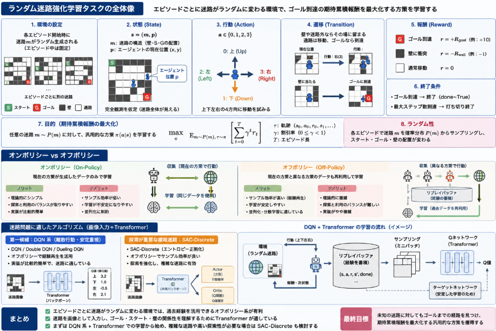

以前に取り組んだ[強化学習の迷路問題](https://yoshishinnze.hatenablog.com/entry/2025/10/30/000000)について。
単純な(ニューラルネットワークを用いない)強化学習で解けてしまいます。

但し、迷路がエピソードごとに変化する、というような問題設定の場合になると強化学習では太刀打ちできなくなります。
ということで、迷路がエピソードごとに代わるような問題の時、どんな手法であれば解けるかについて考えてみます。

## 問題の設定

エピソードごとに迷路がランダムに変わる（ただしエピソード中は固定）という条件を満たす強化学習の問題設定を正式に定義します。

### 問題設定：ランダム迷路強化学習タスク

__1. 環境の定義__

- **環境**: ランダム迷路環境（Random Maze Environment）
- **エピソード**: 1回の迷路探索（スタートからゴール到達または打ち切りまで）
- **エピソードごとの変化**: 各エピソード開始時に、迷路の構造（壁の配置、スタート・ゴール位置）がランダムに生成される。
- **エピソード中の固定性**: 1エピソード内では迷路の構造は変化しない。

__2. 状態空間（State Space）__

- **状態**: $ s = (m, p) $  
  - $ m $: 迷路の構造（壁・スタート・ゴールの配置）  
  - $ p $: エージェントの現在位置 $ (x, y) $
- 迷路は $ N \times N $ のグリッド（例：5×5）とする。
- 各セルは以下のいずれか：
  - 通路（`.`）
  - 壁（`W`）
  - スタート（`S`）
  - ゴール（`G`）

**注**: 強化学習アルゴリズムの観点からは、エージェントは「迷路全体 $ m $」を観測できる（完全観測）か、「周囲のみ」を観測できる（部分観測）かによって状態表現が変わります。ここでは完全観測を仮定することが多いです。

__3. 行動空間（Action Space）__

- **行動**: $ a \in \{0, 1, 2, 3\} $  
  - 0: 上（Up）  
  - 1: 下（Down）  
  - 2: 左（Left）  
  - 3: 右（Right）

__4. 遷移確率（Transition Probability）__

- **遷移**: $ P(s' \mid s, a) $  
  - 行動 $ a $ に応じて、エージェントは隣接セルに移動を試みる。
  - 移動先が壁または迷路外の場合、位置は変化しない。
  - 移動先が通路またはゴールの場合、位置が更新される。
- **エピソード中の固定性**:  
  - 迷路構造 $ m $ はエピソード中一定であり、遷移は $ p $ のみに依存する。

__5. 報酬関数（Reward Function）__

- **報酬**: $ r(s, a, s') $
  - ゴールセルに到達: $ r = +R_{\text{goal}} $（例：+10）
  - 壁に衝突: $ r = -R_{\text{wall}} $（例：-1）
  - それ以外の通常移動: $ r = 0 $

ここで、$ R_{\text{goal}} \gg R_{\text{wall}} > 0 $ とし、ゴール到達を強く評価します。

__6. 終了条件（Termination）__

- **終了条件**:
  - ゴールセルに到達した場合：エピソード終了（`done = True`）
  - 最大ステップ数に達した場合：打ち切り終了（`done = True`）

__7. エピソードごとのランダム性__

- **迷路生成**: 各エピソード開始時に、迷路 $ m $ が確率分布 $ P(m) $ からサンプリングされる。
  - 例：壁の配置を一様ランダムに生成し、スタートとゴールを空きセルからランダムに選択。
- **エージェントの目標**:  
  - 任意の迷路 $ m \sim P(m) $ に対して、ゴールまでの総報酬を最大化する**汎用的な方策（ポリシー）** $ \pi(a \mid s) $ を学習する。

### 強化学習の目的（目的関数）

今回解く問題の期待累積報酬は以下で与えられることになります。
また、問題自体は状態量、行動ともに連続ではない離散問題という扱いになります。

- **目的**: 期待累積報酬の最大化  
  $$
  \max_{\pi} \mathbb{E}_{m \sim P(m), \tau \sim \pi} \left[ \sum_{t=0}^{T} \gamma^t r_t \right]
  $$
  - $ \tau = (s_0, a_0, r_0, s_1, \dots) $：エピソードの軌跡
  - $ \gamma \in [0, 1] $：割引率
  - $ T $：エピソード長（ゴール到達または打ち切りまで）

### アルゴリズム設計上の含意

この問題設定では、エージェントは**特定の迷路を暗記するのではなく、迷路の一般構造に対する「解き方」を学ぶ**必要があります。

- **状態表現の工夫**:
  - 迷路全体を観測できる場合：座標ベースまたは画像ベースの状態表現
  - 部分観測の場合：エージェントの周囲のみを観測し、履歴を状態に含める
- **探索の重要性**:
  - 毎回異なる迷路に出会うため、探索（Exploration）を強化する必要がある
- **汎用性の評価**:
  - 学習済みポリシーが、訓練で見ていない新しい迷路に対しても適切に行動できるか（汎化性能）が重要

## 問題を解く流れ
今回のモデルは迷路を画像ととらえて、構造を理解することに長けたTransformerベースのモデルで解かせようと思います。
画像入力＋Transformerを用いる場合に適した強化学習アルゴリズムを、目的別に整理します。

### 1. アルゴリズム選択の観点
アルゴリズム選定の観点についてです。

- **方策オンポリシーかオフポリシーか**
- **連続行動か離散行動か**
- **安定性・実装の容易さ**
- **計算資源**

迷路問題は通常**離散行動**（上下左右など）なので、離散行動向けのアルゴリズムが中心になります。

### 2. 推奨アルゴリズム（画像＋Transformer向け）

__(1) DQN（Deep Q-Network）系__
**特徴**
- オフポリシー（過去の経験を再利用可能）
- 離散行動向け
- 経験再生（Replay Buffer）とターゲットネットワークで安定化

**画像＋Transformerとの組み合わせ**
- Transformerを**価値関数（Qネットワーク）のバックボーン**として使用。
- 入力：迷路画像（またはパッチ列）
- 出力：各行動のQ値

**適している場面**
- 単一エージェントの迷路
- 安定した学習を重視
- オフライン学習や経験再生を活用したい場合

**具体例**
- DQN
- Double DQN
- Dueling DQN（Advantageを分離）

__(2) PPO（Proximal Policy Optimization）__
**特徴**
- 方策勾配法（Actor-Critic）
- オンポリシー（現在のポリシーで集めたデータで学習）
- クリッピングにより安定した更新

**画像＋Transformerとの組み合わせ**
- **Actor（方策ネットワーク）**: 画像＋Transformer → 行動確率
- **Critic（価値関数ネットワーク）**: 画像＋Transformer → 状態価値

**適している場面**
- マルチエージェント環境（MAPPOとして拡張可能）
- オンライン学習が中心
- 安定性を重視（クリッピングによる過大更新の防止）

**具体例**
- PPO（単一エージェント）
- MAPPO（マルチエージェント）

__(3) A3C / A2C（Asynchronous Advantage Actor-Critic）__
**特徴**
- Actor-Criticの一種
- 非同期（A3C）または同期（A2C）で並列学習
- オンポリシー

**画像＋Transformerとの組み合わせ**
- ActorとCriticの両方で画像＋Transformerをバックボーンとして使用。

**適している場面**
- 並列計算資源が豊富な場合
- サンプル効率よりスループットを重視

__(4) SAC（Soft Actor-Critic）※連続行動向けだが応用可能__
**特徴**
- オフポリシーのActor-Critic
- エントロピー正則化により探索を促進
- 元々は連続行動向けだが、離散版（SAC-Discrete）も存在

**画像＋Transformerとの組み合わせ**
- Actor（方策）とCritic（Q関数）の両方でTransformerを使用。

**適している場面**
- 探索が重要な複雑な迷路
- 連続行動に拡張する可能性がある場合

### 3. オンポリシー VS オフポリシー
前節で何気に出てきたオンポリシーとオフポリシーですが説明していきます。
オンポリシーとオフポリシーは、強化学習における **「どのデータで学習するか」** の違いです。  
迷路問題を含む多くのタスクで、この選択は学習の安定性・効率・実装のしやすさに大きく影響します。

以下に特徴・メリット・デメリットを整理します。

__1. オンポリシー（On-Policy）__

__特徴__
- **現在の方策（ポリシー）が生成したデータのみで学習**します。
- データ収集と学習が同じ方策に依存します。
- 例：SARSA、REINFORCE、A2C/A3C、PPO（オンポリシーとして運用されることが多い）

__メリット__
1. **理論的にシンプル**
   - 方策勾配定理など、オンポリシー前提の理論がそのまま適用できます。
2. **探索と利用のバランスが取りやすい**
   - 現在の方策に従って行動するため、探索率（εなど）を調整しやすい。
3. **実装が比較的簡単**
   - 経験再生などの複雑な仕組みが不要な場合が多い。

__デメリット__
1. **サンプル効率が低い**
   - 各学習ステップで新しいデータを収集する必要があり、過去のデータを再利用しにくい。
2. **学習が不安定になりやすい**
   - 方策が少し変わるとデータ分布も変わり、学習が振動しやすい。
3. **並列化に制約**
   - 古い方策で集めたデータは使えないため、大規模な並列化が難しい場合がある。

__2. オフポリシー（Off-Policy）__

__特徴__
- **現在の方策とは異なる方策（行動方策）が生成したデータで学習**します。
- 過去の経験を再利用（リプレイバッファ）できます。
- 例：Q学習、DQN、SAC、DDPG

__メリット__
1. **サンプル効率が高い**
   - 経験再生（Replay Buffer）により、過去のデータを何度も再利用できます。
2. **学習が安定しやすい**
   - ターゲットネットワークやDouble Q-learningなどの工夫と組み合わせやすい。
3. **並列化・分散学習に適している**
   - 異なる方策で集めたデータを混ぜて学習できる。

__デメリット__
1. **理論的に複雑**
   - 重要度サンプリング（Importance Sampling）など、分布の違いを考慮する必要がある場合があります。
2. **探索と利用のバランスが難しい**
   - 行動方策と学習方策が異なるため、探索が不足したり、古いデータに引きずられたりするリスクがあります。
3. **実装がやや複雑**
   - リプレイバッファ、ターゲットネットワーク、重要度サンプリングなどの仕組みが必要になることが多い。

__3. 迷路問題における選択の指針__

__オンポリシーが向いている場合__
- **小規模な迷路**で、サンプル効率をあまり気にしない場合。
- **初学者向けの実装**で、シンプルさを重視する場合。
- **方策勾配法（PPOなど）**で安定性を確保したい場合。

__オフポリシーが向いている場合__
- **大規模・複雑な迷路**で、少ない試行で学習したい場合。
- **経験再生を活用**して安定した学習を目指す場合。
- **DQNなどの深層強化学習**を適用する場合。

### 4. 迷路問題で良いと思われるアルゴリズム

今回のようなケースの場合、迷路がいろいろ変わるので、その度にやるべきことがどんどんぶれては困ります。
変動が大きい環境下では抽象化して過去との比較ができるオフポリシー系のアルゴリズムが良いかと考えます。

となると試す上で良いと思われるアルゴリズムは以下でしょうか。

__離散行動・画像入力__
- **第一候補**: DQN（またはDouble DQN）＋Transformer
  - 実装が比較的簡単
  - 安定性が高い
  - 迷路のような離散行動タスクに適している

__探索が重要な複雑迷路__
- **候補**: SAC-Discrete＋Transformer
  - エントロピー正則化により探索を強化
  - オフポリシーでサンプル効率が良い

## 総括

ということで単純な迷路ではなく、エピソードごとに迷路がランダムに変化するような場合に解くことが出来そうな手法について検討してみました。
今回であればオフポリシー系の強化学習法が良いと考えています。
また、迷路変化に追従しようと思う場合、入力は客観視点を持つ必要があるので画像を入力の上で、ゴールやスタート、障害物を関係づけて理解することが必要となります。
ですのでモデルはTransformer系を選定することとします。

次回はまず、簡単な問題でDQN系手法で学習ができることを目指していきます。

