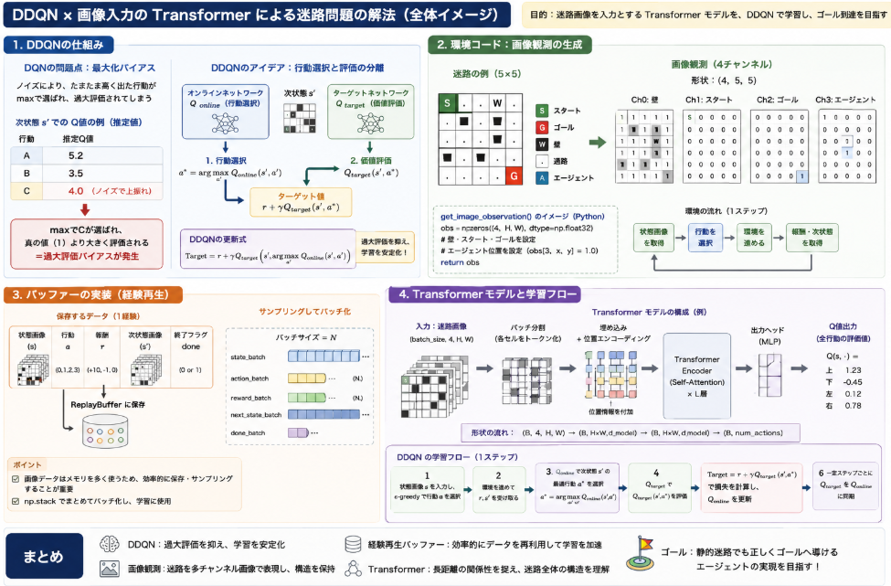

先日の[迷路問題](https://yoshishinnze.hatenablog.com/entry/2025/10/30/000000)について迷路が変動するような環境下でもゴールを目指せるエージェントの構築を検討していきます。

今回はまず、画像入力のTransformerモデルでDDQNで迷路環境の学習が可能かの検証を行っていきます。

本日テーマ：
>DDQN×画像入力のTransformerにより静的迷路のゴールが出来るか確認

## DDQNについて

まずは今回利用する予定の強化学習アルゴリズムであるDDQNとはどんなアルゴリズムであるかについて説明を行います。

DDQN（Double Deep Q-Network）は、**DQN（Deep Q-Network）の「過大評価バイアス」を軽減するための改良手法**です。

以下に、DDQNの概要・仕組み・メリットを整理します。

### 1. DDQNの位置づけ

- **ベース**: DQN（Deep Q-Network）
- **目的**: Q学習における「最大化バイアス（max overestimation bias）」を抑える
- **特徴**: 行動選択と価値評価を分離する「Double Q-learning」の考え方を深層学習に適用

### 2. DQNの問題点：最大化バイアス

__通常のDQNの更新式（1ステップ）__
$$
\text{Target} = r + \gamma \max_{a'} Q_{\text{target}}(s', a')
$$

ここで、
- $ Q_{\text{target}} $：ターゲットネットワーク
- $ \max_{a'} $：次状態 $ s' $ で最も高いQ値を持つ行動を選択

__問題点__
- ノイズや推定誤差により、**ある行動のQ値が偶然高く見積もられると、その行動が過大評価される**。
- これが繰り返されると、Q値が全体的に過大評価される「最大化バイアス」が生じます。
- 結果として、学習が不安定になったり、収束が遅くなったりします。

__例__: 3つの行動のQ値推定

次状態 s′s's′ での真のQ値が以下の通りだとします（真の値は未知）。

行動Aの真のQ値: 5
行動Bの真のQ値: 3
行動Cの真のQ値: 1

しかし、推定にはノイズが乗るため、観測されるQ値は以下のようになることがあります。

行動Aの推定Q値: 5.2（少し高め）
行動Bの推定Q値: 3.5（少し高め）
行動Cの推定Q値: 4.0（ノイズで大きく上振れ）

このとき、maxを取ると行動Cが選ばれ、Q値は4.0として扱われます。しかし真の値は1なので、 3.0も過大評価されています。
このように、「たまたまノイズで高く出た行動」がmaxで選ばれることで、真の値よりも大きく見積もられる現象が起こります。
本当に良い行動ではなくノイズに引っ張られることで、あるべき姿からどんどん乖離していきます。
また一度乖離すると中々元の状態に戻れません。

### 3. DDQNのアイデア：行動選択と評価の分離

DDQNでは、**「どの行動を取るか」の決定**と **「その行動の価値を評価する」こと**を別々のネットワークで行います。

__DDQNの更新式__
$$
\text{Target} = r + \gamma Q_{\text{target}}\left(s', \arg\max_{a'} Q_{\text{online}}(s', a')\right)
$$

- **行動選択（どの行動を取るか）**: オンラインネットワーク $ Q_{\text{online}} $ を使用
- **価値評価（その行動の価値はいくらか）**: ターゲットネットワーク $ Q_{\text{target}} $ を使用

評価者は急な変動に追従しません。少し良くなったということを認識していつもより良い加点を行うくらいです。
これにより、**偶然高い値が出た行動を過大評価しにくく**なります。


### 4. DDQNの具体的な手順

1. **現在の状態 $ s $** から、オンラインネットワーク $ Q_{\text{online}} $ で行動 $ a $ を選択（ε-greedyなど）。
2. 環境から $ r, s' $ を得る。
3. **次状態 $ s' $** での行動選択：
   - オンラインネットワーク $ Q_{\text{online}} $ を用いて、最適行動 $ a'^* = \arg\max_{a'} Q_{\text{online}}(s', a') $ を決定。
4. **価値評価**：
   - ターゲットネットワーク $ Q_{\text{target}} $ を用いて、$ Q_{\text{target}}(s', a'^*) $ を計算。
5. **ターゲット値**：
   $$
   \text{Target} = r + \gamma Q_{\text{target}}(s', a'^*)
   $$
6. オンラインネットワーク $ Q_{\text{online}} $ を、Targetに近づくように更新。
7. 一定ステップごとにターゲットネットワークをオンラインネットワークで更新。

### 5. DDQNのメリット

__(1) 過大評価バイアスの軽減__
- 行動選択と価値評価を分離することで、**ノイズによる過大評価を抑制**。
- Q値の推定がより正確になり、学習が安定します。

__(2) 学習の安定性向上__
- DQNに比べて、**Q値の発散や振動が起こりにくい**。
- 特にノイズの多い環境や複雑なタスクで効果を発揮します。

__(3) 実装の容易さ__
- DQNからの変更点は**ターゲット値の計算部分だけ**で、実装が比較的簡単です。
- 追加のハイパーパラメータはほぼ不要。

### 6. DDQNのデメリット・注意点

__(1) 計算コストのわずかな増加__
- 次状態での行動選択にオンラインネットワークを使用するため、**わずかに計算量が増える**。
- ただし、現代のGPU環境では無視できるレベルです。

__(2) すべての問題で劇的に改善するわけではない__
- シンプルな環境では、DQNとDDQNの差が小さい場合もあります。
- しかし、複雑な環境やノイズの多い環境では効果が顕著です。

## 画像入力のTransformerモデル

迷路の画像を入力とし、Transformerモデルで行動を選択する場合の**特徴**と**期待できる効果**について整理します。

### 1. モデルの特徴

__(1) 画像としての迷路表現__
- 迷路を2次元グリッドの「画像」として扱います。
- 各チャネルに異なる情報を割り当て（例：壁・スタート・ゴール・エージェント位置）、**多チャンネル画像**として入力します。
- これにより、空間的な構造（どこに壁があるか、ゴールまでの経路はどうか）を視覚的に捉えられます。

__(2) Transformerによるトークン化__
- 画像を小さなパッチ（またはセル）に分割し、それぞれを「トークン」として扱います。
- 各トークンを埋め込みベクトルに変換し、**位置エンコーディング**を加えることで、空間位置をモデルが認識できるようにします。

__(3) Self-Attentionによる関係性の学習__
- TransformerのSelf-Attentionにより、**任意の2つのセル間の関係**を直接学習します。
- 例：
  - 「スタートセル」と「ゴールセル」の関係
  - 「現在位置」と「周囲の壁」の関係
  - 「遠くの分岐点」と「現在の経路選択」の関係

__(4) 出力：行動の確率分布またはQ値__
- Transformerの出力をMLPに通し、**各行動の確率分布（方策）またはQ値**を出力します。
- これにより、画像から直接行動を決定する「端から端（end-to-end）」の学習が可能です。

### 2. 期待できる効果

__(1) 空間構造の理解__
- CNNと同様に**局所的な壁のパターン**を捉えつつ、Transformerにより**長距離の依存関係（スタート〜ゴールの経路）** も直接扱えます。
- これにより、迷路全体の構造をより深く理解できます。

__(2) 部分観測への適応__
- エージェントが周囲のみを観測する「部分観測」設定でも、Transformerが**過去の観測履歴を統合**し、迷路全体のメンタルマップを構築する助けになります。
- これはRNNの代替としても有効です。

__(3) ランダム迷路への汎化__
- エピソードごとに迷路が変わる場合、Transformerは**特定の迷路を暗記するのではなく、迷路の一般構造（壁の配置パターン、経路の性質）を学習**しやすいです。
- これにより、訓練で見ていない新しい迷路にも適応できる「汎化性能」が期待できます。

__(4) マルチエージェント環境での活用__
- マルチエージェント迷路では、Transformerが**他エージェントの位置や行動の関係**を捉えるのに適しています。
- 各エージェントの観測画像をトークンとして統合し、協調や競合のパターンを学習できます。

__(5) 探索の効率化__
- Self-Attentionにより、**ゴールまでの経路候補**や**未探索領域の重要性**を推定しやすくなります。
- これにより、無駄な探索を減らし、効率的にゴールへ向かう方策を学習できる可能性があります。

### 3. 注意点（期待しすぎない方がよい点）

__(1) 小規模迷路では過剰な可能性__
- 5×5のような小規模迷路では、状態空間が非常に小さいため、**単純なQ学習や小さなMLPでも十分**なことが多いです。
- Transformerはパラメータ数が多く、計算コストも高いため、**過学習や計算の無駄**になる可能性があります。

__(2) 学習データと計算資源__
- Transformerは多くのデータと計算資源を必要とします。
- 迷路が単純でエピソード数が少ない場合、**学習が進みにくい**こともあります。

__(3) 実装の複雑さ__
- 画像のパッチ分割、位置エンコーディング、Transformerの層の設計など、**実装がやや複雑**です。
- 初学者にとっては、シンプルな手法から始める方が理解しやすい場合もあります。

## 実装

実装コードは以下レポジトリに保管しています。

https://github.com/Shinichi0713/Reinforce-Learning-Study/tree/main/basic/11_maze


画像入力＋Transformerで迷路を解くために必要な、**環境コードの実装法**と**バッファーの実装法**のキーポイントを整理します。

### 1. 環境コードの実装法（画像観測の提供）

__(1) 迷路を画像として表現する__
迷路を多チャンネル画像（例：4チャンネル）として表現します。

- **チャネル0**: 壁（W） = 1.0、それ以外 = 0.0
- **チャネル1**: スタート（S） = 1.0、それ以外 = 0.0
- **チャネル2**: ゴール（G） = 1.0、それ以外 = 0.0
- **チャネル3**: エージェント位置（A） = 1.0、それ以外 = 0.0

形状は `(C, H, W)`（例：`(4, 5, 5)`）とします。

__(2) 画像観測を返すメソッドの追加__
`MazeEnv` クラスに、迷路の現在状態を画像として返すメソッドを追加します。

```python
def get_image_observation(self):
    """
    迷路を画像（NumPy配列）として返す
    形状: (4, H, W)
    """
    rows = len(self.maze)
    cols = len(self.maze[0])
    obs = np.zeros((4, rows, cols), dtype=np.float32)

    for i in range(rows):
        for j in range(cols):
            cell = self.maze[i][j]
            if cell == 'W':
                obs[0, i, j] = 1.0
            elif cell == 'S':
                obs[1, i, j] = 1.0
            elif cell == 'G':
                obs[2, i, j] = 1.0
            elif cell == '.':
                pass  # 何も立てない
    # エージェント位置
    x, y = self.state
    obs[3, x, y] = 1.0
    return obs
```

__(3) 学習ループでの使用__
学習ループでは、`get_image_observation()` を用いて状態を取得します。

```python
state_img = env.get_image_observation()
action = agent.act(state_img)
next_state, reward, done = env.step(action)
next_state_img = env.get_image_observation()
```

### 2. バッファーの実装法（画像データの扱い）

__(1) 経験再生バッファーの設計__
画像データはメモリを消費するため、**効率的な保存とサンプリング**が重要です。

- **保存**: 各経験を `(state_img, action, reward, next_state_img, done)` として保存。
- **サンプリング**: バッチサイズ分の経験をランダムに抽出し、`np.stack` でバッチ化。

__(2) ReplayBuffer クラスの実装例__

```python
class ReplayBuffer:
    def __init__(self, capacity):
        self.buffer = deque(maxlen=capacity)

    def push(self, state, action, reward, next_state, done):
        self.buffer.append((state, action, reward, next_state, done))

    def sample(self, batch_size):
        batch = random.sample(self.buffer, batch_size)
        state, action, reward, next_state, done = zip(*batch)
        # 画像データをNumPy配列にスタック
        state = np.stack(state)
        next_state = np.stack(next_state)
        action = np.array(action)
        reward = np.array(reward)
        done = np.array(done)
        return state, action, reward, next_state, done

    def __len__(self):
        return len(self.buffer)
```

__(3) メモリ効率の工夫（必要に応じて）__
- 画像を `float32` ではなく `float16` や `uint8` で保存（品質とメモリのトレードオフ）。
- 大きな画像の場合は、ダウンサンプリングや圧縮を検討。

### 3. Transformerモデルとの連携

__(1) モデル入力の形状__
Transformerモデルは、画像を以下の形状で受け取るように設計します。

- 入力: `(batch_size, C, H, W)`（例：`(32, 4, 5, 5)`）
- モデル内で `(batch_size, H*W, d_model)` に変形し、Transformerに入力。

__(2) 学習時のデータフロー__
1. バッファーから `state_batch` をサンプリング（形状: `(batch_size, C, H, W)`）。
2. `state_batch` をTensorに変換し、Transformerモデルに入力。
3. 出力のQ値とターゲット値の誤差を最小化するように更新。

## 総括

今回は実装までしました。
多分、Transformerといえど、画像入力の場合はなかなかうまくいかないと思います。
次回学習の結果を報告します。




