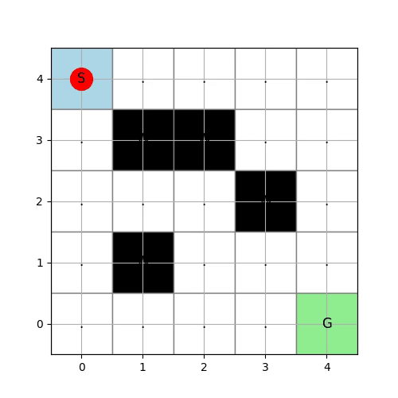

前回迷路問題をTransformerで解くように実装を行いました。
今回は学習を行ってみます。
学習の前に前回コードに気になる点があったため、修正を行います。

## Transformerモデルの改修

### 1. 2次元グリッドに対する「1次元」位置エンコーディングの限界

__懸念点__

コード内では、`torch.randn(1, self.num_tokens, d_model)` として位置エンコーディング（`pos_embedding`）をランダムに初期化しています。これは1次元のシーケンス（文章など）には有効ですが、**2次元のグリッド空間における上下左右の幾何学的な近接関係（空間構造）を初期状態で全く反映していません**。
強化学習、特に追跡（Pursuit）などの空間タスクでは、「上隣のセル」と「下隣のセル」の関係性が重要ですが、ランダム初期化の1次元埋め込みだと、モデルがこの2次元の空間概念を一から学習する必要があり、学習初期の効率が落ちる可能性があります。

__対策__

X座標とY座標それぞれに対して位置エンコーディングを生成して結合・加算するか、2次元用に設計された固定の **Sine-Cosine 位置エンコーディング** を使用して固定された絶対位置を基に学習を行うようにします。

### 2. Global Average Pooling による空間解像度の喪失

__懸念点__

多分ここが一番ネガティブです。
`features.mean(dim=1)`（全トークンの平均）によって全てのセルの特徴量を均一に潰していました。
RLにおいて、「どこに何があるか」という空間情報（特にエージェントとターゲットの位置関係など）は決定的に重要です。単純な平均化を行うと、**「左上にターゲットがいる状態」と「右下にターゲットがいる状態」の区別が難しくなる（特徴量がブレンドされてしまう）** 危険性があります。

__対策__

以下を実施して、エージェント本人がトークンのどこにいるかを認識できるようにします。

* **CLSトークン（分類トークン）の導入**: Vision Transformer (ViT) のように、学習可能なダミートークンを先頭に追加し、Transformer を通した後のそのトークンの出力だけを `self.mlp` に通す。
* **Flatten（展開）**: 平均化せず、`features` をそのまま平坦化（`batch_size, num_tokens * d_model`）して `nn.Linear` に通す（ただし、グリッドサイズが大きいとパラメータが肥大化します）。


### モデルの修正

上記の懸念点を踏まえ、最小限の変更で堅牢性を高めた修正例です。

```python
import torch
import torch.nn as nn

class TransformerQNetwork(nn.Module):
    def __init__(self, in_channels=4, grid_size=5, d_model=64, nhead=4,
                 num_layers=2, action_dim=4, hidden_size=128):
        super().__init__()
        self.grid_size = grid_size
        self.num_tokens = grid_size * grid_size

        # 1. トークン埋め込み
        self.embedding = nn.Linear(in_channels, d_model)

        # 2. CLSトークンの追加 (ベースとなる固定ベクトル)
        self.cls_token = nn.Parameter(torch.randn(1, 1, d_model))

        # 【採用手法2】エージェントの現在座標 (Row, Col) をベクトルに変換する線形層
        self.agent_pos_encoder = nn.Linear(2, d_model)

        # 【採用手法1】2次元位置エンコーディングのためのEmbedding層
        # 縦方向(Row)と横方向(Col)の位置情報をそれぞれ個別に学習
        self.row_embedding = nn.Embedding(grid_size, d_model)
        self.col_embedding = nn.Embedding(grid_size, d_model)
        
        # CLSトークン用の位置埋め込み（空間情報を持たないため独立して用意）
        self.cls_pos_embedding = nn.Parameter(torch.randn(1, 1, d_model))

        # 4. Transformer Encoder (Pre-LN)
        encoder_layer = nn.TransformerEncoderLayer(
            d_model=d_model, nhead=nhead, dim_feedforward=d_model * 2,
            activation="gelu", batch_first=True, norm_first=True
        )
        self.transformer = nn.TransformerEncoder(encoder_layer, num_layers=num_layers)

        # 5. 出力MLP
        self.mlp = nn.Sequential(
            nn.Linear(d_model, hidden_size),
            nn.GELU(),
            nn.Linear(hidden_size, action_dim)
        )

        # 最終出力層の初期化を小さくする
        with torch.no_grad():
            self.mlp[-1].weight.fill_(0.0)
            self.mlp[-1].bias.fill_(0.0)

    def forward(self, x, agent_pos):
        """
        Args:
            x: 迷路の環境状態テンソル (batch, in_channels, grid_size, grid_size)
            agent_pos: エージェントの現在座標テンソル (batch, 2) -> [[row, col], ...]
        """
        batch_size = x.shape[0]

        # (batch, in_channels, H, W) -> (batch, H*W, in_channels)
        x = x.flatten(2).transpose(1, 2)
        x = self.embedding(x)  # (batch, num_tokens, d_model)

        # --- 【採用手法2】CLSトークンにエージェントの文脈をブレンド ---
        # エージェントの座標 (row, col) を特徴量に変換
        agent_feat = self.agent_pos_encoder(agent_pos.float())  # (batch, d_model)
        
        # 固定のCLSトークンにエージェントの特徴量を足し合わせる
        cls_tokens = self.cls_token.expand(batch_size, -1, -1)  # (batch, 1, d_model)
        cls_tokens = cls_tokens + agent_feat.unsqueeze(1)       # (batch, 1, d_model)

        # 先頭に結合
        x = torch.cat((cls_tokens, x), dim=1)  # (batch, num_tokens + 1, d_model)

        # --- 【採用手法1】2次元位置エンコーディングの動的生成 ---
        # 5x5のグリッド座標インデックスを生成
        coords = torch.arange(self.grid_size, device=x.device)
        grid_y, grid_x = torch.meshgrid(coords, coords, indexing="ij")  # 各(grid_size, grid_size)
        
        # 縦横のEmbeddingを取得して加算 -> 2次元の空間情報を保持
        spatial_pos = self.row_embedding(grid_y) + self.col_embedding(grid_x)
        spatial_pos = spatial_pos.view(1, self.num_tokens, -1)     # (1, num_tokens, d_model)

        # CLS用の位置埋め込みと結合して (1, num_tokens + 1, d_model) に整形
        pos_embedding = torch.cat([self.cls_pos_embedding, spatial_pos], dim=1)

        # 位置エンコーディングの加算
        x = x + pos_embedding

        # Transformer処理
        features = self.transformer(x)  # (batch, num_tokens + 1, d_model)

        # 先頭のCLSトークンの特徴量を抽出
        cls_feature = features[:, 0]  # (batch, d_model)

        # 行動Q値を出力
        q_values = self.mlp(cls_feature)
        return q_values
```

## 環境の修正

環境側もゴールする時間が遅くても早くても同じ報酬が出るようになっていました。
ですが、本来はゴールする時間も早い方が良いと思われます。
→時間経過と同時に報酬を落とすようにします。

変更箇所は前回実装した`step`のみです。

```python

    def step(self, action):
        if self.done:
            raise ValueError("Episode is already done. Call reset() first.")

        x, y = self.state
        if action == 0:   # 上
            next_state = (x - 1, y)
        elif action == 1: # 下
            next_state = (x + 1, y)
        elif action == 2: # 左
            next_state = (x, y - 1)
        elif action == 3: # 右
            next_state = (x, y + 1)
        else:
            raise ValueError("Invalid action")

        # --- 報酬設計の変更箇所 ---
        if not self._is_valid_move(next_state):
            next_state = self.state
            reward = -1.0  # 壁にぶつかったペナルティ（強め）
        else:
            reward = -0.02  # 1ステップ経過するごとのタイムペナルティ（早くゴールさせるため）

        if self.maze[next_state[0]][next_state[1]] == 'G':
            reward = 10.0  # ゴール報酬（タイムペナルティを相殺して余りあるプラス）
            self.done = True
        else:
            self.done = False
        # ------------------------

        self.state = next_state
        self.history.append(self.state)  # 履歴に追加
        return self.state, reward, self.done
```

## 学習

### 学習の推移

ロスと報酬をEpisodeごとに出力しました。
全然収束しています。

```
Episode 0, Total Reward: -48.060000000000045, Epsilon: 0.708
Episode 100, Total Reward: 9.86, Epsilon: 0.010
Episode 200, Total Reward: 9.86, Epsilon: 0.010
Episode 300, Total Reward: 9.86, Epsilon: 0.010
Episode 400, Total Reward: 9.86, Epsilon: 0.010
```

### agentの動作

学習後のエージェントの動作を確認します。
対比のため、学習前と学習後両方の動作を掲載します。

学習前



学習後


学習後で一番最短経路でゴールに向かう動作が確認されました。

## 総括

以下、今回の内容を要約・総括いたします。

### 1. Transformerモデルの改修ポイント

__(1) 2次元グリッドに対する位置エンコーディングの改善__
- 元コードでは `torch.randn(1, num_tokens, d_model)` によるランダムな1次元位置埋め込みを使用しており、**2次元空間の上下左右の近接関係を初期状態で一切反映していなかった**。
- 改修後は、**Row方向・Col方向それぞれにEmbedding層を用意し、それらを加算して2次元の空間構造を表現**する方式に変更。
  - `self.row_embedding(grid_y) + self.col_embedding(grid_x)` により、各セルの「縦・横」の位置情報を保持。
- これにより、Transformerが空間構造を一から学習する負担を軽減し、学習初期の効率向上が期待できる。

__(2) Global Average Pooling の廃止とCLSトークン＋エージェント位置情報の導入__
- 元コードでは `features.mean(dim=1)` により全トークンを平均化していたため、**「どこに何があるか」という空間解像度が失われる**問題があった。
- 改修後は以下の構成に変更：
  - **CLSトークン（分類トークン）を先頭に追加**し、Transformer出力の先頭トークンだけをMLPに通す（ViT風の設計）。
  - **エージェントの現在座標 (row, col) を線形層でベクトル化し、CLSトークンに加算**することで、「エージェント自身の位置」を明示的にモデルに伝える。
  - これにより、**「左上にターゲットがある状態」と「右下にターゲットがある状態」を区別できる空間情報を保持**したまま、行動価値関数を推定できる。

__(3) その他の改善__
- CLSトークン用の位置埋め込み（`self.cls_pos_embedding`）を別途用意し、空間情報を持たないCLSトークンにも適切な位置情報を付与。
- 出力MLPの最終層の重み・バイアスをゼロ初期化し、学習初期のQ値のばらつきを抑える工夫を追加。

### 2. 環境側の報酬設計の変更

- 元の環境では、**ゴールする時間が早くても遅くても同じ報酬**になっており、時間最適化のインセンティブが弱かった。
- 改修後は：
  - 1ステップごとに **-0.02 のタイムペナルティ** を課す。
  - 壁にぶつかった場合は **-1.0 のペナルティ** を課す（強め）。
  - ゴール時は **+10.0 の報酬** を与え、タイムペナルティを上回るように設計。
- これにより、**「できるだけ早く、無駄な衝突を避けてゴールする」** という行動方針が自然に学習されるようになった。

### 3. 学習結果の総括

__(1) 学習の推移__
- Episode 0 では総報酬が約 -48 と大きく負（壁にぶつかりながら探索している状態）。
- Episode 100 以降は **総報酬が約 +9.86 で安定**し、探索率εも 0.01 まで低下。
- これは、**エージェントが最短経路でゴールに到達し、タイムペナルティを最小限に抑えつつゴール報酬を獲得できている**ことを示唆。

__(2) エージェントの動作比較__
- **学習前（ランダムエージェント）**：
  - 壁にぶつかりながらランダムに移動し、ゴールにたどり着くまでに多くのステップを要する。
- **学習後**：
  - **最短経路でゴールに向かう動作**が確認され、壁への衝突を避けつつ効率的にゴールへ到達。
  - GIF画像でも、学習後のエージェントが迷路を最短で抜ける様子が視覚的に確認できる。

### 4. まとめ

- **モデル側**では、2次元位置エンコーディングとCLSトークン＋エージェント位置情報の導入により、**空間構造とエージェントの位置を明示的に扱えるTransformer-Qネットワーク**に改良。
- **環境側**では、タイムペナルティとゴール報酬のバランスを調整し、**「早く・安全にゴールする」** という目的が自然に学習される報酬設計に変更。
- その結果、**学習が安定して収束し、最短経路でゴールする方策が獲得された**ことが、報酬推移とGIF画像の両方から確認できた。

ということで、DDQNを用いることで画像情報を用いてエージェントの強化学習により、迷路問題が解けることが分かりました。
次回からはランダムに構造が変化する迷路を解く問題に取り組んでいきます。


