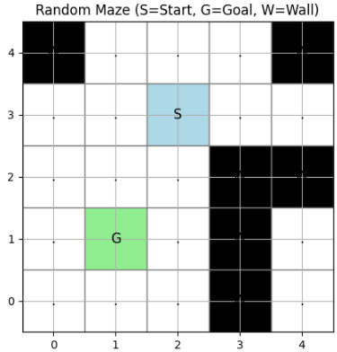
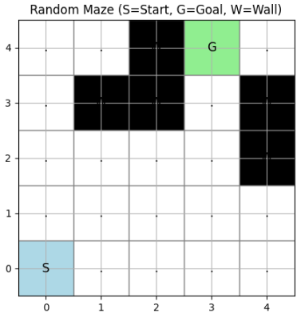
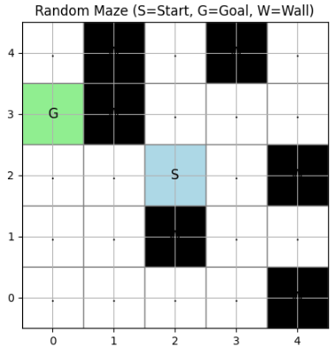

先日迷路をTransformerモデルを用いて視覚情報からスタートからゴールまで移動することが、強化学習で可能であるということを確認しました。
次は迷路がランダムに変更するようなシチュエーションでも、スタートとゴールを画像を見ながらうまく動かすことが出来るかについて検証を行っていきます。
この命題を解くにあたり、まず環境を構築する必要があります。

本日テーマ：
>ランダムにスタートとゴールが設定されて、解決可能な迷路を作るアルゴリズムを開発する。

## 迷路作成アルゴリズムの要件

「ランダムにスタートとゴールが設定されて、必ず解ける迷路」を作るために必要な要件を、**環境側（迷路生成）**と**学習側（RL/DT）** の両面から整理します。

### 1. 環境側（迷路生成）の要件

__(1) 連結性（Connectivity）__
- **スタートからゴールまで、少なくとも1本の経路が存在すること**が必須です。
- 数学的には、迷路をグラフ（グリッド）と見なしたとき、スタートノードとゴールノードが**同じ連結成分**に属している必要があります。

__(2) 経路の存在保証アルゴリズム__
- 迷路生成時に、**スタートとゴールの間に経路が存在することを保証する手順**が必要です。
  - 例：迷路生成後にBFS/DFSで経路探索し、経路がなければ再生成 or 壁を一部削除。
- あるいは、**最初にスタート–ゴール経路を確保してから壁を追加**する方法もあります。

__(3) 壁の配置ルール__
- スタートとゴールを**完全に囲まない**ようにする。
  - 例：スタート/ゴールの周囲8マスに、すべて壁を置かない。
- 迷路全体が**複数の連結成分に分断されない**ようにする。
  - 例：壁を追加するたびに連結性をチェックし、分断される場合は壁を追加しない。

__(4) 迷路のサイズと形状__
- グリッドサイズ（例：5×5, 7×7）を固定 or パラメータ化。
- 矩形グリッドを前提とするか、任意のグラフ構造を許容するか、を明確化。

__(5) スタート・ゴールのランダム配置__
- スタートとゴールが**同じマスにならない**ようにする。
- スタートとゴールが**壁マスにならない**ようにする。
- 可能であれば、**ある程度離れた位置**に配置（例：マンハッタン距離が最小値以上）するルールを設けると、学習が安定しやすいです。

### 2. 学習側（RL/DT）の要件

__(1) 観測（画像入力）の一貫性__
- 迷路がランダムに変わっても、**観測チャネルの意味が一貫**している必要があります。
  - 例：チャネル0=壁、チャネル1=スタート、チャネル2=ゴール、チャネル3=エージェント位置。
- スタート/ゴールの位置が変わっても、**同じチャネルにエンコード**されるようにする。

__(2) 報酬設計の一貫性__
- ゴール到達報酬：+10（固定）
- 壁衝突報酬：-1（固定）
- 通常移動報酬：0
- これらは**迷路の形状に依存しない**ように設計します。

__(3) 終了条件の明確化__
- ゴール到達で `done=True`。
- 最大ステップ数を設け、**無限ループを防ぐ**（例：迷路サイズの2倍程度）。

__(4) 状態表現の安定性__
- 迷路が変わっても、**状態の次元や意味が変わらない**ようにする。
  - 例：常に `(C, H, W)` の画像として表現。
- これにより、Transformerモデルが**迷路の変化に適応しやすく**なります。

### 3. 迷路生成アルゴリズムに求められる性質

__(1) 解の存在保証（必須）__
- 任意のスタート・ゴール配置に対して、**少なくとも1つの経路が存在する**ことを保証する。
- 実装例：
  - 迷路生成後にBFSで経路探索し、存在しなければ再生成。
  - または、スタート–ゴール経路を最初に確保し、その後で壁をランダムに追加（連結性を維持）。

__(2) 多様性（学習のため）__
- 壁の配置パターンが**十分に多様**であること。
- 単純な一直線経路ばかりにならないように、**分岐やデッドエンド**も含める。

__(3) 難易度の調整可能性__
- パラメータで「迷路の難易度」を調整できると良いです。
  - 例：壁の密度、最短経路の長さ、分岐の数など。


## 実装

既存の `MazeEnv` クラスをベースに、**「必ず解けるランダム迷路」** を生成するアルゴリズムを組み込みます。  
また、**到達可能性チェックメソッド**も追加します。

### 1. 追加・変更するメソッド

__(1) `generate_random_maze` の改良__
- スタートとゴールをランダムに配置しつつ、**必ず到達可能な経路を1本確保**する。
- 経路を壊さない範囲で、**ランダムに壁を追加**する。

__(2) `_is_reachable` メソッドの追加__
- BFSでスタートからゴールに到達可能かチェックする。

### 2. 改良版 `MazeEnv` クラス

```python
import random
import numpy as np
import torch
import torch.nn as nn
import torch.optim as optim
from collections import deque
import matplotlib.pyplot as plt
from matplotlib.animation import FuncAnimation
import os

class MazeEnv:
    """
    5x5迷路環境クラス（動画保存機能付き）
    """
    def __init__(self, maze_file="maze.txt", rows=5, cols=5):
        if os.path.exists(maze_file):
            self.maze = self._load_maze(maze_file)
            self.start, self.goal = self._find_start_goal()
        else:
            # 自動生成メソッドを呼び出す
            self.generate_random_maze(rows=rows, cols=cols)
            
        self.state = self.start
        self.done = False
        self.history = []
        self.rows = rows
        self.cols = cols

    def _load_maze(self, file_path):
        maze = []
        with open(file_path, 'r', encoding='utf-8') as f:
            for line in f:
                line = line.strip()
                if not line:
                    continue
                if ' ' in line:
                    row = line.split()
                else:
                    row = list(line)
                maze.append(row)
        return maze

    def _find_start_goal(self):
        start = None
        goal = None
        for i, row in enumerate(self.maze):
            for j, cell in enumerate(row):
                if cell == 'S':
                    start = (i, j)
                elif cell == 'G':
                    goal = (i, j)
        return start, goal

    def _is_valid_move(self, pos):
        x, y = pos
        if x < 0 or y < 0:
            return False
        if x >= len(self.maze) or y >= len(self.maze[0]):
            return False
        if self.maze[x][y] == 'W':
            return False
        return True

    def reset(self):
        self.state = self.start
        self.done = False
        self.history = [self.state]  # 履歴もリセット
        return self.state

    def step(self, action):
        if self.done:
            raise ValueError("Episode is already done. Call reset() first.")

        x, y = self.state
        if action == 0:   # 上
            next_state = (x - 1, y)
        elif action == 1: # 下
            next_state = (x + 1, y)
        elif action == 2: # 左
            next_state = (x, y - 1)
        elif action == 3: # 右
            next_state = (x, y + 1)
        else:
            raise ValueError("Invalid action")

        if not self._is_valid_move(next_state):
            next_state = self.state
            reward = -1
        else:
            reward = 0

        if self.maze[next_state[0]][next_state[1]] == 'G':
            reward = 10
            self.done = True
        else:
            self.done = False

        self.state = next_state
        self.history.append(self.state)  # 履歴に追加
        return self.state, reward, self.done

    def render(self):
        maze_copy = [row[:] for row in self.maze]
        x, y = self.state
        if not self.done:
            maze_copy[x][y] = 'A'
        for row in maze_copy:
            print(' '.join(row))
        print()

    def get_image_observation(self):
        """
        迷路を画像（NumPy配列）として返す
        チャネル0: 壁 (W) = 1, それ以外 = 0
        チャネル1: スタート (S) = 1, それ以外 = 0
        チャネル2: ゴール (G) = 1, それ以外 = 0
        チャネル3: エージェント位置 (A) = 1, それ以外 = 0
        """
        rows = len(self.maze)
        cols = len(self.maze[0])
        obs = np.zeros((4, rows, cols), dtype=np.float32)

        for i in range(rows):
            for j in range(cols):
                cell = self.maze[i][j]
                if cell == 'W':
                    obs[0, i, j] = 1.0
                elif cell == 'S':
                    obs[1, i, j] = 1.0
                elif cell == 'G':
                    obs[2, i, j] = 1.0
                elif cell == '.':
                    pass  # 何も立てない
        # エージェント位置
        x, y = self.state
        obs[3, x, y] = 1.0
        return obs

    def save_video(self, output_path="maze_animation.mp4", fps=2):
        """
        エージェントの動きを動画として保存
        """
        # 迷路のサイズ
        rows = len(self.maze)
        cols = len(self.maze[0])

        # カラーマップの定義
        cell_colors = {
            'S': 'lightblue',  # スタート
            'G': 'lightgreen', # ゴール
            'W': 'black',      # 壁
            '.': 'white',      # 通路
            'A': 'red'         # エージェント（描画時に上書き）
        }

        fig, ax = plt.subplots(figsize=(cols, rows))
        ax.set_xlim(-0.5, cols - 0.5)
        ax.set_ylim(-0.5, rows - 0.5)
        ax.set_aspect('equal')
        ax.set_xticks(range(cols))
        ax.set_yticks(range(rows))
        ax.grid(True)

        # 背景（迷路）を描画
        for i in range(rows):
            for j in range(cols):
                cell = self.maze[i][j]
                color = cell_colors.get(cell, 'white')
                rect = plt.Rectangle((j - 0.5, rows - i - 1.5), 1, 1,
                                     facecolor=color, edgecolor='gray')
                ax.add_patch(rect)
                # ラベル（S, G, W, .）を表示
                if cell in ['S', 'G', 'W', '.']:
                    ax.text(j, rows - i - 1, cell,
                            ha='center', va='center', fontsize=12)

        # エージェントの位置を示すマーカー
        agent_marker, = ax.plot([], [], 'o', markersize=20, color='red')

        def init():
            agent_marker.set_data([], [])
            return agent_marker,

        def update(frame):
            if frame >= len(self.history):
                return agent_marker,
            x, y = self.history[frame]
            # 座標変換（matplotlibはy軸が下向きなので反転）
            plot_y = rows - x - 1
            agent_marker.set_data([y], [plot_y])
            return agent_marker,

        anim = FuncAnimation(fig, update, frames=len(self.history),
                            init_func=init, blit=True, interval=1000/fps)

        # MP4として保存（ffmpegが必要）
        anim.save(output_path, writer='ffmpeg', fps=fps)
        plt.close(fig)
        print(f"Animation saved to {output_path}")

    def _is_reachable(self, start, goal, maze):
        """
        BFSでスタートからゴールに到達可能かチェックする。
        """
        rows = len(maze)
        cols = len(maze[0])
        directions = [(0, 1), (1, 0), (0, -1), (-1, 0)]
        
        queue = deque([start])
        visited = set([start])
        
        while queue:
            x, y = queue.popleft()
            if (x, y) == goal:
                return True
            
            for dx, dy in directions:
                nx, ny = x + dx, y + dy
                if 0 <= nx < rows and 0 <= ny < cols:
                    if maze[nx][ny] != 'W' and (nx, ny) not in visited:
                        visited.add((nx, ny))
                        queue.append((nx, ny))
        
        return False

    def generate_random_maze(self, rows=5, cols=5):
        """
        ランダムにスタートとゴールが設定され、必ず解ける迷路を生成する。
        """
        while True:
            # 1. すべてを通路('.')で初期化
            maze = [['.' for _ in range(cols)] for _ in range(rows)]
            
            # 2. スタートとゴールをランダムに配置（同一マスは避ける）
            while True:
                start = (random.randint(0, rows-1), random.randint(0, cols-1))
                goal = (random.randint(0, rows-1), random.randint(0, cols-1))
                if start != goal:
                    break
            
            maze[start[0]][start[1]] = 'S'
            maze[goal[0]][goal[1]] = 'G'
            
            # 3. スタートからゴールまでの最短経路を1本確保（BFS）
            #    この経路上のマスは壁にしない（連結性の保証）。
            path = self._find_shortest_path(maze, start, goal)
            if not path:
                # 万が一経路がなければ再試行（空迷路なので通常は起こらない）
                continue
            
            # 4. 経路を壊さない範囲でランダムに壁を追加
            #    迷路全体の連結性を維持するようにする。
            self._add_walls_safely(maze, path, start, goal)
            
            # 5. 最終的な到達可能性チェック（念のため）
            if self._is_reachable(start, goal, maze):
                self.maze = maze
                self.start = start
                self.goal = goal
                break

    def _find_shortest_path(self, maze, start, goal):
        """
        BFSでスタートからゴールまでの最短経路を1本見つける。
        ここでは迷路はすべて通路なので、単純なグリッドBFSでOK。
        """
        rows = len(maze)
        cols = len(maze[0])
        directions = [(0, 1), (1, 0), (0, -1), (-1, 0)]  # 右, 下, 左, 上
        
        queue = deque()
        queue.append((start, [start]))  # (現在位置, 経路)
        visited = set([start])
        
        while queue:
            (x, y), path = queue.popleft()
            if (x, y) == goal:
                return path
            
            for dx, dy in directions:
                nx, ny = x + dx, y + dy
                if 0 <= nx < rows and 0 <= ny < cols and (nx, ny) not in visited:
                    visited.add((nx, ny))
                    queue.append(((nx, ny), path + [(nx, ny)]))
        
        return None  # 経路なし（空迷路なので通常は起こらない）

    def _add_walls_safely(self, maze, path, start, goal):
        """
        経路を壊さない範囲でランダムに壁を追加する。
        迷路全体の連結性を維持するようにする。
        """
        rows = len(maze)
        cols = len(maze[0])
        path_set = set(path)  # 経路上のマスは壁にしない
        
        # 壁候補のマスを列挙（経路上とスタート/ゴールは除外）
        candidate_cells = []
        for i in range(rows):
            for j in range(cols):
                if (i, j) not in path_set and (i, j) != start and (i, j) != goal:
                    candidate_cells.append((i, j))
        
        # ランダムに壁を追加（連結性チェック付き）
        # ここでは簡易的に「壁の密度」を調整（例：候補の30%を壁にする）
        wall_density = 0.3
        num_walls = int(len(candidate_cells) * wall_density)
        random.shuffle(candidate_cells)
        
        walls_added = 0
        for x, y in candidate_cells:
            if walls_added >= num_walls:
                break
            
            # 仮に壁を置いてみる
            maze[x][y] = 'W'
            
            # 連結性チェック（BFSでスタートからゴールに到達可能か）
            if self._is_reachable(start, goal, maze):
                walls_added += 1
            else:
                # 連結性が失われる場合は壁を戻す
                maze[x][y] = '.'

    def render_image(self, show=True, save_path=None):
        """
        迷路を画像（matplotlib）で表示する
        - show=True: 画面に表示
        - save_path: 指定があれば画像を保存
        """
        rows = len(self.maze)
        cols = len(self.maze[0])

        # カラーマップの定義
        cell_colors = {
            'S': 'lightblue',  # スタート
            'G': 'lightgreen', # ゴール
            'W': 'black',      # 壁
            '.': 'white',      # 通路
            'A': 'red'         # エージェント（描画時に上書き）
        }

        fig, ax = plt.subplots(figsize=(cols, rows))
        ax.set_xlim(-0.5, cols - 0.5)
        ax.set_ylim(-0.5, rows - 0.5)
        ax.set_aspect('equal')
        ax.set_xticks(range(cols))
        ax.set_yticks(range(rows))
        ax.grid(True)

        # 迷路の背景を描画
        for i in range(rows):
            for j in range(cols):
                cell = self.maze[i][j]
                color = cell_colors.get(cell, 'white')
                # matplotlib は y 軸が下向きなので反転
                rect = plt.Rectangle((j - 0.5, rows - i - 1.5), 1, 1,
                                     facecolor=color, edgecolor='gray')
                ax.add_patch(rect)
                # ラベル（S, G, W, .）を表示
                if cell in ['S', 'G', 'W', '.']:
                    ax.text(j, rows - i - 1, cell,
                            ha='center', va='center', fontsize=12)

        # エージェント位置を描画
        x, y = self.state
        plot_y = rows - x - 1
        ax.plot(y, plot_y, 'o', markersize=20, color='red', label='Agent')

        ax.set_title("Maze (Agent = Red dot)")
        if show:
            plt.show()
        if save_path:
            plt.savefig(save_path, bbox_inches='tight')
            print(f"Image saved to {save_path}")
        plt.close(fig)

    def print_maze(self):
        """
        迷路をテキストで表示（確認用）
        """
        for row in self.maze:
            print(' '.join(row))
        print()


    def render_maze_image(self, show=True, save_path="random_maze.png"):
        """
        生成されたランダム迷路を画像として可視化する。
        - show=True: 画面に表示
        - save_path: 画像保存先パス
        """
        rows = self.rows
        cols = self.cols
        maze = self.maze

        # カラーマップの定義
        cell_colors = {
            'S': 'lightblue',  # スタート
            'G': 'lightgreen', # ゴール
            'W': 'black',      # 壁
            '.': 'white',      # 通路
        }

        fig, ax = plt.subplots(figsize=(cols, rows))
        ax.set_xlim(-0.5, cols - 0.5)
        ax.set_ylim(-0.5, rows - 0.5)
        ax.set_aspect('equal')
        ax.set_xticks(range(cols))
        ax.set_yticks(range(rows))
        ax.grid(True)

        # 迷路の背景を描画
        for i in range(rows):
            for j in range(cols):
                cell = maze[i][j]
                color = cell_colors.get(cell, 'white')
                # matplotlib は y 軸が下向きなので反転
                rect = plt.Rectangle((j - 0.5, rows - i - 1.5), 1, 1,
                                     facecolor=color, edgecolor='gray')
                ax.add_patch(rect)
                # ラベル（S, G, W, .）を表示
                if cell in ['S', 'G', 'W', '.']:
                    ax.text(j, rows - i - 1, cell,
                            ha='center', va='center', fontsize=12)

        ax.set_title("Random Maze (S=Start, G=Goal, W=Wall)")
        if show:
            plt.show()
        if save_path:
            plt.savefig(save_path, bbox_inches='tight')
            print(f"Maze image saved to {save_path}")
        plt.close(fig)
```

### 3. アルゴリズムのポイント（既存クラスへの統合）

__(1) `generate_random_maze` の改良点__
- 以前の実装では「壁をランダムに置いてから経路チェック」していましたが、  
  改良版では**最初に経路を確保し、その経路を壊さない範囲で壁を追加**しています。
- これにより、**必ず解ける迷路**が生成されます。

__(2) `_is_reachable` メソッドの追加__
- BFSでスタートからゴールに到達可能かチェックする汎用メソッドです。
- 迷路生成時だけでなく、**任意の迷路に対して到達可能性を確認**できます。

__(3) ランダムシードの不使用__
- `random` モジュールをそのまま使用しているため、**実行ごとに異なる迷路**が生成されます。
- 再現性が必要な場合は、外部で `random.seed()` を指定してください。

### 4. test動作

ランダムに迷路を生成してみます。

```python
for i in range(3):
    # ランダム迷路を生成
    generator = MazeEnv(rows=5, cols=5)

    # テキストで表示（確認用）
    print("Generated random maze:")
    generator.print_maze()

    # 画像として可視化
    generator.render_maze_image(show=True, save_path="random_maze.png")
```







これで、**毎回ランダムな迷路**が生成されつつ、**解ける**環境が構築できました。  
Transformerモデルを用いた強化学習にも、そのまま組み込めます。

## 総括

ということで今回はエージェントに解かせるランダム迷路作成アルゴリズムを実装しました。
次回からここまで作ったTransformerモデルで、ランダムに変わる迷路で対応できるかを強化学習していきます。


