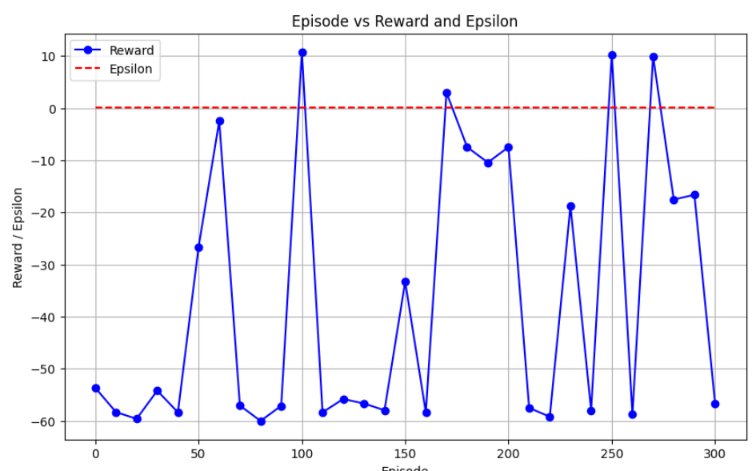
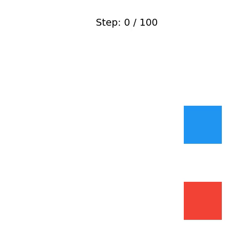

本日は毎週続けてきた迷路探索を行う強化学習エージェントのトライアルです。
前回はエージェントに解かせる迷路の構造をランダムに変えるアルゴリズムを作成しました。
今回はそのランダム迷路構造をエージェントを使って学習させていこうと思います。

## 本日やること

強化学習モデルを前々回のものより改良の上、ランダム迷路構造で学習させて、一旦解かせてみようと思います。

1. 強化学習モデルの改良
2. 学習エージェントの構築
3. 学習と学習結果観測

## 強化学習モデルの改良

迷路の構造が静的な前回の迷路は問題なく解けたのですが、今回モデルに少し課題となる点を見つけたました。

"位置エンコーディングが学習によって変わっていく"


「迷路の構造が固定されている場合」と「ランダムに変化する場合」で、**学習可能な位置エンコーディング（ランダム初期化）** が過大となる最大の理由は、**「座標が持つ意味の固定化」と「大域的な幾何学構造の理解」の難易度の差**にあります。

この違いを具体的なメカニズムを踏まえて解説します。

### 1. 迷路の構造が「固定」なら問題ない理由

迷路の形（壁や通路の配置）が毎エピソード完全に同じであれば、エージェントがやるべきことは「この迷路専用の固定ルートの丸暗記」です。

このとき、モデルは空間のつながり（幾何学構造）を深く理解する必要はありません。

* たとえば、座標 $(1, 1)$ に対応する `pos_embedding` のベクトルが、初期状態ではただのランダムなノイズ（意味を持たない数値の羅列）であっても構いません。
* なぜなら、何度も同じ迷路を走るうちに、モデルは「この $(1, 1)$ という謎の暗号ベクトルが来たら、次は $(1, 2)$ の暗号ベクトルへ移動する行動を選ぶと報酬がもらえる」という、**特定の座標と行動のペア（点と点のつながり）を力まかせに固定値として記憶できるから**です。

いわば、「自分の部屋の家具の配置が絶対に変わらないなら、目隠しをしていても（空間を認識していなくても）歩数と曲がる回数だけでゴールできる」のと同じ状態です。


### 2. 迷路の構造が「ランダム」になると致命的になる理由

しかし、エピソードごとに壁の位置、スタート、ゴールがランダムに変わる場合、エージェントは「ルートの丸暗記」が通用しなくなります。代わりに、**「今いるマスの周囲には何があって、ゴールはどの方向にあるか」という、空間の相対的な幾何学構造をその場で推論する能力**が必要になります。

ここで、ランダム初期化された `pos_embedding` が問題となってきます。

__① 近いマスどうしの幾何学的な関係性がゼロ__

サイン・コサイン（Sin-Cos）などの固定エンコーディングや、あらかじめ明示された座標情報には、数式的に「隣り合うマスどうしはベクトルとしても近い（似ている）」という幾何学的なルールが最初から埋め込まれています。

しかし、`torch.randn` で初期化されたパラメータは、すべてのマスが完全に独立した無関係なノイズです。モデルから見ると、**「$(1, 1)$ の右隣が $(1, 2)$ である」ということすら最初は分かりません。** $(1, 1)$ と $(1, 2)$ のベクトルの距離は、$(1, 1)$ と一番遠い $(5, 5)$ のベクトルの距離と同じくらい離れてしまっているからです。

__② 空間のルールを学ぶ前に、壁のパターンが変わる__

ランダム迷路を解くには、「$(1, 1)$ の隣は $(1, 2)$ と $(2, 1)$ だから、ここを通って壁を避ける」という計算をアテンションで行う必要があります。そのためには、まずモデル自身がバックプロパゲーション（誤差逆伝播）を通じて、「25個のランダムなベクトルを、綺麗に5x5のグリッド状に並ぶようにパラメータを調整する」という退屈な下積みの学習を何万ステップもこなさなければなりません。

しかし、空間の土台（座標の意味）がまだぐにゃぐにゃと動いている最中にも、環境側からは「異なる壁の配置」「異なるゴール位置」という新しいデータが次々に降ってきます。
モデルにとっては、「そもそもグリッドの構造すらまだ理解できていないのに、毎回ルール（壁の配置）が変わるテストを受けさせられている」状態になり、脳内（パラメータ）が完全にパニックを起こします。


### 3. 対応策 

このため学習可能ではなく、2次元の位置関係に強いタイプの位置エンコーディングを適用することになります。


* **固定迷路：** 空間構造が分からなくても、座標ごとの「点」の情報を丸暗記すれば解ける。
* **ランダム迷路：** 空間の「面（幾何学的なつながり）」を理解しないと解けない。

最初から固定の `2D Sin-Cos` を使う、あるいは入力チャンネルに直接 `(X座標, Y座標)` の値を明示的に入れてあげるということは、ネットワークに対して「最初から5x5のチェス盤を用意してあげる（ここが隣同士だよ、と教えてあげる）」のと同じです。

これによって、モデルは「座標の構造をゼロから学習する」という無駄な労力を一切省くことができ、**「用意されたチェス盤の上で、どうやって壁を避けてゴールへ向かうか」という本来の強化学習の目的（ポリシーの最適化）に最初から100%集中できる**ようになります。これが、ランダム環境で固定の位置エンコーディングが必須となる決定的な理由です。

本取り組みでは `2D Sin-Cos` を用いていこうと思います。

__2D Sin-Cosとは__

元祖Transformer（1D）やViTでよく使われる手法を2次元に拡張した、「2D Sinusoidal Positional Encoding」です。  

- メリット:パラメータ数が0（ノンパラメトリック）で、勾配計算や学習が不要。「隣り合う座標同士はベクトルのコサイン類似度が高い」という幾何学的な位置関係を、初めからモデルに100%の精度でインプットできる。
- ランダム迷路において、壁の位置を相対的な距離感として正しく把握する能力が劇的に向上すると期待できます。

```python
import torch
import torch.nn as nn
import numpy as np

class TransformerQNetwork(nn.Module):
    def __init__(self, in_channels=4, grid_size=5, d_model=64, nhead=4, num_layers=2, action_dim=4, hidden_size=128):
        super().__init__()
        self.grid_size = grid_size
        self.num_tokens = grid_size * grid_size

        # 1. 各マスの状態（4チャンネル）をd_model（64次元）に変換する翻訳機
        self.embedding = nn.Linear(in_channels, d_model)

        # 2. 【重要】固定の2D Sin-Cos PEを生成し、バッファとして登録
        pos_emb = self.create_2d_sin_cos_pos_embedding(grid_size, d_model)
        self.register_buffer('pos_embedding', pos_emb)  # これで自動的にデバイス（GPU/CPU）移動が管理されます

        # 3. Transformer
        encoder_layer = nn.TransformerEncoderLayer(
            d_model=d_model, nhead=nhead, dim_feedforward=d_model * 2,
            activation="gelu", batch_first=True, norm_first=True
        )
        self.transformer = nn.TransformerEncoder(encoder_layer, num_layers=num_layers)

        # 4. 出力MLP
        self.mlp = nn.Sequential(
            nn.Linear(self.num_tokens * d_model, hidden_size),
            nn.GELU(),
            nn.Linear(hidden_size, action_dim)
        )

        # 最終層の初期化
        with torch.no_grad():
            self.mlp[-1].weight.fill_(0.0)
            self.mlp[-1].bias.fill_(0.0)

    def create_2d_sin_cos_pos_embedding(self, grid_size, d_model):
        """
        グリッドに対して、固定の2D Sin-Cos 位置エンコーディングを生成する。
        """
        assert d_model % 4 == 0, "d_model は4の倍数である必要があります"
        pe = torch.zeros(grid_size, grid_size, d_model)
        d_axis = d_model // 2
        div_term = torch.exp(torch.arange(0, d_axis, 2).float() * -(np.log(10000.0) / d_axis))
        
        for y in range(grid_size):
            for x in range(grid_size):
                pe[y, x, 0:d_axis:2] = torch.sin(torch.tensor(x).float() * div_term)
                pe[y, x, 1:d_axis:2] = torch.cos(torch.tensor(x).float() * div_term)
                pe[y, x, d_axis::2]  = torch.sin(torch.tensor(y).float() * div_term)
                pe[y, x, d_axis+1::2] = torch.cos(torch.tensor(y).float() * div_term)
                
        # (1, num_tokens, d_model) に平坦化して返す
        return pe.view(1, grid_size * grid_size, d_model)

    def forward(self, x):
        # x の形状: (Batch, num_tokens, in_channels)
        # 例: 5x5迷路なら (Batch, 25, 4)
        
        # 1. 各トークンの状態を 64次元ベクトル に投影
        x = self.embedding(x)  # -> (Batch, 25, 64)
        
        # 2. 固定の座標情報 (1, 25, 64) を足し算（ブロードキャストされます）
        x = x + self.pos_embedding  # -> (Batch, 25, 64)
        
        # 3. Transformerを適用
        x = self.transformer(x)  # -> (Batch, 25, 64)
        
        # 4. 全トークンの出力を結合してMLPへ入力
        x = x.flatten(start_dim=1)  # -> (Batch, 25 * 64) = (Batch, 1600)
        
        return self.mlp(x)
```

## 学習エージェントの構築

強化学習モデルの変更 **「位置エンコーディングの変更」** を踏まえると、学習エージェントや学習ループは以下で修正する必要があります。


### 1. 状態前処理（`_preprocess_state`）の変更

Transformerに迷路を正しく認識させるため、状態の渡し方を変更します。

__【変更理由】__

前述の通り、Transformerはマスの絶対位置ではなく、「マスとマスのつながり（幾何学的な位置関係）」を処理するのが得意です。入力チャンネルに直接 `(X座標, Y座標)` を明示的に追加することで、モデルがランダムな迷路の形に惑わされず、「どこが隣り合うマスなのか」を最初から理解した状態でアテンション（動的な関係性計算）に集中できるようになります。

__【実装イメージ】__

```python
def _preprocess_state(self, state):
    # 既存の環境から 4チャンネル (壁, スタート, ゴール, エージェント) の画像を取得
    # obs の形状: (4, rows, cols)
    obs = self.env.get_image_observation()
    rows, cols = obs.shape[1], obs.shape[2]
    
    # 幾何学的な座標チャンネルを2つ作成 (0.0 〜 1.0 に正規化)
    # これにより、どのマスが隣同士で、どれくらい離れているかを最初から明示する
    x_coords = torch.linspace(0, 1, rows).view(1, rows, 1).expand(1, rows, cols)
    y_coords = torch.linspace(0, 1, cols).view(1, 1, cols).expand(1, rows, cols)
    
    # テンソル化して結合 (4チャンネル + 2チャンネル = 6チャンネル)
    obs_tensor = torch.FloatTensor(obs).unsqueeze(0) # (1, 4, rows, cols)
    coords_tensor = torch.cat([x_coords, y_coords], dim=0).unsqueeze(0) # (1, 2, rows, cols)
    
    combined = torch.cat([obs_tensor, coords_tensor], dim=1) # (1, 6, rows, cols)
    
    # Transformerに入力するために [Batch, num_tokens, in_channels] の形状に変換
    # (1, 6, 5, 5) -> (1, 6, 25) -> (1, 25, 6)
    b, c, h, w = combined.shape
    combined = combined.view(b, c, h * w).permute(0, 2, 1)
    
    return combined # これをネットワークの forward(x) に渡す

```

*※これに伴い、`TransformerQNetworkV2` の `in_channels` 引数は `6` に変更します。*


### 2. 学習ループ（`train`）における進捗・タイムアウト処理の変更

メインのループ処理（`num_episodes` を回す部分）を微調整します。

__【変更理由】__

今回の環境アップデートにより、エージェントには「停止（足踏み）」や「壁衝突」に対して重いペナルティ（`-0.5` や `-0.6`）が一歩ごとに科されます。
もしエージェントが初期のランダム行動で壁に向かって歩き続けたり、同じ場所でスタックしたりした場合、1エピソードの最大ステップ数（`max_steps=100`）をフルに消化するだけで、累計の報酬が `-50` などの膨大なマイナスになってしまいます。これがバッファにたまると学習が極端に負の方向へ引っ張られるため、**早期終了（タイムアウト）のステップ数を迷路のサイズに合わせて最適化**する必要があります。

__【実装イメージ】__

```python
# 学習ループ内の変更（5x5迷路であれば、100歩は長すぎる）
# 5x5空間なら、最短経路は長くても 10歩〜15歩 程度。

# 変更前: rewards = agent.train(num_episodes=1000, max_steps_per_episode=100, ...)
# 変更後: 最大ステップ数を 30 程度に絞る。無駄なスタックによる負の報酬の蓄積を防ぐ。
rewards = agent.train(num_episodes=2000, max_steps_per_episode=30, maze_change=True)

```

## 学習結果

### 報酬推移

エピソードごとに迷路を変化させました。エピソードごとの報酬の推移をグラフにしました。
高い低いを繰り返していますが、気になるのは低い方の報酬が切りあがっていないことです。
少し複雑な迷路になると、もう解くことをあきらめているような傾向と感じました。。。



### 学習の結果

とある迷路の動作を動画にしてみました。
ん。。。
青がエージェントですが、まったく動かない。。。
学習が進んでも、迷路を解けていないことになります。




## 総括
Transformer構成で、少し改造しましたが、静的迷路は解けることが確認出来ましたが、迷路の構造が変化する場合、このままではゴールできないという結果になりました。
考えた理由については以下の2点です。

### 1. 1マスの「壁」の変化が、画面全体のベクトルを激変させている（アテンションの崩壊）
Transformerのセルフアテンションは、25個すべてのマスの相互関係を計算します。これがランダム迷路では裏目に出ます。

CNNの場合： エージェントの周囲1マスに壁があるかどうかを、局所的なフィルタ（畳み込み）で捉えます。迷路全体の形が変わっても、「目の前が壁なら進めない」というローカルなルールを簡単に汎化できます。

Transformerの場合： たった1箇所の壁の位置が変わるだけで、25マス全体のアテンションマップ（関係性の数値）のバランスがガラリと変わってしまいます。モデルから見ると、「1マス壁が変わっただけで、全く別の異次元の世界に来てしまった」ように感じられるため、過去の経験を新しい迷路にうまく応用（汎化）できません。

### 2. 現在の行動選択（ポリシー）と「ゴール位置（G）」が結びついていない
ランダム迷路で最も重要なのは、「ゴール（G）の位置に合わせて、自分の進むべき方向（ポリシー）を動的に切り替える」ことです。

現在の入力構成（6チャンネル）では、壁の構造やゴールの位置を「1つの画像（トークンの特徴量）」として一括で放り込んでいます。しかし、Transformerが「ゴールが右下にあるから、右や下に行く行動のQ値を高めよう」というクロスアテンション的な推論（条件付き意思決定）を自力で獲得するには、現在のシンプルなDQNの構造ではネットワークの表現力が足りず、ただのノイズの海に溺れている可能性があるかもしれません。


モデルが、今回のような関係性の変化をうまくとらえられた上で、スタート→ゴールを判断できるようにする必要があります。

