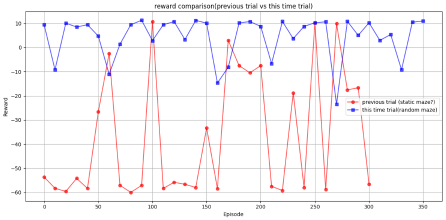
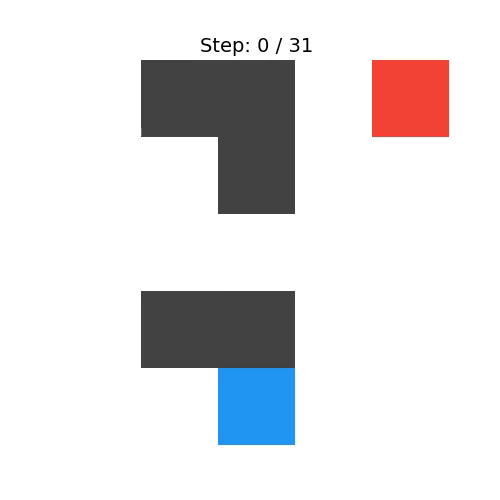

[前回エージェントをエピソードの度にランダムに構造が変化](https://yoshishinnze.hatenablog.com/entry/2026/07/26/043000)するようにしてエージェントが迷路を脱出できなくなりました。
このことを受けて対応していこうと思います。

本日テーマ：
>ランダムに構造変化する迷路だとエージェントが迷路脱出できなくなった原因に対応する

## 事象の整理

### 学習環境とエージェントの状態

前回試行の整理をしていこうと思います。

1. agentの状態

迷路の画像を、ViTを模したTransformerに与えて、DDQNにより学習して迷路脱出を目指します。
静的構造の迷路の場合はすぐに解けるようになったが、ランダムになると解けなくなりました。
また、位置エンコーディングは従来の学習型をやめ、2Dの `2D Sin-Cos` を用いることとしました。
これは、エージェントに対して5×5の固定のマス目を用意して、「最初から5x5のチェス盤を用意してあげる（ここが隣同士だよ、と教えてあげる）」ということになるわけです。
結果、毎回構造する構造ではなく、固定のマス目から場所を考えることになります。

2. 迷路の状態

エピソードごとにランダムに構造変化させます。
具体的には迷路を構成するスタート地点(というかエージェント位置)、ゴール地点、壁の位置をエピソードごとにランダムに変化させています。

報酬は停滞や意味のないと思われる行動にペナルティを導入しています。

### 学習の経過

学習の推移は、エピソードごとに報酬がかなり大きく変動していました。
初めだけならあり得ますが、終始変動が大きい状態でした。

また、動画においては同じ行動を繰り返し(左右を行き来する)、ごくまれにゴールに向かっていくという動作が確認出来ました。

## 気になった点

前回学習が終わった後のエージェントの動作が気になっていました。
同じ行動を繰り返す、ということは状況によって行き来することが報酬を守るために良いと考えている。これはゴールまでの行き方が分からないから行き来を繰り返した方が報酬の減少を抑えらえられる(停滞にペナルティを与えていたので)と考えていることになります。
こんな状態になるという原因はゴールがどこか認識できなかったか、認識したけど、どうやって行けばよいか理解できていないということになります。

そして、この原因となりえるのは**探索不足**です。具体的には学習時点で選択していた $\varepsilon$-greedy が良くなかったと考えました。
学習段階の探索手法として $\varepsilon$-greedy を採用すること自体は、Q学習やDQN（Deep Q Network）における標準的なアプローチであり、**決して間違いではありません**。


### 1. 確率分布が「一様（ランダム）」か「グラデーション」かの違い

$\varepsilon$-greedy と Softmax（ボルツマン分布）の最大の違いは、**「次点の行動（惜しい行動）」をどう扱うか**です。

* **$\varepsilon$-greedy のまずさ**:
$\varepsilon$ の確率でランダムに行動を選ぶ際、**「今にもゴールできそうな筋の良い行動」も「壁に激突するだけの完全に無駄な行動」も、すべて全く同じ等確率**で選ばれてしまいます。Q値が `0.9` の行動（ほぼ正解）と `-100` の行動（大失敗）が、探索時には同等に扱われるため、特に状態空間が広いタスクや死にゲー要素のある環境では、非効率な探索（壁にぶつかり続けるなど）を繰り返して学習が進みにくくなります。
* **Softmax の利点**:
Q値の高さに応じて滑らかに確率が割り振られるため、「一番良さそうな行動」の次に「二番目に良さそうな行動」が選ばれやすくなります。絶望的な行動を選ぶ確率を自動的に低く抑えられるため、無駄のないスマートな探索になります。

### 2. デモ動画（評価時）における挙動の「不自然さ」

今回、動画作成のコードを Softmax に修正した背景にも関わりますが、評価時やデモプレイ時の挙動に問題が出ます。

* **$\varepsilon$-greedy のまずさ**:
$\varepsilon$-greedy で動くエージェントは、基本的にはQ値が最大（Max）のものを愚直に選び続けます。もし動画撮影時に少しだけ探索率（$\varepsilon > 0$）を残していると、「さっきまで天才的な動きをしていたのに、突然1歩だけ真逆の壁に突っ込む」といった極端で不自然な挙動（完全ランダムステップ）が混ざります。
* **Softmax の利点**:
温度パラメータ（`temperature`）を調整することで、「基本的には正解ルートを進むが、時折、次点の間違えにくそうなルートも試す」といった、**人間が迷いながら歩いているような自然な揺らぎ**を持ったデモ動画を作成できます。

### 3. 方策（ポリシー）の滑らかな収束と局所解の回避

Transformer等のシーケンスモデルや、より複雑な価値ベースの学習において、ポリシーの「硬さ」が壁になることがあります。

* **$\varepsilon$-greedy のまずさ**:
`argmax`（最大値の選択）による決定論的な行動選択は、Q値のわずかな高低で行動が 0 か 1 かで激しく切り替わります（不連続性）。これにより、学習の初期〜中期にたまたま高い報酬を得た特定のルート（局所最適解）に固執しやすくなり、そこから抜け出すための探索が「完全ランダム」しかないため、効率的なルートの再発見が難しくなります。
* **Softmax の利点**:
確率的に行動が選択されるため、ポリシーが滑らか（連続的）になり、勾配法ベースの最適化や、のちに軌跡（履歴）を学習するアルゴリズムにとって、より情報量の多い（エントロピーの高い）質の良いデータが得られやすくなります。

## 対応策

強化学習時のエージェントの行動選択を $\varepsilon$-greedy から 確率分布に基づいた行動選択に替えます。
また、行動の度に小刻みに良い行動だったか、悪い行動だったかを教えられるようにしていこうと思います。具体的にはゴールからの最短距離（`dist_map`）をベースに進捗報酬（`progress_reward`）や逆行ペナルティ（`regress_penalty`）を計算して、ゴールに近づいたら報酬、遠のいたらペナルティを分かるようにします。

これによる期待効果は以下の点です。

### 1. 「意味のある失敗」を探索

従来の $\varepsilon$-greedy は、探索（ランダム行動）を選択した際、すべての行動を **等確率（一様ランダム）** で選びます。

* **$\varepsilon$-greedy の問題点:** あと一歩でゴールできるという状況でも、ランダムが引かれると「わざわざ元来た道を大逆走する」「目の前の壁に激突する」といった、明らかに筋の悪い行動を同じ確率で選んでしまいます。
* **Softmax（確率分布）の強み:** Q値が少しでも学習されてくると、「一番マシな道（1位）」だけでなく「次にマシそうな道（2位）」の確率も高くなります。逆に、行き止まりや壁（最下位）を選ぶ確率は急激に低くなります。

つまり、**「全く無意味な大悪手」を完全に排除しつつ、「正解かもしれない選択肢」の範囲内だけで賢く迷う（探索する）** ことができるようになったため、無駄な足踏みや逆走が激減しました。

### 2. Transformerと進捗報酬（距離マップ）の相乗効果

環境はにゴールからの最短距離（`dist_map`）をベースに進捗報酬（`progress_reward`）や逆行ペナルティ（`regress_penalty`）を計算させることとします。
Transformerは全マスの位置関係（大域的な依存関係）を捉えるのが得意なため、「こっちの方向が進捗が良さそうだ」という大まかな傾向（Q値の微小な差）を比較的早い段階からQ値に出力し始めます。

* $\varepsilon$-greedy では、その「かすかなQ値の差」があっても、$\varepsilon$ の確率でそれを無視して完全ランダムに動いてしまい、せっかくのTransformerの気付きが破壊されていました。
* Softmax では、その「かすかなQ値の差（＝こっちの方が良さそうという確率の傾き）」を綺麗に反映して動けるため、Transformerが学習した「方向性のセンス」を殺さずに探索を進められたのです。

### 3. 滑らかな「自信度」の調整（温度パラメータの恩恵）

$\varepsilon$-greedy の探索は「やるか、やらないか」の 0 か 100 かですが、Softmax はQ値の差の開き具合によって、エージェント自身が行動の選択比率を滑らかにコントロールできます。

* **Q値に差がないとき（未学習のエリア）:** 自然と完全ランダムに近い確率分布になり、手探りで探索します。
* **Q値に明確な差があるとき（学習が進んだエリア）:** 温度（`temperature`）がまだ高くても、Q値の差が大きければ「ほぼ正解の行動」をしっかり選べるようになります。

この柔軟性により、未開拓のルートでは大胆に探し、すでに知っているルートでは無駄な脱線をせずにスムーズにゴールへ向かうという、メリハリのある効率的なデータ収集（経験再生バッファへの蓄積）が可能になりました。

## 実装

### コード
実装コードは以下レポジトリを参考下さい。

https://github.com/Shinichi0713/Reinforce-Learning-Study/tree/main/basic/11_maze/src


### 実装のキーポイント
今回の強化学習の行動選択を確率分布（Softmaxなど）へ変更し、`dist_map` をベースにした高頻度な報酬シェイピング（Dense Reward）を導入する際のキーポイントは、以下の3点です。


### 1. 確率選択の「温度（Temperature）」の動的コントロール

Softmaxによる行動選択では、Q値の差を確率に変換する際のスケール調整（温度パラメータ $\tau$）が成否を分けます。

* **初期は「高く」、終盤は「低く」:**
学習初期は $\tau$ を大きく設定し、Q値のわずかな偏りに囚われず一変通りに広く探索させます。学習が進むにつれて $\tau$ を徐々に小さく（アニール）していき、最終的には最もQ値の高い行動を確実に選ぶ（決定論的な動き）ように絞り込みます。
* **Q値のスケール変化への配慮:**
学習が進むとQ値の絶対値が大きくなるため、$\tau$ が固定のままだと、確率分布が勝手に鋭くなって探索が早期終了してしまう点に注意が必要です。

### 2. 進捗報酬による「局所最適なループ（正のフィードバック駅）」の完全防御

最短距離の変化をそのまま報酬に加算する場合、「同じ2マスの間を往復し続けるだけで、無限に報酬を稼げてしまうバグ」が最も発生しやすい罠です。

* **ポテンシャル関数の設計（必須）:**
「近づいたときにもらえるプラス」と「遠ざかったときにもらうマイナス」の絶対値を完全に同じ（対照的）にする必要があります。
* 例：`progress_reward = +0.2`, `regress_penalty = -0.2`


もし遠ざかるペナルティが軽かったり（例：$-0.15$）、壁衝突で元のマスに留まった際にペナルティが発生しなかったりすると、エージェントは「ゴールを目指すより、特定の安全地帯で往復・足踏みして小銭を稼ぐほうが効率が良い」と学習し、ゴールに向かわなくなります。

そこで、ゴールを起点に距離のマップを持つようにして、エージェントの位置が近づいたか、遠のいたかをぱっと分かるようなマップ化を行いました。

レポジトリの実装コードを以下のように使ってください。

```python
env = MazeEnv(rows=5, cols=5)

# エピソードをリセットして距離マップを生成
state = env.reset(maze_change=True)

# 距離マップを表示
env.print_distance_map()
```

するとこんな距離マップが得らることが分かります。[G]がゴール、[W]は壁、数値がゴールまでの距離です。
これを用いるとマップと現在位置を確認するだけで良い行動だったか、悪い行動だったかパット分かるようになります。

```
--- Goal Distance Map ---
  4    3    2    1   [G] 
  5    4   [W]   2    1  
  6    5    6   [W]   2  
  7    6    7   [W]   3  
  8   [W]  [W]   5    4  
-------------------------
```

### 3. 本質的な報酬（ゴール報酬）との主客逆転の防止

小刻みな報酬（進捗）が手厚すぎると、エージェントは「早くゴールすること」よりも「道中でいかに効率よく進捗報酬を回収するか」に執着し始めます。

* **スケールのバランス:**
道中で得られる進捗報酬の累計（例：スタートからゴールまで最短で進んだ場合の合計プラス値）が、最終的な `goal_reward`（10.0など）よりも**十分に小さくなるよう設計**します。
* **ステップペナルティとの併用:**
常に `step_penalty`（負の値）を与え続けることで、「寄り道して進捗報酬を往復回収する時間は損である」という時間的圧力を担保し、最短ルートへのインセンティブを維持します。

## 学習結果

### 学習の推移
学習の推移は以下のように得られます。
前回(うまくいかなかった方)と今回を比較しています。
結果、報酬の変動はあるものの高い状態をある程度は維持できるようになっているようです。




因みに、やはり難しい迷路と簡単な迷路では挙動は違っているはずです。。。
じわじわと良くなっていくとは言え、Transformerでも難しいものに感じている可能性があります。

### エージェントの動作
学習後のエージェントの動作は以下のようになりました。
最後のやつが苦し気でしたが、なんとかゴール出来ました。
ゴールは変わっても何とか行けるようにはなったようです。未だ無駄な動作が多いですが。




## 総括


今回の改善で最も良かった点を一言でまとめると、

**「探索を“無意味なランダム”から“意味のある迷い”に変え、かつ Transformer が捉えた“ゴール方向の感覚”を壊さずに、高頻度の進捗報酬で細かく教え続けたこと」**

です。

もう少し分解すると、以下の3点が良かったかと思います。

### 1. ε-greedy → Softmax による「賢い探索」への変更

- ε-greedy は「良い行動」も「悪い行動」も等確率で選ぶため、学習が進んでも“無意味な逆走”や“壁突き”が頻発していました。
- Softmax（ボルツマン分布）に替えたことで、  
  - Q値が高い行動ほど選ばれやすく  
  - Q値が低い行動は自動的に確率が下がる  
  という**“意味のある迷い”**が可能になりました。
- これにより、Transformer が「こっちの方がゴールに近そう」という方向感覚を学習しても、それを“完全ランダム”で壊さずに済み、効率的な探索ができました。

### 2. dist_map ベースの進捗報酬・逆行ペナルティによる「高頻度なフィードバック」

- ゴールからの最短距離（`dist_map`）を用いて、  
  - ゴールに近づいたら `progress_reward`（正）  
  - 遠ざかったら `regress_penalty`（負）  
  を毎ステップ与えるようにしたことで、**“今の行動が良いか悪いか”をすぐに教えられる**ようになりました。
- 特に、  
  - 進捗報酬と逆行ペナルティの絶対値を同じにし  
  - 壁衝突や停滞にも適切なペナルティを設定  
  することで、「同じ2マスを往復して小銭を稼ぐ」ような局所最適なループを防ぎ、**ゴールに向かうインセンティブ**を維持できました。

### 3. Transformer の“方向感覚”と Softmax・進捗報酬の相乗効果

- Transformer は全マスの位置関係（大域的な依存関係）を捉えるのが得意で、比較的早い段階から「こっちの方がゴールに近そう」という方向感覚を Q値に反映し始めます。
- ε-greedy では、その“かすかなQ値の差”を無視して完全ランダムに動いてしまう場面が多く、Transformer の気付きが活かされませんでした。
- Softmax では、**Q値のわずかな差を確率の傾きとして反映**できるため、Transformer が学習した“方向感覚”を壊さずに探索できました。
- さらに、進捗報酬で**“その方向感覚が正しいかどうか”を細かくフィードバック**できるため、Transformer はより早く・正確に「ゴールへの良いルート」を学習できました。


### まとめ

今回の改善で最も良かったのは、

- **探索を“無意味なランダム”から“意味のある迷い”に変えたこと（Softmax）**  
- **毎ステップ“ゴールに近づいたか・遠ざかったか”を教え続けたこと（dist_map ベースの進捗報酬）**  
- **Transformer の“方向感覚”を壊さずに、それを活かして学習を加速させたこと**

の3点です。

これにより、エージェントは「同じ行動を繰り返して報酬を守る」ような停滞状態から脱却し、**実際にゴールに到達できるポリシー**を学習できました。