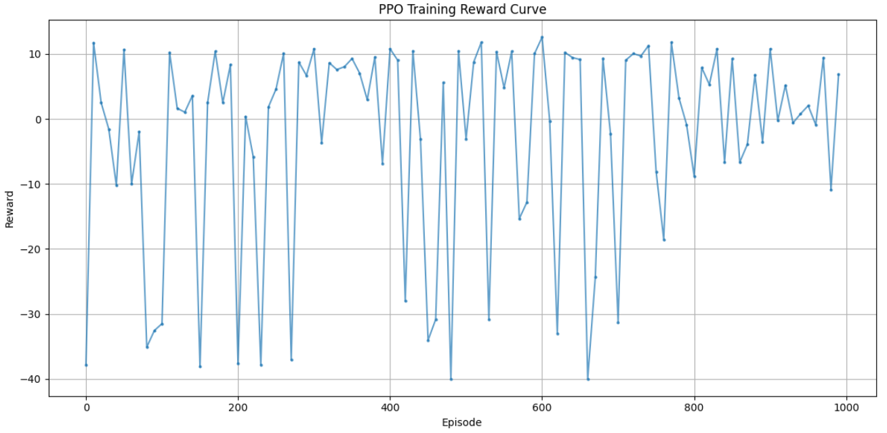
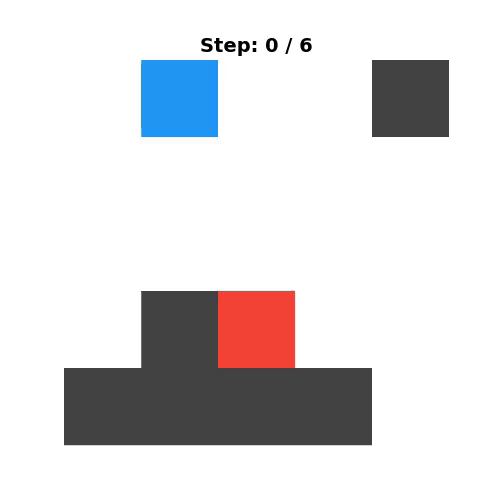

前回ようやく動的迷路を解ける強化学習が出来てきました。
しかし、安定して最短経路でスタートからゴールまで移動するわけではなく、ふらふらすることがありました。
今回は、エージェントをもう少し迷わずゴールに向かってくれるようにしていきたいと思います。

## 現状課題

agentが迷路はゴールを目指して移動することはできるが、最短経路ではなく、同じ個所をうろうろすることがある。
この課題に対して、DDQNのどこに問題があるのかを4つの観点から考察します。


### 1. Q値の「過大評価（Overestimation）」と「平坦化」

DDQNはDQNの過大評価を軽減するように設計されていますが、**迷路のような離散的なグリッド環境では依然として特定の状態のQ値を過大評価しやすい**特性があります。

* **徘徊ループの形成**:
一度たまたま高いQ値が割り振られてしまった状態（マスの組み合わせ）があると、その周辺のQ値も引っ張られて高くなります。その結果、エージェントから見ると「ゴールに向かうステップ」と「その周辺を往復するステップ」の**Q値の差（Q-value margin）が極めて小さく**なってしまいます。
* **過大評価による局所解**:
「ゴールに届く経路」であれば、それが遠回りであっても報酬（プラス）が得られるため、Q値が更新されます。一度その遠回り経路のQ値が十分に高くなってしまうと、DDQNのベルマン更新では「より短い未探索の直進ルート」を試す動機が生まれにくくなります。

### 2. 割引率 $\gamma$（ガンマ）と「遅延報酬」の伝播速度の遅さ

DDQN（Q学習）における価値の伝播は、**1ステップずつしか後方へ遡りません（1-step TD学習）** 。

* **長い経路での勾配拡散**:
ゴールで＋1.0の報酬を得た場合、その価値は $\gamma \times Q(s')$ として1マス手前、さらにその手前へと順番に伝播します。迷路のようにステップ数が長くなると、スタート付近のQ値に差がつくまでに膨大なリプレイバッファのサンプリング（試行回数）が必要です。
* **PPO（GAE）との比較**:
PPOなどで用いられる GAE（Generalized Advantage Estimation）や $n$-step 収益は、複数ステップ先の報酬をまとめて価値評価に反映させます。DDQNの1-step更新では「ゴールまでの最短性」をスタート地点まで正しく書き換えるのに非常に時間がかかり、結果として途中で寄り道するQ値の揺らぎ（ノイズ）を相殺しきれません。

### 3. $\epsilon$-greedy 探索の非効率性（「迷い」の増幅）

DDQNの探索は、一定確率 $\epsilon$ でランダムな行動をとる $\epsilon$-greedy 法に頼っています。

* **無意味な方策の揺らぎ**:
学習がかなり進んだ段階でも、$\epsilon$ の確率で突発的にランダムな行動（壁にぶつかる、後ろに戻るなど）をとります。
* **状態空間の非効率な探索**:
$\epsilon$-greedy は「どの行動がどれくらい有望か」という確率（確信度）を持たず、全行動を均等な確率で選びます。そのため、「あと1歩でゴール」という場面でも突然逆走し、リプレイバッファに「寄り道した軌跡」が大量に蓄積され、それがさらにQ値を歪めるという悪循環に陥ります。

### 4. ステップペナルティ（報酬設計）に対するQ値の鈍感さ

最短経路を学習させるために「1ステップごとに -0.01 のマイナス報酬（ステップペナルティ）」を与えるのが一般的ですが、DDQNはこの微小な差を学習するのが苦手です。

* **Q値のスケール埋没**:
ゴールの報酬が +1.0 だとすると、20ステップで到達したときの価値（$\gamma^{20} \times 1.0$）と、24ステップで到達したときの価値（$\gamma^{24} \times 1.0$）の差は非常に僅かです。
* **Argmax による不連続な行動選択**:
DDQNは $\arg\max_a Q(s, a)$ で行動を選択するため、Q値に `0.001` でも誤差やノイズがあると、一瞬で「最短ではない行動」を最適解として選んでしまいます。確率的にスムーズに行動を選ぶPPO（Policy Gradient）に比べ、DDQNはQ値のわずかな数値ノイズに対して過敏に誤った行動を選び、うろうろする原因になります。

### 一言でいう課題

エージェントがうろうろするのは、エージェントが「怠けている」のではなく、**DDQNのQ値関数上で「最短ルート」と「遠回りルート」のQ値の差が十分に開いていない（ノイズに埋もれている）** ことが原因です。

1-step TD学習による伝播の遅さと、$\arg\max$ による急激な行動選択の切り替えが組み合わさることで、DDQNは迷路のような幾何学的・決定論的な最短経路問題において「同じ場所を往復するローカルループ」から抜け出しにくくなります。

## 対応策

一部内容は前回も言った内容と重複しますが、アルゴリズムをPPOに変更します。
PPOがうろうろする課題に対して解決案となるのではと考える理由について考察します。

### 1. GAE（マルチステップ評価）による「遠い未来の報酬」のダイレクトな書き換え

DDQNが1ステップずつしかQ値を伝播できないのに対し、PPOでは **GAE（Generalized Advantage Estimation）** を使用します。

* **メカニズム**:
GAEは1ステップだけでなく、$n$ ステップ先（あるいはエピソード終了まで）の実際の報酬と価値予測を指数関数的に重ね合わせてアドバンテージ $A(s, a)$ を計算します。
* **徘徊課題の解決**:
「うろうろして20ステップかかった軌跡」と「最短で5ステップでゴールした軌跡」が得られた場合、GAEは**ゴール時の大きなプラス報酬を過去のすべての行動へ即座にバックプロパゲーション**します。
その結果、「無駄な寄り道をした行動」には相対的に低い（またはマイナスの）アドバンテージが割り当てられ、「最短で進んだ行動」の選択確率がダイレクトかつ急激に強化されます。

### 2. 確率的方策（Policy Gradient）による「スムーズな最適化」

DDQNは `argmax` による不連続な行動選択を行うため、Q値の僅かな誤差で行動が激しく振れて徘徊が発生します。

* **メカニズム**:
PPOは状態 $s$ における各行動の選択確率（Softmax分布）を直接出力・更新します。
* **徘徊課題の解決**:
「まっすぐ進む確率 70%」「戻る確率 10%」のように連続的な確率として表現されるため、価値関数の推定値に多少のノイズがあっても行動選択が極端に崩れません。学習が進むにつれて「最短ルート上の行動」の確率が自然に 99% 近くまで高まるため、決定論的で滑らかな最短移動が実現します。

### 3. エントロピー正則化（Entropy Loss）による「目的を持った探索」

DDQNの $\epsilon$-greedy は「完全なランダム行動」に依存するため、ゴール付近でも確率的に無意味な逆走を行ってしまいます。

* **メカニズム**:
PPOの損失関数にはエントロピー項（`entropy_coef * entropy`）が組み込まれており、「方策が確信を持てていない状態（未知のエリア）」では自律的に探索を広げ、「十分に学習した状態」では自然と探索率（エントロピー）が下がります。
* **徘徊課題の解決**:
ゴールまでの最短ルートを一度見つけると、その経路上のエントロピーが急速に低下して無駄なランダム行動をとらなくなります。結果として、DDQNのように「学習が進んだのに急に逆走する」という現象が起きなくなります。

### 4. Clipped Surrogate Objective による「決定的な方策の崩壊防止」

DDQNでは、リプレイバッファからのサンプリングや大きなQ値の更新によって、一度学習した「正しい最短ルート」を突然忘れて徘徊し出す（Overwriting / Catastrophic Forgetting）問題が頻繁に起こります。

* **メカニズム**:
PPOは新旧の方策の比率 $r_t(\theta) = \frac{\pi_\theta(a\vert{}s)}{\pi_{\theta_{old}}(a\vert{}s)}$ を一定の範囲（例: $1 \pm 0.2$）にクリップします。
* **徘徊課題の解決**:
1回のパラメータ更新で方策が急激に変わりすぎることを構造的に阻止するため、**一度獲得した「最短ルートを通る能力」を破壊されずに保持したまま、より効率的な挙動へと安全に微調整**され続けます。

### よいと思っている理由まとめ

| 課題（うろうろする原因） | DDQNでの限界 | PPOによる解決アプローチ |
| --- | --- | --- |
| **遅延報酬の伝播** | 1-step TD学習のため、ゴールからの価値伝播に膨大な試行が必要 | **GAE** により、マルチステップ先のゴール報酬を即座に過去の行動へ反映 |
| **ノイズへの過敏性** | `argmax` の不連続性により、微小なQ値のズレで寄り道を選ぶ | **確率的方策** により、確信度に応じた滑らかな行動確率の修正が可能 |
| **非効率な探索** | $\epsilon$-greedy による無差別なランダム行動でループが発生 | **エントロピー正則化** により、未学習部分のみを効率よく探索 |
| **学習の不安定性** | パラメータ更新で最短ルートの記憶が突然破壊されやすい | **Clip機構** により、確実な改善のみを安全に積み重ねる |

`argmax` の件は前回も言及していて、修正済みですが・・・。

今回は、Transformer のような表現力の高すぎるバックボーンを組み合わせる場合、**PPOの持つ「GAEによる速い価値伝播」** と **「Clip機構による安全ガード」** が機能することで、エージェントが迷路の最短経路を取得しやすくなるかと期待しています。

## 実装のキーポイント

PPOは「論文の数式通りにコードを書くだけだと、なぜか全く学習が進まない・不安定になる」という**実装上の細かなトリック（Implementation Details）への依存度が非常に高い**アルゴリズムとして知られています。

コツとなる点についてまとめていきます。

1. **損失関数とクリッピング**
2. **データの扱い方・正規化**
3. **ネットワーク構造・初期化**

### 1. 損失関数とクリッピング

__1-1. Value Function（Critic）のクリッピング__

`ppo_clip` パラメータ（$\epsilon \approx 0.2$）はActorだけでなく、**Criticの価値関数（$V^\phi$）にも適用する**のが標準的です。更新によって価値関数が急激に変化するのを防ぎます。

```python
# Value Loss Clipping
v_clipped = v_old + torch.clamp(v_pred - v_old, -clip_eps, clip_eps)
v_loss_unclipped = (v_pred - returns) ** 2
v_loss_clipped = (v_clipped - returns) ** 2
v_loss = 0.5 * torch.max(v_loss_unclipped, v_loss_clipped).mean()

```

__1-2. エントロピーボーナスによる探索促進__

学習初期にポリシーが局所最適解に陥って決定的になりすぎるのを防ぐため、損失関数に**エントロピー項**を加算します。

* 係数 $\beta$ （`entropy_coef`）は `0.01` 〜 `0.001` 程度から調整します。
* **コツ:** エントロピー項は「引き算」します（全体の Loss を最小化するため、エントロピーを最大化＝Lossをマイナスにする）。

$$\text{Loss}_{\text{total}} = L^{\text{CLIP}} - c_1 \cdot L^{\text{VF}} + c_2 \cdot S[\pi_\theta]$$

### 2. データの扱い方とGAE（Generalized Advantage Estimation）

__2-1. GAEの実装は「後ろから遡る」__

Advantage（行動価値の優位性）の計算には **GAE($\gamma, \lambda$)** を使います。現在から将来へ向かって計算するのではなく、**エピソードの終端（末尾）から過去へ向かって遡りながら計算**するとシンプルかつ高速に実装できます。

```python
advantages = torch.zeros_like(rewards)
last_gae_lam = 0

# バッチの最後から逆順に計算
for t in reversed(range(len(rewards))):
    if t == len(rewards) - 1:
        next_non_terminal = 1.0 - dones[t]
        next_value = last_value
    else:
        next_non_terminal = 1.0 - dones[t + 1]
        next_value = values[t + 1]

    # TD Error: delta = r + gamma * V(s') - V(s)
    delta = rewards[t] + gamma * next_value * next_non_terminal - values[t]
    # GAE: A_t = delta_t + (gamma * lambda) * A_{t+1}
    last_gae_lam = (
        delta + gamma * gae_lambda * next_non_terminal * last_gae_lam
    )
    advantages[t] = last_gae_lam

returns = advantages + values

```

__2-2. Advantageの標準化（Normalization）__

Mini-batchごとにAdvantageの平均を0、標準偏差を1に正規化（`adv = (adv - adv.mean()) / (adv.std() + 1e-8)`）します。これにより、勾配のスケールが安定し、学習率の設定が容易になります。

### 3. ネットワーク・ハイパーパラメータの調整

__3-1. 直交初期化（Orthogonal Initialization）__

全結合層（Linear）や畳み込み層（Conv）の重み初期化には、デフォルトのHe/Xavier初期化ではなく**直交初期化**を用い、バイアスは0で初期化します。さらに**最終出力層のゲイン（gain）を小さく設定する**のが決定的なコツです。

```python
def init_weights(m):
    if isinstance(m, (nn.Linear, nn.Conv2d)):
        nn.init.orthogonal_(m.weight, gain=np.sqrt(2))
        if m.bias is not None:
            nn.init.constant_(m.bias, 0.0)


# 重みの初期化適用
model.apply(init_weights)

# 【重要】Actorの最終層（Policy Head）のゲインは 0.01 にする
# これにより、学習初期の行動確率がほぼ均等（ランダム探索）になる
nn.init.orthogonal_(actor_final_layer.weight, gain=0.01)

# 【重要】Criticの最終層（Value Head）のゲインは 1.0 にする
nn.init.orthogonal_(critic_final_layer.weight, gain=1.0)

```

__3-2. 勾配ノルムのクリッピング（Gradient Clipping）__

Actor/Criticのパラメータ更新時、勾配の爆発を防ぐために `torch.nn.utils.clip_grad_norm_` を適用します。

* `max_norm` は `0.5` が一般的です。

__3-3. 試す際の推奨ハイパーパラメータ__

迷路や簡単な2D環境・離散行動空間でのスタートラインとして使いやすい設定値です。

* **`learning_rate`**: $2.5 \times 10^{-4}$ （Adamオプティマイザ。必要に応じてアニーリングで徐々に下げる）
* **`gamma` ($\gamma$)**: $0.99$
* **`gae_lambda` ($\lambda$)**: $0.95$
* **`ppo_clip` ($\epsilon$)**: $0.2$
* **`epochs` (1バッチあたりの再学習回数)**: $4$ 〜 $10$
* **`batch_size` / `minibatch_size**`: データ全体（例: 2048ステップ）を取得後、32〜64程度の小バッチに分割して更新

### 4. デバッグとデバッグ用ログ
あくまで実装する上でのコツという感じの内容ですが。

PPOの学習がうまくいかないときは、以下の指標をTensorBoardで可視化するのが近道です。

* **`Policy Loss` と `Value Loss**`: 一方に偏って破綻していないか
* **`KL Divergence`**: 旧ポリシーと新ポリシーの離れ具合（急上昇している場合は学習率やエポック数が大きすぎる）
* **`Clip Fraction`**: どのくらいの割合で比率 $r_t(\theta)$ が $[1-\epsilon, 1+\epsilon]$ 外に弾かれてクリップされたか（20%前後が理想）
* **`Entropy`**: 滑らかに減少しつつ、0に貼り付いていないか

## 学習と結果

実装コードは以下に保管しています。
迷路コードと、モデル&エージェントが保管されています。

https://github.com/Shinichi0713/Reinforce-Learning-Study/tree/main/basic/11_maze/src

### 学習の推移

学習の報酬の推移を示します。
うーん。。。
前回と大差を感じません。。。



### 動作

残念ながら、前回と同様でした。
うろうろは治りません。
壁と最短経路をふさがれる時にエージェントがうろうろ始めています。
agentにはゴールが見えてないの・・・と思ってしまう結果でした。




## 結論


### 1. 現状の到達点

- **動的迷路を解ける強化学習**は、前回（DDQN）・今回（PPO）ともに**一応成立**している。
- エージェントはゴールを目指して移動することはできるが、**最短経路で安定してゴールに到達する挙動には至っていない**。
- PPOに切り替えても、**「うろうろ」「寄り道」「ループ」** といった挙動は依然として残っている。

### 2. DDQN → PPO に切り替えた意図と期待

ユーザー様は、DDQNの以下の課題をPPOで補えると考えていました。

- **1-step TD学習による遅延報酬の伝播の遅さ**  
  → PPO + GAE で、マルチステップ先の報酬を即座に過去の行動へ反映できるはず。
- **`argmax` による不連続な行動選択とノイズへの過敏性**  
  → 確率的方策（Policy Gradient）により、行動確率を滑らかに最適化できるはず。
- **$\epsilon$-greedy による非効率な探索**  
  → エントロピー正則化により、未学習部分だけを効率よく探索できるはず。
- **学習の不安定性・突然の性能崩壊**  
  → Clipped Surrogate Objective により、安全に改善を積み重ねられるはず。

理論的には、**PPOは「最短経路の安定した獲得」に有利な性質を多く持つ**ため、切り替え自体はまずくないと思っています。

### 3. 結果と残った課題

- **報酬推移（学習曲線）**は前回と大差なく、PPO特有の急激な改善は見られていない。
- **実際のエージェント挙動**も、前回と同様に「壁や最短経路がふさがれると、うろうろし始める」という問題が残っている。
- つまり、**アルゴリズムをDDQNからPPOに切り替えただけでは、「最短経路を安定して通る」というレベルには到達していない**。

### 4. 所感

- **アルゴリズムの切り替え（DDQN → PPO）は方向性としては正しい**が、実装・ハイパーパラメータ・報酬設計・ネットワーク構造・環境側の設計など、**他の要因がボトルネックになっている可能性が高い**。
- 特に、PPOは「実装の細部（損失のクリップ、GAEの正規化、初期化、勾配クリップなど）」に強く依存するアルゴリズムであり、  
  これらが適切に設定されていないと、理論的な利点を活かしきれない。

