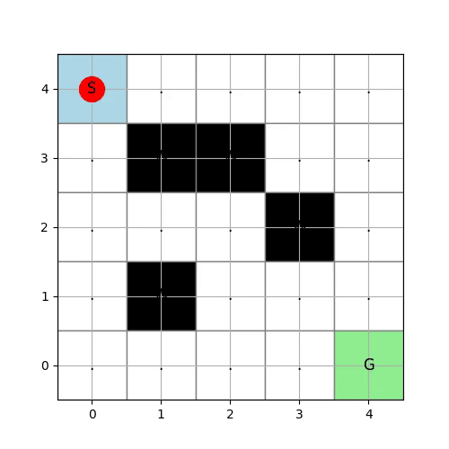

強化学習でトライしてまず解いてみる例題として名高い(!?)のは迷路を解く問題かしらと思います。
本日は迷路の問題を解く強化学習について扱ってみたいと思います。

本日テーマ：
>迷路を脱出するエージェントを強化学習で作成する。今回はまず、環境コードを実装する。

## 問題定義
初めに問題定義を行います。

5×5迷路脱出を行うエージェントを作ります。
迷路は以下の絵のように5×5で定義されます。

__迷路の例（5×5）__

```
S . . . .
. W W . .
. . . W .
. W . . .
. . . . G
```

- S: スタート (0,0)
- G: ゴール (4,4)
- W: 壁
- .: 通路

__ルール（環境仕様）__

本問題のルールです。

1. **状態（State）**  
   - エージェントの現在位置 (x, y)。  
   - 例: (0,0) がスタート、(4,4) がゴール。

2. **行動（Action）**  
   - 4種類: 上(↑), 下(↓), 左(←), 右(→)。

3. **遷移（Transition）**  
   - 行動に応じて1マス移動。
   - 壁（W）や迷路外への移動は「無効」で、その場にとどまる。

4. **報酬（Reward）**  
   - ゴール到達: +10  
   - 壁にぶつかる: -1  
   - 通常移動: 0

5. **終了条件**  
   - ゴールに到達したらエピソード終了。

## 実装

### 迷路を読み込むコード例（Python）

__前提__
- 迷路はテキストファイル（例: `maze.txt`）に保存されているとします。
- 1行が迷路の1行に対応し、文字はスペース区切りまたは連続文字で記述します。

__迷路ファイル例（`maze.txt`）__

以下を保存して`maze.txt`として保存してください。

```text
S . . . .
. W W . .
. . . W .
. W . . .
. . . . G
```

__コード（Python）__

```python
import numpy as np

class MazeEnv:
    """
    5x5迷路環境クラス
    """
    def __init__(self, maze_file="maze.txt"):
        self.maze = self._load_maze(maze_file)
        self.start, self.goal = self._find_start_goal()
        self.state = self.start
        self.done = False

    def _load_maze(self, file_path):
        """
        迷路ファイルを読み込み、2次元リストとして返す
        """
        maze = []
        with open(file_path, 'r', encoding='utf-8') as f:
            for line in f:
                line = line.strip()
                if not line:
                    continue
                if ' ' in line:
                    row = line.split()
                else:
                    row = list(line)
                maze.append(row)
        return maze

    def _find_start_goal(self):
        """
        迷路からスタート(S)とゴール(G)の座標を探す
        """
        start = None
        goal = None
        for i, row in enumerate(self.maze):
            for j, cell in enumerate(row):
                if cell == 'S':
                    start = (i, j)
                elif cell == 'G':
                    goal = (i, j)
        return start, goal

    def _is_valid_move(self, pos):
        """
        現在位置が迷路内かつ壁でないかチェック
        """
        x, y = pos
        if x < 0 or y < 0:
            return False
        if x >= len(self.maze) or y >= len(self.maze[0]):
            return False
        if self.maze[x][y] == 'W':
            return False
        return True

    def reset(self):
        """
        環境を初期状態にリセット
        """
        self.state = self.start
        self.done = False
        return self.state

    def step(self, action):
        """
        1ステップの遷移をシミュレート
        action: 0:上, 1:下, 2:左, 3:右
        """
        if self.done:
            raise ValueError("Episode is already done. Call reset() first.")

        x, y = self.state
        if action == 0:   # 上
            next_state = (x - 1, y)
        elif action == 1: # 下
            next_state = (x + 1, y)
        elif action == 2: # 左
            next_state = (x, y - 1)
        elif action == 3: # 右
            next_state = (x, y + 1)
        else:
            raise ValueError("Invalid action")

        # 移動先が有効かチェック
        if not self._is_valid_move(next_state):
            next_state = self.state  # 壁なら動かない
            reward = -1              # 壁にぶつかった罰
        else:
            reward = 0

        # ゴール判定
        if self.maze[next_state[0]][next_state[1]] == 'G':
            reward = 10
            self.done = True
        else:
            self.done = False

        self.state = next_state
        return self.state, reward, self.done

    def render(self):
        """
        現在の迷路状態を表示（エージェント位置を表示）
        """
        maze_copy = [row[:] for row in self.maze]  # コピー
        x, y = self.state
        if not self.done:
            maze_copy[x][y] = 'A'  # エージェント位置
        for row in maze_copy:
            print(' '.join(row))
        print()

# --- 使用例 ---
if __name__ == "__main__":
    env = MazeEnv("maze.txt")
    print("Initial maze:")
    env.render()

    state = env.reset()
    print(f"Start: {state}, Goal: {env.goal}")

    # 簡単な動作確認
    actions = [3, 1, 1, 3]  # 右→下→下→右 の例
    for i, action in enumerate(actions):
        next_state, reward, done = env.step(action)
        print(f"Step {i+1}: Action {action}")
        print(f"  -> State {next_state}, Reward {reward}, Done {done}")
        env.render()
        if done:
            print("Reached goal!")
            break
```

### 強化学習の例題としての使い方

1. 上記コードで迷路を読み込み、環境（状態遷移と報酬）を定義します。
2. Q学習やSARSAなどのアルゴリズムで、エージェントに「ゴールまでの最短経路」を学習させます。
3. 学習後、エージェントが選ぶ行動を可視化すると、壁を避けつつゴールへ向かう経路が確認できます。

因みに動画生成の機能も実装しています。
上記をインスタンス化して適当に動作させると以下のようになります。



## 総括

これまで構築してきた迷路環境のキーポイントを、設計・実装・拡張の観点からまとめます。

### 1. 環境設計のキーポイント

__(1) 状態・行動・報酬の明確な定義__
- **状態（State）**: エージェントの現在位置 `(x, y)`  
- **行動（Action）**: 4方向（上・下・左・右）  
- **報酬（Reward）**:
  - ゴール到達: +10（大きな正の報酬）
  - 壁衝突: -1（負の報酬）
  - 通常移動: 0
- **終了条件**: ゴール到達でエピソード終了

→ 強化学習の基本要素（状態・行動・報酬・終了条件）をシンプルに定義し、エージェントが「ゴールに早く到達する」ことを自然に学習できる設計になっています。

__(2) 遷移ルールの単純さ__
- 行動に応じて1マス移動。
- 壁や迷路外への移動は「無効」で、その場にとどまる。
- ゴールに到達したら終了。

→ 遷移が決定的で理解しやすく、初学者でも挙動を追いやすい環境です。

### 2. 実装上のキーポイント

__(1) 外部ファイルからの迷路読み込み__
- 迷路をテキストファイル（例: `maze.txt`）で定義。
- 文字 `S`, `G`, `W`, `.` でスタート・ゴール・壁・通路を表現。
- `load_maze()` 関数でファイルを読み込み、2次元リストとして保持。

→ 迷路の変更が容易で、コードを書き換えずに環境を切り替えられます。

__(2) クラス化によるインターフェース統一__
- `MazeEnv` クラスとしてまとめ、以下のメソッドを提供:
  - `__init__`: ファイル読み込み・初期化
  - `reset()`: 状態を初期化（エピソード開始）
  - `step(action)`: 行動を実行し、`(next_state, reward, done)` を返す
  - `render()`: 現在の迷路とエージェント位置を表示

→ OpenAI Gym のような標準的な強化学習環境インターフェースに近づけており、アルゴリズム実装がしやすくなっています。

__(3) 状態履歴の保持と動画化__
- `self.history` に各ステップの状態を保存。
- `save_video()` メソッドで `matplotlib.animation` を用いてアニメーションを作成し、MP4として保存。
- 迷路背景は固定、エージェント位置だけをフレームごとに更新。

→ 学習過程を視覚的に記録・共有でき、デバッグや結果の説明に有用です。

### 3. 拡張性のキーポイント

__(1) 迷路サイズの柔軟性__
- 3×3 → 5×5 への拡張例を示しましたが、ロジックは任意の N×M 迷路に適用可能です。
- ファイル形式を変えずに、行数・列数を増やすだけで拡張できます。

__(2) 報酬設計の変更が容易__
- ゴール以外にも「宝箱」などの特別マスを追加し、報酬を変えることができます。
- 報酬関数を変更するだけで、学習目標を柔軟に変えられます。

__(3) 強化学習アルゴリズムとの組み合わせ__
- `reset()` と `step()` のインターフェースが標準的であるため、Q学習、SARSA、DQN など多くのアルゴリズムと組み合わせやすい設計です。
- 状態が離散的（グリッド座標）で単純なため、テーブル型手法（Qテーブル）の学習例としても適しています。

