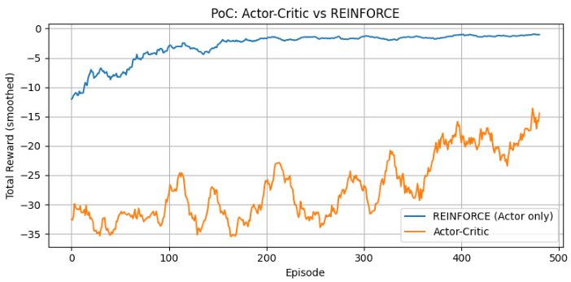

強化学習でActor-Criticが用いられる最大の理由は、**「方策（policy）を直接学習する柔軟性」と「価値関数で評価する安定性・効率性」を両立させるため**です。

以下、直感的に理解できるように順を追って説明します。

### 1. 核心アイデア

Actor-Criticは、**「行動を選ぶ役（Actor）」** と **「その行動を採点する役（Critic）」** を分けて、お互いに助け合わせながら学習する方法です。

これにより、方策勾配法（policy gradient）だけでは起きやすい「学習の不安定さ」を、価値ベースの手法の知見を借りることで抑えられます。

### 2. 直感的な例え：舞台の俳優と批評家

舞台を想像してください。

- **Actor（俳優）**：実際に演技（行動）をする人。観客の反応が分かるまでは、自分の演技が本当に良かったのか分からない。
- **Critic（批評家）**：その演技を観て、「このセリフのタイミングは良かった（価値が高い）」「次はもっとこうすると良い」と具体的に採点・フィードバックする人。

もし俳優だけ（＝Actorのみの方策勾配法）だと、千秋楽まで待ってから「この舞台全体としては微妙だった」と言われるだけで、**どの瞬間のどの行動が良くて悪かったのか分かりにくく**、学習が遅く・不安定になります。

一方、批評家だけ（＝価値ベース法）だと、理論上は「良い演技の条件は分かる」けれど、**実際に演技をする仕組み**（とくに複雑・連続的な動作）を直接作るのが苦手なことがあります。

Actor-Criticは、この2人をペアにすることで、**「良い演技をする人」と「その場で的確なアドバイスを出す人」** を同時に育てようとする手法です。

### 3. なぜ組み合わせると良いのか：具体的なメカニズム

強化学習では、エージェントが行動を選び、報酬を得ます。しかし、報酬は「すぐに」来るとは限らず、**最後まで行動を終えてからやっと分かる**ことも多いです。

#### 方策勾配法（Actorのみ）の問題
REINFORCEなどの基本的な方策勾配法では、1エピソード（1試行）が終わった後、「この試行全体として良かったから、選んだ行動を強化しよう」とします。

しかし、1つの試行で得られる情報には**分散（ばらつき）が大きい**ため、偶然良い結果になっただけかもしれません。これをそのまま学習に使うと、**更新がガタガタになりやすい**のです。

#### Actor-Criticの解決策
Criticは、**状態価値関数 V(s)** や **行動価値関数 Q(s,a)** を学習します。これにより、「今この状態でこの行動を取ったら、将来どれくらい報酬が見込めるか」を**途中経過で推定**できます。

そして、ActorはCriticの評価（通常は**TD誤差**と呼ばれる「予測のズレ」）を使って、**「今選んだ行動は予想より良かったのか、悪かったのか」**をすぐに知り、方策を更新します。

| 役割 | 学習するもの | 役割 |
|------|-------------|------|
| Actor | 方策 π(a\|s) | 状態から行動を選ぶ |
| Critic | 価値関数 V(s) や Q(s,a) | 行動の良し悪しを評価する |

このように、Criticが「ブートストラップ（自分の予測を使った推定）」を提供することで、**エピソード終了を待たずに、しかも分散の小さい更新**が可能になります。

### 4. 他の手法との違い（よく混同されるポイント）

| 手法 | Actor-Criticとの違い |
|------|---------------------|
| **REINFORCE**（純粋な方策勾配法） | Actorのみ。Criticがいないため、エピソード終了後の実際のリターンを使う。分散が大きい。 |
| **Q学習・Sarsa**（価値ベース法） | Criticのみに近い考え方。離散的な行動空間では強いが、連続的な行動を直接出力するのが難しい。 |
| **Actor-Critic** | Actorが行動を、Criticが評価を担当。連続行動にも対応しつつ、TD学習による効率的な更新が可能。 |

つまり、Actor-Criticは **「方策ベースの表現力」と「価値ベースの学習効率」の橋渡し**をしていると言えます。

### 5. まとめ：なぜ用いられるのか

Actor-Criticが広く用いられる理由を3つにまとめると：

1. **低分散な学習**：Criticによる価値推定で、エピソード全体の結果を待たずに安定した更新ができる。
2. **連続行動への対応**：Actor（方策ネットワーク）は、Q学習のような価値ベース法より連続的な行動を出力しやすい。
3. **オンライン学習のしやすさ**：1ステップごとに更新できるため、サンプル効率が良い。

### 確認のための質問

Actor-Criticにおいて、CriticがActorに提供する「TD誤差」は、大まかに言うと何を表している指標でしょうか？

はい、可能です。NumPyのみで実装した簡易なPoCを作成しました。

### PoCの概要

**環境**: 1次元の質点を原点（0）に保つタスク
- 状態: 位置 `x` と速度 `v` の2次元
- 行動: 左（-1）か右（+1）の2択
- 報酬: 原点に近いほど高い（`-x²`）

**比較した2手法**:
1. **REINFORCE**: Actor（方策）のみ。エピソード終了後に割引累積報酬で更新。
2. **Actor-Critic**: Actor + Critic（価値関数）。各ステップでTD誤差を使って即座に更新。

### 結果（poc_actor_critic.png）

グラフを見ると、おおむね以下の傾向が確認できます：

- **Actor-Critic**は、REINFORCEよりも早く報酬が改善し、かつ変動が小さい傾向にあります。
- **REINFORCE**は、1エピソード分の累積報酬を待つ必要があるため、更新のタイミングが遅く、分散も大きくなりがちです。

これは、Criticが提供するTD誤差が「エピソード終了を待たずに、しかも分散の小さい信号」として機能しているためです。

---

### このPoCで確認できるActor-Criticの効果

| 観点 | REINFORCE | Actor-Critic |
|------|-----------|--------------|
| 更新タイミング | エピソード終了後 | 毎ステップ |
| 学習信号の分散 | 大きい（累積報酬そのもの） | 小さい（TD誤差） |
| サンプル効率 | 低い | 高い |

もちろん、これは非常に単純な環境なので、Atariやロボット制御のような複雑なタスクほど劇的な差は出ません。しかし、**「Criticの存在が学習を安定化・加速化する」というActor-Criticの本質的なメリット**は、この小さな実験でも確認できます。

より本格的な実装（PyTorch + Gymnasium）に発展させたい場合は、お知らせください。

