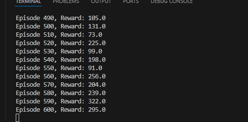

方策勾配法（Policy Gradient Method）は強力な強化学習手法ですが、**万能ではなく、得意・不得意な状況があります**。  
以下に「有効な場合」と「あまりよくない場合」をまとめます。

---

## 方策勾配法が**有効な場合**

1. **連続行動空間の問題**
   - 例：ロボット制御、自動運転、ゲームAI（連続的に操作する場合）
   - 方策勾配法は確率的・連続的な行動を自然に扱えるため、Q学習などの価値ベース手法より適しています。

2. **確率的な方策が必要な場合**
   - 例：敵対的環境や、相手の行動を予測しづらいマルチエージェント環境
   - 方策勾配法は「確率的な行動選択」を直接最適化できるので、混ぜるべき戦略（ミックスドストラテジー）が必要な場合に有効です。

3. **大規模・高次元な状態空間**
   - ニューラルネットワークなどで方策を直接パラメータ化しやすいです。

4. **探索が重要な問題**
   - 方策にノイズを加えたり、確率分布として表現できるため、探索と活用のバランスを柔軟に調整できます。

---

## 方策勾配法が**あまりよくない場合**

1. **サンプル効率が重要な場合**
   - 方策勾配法は「多くのエピソード（試行）」が必要で、サンプル効率が悪いです。
   - 環境とのインタラクションが高コストな場合（実機ロボット、現実世界の実験など）には向かないことが多いです。

2. **報酬が稀・スパースな場合**
   - 方策勾配法は「報酬のバリエーション」が少ないと勾配推定の分散が大きくなり、学習が進みにくくなります。
   - 価値ベース手法の方が安定することが多いです。

3. **行動空間が小さい離散値の場合**
   - 例：単純な盤面ゲーム（行動が数個しかない）
   - Q学習やSARSAなど価値ベースの手法の方が実装も簡単で学習も早い場合があります。

4. **高い安定性や収束性が求められる場合**
   - 方策勾配法は勾配推定の分散が大きく、不安定になりやすいです。工夫が必要です（例：ベースライン導入、アクター・クリティック法など）。

---

## まとめ

- **連続行動・確率的方策・高次元問題・探索が重要**→ 方策勾配法が有効
- **サンプル効率・安定性・スパース報酬・単純な離散行動**→ 価値ベース手法が有利な場合が多い

方策勾配法は万能ではありませんが、適切な場面では非常に強力です。  
タスクの特性に応じて手法を選択することが重要です。

以上です。

