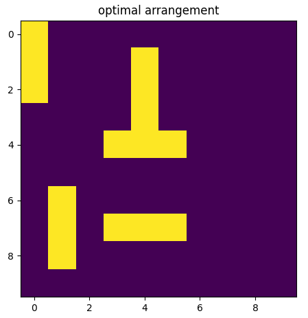

# 強化学習におけるニューラルネットワークの**方策の予測**と**行動価値関数の予測**の違い

## 1. 方策（policy）の予測とは？

- **方策（policy）**は、「この状態でどの行動をとるか」を直接決める関数です。
- ニューラルネットワークは、**状態を入力**として「各行動の確率分布」や「最適な行動そのもの」を**直接出力**します。
- 代表的なアルゴリズム：**Policy Gradient（方策勾配法）、PPO、A3C**など

### 例
- 状態 \( s \) を入力 → 各行動 \( a \) の確率 \( \pi(a|s) \) を出力
- 出力層はSoftmax（離散行動）や、平均・分散（連続行動）など

---

## 2. 行動価値関数（Q関数）の予測とは？

- **行動価値関数（Q関数）**は、「この状態でこの行動をとったときの将来の期待報酬」を予測する関数です。
- ニューラルネットワークは、**状態と行動を入力**として「その組み合わせの価値（Q値）」を**出力**します。
- 代表的なアルゴリズム：**DQN、Double DQN、Dueling DQN**など

### 例
- 状態 \( s \) を入力 → 各行動 \( a \) に対するQ値 \( Q(s, a) \) を出力
- 出力層は各行動のQ値（回帰）

---

## 3. 何が異なるか？

| 比較項目         | 方策の予測（Policy）       | 行動価値関数の予測（Q関数）   |
|------------------|---------------------------|-------------------------------|
| 出力             | 行動の確率分布または直接選択 | 各行動の価値（Q値）            |
| 学習目標         | 報酬を最大化する行動分布    | Q値がベルマン方程式を満たすよう更新 |
| 行動の決定       | サンプリングや最大確率選択   | Q値が最大の行動を選択           |
| 代表的手法       | Policy Gradient, PPOなど   | DQN, Double DQNなど            |
| 探索・活用       | 確率的な行動が自然にできる   | ε-greedyなどで探索を工夫        |

---

## 4. 実装上の違い（簡単なイメージ）

### 方策ネットワーク（例：PPO）
```python
# 状態を入力し、各行動の確率を出力
probs = policy_network(state)  # 例: [0.1, 0.7, 0.2]
action = np.random.choice(actions, p=probs)
```

### Qネットワーク（例：DQN）
```python
# 状態を入力し、各行動のQ値を出力
q_values = q_network(state)  # 例: [1.5, 2.0, 0.8]
action = np.argmax(q_values)
```

---

## 5. まとめ

- **方策の予測**：行動の確率分布を直接出力→確率的な行動選択がしやすい
- **Q関数の予測**：各行動の価値を出力→最大価値の行動を選択
- 実装・学習方法・探索の仕組みが異なる


## NNで方策勾配法に変えた結果

ちなみにTD誤差法ではまったく学習がうまくいかなかった。

