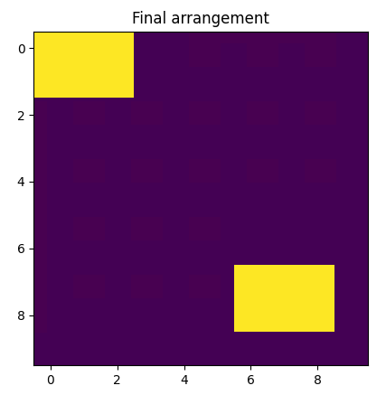
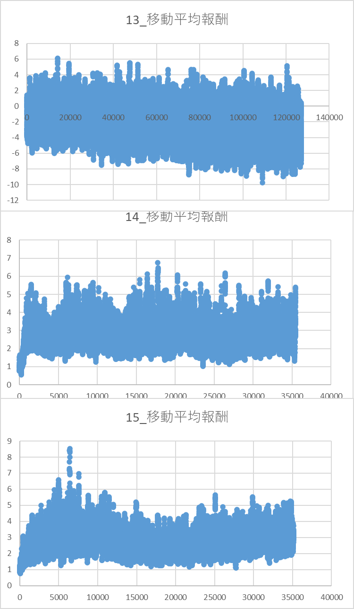

## トライアル

### reference8
dqnでレイアウトする長方形にランダム性を持たせてトライ。
学習がまったく安定しない。

### reference9
dqnのネットワーク構造を、もう少し大きくなるように修正してリトライ。
学習がまったく安定しない。
ネットワークが問題ではない・・・？

### reference10
DDQNで実装。
学習は安定するようになり、隙間を埋めて、高得点を狙えるようになった。

**成功につながったと考えるポイント**  
1. ddqnにより適正な行動評価がされるようになった。
2. ddqnは離散制御と相性が良いとされていて、今回タスク(離散空間へのレイアウト)とマッチした。

### reference11
10で高得点がとれるエージェントができたが、結構な頻度でペナルティを選択していた。
そのため、探索空間を十分にとれる、改善がいきなるではなく、段階的にされるという点に留意してリストラクトした。


**成功につながったと考えるポイント**  
1. ターゲットネットワークのパラメータ更新にソフトアップデートを取り入れて、じわじわと改善がされた

### reference12
学習フレームワークをSACに変更。
なぜか・・・。学習が安定しない。
もしかしたら、エントロピー高い領域への十分な探索を重視しすぎてるせい？

reference11で十分な結果が得られたため、一度保留。


### reference13
並べる長方形のランダム性を持たせたまま。
今度は一度並べると、長方形がなくなるように変更して学習する。

また報酬設計に、全て並べたら追加の報酬を与えるように定義する。
(というより、残りの長方形が少ない程、報酬を増やすように設計する)

__結果__  
ダメっぽい。
特に、-2→サイズ0を選択してしまっている。
__仮説__  
1. AIからして出力選択の難易度が高すぎる
2. 学習時に、サイズ0を選択することがダメと分かりづらくなっている

1は本当に分かりづらい。
修正効くなら修正してみる。

__修正点__  
1. トライのstep数を増加して、全てやりきるエピソードをとりやすくした
2. ロスを、箱のピックアップと、箱の並べるの２つで分割した(これがあるべき)
3. モデルに引き渡す情報に、直前選択した箱の番号も入れる



## reference14
学習アルゴリズムをSACに変更。

だいぶ学習の効率は改善したが、最後一押しがやはり出来てない

## reference15
モデルの構造が良くないことに気づいた

__もともと__  
1. 現状のレイアウトの状態と、箱の情報を入力後、まとめてCNNと全結合層で順伝播
2. ネットワーク内部でCNN、全結合で別々に取得した特徴量をconcatして、最終的にfc→判定としていた

```python
class ActorNet(nn.Module):
    def __init__(self, size_grid, max_rects=5):
        super().__init__()
        self.conv = nn.Sequential(
            nn.Conv2d(1, 16, 3, padding=1), nn.ReLU(),
            nn.Conv2d(16, 32, 3, padding=1), nn.ReLU(),
            nn.Flatten()
        )
        self.rect_encoder = nn.Sequential(
            nn.Linear(max_rects * 2 + 3, 256 * 2), nn.ReLU(),
            nn.Linear(256 * 2, 256 * 2), nn.ReLU(),
            nn.Linear(256 * 2, 64), nn.ReLU()
        )
        self.fc = nn.Sequential(
            nn.Linear(32 * GRID_SIZE * GRID_SIZE + 64, 512), nn.ReLU()
        )
        self.box_head = nn.Linear(512, max_rects)
        self.place_head = nn.Linear(512, size_grid)

        dir_current = os.path.dirname(os.path.abspath(__file__))
        self.path_model = os.path.join(dir_current, "model_actor.pth")

    def forward(self, grid, rects_info):
        grid = grid.to(DEVICE)
        rects_info = rects_info.to(DEVICE)
        grid_feat = self.conv(grid)
        rect_feat = self.rect_encoder(rects_info)
        x = torch.cat([grid_feat, rect_feat], dim=1)
        x = self.fc(x)
        box_logits = self.box_head(x)
        place_logits = self.place_head(x)
        box_probs = torch.softmax(box_logits, dim=1)
        place_probs = torch.softmax(place_logits, dim=1)
        return box_probs, place_probs
```

__想定課題__  
箱が選ばれた後に、選んだ箱をどこに置くかを考えるのが通常の考え方
別々に分かれているということは、配置する箱の考えずに、どこ置くか考えていることになる
→箱を選択後に、配置する箱のサイズをNNに、レイアウト情報とともに送信するべき

forwardの中で箱の選択と選択後の箱を並び変えるように修正。
すると、箱を残す確率が小さくなった。
少し気になったのは最後の1個を残したままにすることが目についた点。
一応、全部出来たら割り増しrewardの設定はあるが・・・。


### 懸念点

はい、**上記の`forward`メソッドでは計算グラフは切れていません**。  
PyTorchの計算グラフは、`torch.Tensor`同士の演算が`autograd`の管理下で行われている限り、途中で`detach()`や`.item()`、`numpy()`などを使わなければ切れません。


#### あなたのコードの該当箇所

```python
index_box = torch.argmax(box_logits, dim=1)  # [B]
# ↓
for b in range(batch_size):
    idx = index_box[b]
    x_val = rects_info[b, idx*2]
    y_val = rects_info[b, idx*2+1]
    box_size.append(torch.stack([x_val, y_val]))
box_size = torch.stack(box_size, dim=0)  # [B, 2]
```

#### ここでの注意点

- `torch.argmax()`は**微分不可能な操作**ですが、**計算グラフを切るわけではありません**。  
  ただし、`index_box`は整数インデックスとなるため、以降の`box_size`計算は「選択されたインデックスの値を使う」だけで、  
  この部分は`box_logits`や`rects_info`に対して勾配が流れません（微分できません）。
- つまり、「計算グラフが切れている」というより「この部分は微分できない（勾配が流れない）」ということです。

#### まとめ

- **計算グラフ自体は切れていません**（detach, .item(), .numpy()等を使っていないので）。
- ただし、`argmax`で選択した要素に対しては、**微分・学習はできません**（離散インデックスなので）。
- もし「box選択も微分可能にしたい」場合は、Gumbel-Softmax等の手法を検討してください。


#### 補足

- 現状のままでも、**ネットワーク全体の学習（box_logits, place_logits）自体は可能**です。
- ただし、`box_size`の選択に関しては「勾配が流れない」ため、そこを微分可能にしたい場合は別途工夫が必要です。


ご質問の「計算グラフが切れていないか？」という点については「**切れていません**」が答えです。  
ただし、「`argmax`での選択は微分不可」なことにご注意ください。
---

ロスは学習によって変化する。→ロスは比較しない。
報酬は相対評価可能。(報酬は変えてないので)→13 VS 14で大きく変化。15は効果なし。
