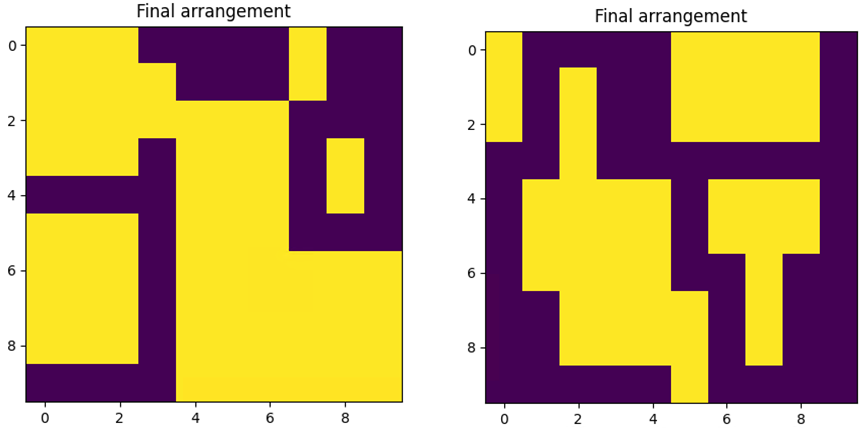
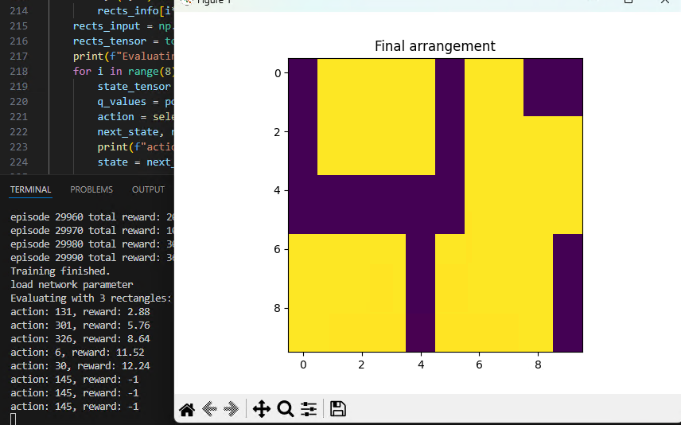

## トライアル

### reference8
dqnでレイアウトする長方形にランダム性を持たせてトライ。
学習がまったく安定しない。

### reference9
dqnのネットワーク構造を、もう少し大きくなるように修正してリトライ。
学習がまったく安定しない。
ネットワークが問題ではない・・・？

### reference10
DDQNで実装。
学習は安定するようになり、隙間を埋めて、高得点を狙えるようになった。

**成功につながったと考えるポイント**  
1. ddqnにより適正な行動評価がされるようになった。
2. ddqnは離散制御と相性が良いとされていて、今回タスク(離散空間へのレイアウト)とマッチした。

### reference11
10で高得点がとれるエージェントができたが、結構な頻度でペナルティを選択していた。
そのため、探索空間を十分にとれる、改善がいきなるではなく、段階的にされるという点に留意してリストラクトした。

**成功につながったと考えるポイント**  
1. ターゲットネットワークのパラメータ更新にソフトアップデートを取り入れて、じわじわと改善がされた

### reference12
学習フレームワークをSACに変更。
なぜか・・・。学習が安定しない。
もしかしたら、エントロピー高い領域への十分な探索を重視しすぎてるせい？

reference11で十分な結果が得られたため、一度保留。

### reference13
並べる長方形のランダム性を持たせたまま。
今度は一度並べると、長方形がなくなるように変更して学習する。

また報酬設計に、全て並べたら追加の報酬を与えるように定義する。
(というより、残りの長方形が少ない程、報酬を増やすように設計する)

