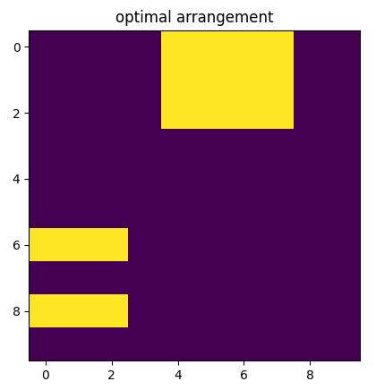
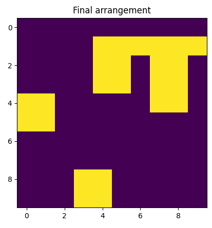

## トライアル1
**トライアル内容**:  
- おける箱の数、サイズはランダムに変更
- アクション選択のメソッドの内容を変更(idxは箱数で割り算→間違いなく箱を選別できるようにする。置く場所はマックスを起点)

**意図**  
- 配置する箱が確実に選択可能なものとなるようにする
- 配置する場所は箱の数によって増減しないようにする

__結果__  
なんとか整列はできるようになった。


**良かった点**  
- 成功を選択できるようになったため、プラス側報酬を取得可能

**今後の改善点**  
1. NNに残り箱数の情報がはいってない→なんとか入れ込むようにする
2. 配置する箱と、配置場所のルールを整備する

## トライアル2
**トライアル内容**  
- 箱の数や、箱のサイズを理解するエンコーダを、CNNと別途に持つ

1. 箱情報の表現方法
たとえば、エピソードごとに最大5個の箱（max_n=5）とし、
各箱のサイズ（w, h）を固定長ベクトルに詰める（無い箱は0埋め）。
```python
max_rects = 5
rects_info = np.zeros((max_rects, 2), dtype=np.float32)
for i, (w, h) in enumerate(rects):
    rects_info[i] = [w, h]
# 例: [[2,3], [1,1], [0,0], [0,0], [0,0]]
```

2. ネットワーク構成例
- 画像（グリッド）: CNNでエンコード
- 箱情報（個数・サイズ）: MLPでエンコード
- 最終的にconcatして全結合層へ

__how to use__  

```python
max_rects = 5
# ...略...
rects_info = np.zeros((max_rects, 2), dtype=np.float32)
for i, (w, h) in enumerate(rects):
    rects_info[i] = [w, h]
rects_info = rects_info.flatten()
num_rects = len(rects)
rects_input = np.concatenate([rects_info, [num_rects]]).astype(np.float32)
rects_tensor = torch.tensor(rects_input).unsqueeze(0)  # (1, max_rects*2+1)
state_tensor = torch.tensor(state).unsqueeze(0)        # (1, 1, H, W)
probs = policy_net(state_tensor, rects_tensor)
```

__実装結果__
非常に改善した！  
やはりこれが一番良い。  


__やり方再度研究__  

select_actionの意味について再確認

## コード全体

```python
def select_action(probs):
    m = torch.distributions.Categorical(probs)
    action = m.sample()
    return action.item(), m.log_prob(action)
```


## それぞれの行の意味

### 1. `def select_action(probs):`
- `probs`（確率の配列）を受け取る関数を定義しています。
- 例: probs = torch.tensor([0.1, 0.2, 0.7])

### 2. `m = torch.distributions.Categorical(probs)`
- PyTorchの`Categorical`分布オブジェクトを作成します。
- これは、与えられた確率分布`probs`に従って「どのクラス（行動）を選ぶか」を決める分布です。

### 3. `action = m.sample()`
- `m`（Categorical分布）から1つサンプル（= 行動のインデックス）をランダムに選びます。
- 例えば、probs=[0.1, 0.2, 0.7]なら、0, 1, 2のうち2が選ばれる確率が最も高いです。

### 4. `return action.item(), m.log_prob(action)`
- `action.item()`は、PyTorchのテンソルからPythonの整数値に変換します（例: 2）。
- `m.log_prob(action)`は、選択した`action`の対数確率（log probability）を返します。
    - これは強化学習（方策勾配法など）で損失計算に使われます。

## まとめ

この関数は、  
**「与えられた確率分布に従って行動をサンプリングし、その行動の対数確率も返す」**  
というものです。

### 主な用途

- 強化学習（特に方策勾配法）で、エージェントが行動を選び、その行動のlog-probを損失計算などに使うときによく使われます。


### 例

```python
probs = torch.tensor([0.1, 0.2, 0.7])
action, log_prob = select_action(probs)
print(action)     # 0, 1, 2 のどれかが出る
print(log_prob)   # そのactionが選ばれる確率の対数値
```

---

