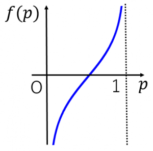
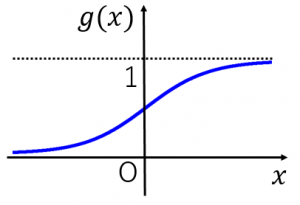

## 対数確率

```math
ロジット関数：f(p)=log \frac{p}{1−p}(0<p<1) \\

ロジスティック関数：g(x)=\frac{A}{1+e−k(x−x_0)}
```

**オッズ比**
確率 $p$ で起こる事象 A について、A が起こる確率と起こらない確率の比

**対数オッズ**
オッズの対数をとったもの 
```math
log \frac{p}{1−p}=logp−log(1−p)
```

---
対数オッズを関数とみなしたものがロジット関数。

対数ロジット（logits）や対数確率（log-probabilities）を用いる理由は、**数値的安定性**と**損失関数の計算効率**、**微分のしやすさ**が主な理由です。

対数ロジットや対数確率を用いる理由は数値的安定性と損失関数の計算効率、微分のしやすさ。


## 1. **数値的安定性**

- ソフトマックス関数や確率の計算は、値が非常に小さくなったり大きくなったりします。
- 例えば、確率が0.00001や1.0に近い場合、直接計算するとオーバーフローやアンダーフローが発生しやすいです。
- **対数を取ることで、極端な値の扱いが安定します。**
- 例えば、クロスエントロピー損失は「log(softmax(logits))」として計算されますが、PyTorchの`nn.CrossEntropyLoss`は内部でロジット（softmax前の値）を直接使い、数値的に安全に計算しています。


## 2. **損失関数の効率的な計算**

- 強化学習や分類問題では「選択した行動（または正解ラベル）の確率の対数」を損失に使います。
- 例えば、REINFORCEでは「log(prob) × 報酬」を損失にします。
- 対数確率を使うことで、掛け算を足し算に変換でき、計算がシンプルになります。
    - 例: 複数確率の積 \( p_1 \times p_2 \) → 対数を取ると \( \log p_1 + \log p_2 \)


## 3. **微分がしやすい（勾配計算が簡単）**

- ロジットや対数確率は、微分（勾配）計算が簡単で、ニューラルネットの学習に向いています。


## 4. **実装上の慣習とAPIの設計**

- PyTorchやTensorFlowの多くのAPIは、logits（ソフトマックス前の値）やlog-probを直接受け取る設計になっています。
- これは上記の理由（数値安定性・計算効率）からです。


## まとめ

- **対数ロジットや対数確率を使うのは、数値的に安定し、計算効率も良く、微分もしやすいからです。**
- 強化学習や分類タスクにおいて、損失関数や勾配計算の標準的な方法です。

**ロジット関数**
確率 $p$ で起こる事象Aについて、確率の比 $\frac{p}{1-p}$をオッズと呼ぶ。




**ロジスティック関数**
標準ロジスティック関数 $g(x)=\frac{1}{1+e^{-x}}$のグラフは以下通りとなる。
標準ロジスティック関数はステップ関数をなだらかにしたもの（微分可能）です。シグモイド関数とも呼ばれます。


