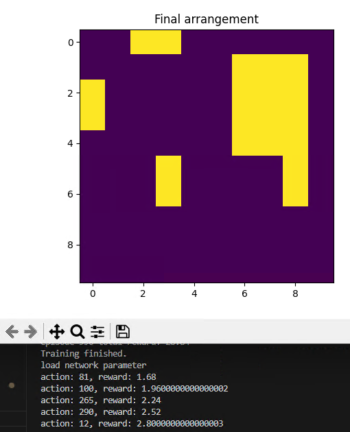
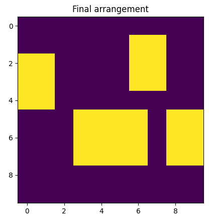

素晴らしい進展ですね！  
「方策勾配法（Policy Gradient法）」から「DDQN（Double DQN）」に切り替えたら学習が進むようになったとのことですが、これは実際によくある現象です。  
主な原因・背景を以下にまとめます。

---

## 1. 離散的な行動空間との相性

- **方策勾配法（Policy Gradient法）**は、行動の確率分布を直接パラメータ化して学習します。  
  一方、**DDQNはQ値を推定し、最大値をとることで行動を決定**します。
- グリッドマップのような「離散的な行動空間」では、Q学習系（DQN/DDQN）の方が効率的に学習できることが多いです。

---

## 2. 方策勾配法の学習の不安定さ

- 方策勾配法は「サンプル効率が悪い」「高分散になりやすい」「報酬が疎いと学習が進みにくい」などの弱点があります。
- 特に報酬設計が難しい問題や、長いエピソードで最終報酬しか得られない場合、方策勾配法は学習が停滞しやすいです。

---

## 3. DDQNの安定化効果

- **DDQNは「Q値の過大評価問題」を緩和し、より安定した学習を実現します。**
- Experience ReplayやTarget Networkなどの工夫も、学習の安定化に寄与します。
- Q学習系は「報酬の伝播」が速いため、最終報酬だけでも中間状態の価値が伝わりやすいです。

---

## 4. 状態・行動空間のスケール

- 「グリッドマップでの部屋設計」は状態・行動空間が比較的「離散的」「有限」な場合が多いです。  
  この場合、Q学習系が特に強みを発揮します。
- 方策勾配法は連続制御や確率的な行動選択が重要なタスクで強みを発揮しますが、今のタスクではDDQNの方がマッチしていたと考えられます。

---

## 個人的なまとめ
1. DQNはQ値を推定し、最大値をとることで行動を選択する。グリッドマップのような離散的な行動空間ではQ学習の法が効率的に学習できることが多い
2. 方策勾配法の学習は不安定：報酬が過疎ってると、学習が進みにくい。
3. DDQNの安定化効果：Q値の過大評価問題を緩和し、安定した学習を実現する
4. 状態・行動空間のスケールは離散的、有限な場合が多い。方策勾配法は連続制御や確率手金あ行動選択が重要なタスクで強味を発揮するが、現状のタスクではDDQNのほうが威力を発揮する。


---
ご提示のコードでニューラルネットワークが計算しているロス関数は、**Double DQNに基づくQ学習の損失関数（平均二乗誤差：MSELoss）**です。

具体的には、  
「現時点のQ関数（q_net）が出す行動価値（q_pred）」と  
「Double DQNのターゲット値（expected_q）」  
の**平均二乗誤差**を最小化するように学習しています。

---

## 数式で表すと

各サンプルについて、  
- \( Q(s, a) \)：現ネットワーク（q_net）が出す、状態\( s \)・行動\( a \)のQ値
- \( r \)：報酬
- \( s' \)：次状態
- \( \gamma \)：割引率
- \( Q_{\text{target}} \)：ターゲットネットワーク
- \( \text{done} \)：エピソード終了フラグ

Double DQNのターゲット値は

\[
\text{target} = r + \gamma \cdot Q_{\text{target}}(s', \arg\max_a Q(s', a)) \cdot (1 - \text{done})
\]

この「target」と「現在のQ値」の平均二乗誤差

\[
\text{loss} = \frac{1}{N} \sum_{i=1}^{N} \left( Q(s_i, a_i) - \text{target}_i \right)^2
\]

を最小化するように学習しています。

---

## コード対応

```python
q_pred = q_net(batch_state, batch_rects).gather(1, batch_action).squeeze(1)  # Q(s, a)
loss = nn.MSELoss()(q_pred, expected_q)  # MSELoss
```

---

## まとめ

- **Double DQNのターゲット値**と、**現ネットワークのQ値**との**平均二乗誤差（MSE）**をロス関数として最小化しています。
- これはDQN系の典型的な損失関数です。

---


今後は、DDQNの各種ハイパーパラメータやネットワーク設計などをさらに工夫することで、さらなる精度向上も期待できます。


  

Evaluating with 2 rectangles: [(2, 3), (2, 3)]  
  


