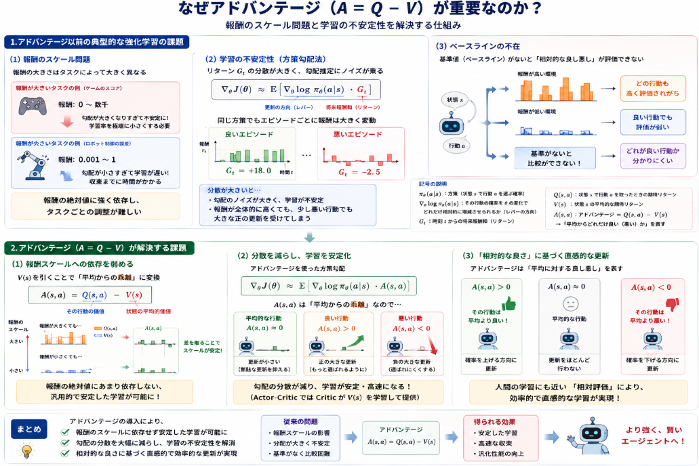

先日[GAE](https://yoshishinnze.hatenablog.com/entry/2026/07/24/043000)の説明を行いましたが、肝心のもととなるアドバンテージについて触れたことがありませんでした。

強化学習の根深い課題に基づいた考えなので是非説明しておきたいと考えました。

本日テーマ：
>強化学習に用いられるアドバンテージとは何かについて説明する。

## アドバンテージ

強化学習における「アドバンテージ（advantage）」とは、**ある状態における特定の行動を選ぶことの「相対的な良さ」を表す量**でございます。  
より正確には、**「その行動を選んだときの期待リターン（Q値）」から、「その状態で取りうる行動の平均的な期待リターン（状態価値 V）」を引いたもの**として定義されます。

### 1. 数式での定義

状態を $s$、行動を $a$ とすると、アドバンテージ $A(s,a)$ は次のように表されます。

$$
A(s,a) = Q(s,a) - V(s)
$$

ここで：

- $Q(s,a)$：状態 $s$ で行動 $a$ を選んだときの、将来得られる報酬の期待値（行動価値関数）
- $V(s)$：状態 $s$ から[方策](https://yoshishinnze.hatenablog.com/entry/2026/08/03/043000)に従って行動を選び続けたときの、将来得られる報酬の期待値（状態価値関数）

### 2. 直感的な意味

アドバンテージ $A(s,a)$ は、次のように解釈できます。

- $A(s,a) > 0$：  
  その行動 $a$ は、**その状態での「平均的な行動」よりも良い選択**である。
- $A(s,a) = 0$：  
  その行動 $a$ は、**その状態での「平均的な行動」と同等**である。
- $A(s,a) < 0$：  
  その行動 $a$ は、**その状態での「平均的な行動」よりも悪い選択**である。

つまり、アドバンテージは「その行動を選ぶことで、どれだけ“得”をするか（あるいは“損”をするか）」を、**その状態での平均的な期待リターンと比較して**示す指標でございます。

## 解決したい課題

アドバンテージが強化学習で広く使われるようになった背景には、**「報酬のスケール問題」と「学習の不安定性」** という、従来の強化学習における大きな課題がございました。  
以下、順を追ってご説明いたします。

### 1. アドバンテージ以前の典型的な強化学習の課題

__(1) 報酬のスケール問題__

- 強化学習では、エージェントが受け取る報酬 $r_t$ の大きさがタスクによって大きく異なります。
  - 例：ゲームのスコア（0〜数千）、ロボット制御の誤差（0.001〜1 程度）、など。
- 従来の手法では、**Q値 $Q(s,a)$ や報酬和そのもの**をそのまま方策更新の基準として用いることが多くございました。
- しかし、報酬のスケールが大きいと：
  - 勾配（更新量）が非常に大きくなり、学習が不安定になる
  - 学習率を極端に小さくしないと発散しやすい
- 逆に報酬のスケールが小さいと：
  - 学習が遅く、収束までに時間がかかる
- このように、**報酬の絶対値に強く依存する設計**は、タスクごとのハイパーパラメータ調整を難しくし、実用上の大きな課題となっておりました。

__(2) 学習の不安定性（特に方策勾配法）__

- 方策勾配法（Policy Gradient）では、方策 $\pi_\theta(a|s)$ のパラメータ $\theta$ を、以下のような形で更新します。
  $$
  \nabla_\theta J(\theta) \approx \mathbb{E}\left[ \nabla_\theta \log \pi_\theta(a|s) \cdot G_t \right]
  $$

  ここで $J(\theta)$ は目的関数、$G_t$ はそのエピソードでの将来報酬和（リターン）です。
- このとき、**$G_t$ の分散（ばらつき）が非常に大きい**という問題がございました。
  - 同じ方策でも、エピソードによって得られる報酬和は大きく変動します。
  - その結果、勾配推定のノイズが大きく、学習が不安定になります。
- また、**「良い行動」と「悪い行動」の差が相対的でなく絶対的**であるため、
  - 報酬が全体的に高い環境では、少し悪い行動でも大きな正の更新を受けてしまう
  - 逆に報酬が全体的に低い環境では、良い行動でも更新が弱いといった問題も生じます。

>__$π$とは？__
>上式の$π$は方策を意味しています。
>方策とは、「ある状態 s において、どの行動 a をどの確率で選ぶか」を決めるルールです。確率的な方策と、決定論的な方策の2パターンの使い方があります。
>確率的な方策の場合：$\pi(a|s)$ は、「状態 s で行動 a を選ぶ確率」を表します。
>決定論的な方策の場合：$\pi(s)$ は、「状態 s で選ぶべき行動 a」を直接返す関数として扱われます。この時は確率ではなく、まさに行動そのものを示します。

>__$\nabla_\theta \log \pi_\theta(a|s)$とは？__
>「その行動の確率を、θ の変化によってどれだけ相対的に増減させられるか」を表す“レバー”の方向を示します。
>$$
\nabla_\theta \log \pi_\theta(a|s) = \frac{\nabla_\theta \pi_\theta(a|s)}{\pi_\theta(a|s)}
>$$
>で log を用いる理由は、**「対数微分」** の性質を利用するためです。
>- 一般に、関数 $f(x)$ に対して
  $$
  \frac{d}{dx} \log f(x) = \frac{f'(x)}{f(x)}
>  $$
  が成り立ちます。
>- これを確率 $\pi_\theta(a|s)$ に適用すると、
  $$
  \nabla_\theta \log \pi_\theta(a|s) = \frac{\nabla_\theta \pi_\theta(a|s)}{\pi_\theta(a|s)}
>  $$
  となり、**確率の勾配を確率そのもので割った形**（＝相対的な変化率）が自然に現れます。
>
>この性質により、方策勾配の式が簡潔に書けるだけでなく、**確率のスケールに依存しない形**で更新方向を表現できる、という利点があります。

__(3) ベースラインの不在__

- 上記の問題に対処するため、**ベースライン（baseline）** を導入するアイデアが早くから提案されておりました。
- ベースラインとは、勾配更新の重みから「ある基準値」を差し引くことで、
  - 分散を減らし、
  - 更新の方向を「平均より良いか悪いか」という相対的な評価に変える
  ための工夫でございます。
- しかし、**どのようなベースラインを選ぶべきか**、また**どう推定するか**が長らく課題となっておりました。

### 2. アドバンテージが解決する課題

アドバンテージ $A(s,a) = Q(s,a) - V(s)$ は、上記の課題に対して、次のような解決策を提供いたします。

__(1) 報酬スケールへの依存を弱める__

- $V(s)$ は「その状態での平均的な期待リターン」ですので、
  $$
  A(s,a) = Q(s,a) - V(s)
  $$
  は、**「その行動が平均からどれだけ乖離しているか」** を表します。
- 報酬の絶対値が大きくなっても、$Q$ と $V$ が同じスケールで動くため、**アドバンテージのスケールは比較的安定**します。
- これにより、**タスクごとの報酬スケールにあまり依存しない、汎用的な学習アルゴリズム**を設計しやすくなりました。

__(2) 分散を減らし、学習を安定化__

- 方策パラメータの更新においてアドバンテージを用いた方策勾配は、一般に以下の形をとります。
  $$
  \nabla_\theta J(\theta) \approx \mathbb{E}\left[ \nabla_\theta \log \pi_\theta(a|s) \cdot A(s,a) \right]
  $$
- $A(s,a)$ は「平均からの乖離」を表すため、
  - 平均的な行動は $A \approx 0$ となり、更新が小さくなる
  - 良い行動は正の大きな更新、悪い行動は負の大きな更新を受ける
- これにより、**勾配推定の分散が減少し、学習が安定**します。
- 特に、Actor-Critic 系の手法では、Critic が $V(s)$ を学習することで、**オンラインで適切なベースラインを提供**できるようになりました。

__(3) 「相対的な良さ」に基づく直感的な更新__

- アドバンテージを使うことで、方策更新は次のように解釈できます。
  - $A(s,a) > 0$：その行動は平均より良い → もっと選ばれるように方策を更新
  - $A(s,a) < 0$：その行動は平均より悪い → 選ばれにくくするように方策を更新
- これは人間の学習にも近く、**「相対的な良さ」に基づく直感的で効率的な学習**を実現します。

### 3. 歴史的な流れ

アドバンテージが用いられるようになった経緯については以下のようなものです。

- 1990年代〜2000年代初頭：
  - REINFORCE などの素朴な方策勾配法が提案されるが、分散が大きく実用上の課題が多い。
  - ベースラインの重要性が認識され、単純な平均報酬などをベースラインとする試みが行われる。
- 2000年代後半〜2010年代：
  - Actor-Critic 法が発展し、**Critic が $V(s)$ を学習することで、自然にアドバンテージが得られる**ことが明確になる。
  - アドバンテージを用いた方策勾配が標準的な形として定着。
- 2010年代半ば以降：
  - **GAE（Generalized Advantage Estimation）** が提案され、n-step の情報を組み合わせたアドバンテージ推定が広く使われるようになる。
  - PPO, A3C など、現代的な深層強化学習アルゴリズムの多くが、アドバンテージを中核に据えた設計となっております。

## アドバンテージを用いてる手法

アドバンテージは、現在の強化学習において**Actor-Critic 系の手法や方策最適化アルゴリズムの中核**として広く用いられております。  
代表的なものを挙げますと、以下のような手法でございます。

### 1. Actor-Critic 系の手法

__(1) A2C / A3C（Advantage Actor-Critic）__

- **A2C（Advantage Actor-Critic）**：  
  同期型の Advantage Actor-Critic で、複数の環境を並列に走らせ、その経験をまとめて更新します[DI-engine A2C documentation](https://di-engine-docs.readthedocs.io/en/latest/12_policies/a2c.html)。
- **A3C（Asynchronous Advantage Actor-Critic）**：  
  非同期に複数のエージェントが環境を探索し、それぞれがグローバルな方策・価値関数を更新する手法です[Sesen AI – A3C in PyTorch](https://sesen.ai/blog/a3c-asynchronous-advantage-actor-critic)。
- いずれも、**Critic が状態価値 $V(s)$ を学習し、それを用いてアドバンテージ $A(s,a)$ を推定**し、Actor（方策）の更新に用います[Jonathan Hui – Actor-Critic Methods](https://jonathan-hui.medium.com/rl-actor-critic-methods-a3c-gae-ddpg-q-prop-e1c41f268541)。

__(2) その他の Actor-Critic 手法__

- **DDPG（Deep Deterministic Policy Gradient）**：  
  連続行動空間向けの Actor-Critic 手法で、アドバンテージの概念を連続行動に拡張した形で利用します[Jonathan Hui – Actor-Critic Methods](https://jonathan-hui.medium.com/rl-actor-critic-methods-a3c-gae-ddpg-q-prop-e1c41f268541)。
- **A2C/A3C をベースにした多くの派生手法**：  
  マルチエージェント強化学習や動的決定問題への応用など、A3C を組み込んだ研究も行われています[ScienceDirect – A3C integration](https://www.sciencedirect.com/science/article/abs/pii/S2210650224002943)。

### 2. 方策最適化アルゴリズム（Policy Optimization）

__(1) PPO（Proximal Policy Optimization）__

- **PPO** は、深層強化学習で最も広く使われているアルゴリズムの一つでございます。
- PPO では、**GAE（Generalized Advantage Estimation）** によってアドバンテージを推定し、それを用いて方策を更新します[GitHub – pytorch-a2c-ppo-acktr-gail](https://github.com/ikostrikov/pytorch-a2c-ppo-acktr-gail)。
- GAE は、異なるステップ数のアドバンテージ推定を重み付きで組み合わせることで、**バイアスと分散のトレードオフを調整**し、安定した学習を実現します[Jonathan Hui – Actor-Critic Methods](https://jonathan-hui.medium.com/rl-actor-critic-methods-a3c-gae-ddpg-q-prop-e1c41f268541)。

__(2) TRPO（Trust Region Policy Optimization）__

- PPO の前身にあたる TRPO も、アドバンテージを用いた方策勾配に基づいており、信頼領域（trust region）の制約を加えることで安定性を高めています[YouTube – Advanced Policy Optimization](https://www.youtube.com/watch?v=JYGg_U3UVgg)。

### 3. GAE（Generalized Advantage Estimation）

- **GAE** 自体は独立したアルゴリズムではなく、**アドバンテージ推定のための汎用的な枠組み**でございます。
- PPO, A2C/A3C, TRPO など、多くの現代的な方策最適化アルゴリズムで、**GAE によるアドバンテージ推定が標準的に採用**されています[Jonathan Hui – Actor-Critic Methods](https://jonathan-hui.medium.com/rl-actor-critic-methods-a3c-gae-ddpg-q-prop-e1c41f268541)。

### 4. 比較研究における位置づけ

- DQN, PPO, A2C などの深層強化学習モデルを比較する研究でも、**A2C（Advantage Actor-Critic）や PPO（GAE によるアドバンテージ利用）** が主要な比較対象として扱われています[arXiv – DQN vs PPO vs A2C](https://arxiv.org/pdf/2407.14151)。
- これは、アドバンテージを用いた方策最適化が、**実用上の性能と安定性のバランスが良い**と広く認識されていることを示しております。

## 総括

本日説明したアドバンテージについて総括していきます。

### 1. 強化学習の根深い課題

従来の強化学習（特に方策勾配法）では、主に以下の課題がありました。

1. **報酬スケールへの過度な依存**  
   - 報酬の絶対値がタスクごとに大きく異なり、学習率の調整が難しく、学習が不安定になりやすい。
2. **勾配推定の分散が大きい**  
   - リターン $G_t$ の分散が大きく、同じ方策でもエピソードごとに報酬和が大きく変動するため、勾配更新がノイズに支配される。
3. **「良い行動」と「悪い行動」の評価が絶対的**  
   - 報酬が全体的に高い環境では少し悪い行動でも大きな正の更新を受け、逆に低い環境では良い行動でも更新が弱い、という非効率が生じる。
4. **適切なベースラインの設計・推定が難しい**  
   - 分散を減らすためのベースライン（基準値）をどう選び、どう推定するかが長らく未解決であった。

### 2. アドバンテージがもたらす解決効果

アドバンテージ $A(s,a) = Q(s,a) - V(s)$ の導入により、上記の課題は次のように解決されます。

1. **報酬スケールへの依存を弱める**  
   - $V(s)$ を引くことで、「平均からの乖離」という相対的な評価に変換され、報酬の絶対値に依存しない安定した指標となる。
2. **分散を大幅に削減し、学習を安定化**  
   - 平均的な行動は $A \approx 0$ となり更新が小さく、良い行動・悪い行動のみが強く更新されるため、勾配推定のノイズが減り、学習が安定する。
3. **「相対的な良さ」に基づく直感的な更新**  
   - $A > 0$ なら「平均より良い行動」として強化し、$A < 0$ なら「平均より悪い行動」として抑制する、という人間の学習に近い更新が可能になる。
4. **Actor-Critic による自然なベースラインの提供**  
   - Critic が $V(s)$ を学習することで、オンラインで適切なベースライン（＝アドバンテージ）を自動的に推定できるようになり、設計の負担が軽減される。

### 3. 結論

アドバンテージは、**「報酬スケールに依存せず、分散を抑え、相対的な良さに基づいて方策を更新する」** ための強力な概念であり、A2C/A3C、PPO、TRPO、GAE など、現代の深層強化学習アルゴリズムの多くが、このアドバンテージを中核に据えることで、**実用上の性能と安定性の両立**を実現してます。

