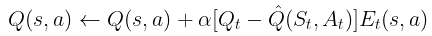

__練習問題__
以下のように5×5の迷路を使います。

Q学習またはSARSAを使って「スタートからゴールまで最短経路を学習するプログラム」を作成してください。

```
maze = [
    ['S', '.', '.', '#', '.'],
    ['.', '#', '.', '#', '.'],
    ['.', '#', '.', '.', '.'],
    ['.', '.', '#', '#', '.'],
    ['#', '.', '.', 'G', '.']
]
S: スタート
G: ゴール
#: 壁（通れない）
.: 通れるマス
```

## 構成

1. 環境
   迷路、リワードする、状態を返す、壁は通さない
2. エージェント
   行動選択する、行動価値を更新する
3. 訓練コード
   エージェントを訓練する


```python
    def update(self, s_idx, a, r, s_next_idx, a_next, done):
        # Q(λ)更新
        td_error = r + self.gamma * np.max(self.q[s_next_idx]) * (not done) - self.q[s_idx, a]
        self.e[s_idx, a] += 1  # eligibility traceを増加

        # 全状態・全行動について一括更新
        self.q += self.alpha * td_error * self.e
        # eligibility trace減衰
        self.e *= self.gamma * self.lam

        if done:
            self.e *= 0  # 終了時はtraceリセット
```

更新式

```math
\delta(\lambda) = r + \gamma
```




TD誤差を実装する場合

```python
import numpy as np

def td_lambda_update(V, states, rewards, alpha, gamma, lambd):
    """
    TD(λ) の更新を行う関数
    V: 状態価値を保持する辞書
    states: 状態のリスト
    rewards: 報酬のリスト
    alpha: 学習率
    gamma: 割引率
    lambd: λの値
    """
    eligibility_trace = {s: 0 for s in V.keys()}
    for t in range(len(states) - 1):
        state = states[t]
        next_state = states[t + 1]
        reward = rewards[t]
        td_error = reward + gamma * V[next_state] - V[state]
      
        eligibility_trace[state] += 1
      
        # 各状態の価値を更新
        for s in V.keys():
            V[s] += alpha * td_error * eligibility_trace[s]
            eligibility_trace[s] *= gamma * lambd

    return V

# サンプルデータ
states = ['A', 'B', 'C', 'D']
rewards = [1, 0, -1, 2]
V = {state: 0.0 for state in states}
alpha = 0.1
gamma = 0.9
lambd = 0.8

# 実行
updated_V = td_lambda_update(V, states, rewards, alpha, gamma, lambd)
print(updated_V)

```
