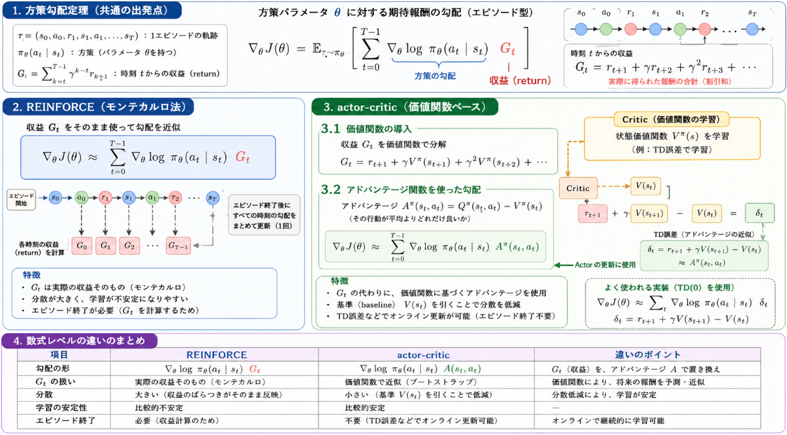

現在の強化学習の用途は
- 連続行動空間の制御タスク（ロボット制御、自動運転、物理シミュレーションなど）
- 大規模言語モデル（LLM）の強化学習によるファインチューニング（RLHFなど）
などの産業における今後の発展が有望視されている分野で応用されています。
そして、この分野における強化学習の分野では **actor-criticモデル** という手法が中心になっています。

__この記事のテーマ__
>現在強化学習の中で主流の手法であるactor-criticモデルが出てきた背景と、仕組み、効果について説明する

## 解決課題
まずは、なぜactor-criticモデルが必要とされたかについて触れていきます。

actor-criticモデルは、主に **「価値関数の学習」と「方策の学習」を同時に進めたい** という課題、および **「方策勾配法のばらつき（分散）を抑えたい」** という課題を解決するために考え出された枠組みです。

### 1. 価値関数ベース vs 方策ベースの長所を組み合わせたい

強化学習の代表的なアプローチには、大きく分けて次の2つがあります。

- **価値関数ベース（value-based）**  
  - 例：Q学習  
  - 各状態・行動の「価値」を学習し、価値が最大になる行動を選ぶ。  
  - 長所：学習が比較的安定しやすい。  
  - 短所：行動選択が「価値最大」に固定されやすく、探索が乏しくなることがある。

- **方策ベース（policy-based）**  
  - 例：REINFORCE（モンテカルロ方策勾配）  
  - 方策（確率的な行動選択ルール）そのものをパラメータで表現し、その勾配を使って更新する。  
  - 長所：連続行動空間にも適用しやすく、確率的な方策で自然に探索が行える。  
  - 短所：学習のばらつき（分散）が大きく、学習が不安定になりやすい。

actor-criticは、この2つを組み合わせることで、

- **actor（行動器）** ：方策そのものを学習・更新する（方策ベースの長所を活かす）
- **critic（評価器）** ：価値関数（状態価値やアドバンテージ）を学習し、actorの更新に使う（価値関数ベースの安定性を活かす）

という役割分担をします。  
これにより、「柔軟な方策」と「安定した評価」を両立させようとしているわけです。

### 2. 方策勾配法の分散を減らしたい

純粋な方策勾配法（例：REINFORCE）では、エピソード終了まで報酬を蓄積し、その総報酬を使って方策を更新します。  
このとき、**総報酬のばらつきが大きい**と、勾配更新の分散も大きくなり、学習が不安定になります。

actor-criticでは、criticが学習した**価値関数（V(s)）やアドバンテージ（A(s,a)）** を使って、  
「この行動が平均よりどれだけ良かったか」を評価します。

- 単純な総報酬ではなく、「基準（価値関数）」からの差分を使うことで、更新信号の分散を抑えられる
- その結果、学習がより安定し、収束が早くなる

というのが、actor-criticが解決しようとしたもう一つの重要な課題です。

## actor-criticのモデル式
もともとの方策を用いる強化学習法はREINFORCEというものでした。
REINFORCEとactor-criticは、どちらも **[方策勾配定理](https://note.com/novel_fowl5247/n/n9c68fa704ab8)** に基づくアルゴリズムですが、  
「**期待報酬の勾配をどう近似するか**」という点で数式が異なります。

本節ではREINFORCEとの違いを基にactor-criticのモデル式を導出します。

### 1. 方策勾配定理（共通の出発点）

まず、どちらも出発点は同じで、方策パラメータ $\theta$ に対する期待報酬の勾配は、以下のように書けます（エピソード型の設定）：

$$
\nabla_\theta J(\theta)
= \mathbb{E}_{\tau \sim \pi_\theta} \left[
\sum_{t=0}^{T-1} \nabla_\theta \log \pi_\theta(a_t \mid s_t) \; G_t
\right]
$$

ここで、

- $\tau = (s_0, a_0, r_1, s_1, a_1, \dots, s_T)$：1エピソードの軌跡
- $\pi_\theta(a_t \mid s_t)$：方策（パラメータ $\theta$ を持つ）
- $G_t = \sum_{k=t}^{T-1} \gamma^{k-t} r_{k+1}$：時刻 $t$ からの**収益（return）**

この「$\nabla_\theta \log \pi_\theta(a_t \mid s_t) \cdot G_t$」をサンプル平均で近似するのが、基本的な方策勾配法です。

### 2. REINFORCE の数式

REINFORCE は、この式を**そのままサンプル近似**します。

1エピソード終了後に、各時刻 $t$ について

$$
\nabla_\theta J(\theta) \approx
\sum_{t=0}^{T-1} \nabla_\theta \log \pi_\theta(a_t \mid s_t) \; G_t
$$

を使ってパラメータを更新します（実装上は、これを勾配として勾配法を1ステップ進める）。

**ポイント**：

- $G_t$ は「実際に観測された収益」そのものを使う
- 収益の期待値などは使わず、**モンテカルロ（実際のサンプル）** で評価
- そのため、分散が大きく、学習が不安定になりやすい

### 3. actor-critic の数式

actor-critic では、収益 $G_t$ を**価値関数で近似**し、さらに**基準（baseline）** を引いて分散を減らします。

__3.1 状態価値関数 $V^\pi(s)$ の導入__

収益 $G_t$ は、次のように分解できます：

$$
G_t = r_{t+1} + \gamma r_{t+2} + \gamma^2 r_{t+3} + \dots
$$

これは、状態価値関数 $V^\pi(s_t)$ と「残りの部分」に分けられます。

actor-critic では、critic が $V^\pi(s)$ を学習し、actor の更新に使います。

__3.2 アドバンテージ関数を使った形__

よく使われる形は、**アドバンテージ関数** $A^\pi(s_t, a_t)$ を使うものです：

$$
A^\pi(s_t, a_t) = Q^\pi(s_t, a_t) - V^\pi(s_t)
$$

これは「その行動が平均よりどれだけ良いか」を表します。

actor-critic では、方策勾配を

$$
\nabla_\theta J(\theta)
\approx \sum_{t=0}^{T-1} \nabla_\theta \log \pi_\theta(a_t \mid s_t) \; A^\pi(s_t, a_t)
$$

と近似します。

ここで $A^\pi(s_t, a_t)$ は、critic が学習した価値関数を使って推定されます（例：TD誤差 $\delta_t = r_{t+1} + \gamma V(s_{t+1}) - V(s_t)$ を $A(s_t, a_t)$ の近似として使う）。

### 4. 数式レベルの違いのまとめ

| 項目 | REINFORCE | actor-critic |
|------|-----------|--------------|
| 勾配の形 | $\nabla_\theta \log \pi_\theta(a_t \mid s_t) \; G_t$ | $\nabla_\theta \log \pi_\theta(a_t \mid s_t) \; A(s_t, a_t)$ |
| $G_t$ の扱い | 実際の収益そのもの（モンテカルロ） | 価値関数で近似（ブートストラップ） |
| 分散 | 大きい（収益のばらつきがそのまま反映） | 小さい（基準 $V(s_t)$ を引くことで低減） |
| 学習の安定性 | 比較的不安定 | 比較的安定 |
| エピソード終了 | 必要（収益計算のため） | 不要（TD誤差などでオンライン更新可能） |

### 補足：TD誤差を使った actor-critic の具体例

よくある実装では、TD(0) の誤差

$$
\delta_t = r_{t+1} + \gamma V(s_{t+1}) - V(s_t)
$$

を $A(s_t, a_t)$ の近似として使い、

$$
\nabla_\theta J(\theta) \approx
\sum_t \nabla_\theta \log \pi_\theta(a_t \mid s_t) \; \delta_t
$$

とします。  
これが「actor-critic」の典型的な数式表現です。

## actor-criticの効果

actor-criticを用いる主な効果は、**「方策勾配の分散を抑え、安定した学習を実現する」** ことです。  
以下、引用元を示しながら具体的に説明します。

### 1. 分散低減と安定した学習

純粋な方策勾配法（例：REINFORCE）は、収益 $G_t$ をそのまま使うため、  
報酬のばらつきが大きく、勾配更新の分散も大きくなりがちです。

actor-criticでは、criticが価値関数を学習し、それを基準（baseline）として使うことで、  
**更新信号の分散を抑え、安定した学習**を実現します。

> “A key advantage of actor-critic methods is their ability to reduce variance in training compared to pure policy gradients, as the critic provides a stable baseline for evaluating actions.”  
> — *What is an actor-critic method in reinforcement learning?*[Milvus AI Quick Reference](https://milvus.io/ai-quick-reference/what-is-an-actorcritic-method-in-reinforcement-learning)

ここでいう「baseline」とは、状態価値関数 $V(s)$ やアドバンテージ関数 $A(s,a) = Q(s,a) - V(s)$ のことです。  
これにより、**「その行動が平均よりどれだけ良いか」**を評価できるようになり、  
単純な収益 $G_t$ を使う場合よりも分散が小さくなります。

### 2. オンライン学習と効率的な更新

モンテカルロ方策勾配（REINFORCE）は、エピソード終了まで待って収益 $G_t$ を計算する必要があります。

一方、actor-critic（特にTD誤差を使うもの）では、

- criticがTD誤差 $\delta_t = r_{t+1} + \gamma V(s_{t+1}) - V(s_t)$ を計算
- actorはそのTD誤差をアドバンテージの近似として使い、方策を更新

という**オンライン更新**が可能です。

> “The critic provides immediate feedback. The actor takes an action, the environment updates, and the critic immediately evaluates the new state.”  
> — *Deep Reinforcement Learning: The Actor-Critic Method*[Towards Data Science](https://towardsdatascience.com/deep-reinforcement-learning-the-actor-critic-method)

これにより、

- エピソード終了を待たずに学習できる
- サンプル効率が向上する

という効果があります。

### 3. 連続行動空間への適応

価値ベース手法（DQNなど）は、$\arg\max_a Q(s,a)$ を求める必要があり、  
連続行動空間では計算が困難です。

actor-criticでは、

- actorが連続行動を直接出力（例：ガウス分布の平均・分散）
- criticがその行動を評価

という形で、**連続行動空間を自然に扱える**ため、  
ロボット制御や物理シミュレーションなどで広く使われています。

> “Both PPO and SAC are designed to optimize stochastic policies for tasks that involve continuous actions and complex scenarios, using an Actor-Critic architecture.”  
> — *Actor-Critic Methods: SAC and PPO*[Joel's PhD Blog](https://joel-baptista.github.io/phd-weekly-report/posts/ac)

ここで言及されているPPO（Proximal Policy Optimization）やSAC（Soft Actor-Critic）は、  
いずれもactor-criticアーキテクチャに基づく現代の主要アルゴリズムです。

### 4. 実用的な制御タスクでの有効性

actor-criticは、実世界の制御問題にも適用されています。

例えば、化学プロセスや石油産業における界面追跡（interface tracking）の問題では、  
actor-critic強化学習が**実時間での物体追跡制御**に成功したと報告されています。

> “This paper provides a detailed review of one of the most effective RL methodologies: actor–critic policy.”  
> — *Actor–Critic Reinforcement Learning and Application in Developing Computer-Vision-Based Interface Tracking*[ScienceDirect](https://www.sciencedirect.com/science/article/pii/S209580992100326X)

ここでは、actor-criticが

- 専門家知識をあまり必要とせず
- 少数の画像から環境を構築し
- エージェント自身がデータを生成しながら学習する

という点で、実用的な制御タスクに適していると評価されています。

## 総括

actor-criticモデルは、**価値関数ベースと方策ベースの長所を組み合わせ、方策勾配の分散を抑えて安定した学習を実現する**手法です。

### 背景：なぜ必要とされたか
- 価値関数ベース（Q学習など）は安定だが、行動選択が「価値最大」に固定されがちで、探索が乏しい。
- 方策ベース（REINFORCEなど）は柔軟だが、収益のばらつきが大きく、学習が不安定。
- actor-criticは、**actorで方策を直接学習し、criticで価値関数を学習**することで、両者の長所を統合。

### 仕組み：数式レベルでの違い
- どちらも方策勾配定理に基づくが、REINFORCEは収益 $G_t$ をそのまま使う。
- actor-criticは、criticが学習した価値関数 $V(s)$ やアドバンテージ $A(s,a)$ を使い、
  $$
  \nabla_\theta J(\theta) \approx \sum_t \nabla_\theta \log \pi_\theta(a_t|s_t) \; A(s_t,a_t)
  $$
  と近似。TD誤差 $\delta_t = r_{t+1} + \gamma V(s_{t+1}) - V(s_t)$ を $A$ の近似として使うことも多い。

### 効果
- **分散低減**：基準（baseline）を引くことで、方策勾配の分散を抑え、学習を安定化[Milvus AI Quick Reference](https://milvus.io/ai-quick-reference/what-is-an-actorcritic-method-in-reinforcement-learning)。
- **オンライン学習**：エピソード終了を待たずにTD誤差で更新でき、サンプル効率が向上[Towards Data Science](https://towardsdatascience.com/deep-reinforcement-learning-the-actor-critic-method)。
- **連続行動空間への適応**：actorが連続行動を直接出力するため、ロボット制御などで広く利用[Joel's PhD Blog](https://joel-baptista.github.io/phd-weekly-report/posts/ac)。
- **実用的な制御タスクでの有効性**：化学プロセスや石油産業の界面追跡など、実世界の制御問題で成功例が報告されている[ScienceDirect](https://www.sciencedirect.com/science/article/pii/S209580992100326X)。

以上から、actor-criticは現代の深層強化学習における主流手法の一つとして応用されていると考えています。

強化学習 (機械学習プロフェッショナルシリーズ)

同シリーズで緑本のPythonによる強化学習の本を何度も何度も読んだのですが、どうしても読み進めません。試しにと思って3年前に買ったこの本を読み返してみるとすっと読めました。 これからのコーディングは生成AIが書いてくれるのだから、難しい理論本で勉強してコーディングはお任せ（直すべき所は直す）というのが正解なのかもしれない。。。

<a href="https://www.amazon.co.jp/%E5%BC%B7%E5%8C%96%E5%AD%A6%E7%BF%92-%E6%A9%9F%E6%A2%B0%E5%AD%A6%E7%BF%92%E3%83%97%E3%83%AD%E3%83%95%E3%82%A7%E3%83%83%E3%82%B7%E3%83%A7%E3%83%8A%E3%83%AB%E3%82%B7%E3%83%AA%E3%83%BC%E3%82%BA-%E6%A3%AE%E6%9D%91%E5%93%B2%E9%83%8E-ebook/dp/B07XJXMQGD?__mk_ja_JP=%E3%82%AB%E3%82%BF%E3%82%AB%E3%83%8A&amp;crid=2Q7JANDTXMDRQ&amp;dib=eyJ2IjoiMSJ9.YZxuAtwvMTmksETM7b4V5tEFcZKwS3FH_fG2YEbWKvrGjHj071QN20LucGBJIEps.GCkT5rik7rfwPmJpLUkBFsUfiUvfOc-QO8WH5HT0oSA&amp;dib_tag=se&amp;keywords=MARL+%E5%BC%B7%E5%8C%96%E5%AD%A6%E7%BF%92&amp;qid=1777879215&amp;sprefix=marl+%E5%BC%B7%E5%8C%96%E5%AD%A6%E7%BF%92%2Caps%2C165&amp;sr=8-1&amp;linkCode=ll2&amp;tag=yoshishinnze-22&amp;linkId=a3ac27efe00549a8b95a7d948fa658b0&amp;ref_=as_li_ss_tl" target="_blank" rel="noopener">Amazonで詳細を見る</a>

[blog:g:4207112889963697807:banner]

[blog:g:10328749687175353006:banner]

[blog:g:11696248318754550880:banner]

[blog:g:11696248318754550877:banner]

