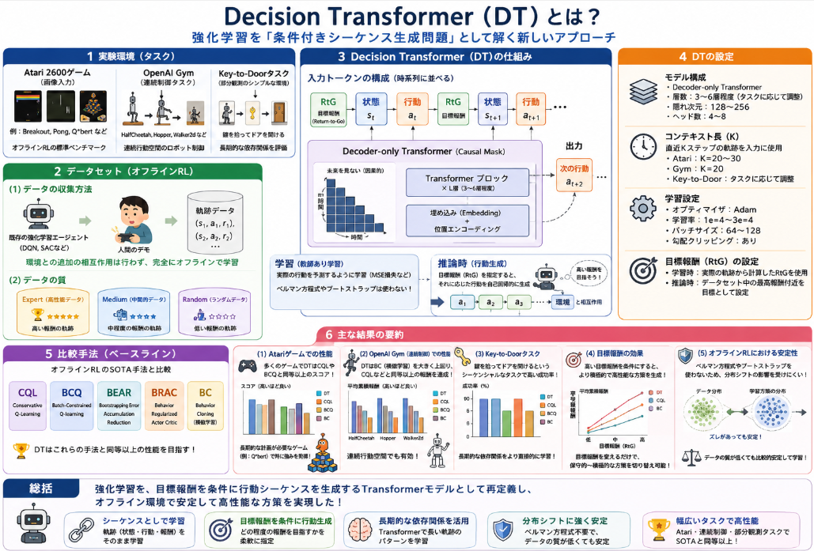

強化学習を進めてきましたが、学習の仕方はここのところMAPPOばかりでした。
ということで使えそうな手法がないかを探索していきたいと思います。

今日のテーマ：
>Decision Transformer（DT）というシーケンスを扱う強化学習手法について調べてみた。

## 概要

**Decision Transformer** は、強化学習を **「条件付きシーケンスモデリング」** として扱う、新しいアプローチの手法です。

以下に、その概要を整理します。

### 1. Decision Transformerの基本アイデア

__従来の強化学習との違い__
- 従来：環境と相互作用し、報酬を最大化するように方策を学習（Q学習、方策勾配など）。
- Decision Transformer：**過去の軌跡（状態・行動・報酬）をシーケンスとして学習し、目標報酬を条件として将来の行動を生成**。

__キーポイント__
- 強化学習を **「目標達成のためのシーケンス予測問題」** として再定義。
- Transformerを用いて、**過去の経験から直接行動を生成**する。

### 2. 入力と出力の構造

__入力シーケンス__
Decision Transformerへの入力は、以下のようなトークンのシーケンスです。

$$
\text{Input} = [R_0, s_0, a_0, R_1, s_1, a_1, \dots, R_t, s_t]
$$

- $ R_t $: 累積報酬（または目標報酬）
- $ s_t $: 状態
- $ a_t $: 行動

__出力__
- 次の行動 $ a_{t+1} $ を予測（分類 or 回帰）。

__重要な点__
- **報酬を「条件」として扱う**：
  - 例：「累積報酬を100以上にしたい」という目標を入力に与え、その目標を達成する行動を生成。

### 3. 学習の流れ（オフライン強化学習）

__(1) データ収集__
- 既存の方策（ランダムや既存アルゴリズム）で収集した軌跡データを使用。
- 各軌跡：$ (s_0, a_0, r_0, s_1, a_1, r_1, \dots) $

__(2) 目標報酬の計算__
- 各タイムステップでの**残りの累積報酬（Return-to-Go）** を計算。
  $$
  R_t = \sum_{k=t}^{T} r_k
  $$

__(3) シーケンスの構築__
- 入力：$ [R_0, s_0, a_0, R_1, s_1, a_1, \dots] $
- 出力：次の行動 $ a_{t+1} $

__(4) Transformerでの学習__
- 自己回帰的に行動を予測（GPTのようなNext-Token Prediction）。
- 損失関数：行動の予測誤差（クロスエントロピー or MSE）。

### 4. 推論（行動選択）の流れ

__(1) 目標の設定__
- 目標とする累積報酬 $ R_{\text{target}} $ を設定。
  - 例：迷路なら「10ステップ以内にゴールに到達する」など。

__(2) 初期入力__
- 初期入力：$ [R_{\text{target}}, s_0] $
- Transformerが最初の行動 $ a_0 $ を生成。

__(3) 環境ステップ__
- 行動 $ a_0 $ を実行し、報酬 $ r_0 $ と次状態 $ s_1 $ を得る。
- 残りの目標報酬を更新：$ R_1 = R_{\text{target}} - r_0 $

__(4) 次の入力__
- 新しい入力：$ [R_{\text{target}}, s_0, a_0, R_1, s_1] $
- Transformerが次の行動 $ a_1 $ を生成。

これを繰り返し、**目標報酬を達成する行動シーケンスを生成**します。

### 5. Decision Transformerの特徴

__(1) オフライン強化学習に強い__
- 既存のデータセットから直接学習できるため、**オンライン相互作用が不要**。
- 実世界のログデータなど、安全に収集されたデータを活用できる。

__(2) モデルベースではない__
- 環境のダイナミクス（状態遷移モデル）を明示的に学習しない。
- **軌跡の条件付き生成**として行動を決める。

__(3) 目標指向の行動生成__
- 目標報酬を入力として与えることで、**「どの程度の報酬を目指すか」を柔軟に指定**できる。
- 例：保守的な目標 vs 積極的な目標。

__(4) Transformerの強みを活用__
- 長い履歴を扱えるため、**複雑な依存関係**を学習可能。
- 大規模なデータセットで事前学習し、ファインチューニングも可能。

## 解決課題

**Decision Transformer（DT）が解決しようとした課題**は、主に以下の3つです。

### 1. オフライン強化学習における「分布シフト」問題

__課題__
- オフライン強化学習（Offline RL）では、**既存のデータセットだけ**を使って学習し、環境との追加の相互作用は行いません。
- しかし、従来の強化学習手法（Q学習、方策勾配など）は、**「学習中の方策が収集データと異なる」** 場合に、性能が大きく悪化します。
  - 例：データセットが保守的な方策で収集されているのに、学習中に積極的な方策を試すと、Q値の過大評価が起きる。
- これを**分布シフト（distribution shift）** と呼び、オフラインRLの大きな課題でした。

__Decision Transformerの解決策__
- DTは **「行動を直接生成するシーケンスモデル」** として設計されているため、Q値の推定や方策の更新を必要としません。
- 過去の軌跡データから**条件付きで行動を生成**するだけなので、分布シフトの影響を受けにくい。
- 結果として、**オフライン環境で安定して高性能な方策を学習**できるようになりました。

### 2. 強化学習の「報酬最大化」を、より直感的な「目標達成」として扱う

__課題__
- 従来の強化学習では、「報酬を最大化する」という抽象的な目的を、**ベルマン方程式や価値関数**を通じて間接的に扱います。
- これにより、**「どの程度の報酬を目指すか」を柔軟に指定しにくい**という問題がありました。

__Decision Transformerの解決策__
- DTは、**目標報酬（Return-to-Go）を明示的な入力**として与え、その目標を達成する行動を生成します。
- これにより、
  - 「高報酬を目指す積極的な方策」
  - 「安全を重視した保守的な方策」
  など、**目標を変えるだけで方策の性質を切り替えられる**ようになりました。
- 強化学習を **「目標達成のためのシーケンス生成」** として再定義した点が、大きな革新です。

### 3. 大規模な軌跡データを活用するための「シーケンスモデリング」アプローチ

__課題__
- 実世界のログデータやデモデータは、**長い時系列の軌跡**として蓄積されます。
- しかし、従来の強化学習手法は、これらのデータを**断片的な経験（state, action, reward, next_state）** として扱うことが多く、時系列の依存関係を十分に活用できませんでした。

__Decision Transformerの解決策__
- DTはTransformerを用いて、**過去の軌跡全体をシーケンスとして学習**します。
- これにより、
  - 長期的な依存関係
  - 複雑な行動パターン
  を直接モデル化できます。
- また、**大規模な事前学習**が可能になり、汎用的な行動生成モデルとしての応用も期待されています。

## 提案手法

Decision Transformer の**手法の詳細**を、論文の内容に沿って整理します。

### 1. 基本アイデア：RLを「シーケンスモデリング」として再定義

__従来のRLとの違い__
- 従来：ベルマン方程式や価値関数に基づき、**報酬最大化の方策**を学習。
- Decision Transformer：**過去の軌跡（状態・行動・報酬）をシーケンスとして学習**し、**目標報酬を条件**として将来の行動を生成。

__キーポイント__
- RLを **「条件付きシーケンス生成問題」** として扱う。
- Transformerを用いて、**行動を直接生成**する（Q値や方策勾配を介さない）。

### 2. 入力表現：Return-to-Go（RtG）トークン

__トークンの種類__
論文では、各タイムステップを以下の3種類のトークンで表現します。

1. **Return-to-Go（RtG）**: 残りの累積報酬（目標報酬）
2. **State（状態）**: 環境の観測（画像 or ベクトル）
3. **Action（行動）**: エージェントが取った行動

__Return-to-Go（RtG）の定義__
- 時刻 $ t $ におけるRtG $ R_t $ は、**その時点からエピソード終了までの累積報酬**です。
  $$
  R_t = \sum_{k=t}^{T} r_k
  $$
- 学習時：実際の報酬から計算。
- 推論時：**目標とする累積報酬**を指定（例：迷路なら「10ステップ以内にゴール」など）。

__シーケンスの構成__
入力シーケンスは以下のように並べます。

$$
[R_0, s_0, a_0, R_1, s_1, a_1, \dots, R_t, s_t]
$$

- 出力：次の行動 $ a_{t+1} $
- モデルは**自己回帰的**に行動を予測（GPTと同じ仕組み）。

### 3. モデルアーキテクチャ：Decoder-only Transformer

__アーキテクチャの概要__
- **Decoder-only Transformer**（GPT系）を使用。
- **Causal Mask（因果的マスク）** を適用し、未来の情報を見ないようにする。
- 各トークンは、**線形層＋位置エンコーディング**で埋め込まれる。

__トークン埋め込み__
- RtG、State、Actionの各トークンを**別々の線形層**で埋め込み、同じ次元に変換。
- その後、**位置エンコーディング**を加えてTransformerに入力。

__出力層__
- 最後のトークン（状態 $ s_t $ に対応する出力）から、**行動 $ a_{t+1} $ を予測**。
- 離散行動：Softmaxで確率分布を出力。
- 連続行動：平均・分散を出力（ガウス分布）し、サンプリング。

### 4. 学習方法：オフライン強化学習としての教師あり学習

__(1) データ収集（オフライン）__
- 既存の方策（ランダム、BC、他のRLアルゴリズムなど）で収集した**軌跡データ**を使用。
- 各軌跡：$ (s_0, a_0, r_0, s_1, a_1, r_1, \dots, s_T) $

__(2) RtGの計算__
- 各タイムステップでRtG $ R_t $ を計算。
  $$
  R_t = \sum_{k=t}^{T} r_k
  $$

__(3) シーケンスの構築__
- 入力：$ [R_0, s_0, a_0, R_1, s_1, a_1, \dots, R_t, s_t] $
- ターゲット：$ a_{t+1} $

__(4) 損失関数__
- **教師あり学習**として、行動の予測誤差を最小化。
- 離散行動：クロスエントロピー損失
- 連続行動：平均二乗誤差（MSE）または負の対数尤度

__重要な点__
- **ベルマン方程式やブートストラップは使用しない**。
- 単純な**シーケンス予測問題**として扱うため、学習が安定。

### 5. 推論（行動選択）の手順

__(1) 目標の設定__
- 目標とする累積報酬 $ R_{\text{target}} $ を設定。
  - 例：Atariなら「スコア1000点以上」、迷路なら「10ステップ以内にゴール」。

__(2) 初期入力__
- 初期入力：$ [R_{\text{target}}, s_0] $
- Transformerが最初の行動 $ a_0 $ を生成。

__(3) 環境ステップ__
- 行動 $ a_0 $ を実行し、報酬 $ r_0 $ と次状態 $ s_1 $ を得る。
- 残りの目標報酬を更新：$ R_1 = R_{\text{target}} - r_0 $

__(4) 次の入力__
- 新しい入力：$ [R_{\text{target}}, s_0, a_0, R_1, s_1] $
- Transformerが次の行動 $ a_1 $ を生成。

これを繰り返し、**目標報酬を達成する行動シーケンス**を生成します。

## 効果

Decision Transformer（DT）の**実験条件と結果**を、論文の内容に沿って説明します。

### 1. 実験環境（タスク）

論文では、以下の3種類の環境で評価しています。

1. **Atari 2600ゲーム**（画像入力）
   - 例：Breakout, Pong, Q*bert など
   - オフラインRLの標準ベンチマークとして使用。

2. **OpenAI Gymの連続制御タスク**（ベクトル状態）
   - HalfCheetah, Hopper, Walker2d
   - 連続行動空間を持つロボット制御タスク。

3. **Key-to-Doorタスク**（シンプルな部分観測環境）
   - 鍵を拾ってドアを開ける、というシーケンシャルなタスク。
   - 長期的な依存関係を評価。

### 2. データセット（オフラインRL）

__(1) データの収集方法__
- **既存の強化学習エージェント**（DQN, SACなど）や**人間のデモ**から収集した軌跡データを使用。
- 環境との追加の相互作用は行わず、**完全にオフライン**で学習。

__(2) データの質__
- **高パフォーマンスなデータ**（Expert）
- **ランダムなデータ**（Random）
- **中間的な性能のデータ**（Medium）
など、複数のデータセットを用意。

### 3. 比較手法（ベースライン）

論文では、以下の**オフラインRLのSOTA手法**と比較しています。

- **CQL** (Conservative Q-Learning)
- **BCQ** (Batch-Constrained Q-learning)
- **BEAR** (Bootstrapping Error Accumulation Reduction)
- **BRAC** (Behavior Regularized Actor Critic)
- **BC** (Behavior Cloning：単純な模倣学習)

DTは、これらの手法と**同等以上の性能**を目指しています。

### 4. 実験条件（DTの設定）

__(1) モデル構成__
- **Decoder-only Transformer**
- 層数：3〜6層程度（タスクに応じて調整）
- 隠れ次元：128〜256
- ヘッド数：4〜8

__(2) コンテキスト長（K）__
- **直近Kステップの軌跡**を入力に使用。
- Atari：K=20〜30
- Gym：K=20
- Key-to-Door：タスクに応じて調整

__(3) 学習設定__
- オプティマイザ：Adam
- 学習率：1e-4 〜 3e-4
- バッチサイズ：64〜128
- 勾配クリッピング：あり

__(4) 目標報酬（RtG）の設定__
- 学習時：実際の軌跡から計算したRtGを使用。
- 推論時：**データセット中の最高報酬付近**を目標として設定。

### 5. 主な結果の要約

__(1) Atariゲームでの性能__
- **Expertデータセット**では、DTは多くのゲームで**CQLやBCQと同等以上のスコア**を達成。
- **Mediumデータセット**でも、DTは安定して高性能を示し、**分布シフトの影響を受けにくい**ことが確認された。
- 特に、**長期的な計画が必要なゲーム**（例：Q*bert）で、DTのシーケンスモデリングの強みが発揮。

__(2) OpenAI Gym（連続制御）での性能__
- HalfCheetah, Hopper, Walker2dにおいて、DTは**BC（模倣学習）を大きく上回る性能**を示す。
- CQLなどのオフラインRL手法と比較しても、**同等またはそれ以上の報酬**を達成。
- 連続行動空間でも、**Transformerによる行動生成が有効**であることを示した。

__(3) Key-to-Doorタスク__
- 鍵を拾い、ドアを開けるという**シーケンシャルなタスク**で、DTは**高い成功率**を示す。
- 従来の価値ベース手法に比べ、**長期的な依存関係をより直接的に学習**できることが確認された。

__(4) 目標報酬の効果__
- **高い目標報酬を条件とした場合**、DTはより積極的で高性能な方策を生成。
- 目標報酬を変えるだけで、**保守的〜積極的な方策を切り替えられる**ことを実証。

__(5) オフラインRLにおける安定性__
- DTは**ベルマン方程式やブートストラップを使用しない**ため、分布シフトの影響を受けにくい。
- その結果、**データセットの質が低い場合でも比較的安定**して学習できる。

## 総括

**Decision Transformer（DT）** は、強化学習を **「条件付きシーケンス生成問題」** として扱う手法です。

### 1. 何をした手法か？（概要）

- 従来のRL：価値関数や方策勾配で「報酬最大化」を間接的に学習。
- DT：**過去の軌跡（状態・行動・報酬）をシーケンスとして学習**し、**目標報酬を条件**として行動を生成。
- 入力：`[目標報酬(RtG), 状態, 行動, 目標報酬, 状態, ...]`
- 出力：次の行動（自己回帰的に生成）

### 2. 何を解決したか？（課題）

1. **オフラインRLの分布シフト問題**  
   - 既存データと学習方策がズレると性能が悪化する問題を、**行動を直接生成するシーケンスモデル**として回避。

2. **報酬最大化の抽象性**  
   - 目標報酬（Return-to-Go）を明示的な入力にし、**「どの程度の報酬を目指すか」を柔軟に指定**できる。

3. **軌跡データの時系列依存関係の活用**  
   - Transformerで**長い軌跡をシーケンスとして学習**し、複雑な行動パターンを直接モデル化。

### 3. どう実現したか？（手法の核）

- **Return-to-Go（RtG）トークン**：残りの累積報酬（目標報酬）を入力に追加。
- **Decoder-only Transformer**：Causal Maskで未来を見ず、行動を自己回帰的に予測。
- **教師あり学習**：行動の予測誤差を最小化（ベルマン方程式やブートストラップ不使用）。
- 推論時：目標報酬を条件に、**行動シーケンスを生成**して環境と相互作用。

### 4. どんな結果が出たか？（実験）

- **Atariゲーム**・**OpenAI Gym（連続制御）**・**Key-to-Doorタスク**で評価。
- **オフラインRLのSOTA手法（CQL, BCQなど）と同等以上の性能**を達成。
- 特に、
  - **長期的な計画が必要なタスク**で強みを発揮。
  - **高目標報酬を条件**にすると、より高性能な方策を生成。
  - **データセットの質が低くても比較的安定**に学習。

### 5. 一言で言うと

**「強化学習を、目標報酬を条件に行動シーケンスを生成するTransformerモデルとして再定義し、オフライン環境で安定して高性能な方策を実現した」** 手法です。

## 引用論文

Decision Transformerを提案した**元論文**は、以下の通りです。

### 論文情報

- **タイトル**: Decision Transformer: Reinforcement Learning via Sequence Modeling  
- **著者**:  
  - Lili Chen  
  - Kevin Lu  
  - Aravind Rajeswaran  
  - Kimin Lee  
  - Aditya Grover  
  - Michael Laskin  
  - Pieter Abbeel  
  - Aravind Srinivas  
  - Igor Mordatch  
- **公開年**: 2021年  
- **arXiv ID**: 2106.01345  
- **公開場所**: arXiv preprint  

__引用元__

- arXiv論文ページ:  
  Decision Transformer: Reinforcement Learning via Sequence Modeling  
  [arXiv](https://arxiv.org/abs/2106.01345)

- 公式コードリポジトリ（GitHub）:  
  kzl/decision-transformer  
  [GitHub](https://github.com/kzl/decision-transformer)

- 公式プロジェクトページ（Berkeley）:  
  Decision Transformer: Reinforcement Learning via Sequence Modeling  
  [Berkeley Project Site](https://sites.google.com/berkeley.edu/decision-transformer)
