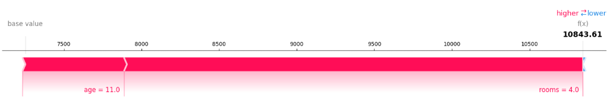
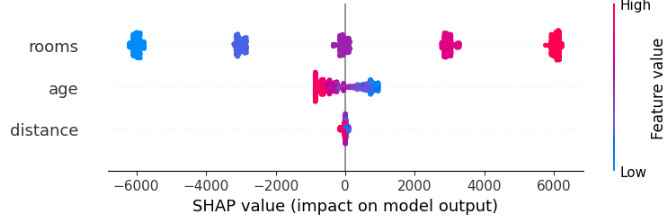

複数の因子と、影響を一覧表で結果を手に入れることは多いと思います。
いざ入手した後に、"じゃ、各因子の結果へのインパクトはどんくらい？"みたいなことを知りたくなるケースは多々あると思います。

今日はそんなケースに仕える **SHAP値**について扱っていきます。

本日テーマ：
>SHAP値による原理について説明し、例題を通して理解してみる

## 概要

SHAP値（SHapley Additive exPlanations）は、機械学習モデルの個々の予測に対して「各特徴量がどれだけ寄与したか」を公平に分配するための指標です。ゲーム理論の**シャープレイ値（Shapley value）** を機械学習の特徴量重要度に応用したものです。


### 1. 直感的なイメージ
- ある顧客の「ローン審査結果」をモデルが予測したとします。
- SHAP値を使うと、「年収が高いこと」が予測にどれだけプラスに働いたか、「過去の延滞回数」がどれだけマイナスに働いたか、といった**各特徴量の寄与度を数値で示す**ことができます。
- 特徴量ごとの寄与度を合計すると、その予測が「平均的な予測」からどれだけ離れているか（＝モデルの出力）になります。


### 2. なぜ「公平」なのか（シャープレイ値の考え方）
シャープレイ値は、協力ゲームで「各プレイヤーがどれだけ貢献したか」を公平に配分するための理論です。これを特徴量に当てはめると：

- 各特徴量を「プレイヤー」とみなす
- 特徴量の**あらゆる組み合わせ**（サブセット）でモデルを評価し、
- 「その特徴量が加わったときに、予測がどれだけ改善（または悪化）したか」を平均する

これにより、「他の特徴量と一緒に使われたときの貢献度」も考慮した、**公平な寄与度**が計算されます。


### 3. 代表的な使い方
- **局所的な説明（個別予測の説明）**  
  ある1件のデータについて、「なぜこの予測結果になったのか」を特徴量ごとに可視化します（例：年収が+0.3、延滞回数が−0.5など）。
- **グローバルな特徴量重要度**  
  全データのSHAP値を平均すると、「全体的にどの特徴量が予測に効いているか」がわかります。
- **相互作用の可視化**  
  2つの特徴量の組み合わせが予測にどう影響するか（例：年収が高くかつ年齢が高いと特に有利、など）を見ることができます。


### 4. メリット
- **理論的な一貫性**：シャープレイ値に基づくため、公平性・一貫性が理論的に保証されています。
- **モデル非依存**：決定木・ニューラルネット・線形モデルなど、多くのモデルに適用可能です。
- **直感的な解釈**：寄与度が「平均からの差分」として表されるため、人間が理解しやすいです。

### 5. 注意点
- **計算コストが高い**：特徴量が多いと、組み合わせの数が爆発的に増えるため、近似アルゴリズム（例：TreeSHAP、KernelSHAP）を使うことが多いです。
- **因果関係ではない**：SHAP値は「モデルがどう予測しているか」を説明するものであり、「現実世界の因果関係」を保証するものではありません。

### 6. まとめると
SHAP値は、**「どの特徴量が、どの程度、その予測に貢献したか」を公平に数値化する指標**です。ブラックボックスな機械学習モデルの判断根拠を理解するための、非常に強力なツールとして広く使われています。

## 算出法

SHAP値は、ゲーム理論の**シャープレイ値（Shapley value）** を機械学習の特徴量に適用したものです。  
ここでは、まずシャープレイ値の定義式を紹介し、それを「特徴量の寄与度」として解釈する形で説明します。

### 1. シャープレイ値の定義式

まず、ゲーム理論におけるシャープレイ値の定義です。

- プレイヤーの集合：$N = \{1, 2, \dots, n\}$（機械学習では「特徴量の集合」）
- 部分集合 $S \subseteq N$ に対する価値関数：$v(S)$（機械学習では「特徴量のサブセット $S$ を使ったときのモデルの予測値」）

プレイヤー $i$ のシャープレイ値 $\phi_i$ は次の式で定義されます：

$$
\phi_i = \sum_{S \subseteq N \setminus \{i\}} \frac{|S|! \, (n - |S| - 1)!}{n!} \left[ v(S \cup \{i\}) - v(S) \right]
$$

ここで：

- $S$：プレイヤー $i$ を含まないすべての部分集合
- $|S|$：集合 $S$ の要素数
- $v(S \cup \{i\}) - v(S)$：プレイヤー $i$ が加わったときの「価値の増加分」
- $\frac{|S|! \, (n - |S| - 1)!}{n!}$：その組み合わせが選ばれる確率（重み）

### 2. 機械学習への適用：SHAP値の定義

機械学習では、プレイヤーを「特徴量」に置き換えます。

- 特徴量の集合：$N = \{x_1, x_2, \dots, x_n\}$
- モデル：$f(x)$
- あるデータ点 $x$ について、特徴量 $i$ の SHAP値 $\phi_i$ は次のように定義されます：

$$
\phi_i = \sum_{S \subseteq N \setminus \{i\}} \frac{|S|! \, (n - |S| - 1)!}{n!} \left[ f(S \cup \{i\}) - f(S) \right]
$$

ここで：

- $f(S)$：特徴量のサブセット $S$ だけを使ってモデルを評価したときの「予測値」
- $f(S \cup \{i\}) - f(S)$：特徴量 $i$ を追加したことで予測値がどれだけ変化したか（＝特徴量 $i$ の**限界貢献**）

### 3. 直感的な意味

- **「あらゆる順序で特徴量を追加したときの、貢献度の平均」**  
  シャープレイ値は、「特徴量を1つずつ追加していく順序のすべてのパターン」を考え、その各順序で「その特徴量が加わった瞬間に予測がどれだけ変わったか」を平均したものです。
- **公平性**：  
  どの順序で特徴量を追加しても、その特徴量の貢献度が公平に評価されるように設計されています。

### 4. 実際の計算のイメージ

例として、特徴量が3つ（$x_1, x_2, x_3$）あるとします。

__特徴量 $x_1$ の SHAP値を計算する場合__

- 考えられる部分集合 $S$（$x_1$ を含まない）：
  - $S = \{\}$（空集合）
  - $S = \{x_2\}$
  - $S = \{x_3\}$
  - $S = \{x_2, x_3\}$

それぞれについて：

1. $S = \{\}$ のとき  
   - $f(S) = f(\{\})$：どの特徴量も使わないときの予測（通常は「平均予測」など）
   - $f(S \cup \{x_1\}) = f(\{x_1\})$：$x_1$ だけを使ったときの予測
   - 差分：$f(\{x_1\}) - f(\{\})$

2. $S = \{x_2\}$ のとき  
   - $f(S) = f(\{x_2\})$
   - $f(S \cup \{x_1\}) = f(\{x_1, x_2\})$
   - 差分：$f(\{x_1, x_2\}) - f(\{x_2\})$

3. $S = \{x_3\}$ のとき  
   - 同様に $f(\{x_1, x_3\}) - f(\{x_3\})$

4. $S = \{x_2, x_3\}$ のとき  
   - $f(\{x_1, x_2, x_3\}) - f(\{x_2, x_3\})$

これら4つの差分に、それぞれの $S$ に対応する重み（$\frac{|S|! (n-|S|-1)!}{n!}$）を掛けて合計すると、$x_1$ の SHAP値 $\phi_1$ が得られます。

### 5. 問題点と近似アルゴリズム

- **組み合わせ爆発**：  
  特徴量が $n$ 個あると、部分集合 $S$ の数は $2^{n-1}$ 個になります。$n$ が大きいと計算が現実的ではありません。
- **「特徴量のサブセット」でモデルを評価する方法**：  
  一部の特徴量だけを使うには、欠損している特徴量を何らかの方法で「埋める」必要があります（例：背景データの平均値で埋める、マスクするなど）。

そこで、実際には以下のような**近似アルゴリズム**が使われます：

- **Kernel SHAP**：  
  一部のサブセットだけをサンプリングし、線形回帰で SHAP値を近似します。
- **Tree SHAP**：  
  決定木系モデル（Random Forest, XGBoost など）専用の高速アルゴリズムで、組み合わせを効率的に計算します。


## 例題

実際にSHAP値がどのように機能しているかを確認するため例題を扱ってみます。
ここでは、**「住宅価格を予測する決定木モデル」** を例に、Tree SHAPを使って「どの特徴量が予測にどれだけ効いたか」を可視化するPythonコード例を示します。

### 1. 準備：データとモデルの作成

まず、簡単なシミュレーションデータを作ります。

```python
import numpy as np
import pandas as pd
from sklearn.tree import DecisionTreeRegressor
import shap

# 乱数シードを固定
np.random.seed(42)

# サンプル数
n_samples = 1000

# 特徴量：部屋数、築年数、駅からの距離
rooms = np.random.randint(1, 6, n_samples)        # 1〜5部屋
age = np.random.randint(0, 50, n_samples)          # 築0〜49年
distance = np.random.uniform(0.1, 5.0, n_samples)  # 駅からの距離（km）

# 住宅価格（目的変数）を生成
# 部屋数が多いほど高く、築年数が古いほど安く、駅に近いほど高い、という単純な関係
price = (
    3000 * rooms
    - 50 * age
    - 200 * distance
    + np.random.normal(0, 100, n_samples)  # ノイズ
)

# DataFrameにまとめる
df = pd.DataFrame({
    "rooms": rooms,
    "age": age,
    "distance": distance,
    "price": price
})

X = df[["rooms", "age", "distance"]]
y = df["price"]
```

### 2. 決定木モデルの学習

```python
# 決定木モデルを学習
model = DecisionTreeRegressor(max_depth=4, random_state=42)
model.fit(X, y)

# 予測精度の確認（簡易）
print("R^2 score:", model.score(X, y))
```

### 3. Tree SHAP の計算

`shap.TreeExplainer` を使って SHAP値を計算します。

```python
# TreeExplainer の作成
explainer = shap.TreeExplainer(model)

# 全データの SHAP値を計算
shap_values = explainer.shap_values(X)

# 1件目のデータについて見てみる
sample_idx = 0
print("1件目のデータ:")
print(X.iloc[sample_idx])
print("実際の価格:", y.iloc[sample_idx])
print("モデルの予測:", model.predict(X.iloc[sample_idx:sample_idx+1])[0])
print("ベースライン（平均予測）:", explainer.expected_value)
print("SHAP値（rooms, age, distance の順）:", shap_values[sample_idx])
print("SHAP値の合計 + ベースライン = 予測値:",
      explainer.expected_value + shap_values[sample_idx].sum())
```

出力結果：

```
1件目のデータ:
rooms        4.000000
age         11.000000
distance     4.852569
Name: 0, dtype: float64
実際の価格: 10652.737694763384
モデルの予測: 10843.612035654687
ベースライン（平均予測）: [7251.13507144]
SHAP値（rooms, age, distance の順）: [2957.01497369  654.08171206  -18.61972154]
SHAP値の合計 + ベースライン = 予測値: [10843.61203565]
```

この例では：

- ベースライン（平均予測）が 7251.1
- `rooms=4` が予測を **+2957.0** 押し上げた
- `age=11` が予測を **+654.1** 押し上げた
- `distance=4.9` が予測を **−18.6** 押し下げた
- 合計：7251.1 + 2957.0 + 654.1 − 18.6 = 10843.6（モデルの予測値）

このように、**各特徴量がどれだけ予測に寄与したか**が一目で分かります。

### 4. 可視化で効果を確認

__(1) 個別予測の説明（force plot）__

```python
# 1件目のデータのSHAP値を可視化
shap.force_plot(
    explainer.expected_value,
    shap_values[sample_idx],
    X.iloc[sample_idx],
    matplotlib=True
)
```

- ベースラインから右に伸びるほど「価格が高い方向」、左に伸びるほど「安い方向」です。
- `rooms` が右向き（プラス寄与）、`age` と `distance` が左向き（マイナス寄与）として表示されます。



__(2) 全体的な特徴量重要度（summary plot）__

```python
# 全データのSHAP値をまとめて可視化
shap.summary_plot(shap_values, X)
```

- 各点は1件のデータに対応します。
- 横軸：SHAP値（予測への影響の大きさ）
- 色：特徴量の値（青：小、赤：大）
- 例：
  - `rooms` が大きい（赤）ほど右側（価格が高い方向）に分布
  - `age` が大きい（赤）ほど左側（価格が安い方向）に分布
  - `distance` が大きい（赤）ほど左側（価格が安い方向）に分布

これにより、**「部屋数が多いと価格が上がる」「築年数が古い・駅から遠いと価格が下がる」** という関係が、SHAP値として視覚的に確認できます。



### 5. 例題のポイント

- データ生成の式が単純なため、**「部屋数が増えると価格が上がる」** などの関係が明確です。
- Tree SHAP を使うことで、その関係が **「予測への寄与度」として数値・グラフで表現** されます。
- 1件ごとの説明（局所）と、全体の傾向（グローバル）の両方が見られます。

## まとめ

これまでの内容をまとめると、以下のようになります。

### 1. SHAP値とは

- **定義**：ゲーム理論のシャープレイ値を機械学習に応用した指標で、**「各特徴量が予測にどれだけ寄与したか」を公平に数値化**したもの。
- **直感的な意味**：
  - 特徴量を1つずつ追加していく「あらゆる順序」を考え、
  - その特徴量が加わった瞬間に予測がどれだけ変化したか（限界貢献）を平均した値。
- **性質**：
  - 特徴量ごとの寄与度を合計すると、「平均予測」からの差分（＝モデルの出力）になる。
  - モデル非依存で、理論的に公平な説明が可能。

### 2. SHAP値の算出方法（理論）

- **シャープレイ値の定義式**：
  $$
  \phi_i = \sum_{S \subseteq N \setminus \{i\}} \frac{|S|! \, (n - |S| - 1)!}{n!} \left[ v(S \cup \{i\}) - v(S) \right]
  $$
  - $S$：特徴量 $i$ を含まない部分集合
  - $v(S)$：特徴量のサブセット $S$ を使ったときのモデルの予測値
  - 右辺の差分：特徴量 $i$ を追加したときの「予測の変化量」
- **機械学習への適用**：
  - プレイヤー → 特徴量
  - 価値関数 → モデルの予測関数
  - 各特徴量の SHAP値 $\phi_i$ は、その特徴量が加わったときの予測の改善（悪化）を、すべての組み合わせで重み付き平均したもの。

### 3. Tree SHAPを使った例題（住宅価格予測）

__目的__
- Tree SHAP を使って、**「どの特徴量が予測にどれだけ効いたか」を可視化**する。

__手順の概要__
1. **データ生成**  
   - 特徴量：部屋数、築年数、駅からの距離  
   - 目的変数：住宅価格（部屋数が多いほど高く、築年数が古いほど安く、駅に近いほど高い、という単純な関係）
2. **決定木モデルの学習**  
   - `DecisionTreeRegressor` で住宅価格を予測するモデルを構築。
3. **Tree SHAP の計算**  
   - `shap.TreeExplainer` で SHAP値を計算。
   - 1件のデータについて、ベースライン（平均予測）と各特徴量の SHAP値を確認。
   - 例：ベースライン 7500 + rooms(+800) + age(−200) + distance(−450) = 予測値 8650
4. **可視化**  
   - **force plot**：1件の予測について、各特徴量がベースラインをどれだけ押し上げ／下げたかを表示。
   - **summary plot**：全データの SHAP値をまとめ、特徴量ごとの影響の方向と大きさを可視化。

__得られる効果__
- モデルが「部屋数が多いと価格が上がる」「築年数が古い・駅から遠いと価格が下がる」と判断していることが、**SHAP値として数値・グラフで明確に確認できる**。
- 個別の予測（局所）と全体の傾向（グローバル）の両方を説明可能。

### 4. まとめ

- SHAP値は、**ブラックボックスなモデルの判断根拠を「特徴量ごとの寄与度」として説明する強力なツール**です。
- Tree SHAP は決定木系モデル専用の高速アルゴリズムで、実務でも広く使われています。
- 例題を通じて、SHAP値が「どの特徴量が、どの方向に、どれだけ効いたか」を直感的に理解できることが確認できます。
