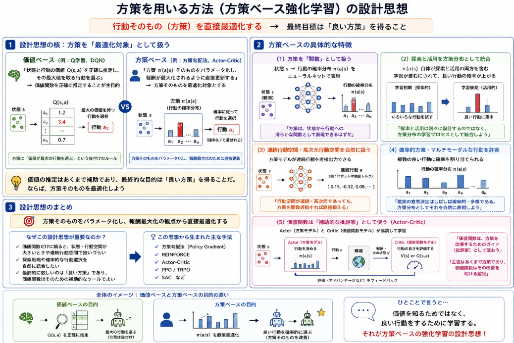

本日は強化学習で著者が説明をすっ飛ばした強化学習の概念に関するものです。

強化学習を行う上でエージェントは定義された環境の中で行動を選択・実行します。
この行動の良し悪しに対して、報酬で評価を行い、エージェントは行動と報酬をセットで学習することで、よりよい行動を学んでいきます。

この **定義された環境の中で行動を選択・実行** という中で機能するのが方策モデルです。

本日テーマ：
>方策モデルとは何かについて説明してみた

## 方策とは

強化学習における**方策モデル（policy model）** とは、**エージェントが「ある状態でどの行動を選ぶべきか」を直接決める関数（またはその近似モデル）** のことです。

もう少し詳しく説明します。

### 1. 方策（ポリシー）とは

強化学習では、エージェントが環境と相互作用しながら報酬を最大化するように行動を学習します。

- **状態（state）**：エージェントが置かれている状況（例：ゲームの盤面、ロボットの姿勢）
- **行動（action）**：エージェントが取りうる選択肢（例：上下左右に動く、アクセルを踏む）

**方策（policy）** とは、  
「状態 $ s $ が与えられたときに、どの行動 $ a $ をどれくらいの確率で選ぶか」を表すルールです。  
数学的には、確率分布 $ \pi(a|s) $ として書かれることが多いです。

### 2. 方策モデルとは

**方策モデル**は、この方策 $ \pi(a|s) $ を**近似するためのモデル**です。

- ニューラルネットワークや線形関数など、パラメータを持つ関数
- 入力：状態 $ s $
- 出力：行動の確率分布（あるいは、決定的な行動そのもの）

例：
- 状態を画像として入力し、各行動（「上」「下」「左」「右」）の選択確率を出力するニューラルネット
- ロボットのセンサー値を入力し、各関節の目標角度を出力する関数

### 3. 価値関数モデルとの違い

強化学習には、もう一つ重要な概念として**価値関数（value function）** があります。

- **価値関数モデル**：  
  「状態 $ s $ で行動 $ a $ を取ったとき、将来どれくらいの報酬が期待できるか」を推定するモデル  
  → 行動の「良さ」を評価する役割

- **方策モデル**：  
  「状態 $ s $ でどの行動 $ a $ を選ぶべきか」を直接決めるモデル  
  → 行動そのものを決める役割

多くのアルゴリズムでは、
- 価値関数を学習して、その評価に基づいて方策を改善する（例：Q学習）
- 方策モデルを直接学習して、報酬が高くなるようにパラメータを更新する（例：方策勾配法）

という形で、両者を組み合わせて使います。

### 4. 代表的な方策モデルの使い方

- **方策勾配法（Policy Gradient）**  
  方策モデルのパラメータを、報酬が増える方向に直接更新します。

- **Actor-Critic（アクター・クリティック）**  
  - **Actor（方策モデル）**：どの行動を取るかを決める
  - **Critic（価値関数モデル）**：その行動の良さを評価する  
  両方のモデルを同時に学習します。

- **決定論的方策（Deterministic Policy）**  
  状態 $ s $ に対して一意の行動 $ a $ を出力する方策モデル（例：DDPG）。

## 方策モデルが必要となった理由

方策モデルが「必要になってきた」背景は、ざっくり言うと **「価値関数だけに頼る手法では、現実的な問題を解くのが難しくなってきたから」** です。

もう少し分解して、**方策モデルがなかった段階での課題**を整理します。

### 1. 方策モデルがなかった時代の代表的な手法：価値ベースの手法

強化学習の初期からよく使われていたのは、主に以下のような**価値関数ベースの手法**でした。

- **Q学習（Q-learning）**
- **SARSA**
- **価値反復（Value Iteration）**
- **方策反復（Policy Iteration）**（※厳密には方策も扱いますが、表形式が前提）

これらは、**状態 $ s $ と行動 $ a $ のペアに対する価値 $ Q(s,a) $ を推定**し、「その時点で最も価値の高い行動を選ぶ」という**貪欲方策（greedy policy）** に基づいて行動を決めます。

### 2. 方策モデルがなかった段階での主な課題

__(1) 状態空間・行動空間が大きいと表形式では扱えない__

- 初期の価値ベース手法は、**状態と行動をすべてテーブル（表）で表現**する前提でした。
- 例：状態が $ 10^6 $ 通り、行動が $ 10 $ 通り → $ Q(s,a) $ の表は $ 10^7 $ エントリ必要
- 現実のタスク（画像入力、連続状態など）では、状態数はほぼ無限に近く、**テーブルではメモリも計算量も爆発**します。
  → **関数近似（ニューラルネットなど）で $ Q(s,a) $ を近似**する必要が出てきましたが、  
  それでも「どの行動をどれくらいの確率で選ぶか」を直接扱うのは難しく、多くの場合「最大価値の行動を選ぶ」だけになってしまいます。

__(2) 連続な行動空間にうまく適用できない__

- Q学習などは、**行動 $ a $ を離散的に列挙**する前提です。
- しかし、ロボット制御や自動運転などでは、  
  アクセル・ブレーキ・ステアリングなど**行動が連続値**です。
- 連続行動を無理やり離散化すると：
  - 分解能を細かくすると行動数が爆発
  - 分解能を粗くすると制御が不正確
- 価値関数 $ Q(s,a) $ を「すべての連続行動 $ a $ について評価して最大を探す」のは計算量的に現実的ではありません。
  → **方策モデルを使えば、「状態 → 連続行動」を直接出力**できるので、この問題を回避できます。

__(3) 探索と活用のバランスを柔軟に扱いにくい__

- Q学習などは、基本的に「価値が最大の行動を選ぶ（活用）」か、あるいは「ε-greedy でランダムに行動する（探索）」という**単純な方策**に頼ります。
- しかし、現実のタスクでは：
  - ある状態では大胆に探索したい
  - 別の状態では安全に活用したい
  - 行動の確率分布自体を学習したい
- といった**柔軟な方策**が必要になることが多いです。
- 価値関数だけでは「どの行動をどれくらいの確率で選ぶか」を**直接制御する仕組みが弱い**ため、探索戦略を細かく設計するのが難しい場面があります。

__(4) 確率的方策・マルチモーダルな行動が必要なタスク__

- 一部のタスクでは、**同じ状態でも複数の良い行動があり得る**（マルチモーダル）場合があります。
  - 例：サッカーで「シュートする」か「パスする」か、どちらも状況によっては正解
- Q学習のような「最大価値の行動だけを選ぶ」手法では、こうした**確率的な方策やマルチモーダルな行動分布**を自然に表現できません。
- 方策モデルは、**行動の確率分布 $ \pi(a|s) $ を直接出力**できるので、こうしたタスクに適しています。

__(5) 価値関数の近似誤差に敏感__

- 深層Qネットワーク（DQN）などでは、**価値関数 $ Q(s,a) $ をニューラルネットで近似**します。
- しかし、価値関数の推定が少しずれると：
  - 選ばれる行動が大きく変わる
  - 学習が不安定になる
- 方策モデルを使う手法（方策勾配、Actor-Critic）では、**方策そのものを滑らかに更新**できるため、価値関数の推定誤差の影響をある程度吸収しやすくなります。

### 3. 方策モデルが解決するポイント（対比）

| 課題（方策モデルなし） | 方策モデルがあるとどう変わるか |
|------------------------|--------------------------------|
| 状態・行動空間が大きくてテーブルが使えない | ニューラルネットなどで**方策を直接近似**できる |
| 連続行動空間に適用しづらい | **状態 → 連続行動**を直接出力できる |
| 探索戦略を柔軟に設計しにくい | 方策分布そのものを学習し、**探索と活用を同時に最適化**できる |
| マルチモーダルな行動を表現しにくい | **確率的方策**として複数の行動を同時に扱える |
| 価値関数の誤差に敏感 | 方策を滑らかに更新することで**安定性が向上**する |

## 設計思想

方策を用いる方法（方策ベースの強化学習）の設計思想は、ざっくり言うと

> **「行動そのもの（方策）を直接最適化する」**

という発想に基づいています。

もう少し分解して、設計思想のポイントを整理します。

### 1. 設計思想の核：方策を「最適化対象」として扱う

__(1) 価値ベース vs 方策ベースの違い__

- **価値ベース（例：Q学習、DQN）**  
  - 設計思想：  
    「状態と行動の価値 \( Q(s,a) \) を正確に推定し、その最大値を取る行動を選ぶ」  
    → **価値関数を正確に推定することが主目的**
  - 方策は、基本的に「価値が最大の行動を選ぶ」という**後付けのルール**です。

- **方策ベース（例：方策勾配法、Actor-Critic）**  
  - 設計思想：  
    「方策 \( \pi(a|s) \) そのものをパラメータ化し、報酬が最大化されるように直接更新する」  
    → **方策そのものを最適化対象とする**

つまり、方策ベースの設計思想は、

> 「価値の推定はあくまで補助であり、最終的な目的は『良い方策』を得ることだ。ならば、方策そのものを最適化しよう」

という発想です。

### 2. 設計思想の具体的な特徴

__(1) 方策を「関数」として扱う__

- 方策モデル（ニューラルネットなど）で  
  **状態 \( s \) → 行動の確率分布 \( \pi(a|s) \)** を表現します。
- 設計思想：
  - 「方策は、状態から行動への**滑らかな関数**として表現できるはずだ」
  - 「その関数のパラメータを、報酬に基づいて直接調整しよう」

__(2) 探索と活用を「方策分布」として統合__

- ε-greedy のような**外付けの探索戦略**ではなく、
  - 方策分布 \( \pi(a|s) \) 自体が**探索と活用の両方を含む**
  - 学習が進むにつれて、良い行動の確率が高まり、悪い行動の確率が下がる
- 設計思想：
  - 「探索と活用は別々に設計するのではなく、**方策分布の学習プロセスとして統合**しよう」

__(3) 連続行動空間・高次元行動空間を自然に扱う__

- 価値ベースでは、連続行動を扱うために
  - 行動を離散化する
  - あるいは、\( Q(s,a) \) を最大化する \( a \) を数値最適化で求める
- 方策ベースでは、
  - 方策モデルが**連続行動を直接出力**できる
  - 例：ロボット制御で「関節トルク」や「目標速度」を連続値として出力
- 設計思想：
  - 「行動空間が連続・高次元であっても、**方策を関数近似すれば直接扱える**」

__(4) 確率的方策・マルチモーダルな行動を許容__

- 価値ベースでは、多くの場合「最大価値の行動」を選ぶため、
  - 同じ状態で複数の良い行動がある場合（マルチモーダル）でも、  
    そのうち1つしか選ばれない
- 方策ベースでは、
  - 方策分布 \( \pi(a|s) \) が**複数の行動に確率を割り当てる**ことができる
  - 状況に応じて、複数の「良い行動」を確率的に使い分けられる
- 設計思想：
  - 「現実の意思決定はしばしば確率的・多様である。  
     方策分布としてそれを**自然に表現**しよう」

__(5) 価値関数は「補助的な批評家」として使う（Actor-Critic）__

- Actor-Critic では、
  - **Actor（方策モデル）**：行動を決める
  - **Critic（価値関数モデル）**：その行動の良さを評価する
- 設計思想：
  - 「価値関数は、方策を改善するための**ガイド（批評家）**として使おう」
  - 「主役はあくまで方策であり、価値関数はその改善を助ける脇役」

### 3. 設計思想のまとめ

方策を用いる方法の設計思想を一言でまとめると、

> **「方策そのものをパラメータ化し、報酬最大化の観点から直接最適化する」**

という考え方です。

その背景には、

- 価値関数だけに頼ると、  
  状態・行動空間が大きいときや連続行動空間で扱いづらい
- 探索戦略や確率的な行動選択を**自然に統合したい**
- 最終的に欲しいのは「良い方策」であり、  
  価値関数はそのための**補助的なツール**でよい

という問題意識があります。

この設計思想に基づいて、  
方策勾配法や Actor-Critic といった現代の深層強化学習の主要な枠組みが発展してきました。

## 現在の強化学習
ここまで方策モデルについて説明していきました。
では方策モデルは現在の強化学習でどの程度使われているのでしょうか？

その答えは、現在の強化学習では「方策モデルだけ」「価値モデルだけ」という純粋な一方が主流というより、**両者を組み合わせた Actor-Critic（アクター・クリティック）系の手法が主流**です。

もう少し詳しく整理します。

### 1. 現在の主流：Actor-Critic（方策＋価値のハイブリッド）

2024年以降の強化学習の実用現場では、

- **Actor（方策モデル）**：どの行動を取るかを決める
- **Critic（価値モデル）**：その行動の良さを評価する

という**Actor-Critic アプローチ**が標準的な位置づけになっています[AI総研](https://www.ai-souken.com/article/what-is-reinforcement-learning)。

代表的なアルゴリズムとしては：

- **PPO（Proximal Policy Optimization）**
- **A3C / A2C（Asynchronous Advantage Actor-Critic）**
- **SAC（Soft Actor-Critic）**
- **TD3（Twin Delayed DDPG）**
- **DDPG（Deep Deterministic Policy Gradient）**

などが挙げられ、いずれも**方策モデルと価値モデルの両方を使う**設計になっています。

### 2. なぜ「どちらか一方」ではなく「両方」が主流なのか

__(1) 純粋な価値ベース（例：DQN）の限界__

- DQN のような**純粋な価値ベース手法**は、
  - 離散行動空間のゲーム（Atari など）では非常に強力ですが、
  - 連続行動空間（ロボット制御など）にはそのままでは適用しづらい
  - 探索戦略や確率的方策を柔軟に設計しにくい
- そのため、**「価値関数だけ」に頼る手法は、汎用的な主流としては後退**しています。

__(2) 純粋な方策ベース（例：REINFORCE）の限界__

- REINFORCE のような**純粋な方策勾配法**は、
  - 方策モデルだけを更新するため、学習が不安定でサンプル効率が悪い
  - 各行動の「相対的な良さ」を評価する仕組みが弱い
- そのため、**価値モデル（Critic）を導入して安定性と効率を上げる**方向に進化しました。

__(3) Actor-Critic のメリット__

- Actor（方策モデル）が「行動を決める」
- Critic（価値モデル）が「その行動の良さを評価する」
- これにより、
  - 連続行動空間にも自然に適用できる
  - 探索と活用を方策分布として統合できる
  - 学習が比較的安定し、サンプル効率も高い

というバランスの良さから、**実用アルゴリズムの多くが Actor-Critic 系**になっています[AI総研](https://www.ai-souken.com/article/what-is-reinforcement-learning)。

### 3. LLM時代の新しい動き：GRPO など「価値モデルを省く」流れ

一方で、**大規模言語モデル（LLM）の推論強化**の分野では、少し異なる流れも出てきています。

- **GRPO（Group Relative Policy Optimization）**  
  - DeepSeek-R1 などで採用された手法
  - PPO から**価値関数（Critic）の学習を省き**、  
    グループ内の相対評価だけで方策を更新する
  - メモリ効率と学習安定性を両立させた新しい方策最適化手法と位置づけられています[AI総研](https://www.ai-souken.com/article/what-is-reinforcement-learning)。

- **DAPO** など、GRPO をさらに発展させた手法も提案されています。

これらは「価値モデルを省いた方策最適化」であり、  
**LLMの推論訓練という特定の文脈では、方策ベースの手法が再び注目されている**と言えます。

ただし、一般的な強化学習全体で見ると、  
**PPO をはじめとする Actor-Critic 系が依然として標準的な基盤**であり、  
GRPO のような手法はその上での「効率化・特殊化」の流れと捉えるのが適切です。

### 4. 総括

- **現在の強化学習の主流**：
  - **Actor-Critic（方策モデル＋価値モデル）**が標準
  - PPO、A3C、SAC、TD3 などが代表例[AI総研](https://www.ai-souken.com/article/what-is-reinforcement-learning)。

- **純粋な価値ベース（DQN など）**：
  - 特定のタスク（離散行動のゲームなど）では依然として重要ですが、  
    汎用的な主流としては後退。

- **純粋な方策ベース（REINFORCE など）**：
  - 理論的には重要ですが、実用では Actor-Critic に進化。

- **LLMの推論強化（GRPO など）**：
  - 価値モデルを省いた**方策最適化**が新しいトレンドとして台頭しているが、  
    強化学習全体としては、依然として Actor-Critic 系が基盤。

したがって、「方策モデル vs 価値モデル」という二者択一ではなく、 
**「方策モデルと価値モデルを組み合わせた Actor-Critic が主流」** と理解するのが、現在の強化学習の実情に近いです。

