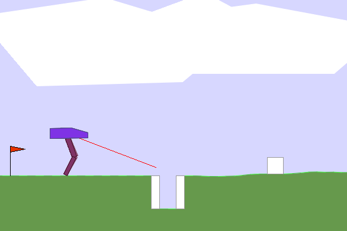
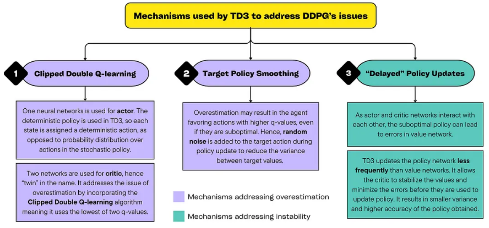
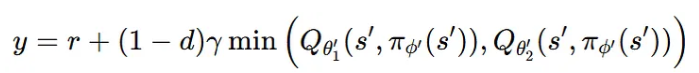
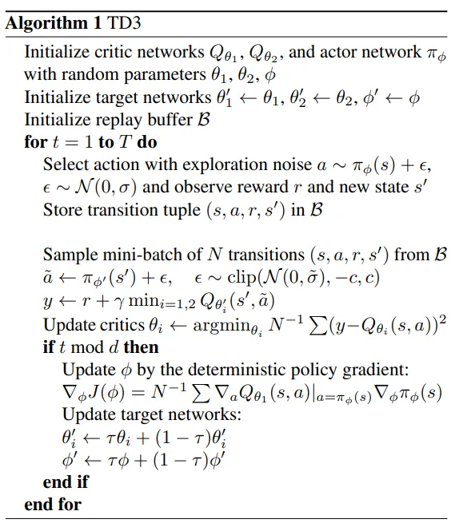
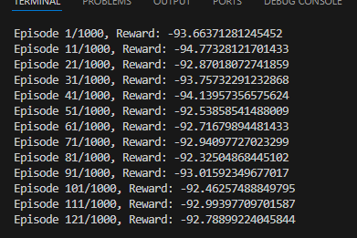

## 目的


## ランダム操作
とりあえず動作確認。


## この問題の特徴
BipedalWalkerHardcoreは、連続値の行動空間を持つ高難易度のロボティクス環境であり、ノイズや不安定さ、複雑な報酬設計が特徴です。
- 連続値の行動空間
- ノイズや不安定さ
- 複雑な報酬設計

## 強化学習フレームワークの検討

そのため、以下の強化学習アルゴリズムが有力です。


### 1. **Proximal Policy Optimization (PPO)**
**選定理由:**  
- サンプル効率が高く、安定した学習が可能。
- 連続制御タスクで実績が多く、BipedalWalkerHardcoreでも多くの成功例が報告されています。
- ハイパーパラメータの調整が比較的容易で、実装も豊富。

---

### 2. **Soft Actor-Critic (SAC)**
**選定理由:**  
- 最大エントロピー強化学習により、探索性が高く、多様な状況での学習が安定。
- サンプル効率が高く、ノイズの多い環境でもロバストに学習できる。
- 連続行動空間のタスクで最先端の性能を発揮している。

---

### 3. **Twin Delayed DDPG (TD3)**
**選定理由:**  
- DDPGの改良版で、過推定バイアスを抑制し、より安定した学習が可能。
- 連続制御タスクでPPOやSACと並ぶ高い性能を示している。
- ノイズ耐性が高く、BipedalWalkerHardcoreのような難易度の高い環境にも適している。

---

### 4. **Deep Deterministic Policy Gradient (DDPG)**
**選定理由:**  
- 連続行動空間に特化したアクター・クリティック型アルゴリズム。
- 探索ノイズの導入や経験再生バッファによる効率的な学習が可能。
- TD3の登場以降はやや古典的だが、十分な性能を発揮できる。

---

### 5. **Distributed Distributional DDPG (D4PG)**
**選定理由:**  
- DDPGを分散並列化し、分布的価値推定を導入した発展型。
- 大規模並列学習と分布的強化学習による高い性能。
- より複雑な環境や大規模なタスクにも適用可能。

今回TD3を学習したことがないのでTD3を実装する。

## TD3とは
TD3（Twin Delayed Deep Deterministic Policy Gradient）は、連続行動空間を持つ環境における強化学習のためのオフポリシー型アクター・クリティックアルゴリズムです。2018年に発表され、DDPG（Deep Deterministic Policy Gradient）の改良版として知られています。

### TD3の特徴
#### 1. 過大評価バイアスの抑制
DDPGでは、Q関数（価値関数）の推定が過大になる傾向（過大評価バイアス）があり、学習が不安定になることがありました。TD3では、2つの独立したQネットワーク（クリティック）を用意し、2つのQ値のうち小さい方をターゲット値として使用することで、過大評価を抑制します。

#### 2. ターゲットポリシーのスムージング
ターゲット値を計算する際、ターゲットアクションに小さなノイズを加えてスムージングします。これにより、値関数の過学習や過剰な鋭敏さを防ぎます。

#### 3. 遅延更新（Delayed Policy Updates）
アクターネットワーク（ポリシー）の更新頻度をクリティックよりも遅くします。これにより、より安定した価値推定のもとでポリシーが更新され、学習が安定します。

### TD3の基本的な流れ
1. 2つのクリティックネットワークでQ値を計算。
2. ターゲットアクションにノイズを加えてスムージング。
3. ターゲットQ値は2つのクリティックの小さい方を利用。
4. アクター（ポリシー）ネットワークは遅延して更新。




https://medium.com/@joanna.z.gryczka/td3-tutorial-and-implementation-682f16b56699




1. The algorithm also uses the Replay Buffer, a data structure where past experiences are stored, allowing the agent to learn from its history.
It has various important advantages: increased speed of learning, reduced correlation between experiences, and reduced chance of catastrophic forgetting by reusing past experiences.
2. TD3 is model-free, which means that the agent learns the best policy directly from the interactions with environment. Consequently, it does not require knowledge of environment’s dynamics.



run training!!




あなたのコードはすでにTD3（Twin Delayed Deep Deterministic Policy Gradient）に近い構成ですが、**重要なTD3の特徴**が抜けていたり、誤りがいくつか含まれています。  
以下のポイントを踏まえて、**本格的なTD3アルゴリズム**に修正したコードを提示します。

---

## TD3の主な特徴
1. **アクター・クリティック両方にターゲットネットワークを持つ**
2. **クリティックは2つ（ツイン）**
3. **ターゲットアクションにノイズを加える（ターゲットポリシースムージング）**
4. **アクターの更新頻度はクリティックより遅い（delayed policy update）**
5. **ターゲットネットワークはsoft update（Polyak averaging）**

---

## 修正版コード

```python
import os
import torch
import numpy as np
from agent import Actor, Critic, ReplayBuffer
from environment import Environment
import torch.nn.functional as F
import copy

class Trainer:
    def __init__(self, state_dim, action_dim, max_action, min_action):
        self.env = Environment(is_train=True)
        state_dim, action_dim = self.env.get_dimensions()
        self.actor = Actor(state_dim, action_dim, max_action)
        self.actor_target = copy.deepcopy(self.actor)
        self.critic = Critic(state_dim, action_dim)
        self.critic_target = copy.deepcopy(self.critic)

        self.max_action = max_action
        self.min_action = min_action
        self.replay_buffer = ReplayBuffer(size_max=1000000, batch_size=64)
        self.actor_optimizer = torch.optim.Adam(self.actor.parameters(), lr=1e-3)
        self.critic_optimizer = torch.optim.Adam(self.critic.parameters(), lr=1e-3)
        self.total_it = 0

    def save_models(self):
        self.actor.save()
        self.critic.save()

    def select_action(self, state, noise=0.1):
        state = torch.FloatTensor(state.reshape(1, -1)).to(self.actor.device)
        action = self.actor(state).detach().cpu().numpy()[0]
        if noise != 0:
            action = action + np.random.normal(0, noise, size=action.shape)
        return np.clip(action, self.min_action, self.max_action)

    def train_once(self, batch_size=64, gamma=0.99, tau=0.005, policy_noise=0.2, noise_clip=0.5, policy_freq=2):
        if len(self.replay_buffer) < batch_size:
            return

        self.total_it += 1

        # サンプル
        state, action, reward, next_state, done = self.replay_buffer.sample()
        state = torch.FloatTensor(state).to(self.actor.device)
        action = torch.FloatTensor(action).to(self.actor.device)
        reward = torch.FloatTensor(reward).unsqueeze(1).to(self.actor.device)
        next_state = torch.FloatTensor(next_state).to(self.actor.device)
        done = torch.FloatTensor(done).unsqueeze(1).to(self.actor.device)

        # ターゲットアクションにノイズを加える（ターゲットポリシースムージング）
        noise = (torch.randn_like(action) * policy_noise).clamp(-noise_clip, noise_clip)
        next_action = (self.actor_target(next_state) + noise).clamp(self.min_action, self.max_action)

        # ターゲットQ値
        target_Q1, target_Q2 = self.critic_target(next_state, next_action)
        target_Q = torch.min(target_Q1, target_Q2)
        target_Q = reward + (1 - done) * gamma * target_Q.detach()

        # 現在のQ値
        current_Q1, current_Q2 = self.critic(state, action)

        # クリティック損失
        critic_loss = F.mse_loss(current_Q1, target_Q) + F.mse_loss(current_Q2, target_Q)

        # クリティックの更新
        self.critic_optimizer.zero_grad()
        critic_loss.backward()
        self.critic_optimizer.step()

        # アクターの更新（delayed policy update）
        if self.total_it % policy_freq == 0:
            actor_loss = -self.critic.Q1(state, self.actor(state)).mean()
            self.actor_optimizer.zero_grad()
            actor_loss.backward()
            self.actor_optimizer.step()

            # ターゲットネットワークのsoft update
            for param, target_param in zip(self.actor.parameters(), self.actor_target.parameters()):
                target_param.data.copy_(tau * param.data + (1 - tau) * target_param.data)
            for param, target_param in zip(self.critic.parameters(), self.critic_target.parameters()):
                target_param.data.copy_(tau * param.data + (1 - tau) * target_param.data)

    def train_td3(self, episodes=1000, start_timesteps=10000, expl_noise=0.1):
        for ep in range(episodes):
            state = self.env.reset()
            episode_reward = 0
            done = False
            while not done:
                if self.total_it < start_timesteps:
                    action = np.random.uniform(self.min_action, self.max_action, size=self.env.action_dim)
                else:
                    action = self.select_action(state, noise=expl_noise)
                next_state, reward, done, _ = self.env.step(action)
                self.replay_buffer.add((state, action, reward, next_state, float(done)))
                state = next_state
                episode_reward += reward

                # 学習
                self.train_once()

            if ep % 10 == 0:
                self.save_models()
                print(f"Episode {ep + 1}/{episodes}, Reward: {episode_reward}")

if __name__ == "__main__":
    trainer = Trainer(state_dim=24, action_dim=4, max_action=1.0, min_action=-1.0)
    trainer.train_td3()
    trainer.save_models()
    print("Training completed.")

```

---

### 主な修正点
- ターゲットネットワーク（`actor_target`, `critic_target`）を導入
- ターゲットネットワークの**soft update**を実装
- クリティック更新とアクター更新の**分離**（delayed policy update）
- 学習初期はランダムアクションで探索（`start_timesteps`）
- `self.total_it`の管理
- `actor_optimizer.step`のカッコ忘れ修正
- 各種パラメータの引数化

---

必要に応じて`agent.py`や`environment.py`の実装も見直してください（クリティックが2つの出力を返すこと、`Q1`関数の実装など）。

以上です。

## TD3の結果

全然ダメだった。
探索領域不足だと、そもそも、収束しないとのことで。
この環境の場合、初めから、長いランダムアクションをとり続けるように設定されてる。

また、おそらく状態が多すぎる→問題が複雑と思われる状態

## 問題解決の方法
BipedalWalkerHardcore-v3は、強化学習の中でも**特に難易度が高い環境**です。  
標準的なアルゴリズムやハイパーパラメータのままだと、学習が進まない・報酬が伸びないことが多いです。  
ここでは、**学習をうまく進めるための工夫やコツ**をまとめます。

---

### 1. **十分な初期探索（ランダム行動）**

- 最初の1万～5万ステップ程度は**完全にランダムな行動**で経験を蓄積します。
- これにより多様な状況をReplayBufferに入れることができます。

---

### 2. **報酬のスケーリング**

- 報酬の絶対値が大きすぎると勾配爆発や不安定化の原因になります。
- `reward = reward * 0.1`のように**報酬を小さくスケーリング**することで安定する場合が多いです。

---

### 3. **アクションのクリッピング**

- ネットワーク出力のアクションが環境の範囲外になることがあります。
- `np.clip(action, env.action_space.low, env.action_space.high)`で**必ずクリッピング**しましょう。

---

### 4. **ReplayBufferの十分なサイズとバッチサイズ**

- バッファサイズは**100万以上**、バッチサイズは**256**など大きめが推奨されます。
- バッファに十分な経験が溜まってから学習を始めることも重要です。

---

### 5. **学習率・アルゴリズムハイパーパラメータの調整**

- 学習率（lr）は**3e-4**や**1e-4**を試してみましょう。
- `target_entropy`も`-action_dim`からやや小さめに調整することがあります。

---

### 6. **ネットワークの初期化**

- Xavier初期化やHe初期化など、**適切な重み初期化**を使うと学習が安定しやすくなります。

---

### 7. **学習ステップのタイミング調整**

- 毎ステップ学習するのではなく、**エピソード終了後にまとめて複数回学習**することで安定することもあります。

---

### 8. **ノイズや正則化の導入**

- Explorationのために**アクションにガウスノイズ**を加える場合もあります。
- レイヤー正則化やDropoutを導入することで過学習を防ぐ場合もあります。

---

### 9. **乱数シードの固定**

- 再現性のために**乱数シードを固定**しましょう。

---

### 10. **学習の進行確認と早期終了**

- 100エピソードごとに平均報酬を確認し、**学習が全く進まない場合はハイパーパラメータを見直す**ことが大切です。

---

#### まとめ

- 探索領域を十分に取得する
- 学習時の報酬や学習率を調整して、極端な変換が起きないようにする
- 少しづつ変化を与える工夫が重要

## SACに変更
SACにすると学習が安定化しだした。
ただ、安定化したというだけ。。。？学習自体は目に見えた改善でもないかもしれない

リプレイを優先度付けするタイプにするとかえって悪化した。。。
もとに戻すと学習が安定化しだした。。。

残念ながら、あまりよくないアイデアだったみたい。


## うまくいったコード

https://github.com/ugurcanozalp/td3-sac-bipedal-walker-hardcore-v3

中身はほぼ同じ
ただし、Transormerを使ってた。
→できるようになった。


## ここまでの経緯

×TD3とFNNの解法
×sacとFNNの解法
×リプレイメモリをpriority memoryへ→余計悪くなった
〇モデルをtransformerでsac

初期の探索不足がちょっと足を引っ張った感があるが、そこが改善されれば良い結果になりそうに感じた。

