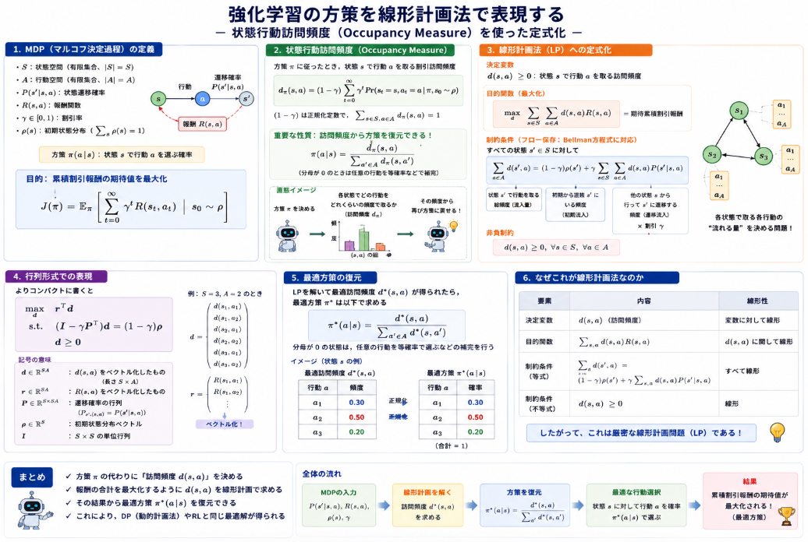

強化学習で[方策モデル](https://yoshishinnze.hatenablog.com/entry/2026/08/03/043000)の最適化を行います。
この最適化より解を求めるという行為を行う時に用いられる際に線形計画法（Linear Programming, LP）という手法により最適化を表現することが出来ます。

本日テーマ：
>線形計画問題について説明します。

## 概要

線形計画法は、**目的関数とすべての制約条件が線形（一次式）で表される最適化問題**を扱う数学的手法です。

### 定義

ある決定変数の線形結合を最大化（または最小化）したいが、それらの変数はいくつかの線形不等式（または等式）によって制約を受ける、という問題です。

標準形では以下のように記述されます。

$$\begin{aligned}
\text{最大化（または最小化）} \quad & \boldsymbol{c}^\top \boldsymbol{x} \\
\text{制約条件} \quad & \boldsymbol{A}\boldsymbol{x} \leq \boldsymbol{b} \\
& \boldsymbol{x} \geq \boldsymbol{0}
\end{aligned}$$

ここで：
- $\boldsymbol{x} \in \mathbb{R}^n$：決定変数（求めたい値）
- $\boldsymbol{c} \in \mathbb{R}^n$：目的関数の係数ベクトル
- $\boldsymbol{A} \in \mathbb{R}^{m \times n}$：制約条件の係数行列
- $\boldsymbol{b} \in \mathbb{R}^m$：制約の右辺ベクトル（資源の上限など）


### 直感的な例：工場の生産計画

ある工場で製品 $P_1$ と $P_2$ を製造するとします。

| | 製品 $P_1$ | 製品 $P_2$ | 上限 |
|---|---|---|---|
| 労働時間（時間/個） | 2 | 1 | 100時間 |
| 原材料（kg/個） | 1 | 3 | 150kg |
| 利益（円/個） | 30 | 50 | |

製品 $P_1$ を $x_1$ 個、$P_2$ を $x_2$ 個生産するとき、利益を最大化する問題は線形計画法として定式化できます。

$$\begin{aligned}
\text{最大化} \quad & 30x_1 + 50x_2 \\
\text{制約条件} \quad & 2x_1 + x_2 \leq 100 \\
& x_1 + 3x_2 \leq 150 \\
& x_1, x_2 \geq 0
\end{aligned}$$


### 幾何学的な意味

2変数の場合、制約条件の不等式は**半平面**を定め、それらの共通部分は**凸多角形（実行可能領域）** となります。

```
      x₂
       │
  150  ├────────────╲
       │            ╲
       │    領域     ╲
  100  ├──────╲       ╲
       │       ╲       │
       │   ★    ╲      │  ← 最適解は頂点のいずれかに存在
       │         ╲     │
       └──────────╲────┴──── x₁
                  50   150
```

線形関数の最大値（最小値）は、この凸多角形の**頂点のいずれか**で必ず達成されます。これが線形計画法の重要な性質です。


### 主な解法

| 手法 | 特徴 |
|------|------|
| **単体法（シンプレックス法）** | 実行可能領域の頂点を効率的に移動して最適解を探索。実用上非常に高速。 |
| **内点法** | 領域の内部を通って最適解に近づく。大規模問題や特定の構造で有利。 |

どちらの方法も、多項式時間または実用上十分な速度で大規模な問題を解くことができます。


### 応用例

線形計画法は、資源配分の最適化に自然に帰着するため、幅広い分野で使われています。

- **生産計画**：限られた資源（労働力、原材料、機械時間）での利益最大化
- **輸送・物流**：倉庫から店舗への輸送コスト最小化（輸送問題）
- **栄養計画**：必要な栄養素を満たしつつ食品コストを最小化
- **ポートフォリオ最適化**：リスク制約下での期待収益最大化（一部をLPで近似）
- **機械学習**：SVM（サポートベクターマシン）の最適化問題はLPやQP（二次計画法）として定式化可能


## 方策を線形計画法で表現

強化学習における方策を線形計画問題として定式化するには、**マルコフ決定過程（MDP）** における**状態行動訪問頻度（occupancy measure）** を用いるのが標準的です。

### 1. MDPの定式化

まず、MDPを以下のように定義します。

- $\mathcal{S}$：状態空間（有限集合、$|\mathcal{S}| = S$）
- $\mathcal{A}$：行動空間（有限集合、$|\mathcal{A}| = A$）
- $P(s'|s,a)$：状態遷移確率
- $R(s,a)$：報酬関数
- $\gamma \in [0,1)$：割引率
- $\rho(s)$：初期状態分布（$\sum_s \rho(s) = 1$）

**方策** $\pi(a|s)$ は、状態 $s$ で行動 $a$ を選択する確率です。

累積割引報酬の期待値を最大化する問題は、以下のように書けます。

$$J(\pi) = \mathbb{E}_{\pi}\left[\sum_{t=0}^{\infty} \gamma^t R(s_t, a_t) \,\bigg|\, s_0 \sim \rho\right]$$

### 2. 状態行動訪問頻度（Occupancy Measure）

方策 $\pi$ に従ったとき、状態 $s$ で行動 $a$ を取る**割引訪問頻度**を以下のように定義します。

$$d_{\pi}(s,a) = (1-\gamma) \sum_{t=0}^{\infty} \gamma^t \Pr(s_t=s, a_t=a \mid \pi, s_0 \sim \rho)$$

$(1-\gamma)$ は正規化定数で、$\sum_{s,a} d_{\pi}(s,a) = 1$ となります。

この $d_{\pi}(s,a)$ は、方策 $\pi$ を**完全に特徴づける**重要な量です。実際、方策は訪問頻度から以下のように復元できます。

$$\pi(a|s) = \frac{d_{\pi}(s,a)}{\sum_{a'} d_{\pi}(s,a')}$$

### 3. 線形計画法への定式化

__決定変数__

$$d(s,a) \geq 0 \quad \text{（状態 } s \text{ で行動 } a \text{ を取る訪問頻度）}$$

__目的関数（最大化）__

$$\max_{d} \sum_{s \in \mathcal{S}} \sum_{a \in \mathcal{A}} d(s,a) \cdot R(s,a)$$

__制約条件（フロー保存：Bellman方程式に対応）__

すべての状態 $s' \in \mathcal{S}$ に対して：

$$\sum_{a} d(s',a) = (1-\gamma)\rho(s') + \gamma \sum_{s,a} d(s,a) \cdot P(s'|s,a)$$

__非負制約__

$$d(s,a) \geq 0, \quad \forall s \in \mathcal{S}, \forall a \in \mathcal{A}$$

### 4. 行列形式での表現

よりコンパクトに書くと以下のようになります。

$$\begin{aligned}
\max_{d} \quad & \boldsymbol{r}^\top \boldsymbol{d} \\
\text{s.t.} \quad & (\mathbf{I} - \gamma \boldsymbol{P}^\top) \boldsymbol{d} = (1-\gamma)\boldsymbol{\rho} \\
& \boldsymbol{d} \geq \boldsymbol{0}
\end{aligned}$$

ここで：
- $\boldsymbol{d} \in \mathbb{R}^{SA}$：$d(s,a)$ をベクトル化したもの
- $\boldsymbol{r} \in \mathbb{R}^{SA}$：$R(s,a)$ をベクトル化したもの
- $\boldsymbol{P} \in \mathbb{R}^{S \times SA}$：遷移確率の行列
- $\boldsymbol{\rho} \in \mathbb{R}^{S}$：初期状態分布

### 5. 最適方策の復元

このLPを解いて最適な訪問頻度 $\boldsymbol{d}^*$ が得られたら、最適方策 $\pi^*$ は以下のように求まります。

$$\pi^*(a|s) = \frac{d^*(s,a)}{\sum_{a' \in \mathcal{A}} d^*(s,a')}$$

分母が $0$ になる状態では、任意の行動を等確率で選ぶなどの補完を行います。

### 6. なぜこれが線形計画法なのか

| 要素 | 内容 |
|------|------|
| **決定変数** | $d(s,a)$（訪問頻度） |
| **目的関数** | $\sum_{s,a} d(s,a) R(s,a)$（線形） |
| **制約条件** | フロー保存方程式（線形等式）+ 非負制約（線形不等式） |

すべての式が**線形**であるため、これは厳密な意味での線形計画問題です。





