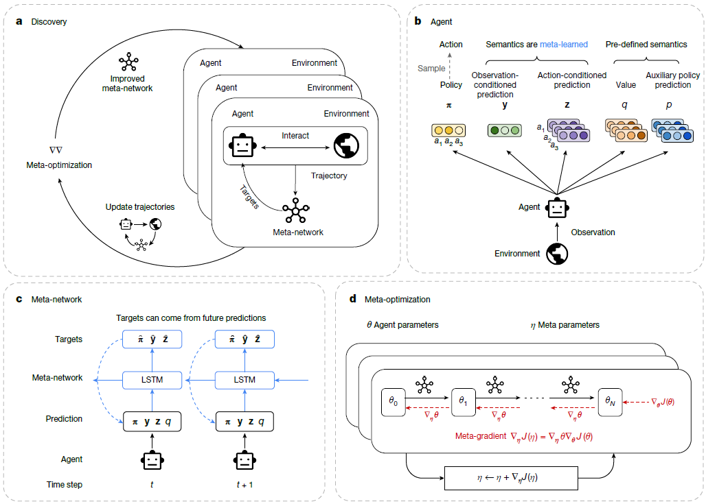

Natureから投稿された強化学習の面白い論文があります。
学習とは、今までは人が学習する仕組みを作り、データを与えて、データからの学習は自動で行うというのが通例だったと思います。
しかし、仕組み自体も探索するという手法を提案しています。

## 概要
[この論文](https://www.nature.com/articles/s41586-025-09761-x)は、**人間が設計した強化学習アルゴリズムを、機械が自分で発見できるか**という問いに答えた研究です。以下に概要をまとめます。

### 研究の背景と動機

現在の強化学習（RL）エージェントは、Q学習や[PPO](https://yoshishinnze.hatenablog.com/entry/2026/08/10/043000)など、**人間が手で設計した学習ルール**を使っています。しかし、人間の学習メカニズムは生物の進化によって自然に発見されたものであり、人工的なRLアルゴリズムも同様に自動発見できれば、人間の知識や直感の限界を超えられるかもしれません。

従来もアルゴリズム発見の試みはありましたが、探索空間が狭かったり（ハイパーパラメータや損失関数だけ）、単純な環境（グリッドワールドなど）でしか検証されていませんでした。

### 提案手法：RLルールの自動発見

__核心アイデア__

「RLアルゴリズムの本質は、**予測やポリシーをどのターゲットに向かって更新するか**というルールである」という観察に基づき、この「ターゲットを決定する関数」自体を**メタネットワーク**として表現し、最適化します。

__エージェントの構造__

エージェントは以下の出力を持ちます：

| 出力 | 意味 |
|------|------|
| **π** | ポリシー（行動選択確率） |
| **y(s)** | 観測条件付き予測ベクトル（サイズ任意） |
| **z(s, a)** | 行動条件付き予測ベクトル（サイズ任意） |
| **q(s, a)** | 行動価値関数（既知のセマンティクス） |
| **p(s, a)** | 補助的なポリシー予測 |

**y(s)** と **z(s, a)** は、あらかじめ「価値関数」や「モデル」といった意味を与えず、**メタネットワークがその意味（セマンティクス）を発見する**ための予測です。

__メタネットワーク__

メタネットワークは、エージェントの軌跡（trajectory）・報酬・エピソード終了フラグを入力として受け取り、**エージェントの各予測とポリシーの「ターゲット」**を出力します。エージェントはこれらのターゲットに向かって自分のパラメータを更新します。

__メタ最適化（Meta-Optimization）__

多数のエージェントを並列に動かし、それぞれが異なる環境で学習します。メタネットワークのパラメータは、**メタ勾配法**を用いて更新されます。具体的には、エージェントの更新過程（θ₀ → θₙ）を通じて勾配を伝播させ、エージェント集団の累積報酬を最大化するようにメタネットワークを最適化します。

### 実験結果

__1. Atariベンチマーク__

発見された「**DiscoRL**」は、メタ学習に使ったAtariゲームで**既存の全RLルールを上回る**性能を示しました。

__2. 未見の環境への汎化__

DiscoRLは、**発見時に全く見たことのないProcGen**などの困難なベンチマークでも、多くの最先端RLアルゴリズムを凌駕するSOTA性能を達成しました。

__3. スケーリング則__

発見に使う環境が多様で複雑になるほど、DiscoRLの性能と汎化性が向上することが示されました。

### 最も注目すべき発見

論文の分析により、DiscoRLが発見した予測 **y(s)** と **z(s, a)** のセマンティクスは、**既存のRL概念（価値関数、後継特徴、モデルなど）とは異なる、全く新しい概念**であることが明らかになりました。

これは単なる「既存アルゴリズムの再発見」ではなく、**機械が人間の設計を超えた新しい学習原理を生み出した**ことを示唆しています。

## 課題

この研究が取り組んでいる課題は、大きく分けて**3つの層**に整理できます。

### 1. 根本課題：RLアルゴリズムは「人間が手で設計する」という限界

現在の強化学習の最大のボトルネックは、**学習ルール自体が人間の知識と直感に依存している**点です。

- Q学習、PPO、TD学習など、成功しているRLアルゴリズムはすべて研究者が手で設計したものです。
- これは**遅く、労力がかかり、人間の創造性の限界に縛られます**。
- 一方、人間や動物の学習メカニズムは、進化という「自動化された探索」によって何世代にもわたって洗練されてきました。

**つまり、「なぜ機械の学習ルールは機械に発見させないのか」という問いが、この研究の出発点です。**

### 2. 従来研究の限界：「狭い探索空間」と「単純な環境」

アルゴリズム自動発見は過去にも試みられていましたが、以下の2つの点で不十分でした。

__(a) 探索空間が狭い__
- 従来は、ハイパーパラメータの調整や損失関数の形など、**限られた設計空間**の中で探索していました。
- 本研究は、**「予測のターゲットを決定する関数全体」** をメタネットワークとして表現し、表現力の高い探索空間を構築しました。

__(b) 検証環境が単純__
- 従来のメタ学習研究は、グリッドワールドなどの**単純な環境**でしか検証されていませんでした。
- 本研究は、**Atariのような複雑で多様な環境**でメタ学習を行い、実用的な性能を達成しました。

### 3. 実用的課題：汎化とスケーリング

単に「既存アルゴリズムを再発見する」だけでは意味がありません。本研究が解決しようとした実用的な課題は：

| 課題 | 本研究のアプローチ |
|------|------------------|
| **未見の環境への汎化** | 多様な環境でメタ学習することで、ProcGenなど未見環境でもSOTAを達成 |
| **発見のスケーリング** | 環境の多様性と複雑さを増やすほど、発見されたルールの性能と汎化性が向上 |
| **新規性の保証** | 発見された予測のセマンティクスが既存概念と異なることを分析で確認 |

## 提案手法

本論文の提案内容は、**「RLアルゴリズムをメタネットワークとして表現し、エージェント集団の経験からメタ勾配法で最適化する」** という枠組みです。以下、構成要素から順に説明します。

### 1. 核心アイデア：RLルール = 「ターゲットを生成する関数」

本研究は、既存のRLアルゴリズム（Q学習、PPO、TD学習など）の本質を以下のように捉えました：

> **「エージェントの予測やポリシーを、将来の報酬や予測に基づいた『ターゲット』に向かって更新するルール」**

そして、この **「ターゲットを決定する関数」自体をニューラルネットワーク（メタネットワーク）として表現し、その重みを学習する**ことで、RLアルゴリズムを自動発見します。

### 2. エージェントの構造：意味を固定しない予測空間

エージェントは以下の5つの出力を持ちます：

| 出力 | 記号 | 役割 |
|------|------|------|
| ポリシー | $π(a\|s)$ | 行動選択確率 |
| 観測条件付き予測 | $y(s) ∈ ℝⁿ$ | **意味を固定しない予測ベクトル** |
| 行動条件付き予測 | $z(s,a) ∈ ℝᵐ$ | **意味を固定しない予測ベクトル** |
| 行動価値関数 | $q(s,a)$ | 既知のセマンティクスを持つ補助予測 |
| 補助ポリシー予測 | $p(s,a)$ | 既知のセマンティクスを持つ補助予測 |

__なぜ「y(s)」と「z(s,a)」が重要か__
- 既存のRLでは「価値関数」「モデル」など、**予測の意味を人間があらかじめ定義**します。
- 本研究では、**予測の意味（セマンティクス）も含めてメタネットワークに発見させます**。
- $y(s)$ と $z(s,a)$ の形式は、状態価値関数 $v(s)$ と行動価値関数 $q(s,a)$ の区別など、既存RLの多くの概念を表現できる一般性を持ちつつ、それに限定されない柔軟性があります。

### 3. メタネットワーク：ターゲット生成器

メタネットワークは、RLルールそのものを表現するネットワークです。

__入力__
- エージェントの軌跡（各時刻での予測値・ポリシー出力）
- 環境からの報酬
- エピソード終了フラグ

__出力__
- エージェントの各予測（y, z, q, p）の**ターゲット値**
- ポリシー π の**ターゲット**

__処理__

メタネットワーク内部ではLSTMを用い、時系列の軌跡情報から「将来の報酬と予測に基づいたターゲット」を計算します。これは、TD学習やPPOなどが行う「ブートストラップターゲットの計算」を一般化したものです。

### 4. 二重の最適化ループ

本手法には、**エージェント最適化**と**メタ最適化**の2つのループが存在します。

```
【外側：メタ最適化】
メタネットワークのパラメータ φ を更新
        ↓
【内側：エージェント最適化】
エージェントのパラメータ θ を、メタネットワークが生成するターゲットに従って更新
        ↓
エージェントが環境と相互作用 → 累積報酬を獲得
        ↓
累積報酬を最大化するように、メタネットワークのパラメータ φ に勾配を伝播
```

__メタ勾配法__
- エージェントの更新過程 $θ₀ → θ₁ → ... → θₙ$ を**展開して微分**します。
- これにより、「どのターゲットを設定した結果、エージェントがどれだけ報酬を獲得したか」という因果関係を、メタネットワークの重みまで伝播させます。

### 5. 大規模な発見プロセス

__エージェント集団__
- **多数のエージェント**を並列に動作させ、それぞれが異なる環境インスタンスと相互作用します。
- 環境はAtariなど、**多様で複雑なタスク**から構成されます。

__スケーリング則__
- 発見に使う環境が**多様で複雑になるほど**、発見されたRLルールの性能と汎化性が向上することが示されました。
- これは、「より豊かな経験からより優れた学習ルールが生まれる」という直感を実証したものです。

### 6. 発見されたもの：DiscoRL

この枠組みによって発見されたRLルールは **DiscoRL（Discovered RL rule）** と名付けられました。

__DiscoRLの特徴__
- Atariで既存の全手法を上回る
- 未見のProcGen環境でもSOTAを達成
- **発見された予測 y(s) と z(s,a) のセマンティクスは、既存の価値関数・モデル・後継特徴などとは異なる新しい概念**

### 提案内容のまとめ図



この枠組みにより、**「どの予測を学ぶべきか」** と **「それをどのターゲットに向かって更新すべきか」** という、RLアルゴリズムの最も本質的な部分を、人間ではなく機械が発見できるようになりました。<source-chip title="Nature" url="https://www.nature.com/articles/s41586-025-09761-x" />

## 効果

本論文の実験結果は、**「機械が発見したRLアルゴリズムが、人間が設計した最先端手法を上回る」** ことを、複数のベンチマークと分析によって実証しています。以下に主要な結果をまとめます。

### 1. Atari57：既存手法を上回る性能

発見された **Disco57**（Atari57でメタ学習したルール）は、Atariベンチマークで以下の既存手法と比較されました：

- DQN（2015）
- IMPALA（2018）
- STACX（2020）
- Dreamer（2020）
- MEME（2022）
- MuZero（2020）

**結果**：Disco57は、これらの慎重に設計されたベースラインと同等か、それ以上の性能を達成しました。<source-chip title="rewire.it" url="https://rewire.it/blog/disco-rl-when-algorithms-learn-to-design-algorithms/" /> これは特筆すべきことで、PPOなどの各アルゴリズムは何年もの研究の積み重ねによって生まれましたが、DiscoRLは自動発見によってそれを凌駕しました。

### 2. 未見環境への汎化：Atari以外でも強い

DiscoRLの重要な特徴は、**メタ学習時に見たことのない環境でも高い性能を発揮する**点です。

__評価された未見環境__
| 環境 | 特徴 |
|------|------|
| **ProcGen** | 手続き的に生成されるゲーム（汎化能力のテスト） |
| **DMLab-30** | 3D認知タスク |
| **Crafter** | オープンワールド的なサバイバルタスク |
| **NetHack** | 非常に複雑なローグライクゲーム |
| **Sokoban** | パズル/推論タスク |

**結果**：DiscoRLは、観測空間や行動空間が根本的に異なるこれらの環境でも、強い性能を示しました。これは、発見されたルールが特定の環境に過学習していないことを示しています。<source-chip title="Google DeepMind" url="https://google-deepmind.github.io/disco_rl/" />

### 3. 発見効率：計算コストは現実的

「こんなに大規模なメタ学習、計算量的に現実的なのか」という疑問に対し、論文は以下を示しています：

- **最適なDiscoRLルールは、各Atariゲームあたり約6億ステップ（約3回の完全なエージェント学習に相当）で発見された**
- これは「発見」が、単一のエージェントを最適化するコストの数倍程度で済むことを意味し、**計算的に実現可能**であることを示しています。<source-chip title="Temple University Presentation" url="https://cis.temple.edu/tagit/presentations/Discovering%20state-of-the-art%20reinforcement%20learning%20algorithms.pdf" />

### 4. スケーリング則：環境が多いほど良いルールが生まれる

本研究の重要な発見の一つは、**「発見に使う環境が多様で複雑になるほど、発見されたRLルールが強くなる」** というスケーリング則です。

- **Disco57**：57のAtari環境でメタ学習
- **Disco103**：Atari + ProcGen + DMLab-30の計103環境でメタ学習

Disco103はDisco57よりも未見のProcGen環境で高い性能を示し、**環境の多様性と複雑さが、より汎用的で強力な学習ルールを生み出す**ことが実証されました。<source-chip title="Nature" url="https://www.nature.com/articles/s41586-025-09761-x" />

### 5. アブレーションスタディ：何が重要か

Atariで行われたアブレーション実験により、DiscoRLの各構成要素の重要性が明らかになりました：

| 条件 | 結果 |
|------|------|
| **価値関数(q)なし** | 性能が大きく低下 → 価値関数は依然として重要 |
| **学習予測(y, z)なし** | 性能が低下 → メタ学習した予測も重要 |
| **補助予測(p)なし** | ある程度影響 |
| **小さなエージェント** | 性能低下 → モデルサイズも重要 |
| **おもちゃの環境のみ（グリッドワールド57）** | 大幅に低下 → **多様で複雑な環境での発見が不可欠** |

**結論**：事前に定義された価値関数と、メタ学習によって発見された新しい予測の両方が重要であり、それらを多様な環境で学習させることが性能の鍵です。<source-chip title="Temple University Presentation" url="https://cis.temple.edu/tagit/presentations/Discovering%20state-of-the-art%20reinforcement%20learning%20algorithms.pdf" />

### 6. 発見された予測の性質分析

最も興味深い結果の一つは、**DiscoRLが発見した予測が何を学習しているか**の分析です。

__観察された現象__
- **予測の確信度が、重要なイベントの前に急上昇する**
- 大きな報酬が得られる前に予測が活性化
- 強い行動選択の前にも予測が変化

__解釈__

DiscoRLは、**中期的な時間スケールで将来の重要なイベントを予測・識別**する仕組みを自動的に発見しました。これは従来の価値関数（将来の割引報酬和）とは異なる、より豊かな予測セマンティクスを獲得したことを示唆しています。

また、発見された予測ベクトル（30次元）は、情報量が豊富で、そこから元の価値関数をほぼ回復できることも確認されました。つまり、**価値関数と同等かそれ以上の情報を、発見された表現が保持している**のです。<source-chip title="rewire.it" url="https://rewire.it/blog/disco-rl-when-algorithms-learn-to-design-algorithms/" />

### 実験結果のまとめ

| 評価項目 | 結果 |
|----------|------|
| **Atari57** | 既存の全手法を凌駕または同等 |
| **未見環境（ProcGen等）** | SOTA性能を達成 |
| **発見に必要な計算** | 各ゲーム約3回分の学習で実現可能 |
| **スケーリング** | 環境が多様で複雑になるほど性能向上 |
| **発見された予測** | 価値関数とは異なる新しいセマンティクスを獲得 |

これらの結果は、**「強化学習アルゴリズムの設計は、今後、自動化された方法によって主導される可能性がある」** という本研究の主張を強く支持しています。<source-chip title="Google DeepMind" url="https://google-deepmind.github.io/disco_rl/" />


## 総括

この論文の本質は、以下の3つのパラダイムシフトに集約されます。

### 1. 「学習するもの」から「学習する方法そのもの」を学習する対象へ

従来の機械学習は、**「与えられたアルゴリズムでデータから何を学ぶか」** が問いでした。

この論文は、**「アルゴリズム自体を学習の対象にする」** というレベルを一段上げました。ポリシーや価値関数を学習するのではなく、**「どうやってポリシーや価値関数を更新すべきか」という学習ルールそのもの**を、メタネットワークが発見します。

### 2. 人間の「設計」から機械の「発見」へ

DQNやPPOは、人間の直感と理論によって「こう学習すべきだ」と設計されました。

この論文は、**人間が「価値関数とは何か」「TD学習とは何か」を定義するのではなく、機械が経験を通じて「何を予測すべきか」「どう更新すべきか」を独自に発見する**ことを示しました。

そして決定的なのは、発見されたものが**既存の概念（価値関数、モデル、後継特徴など）の模倣ではなく、人間が思いつかなかった新しい予測セマンティクス**だったことです。

### 3. 進化が生物の学習を生んだように、メタ学習がAIの学習を生み出す

論文の冒頭で示された比喩が本質を捉えています。

> 人間の学習メカニズムは、進化によって何世代にもわたる試行錯誤を通じて「発見」された。ならば、AIの学習メカニズムも同様に「発見」できないか。

この研究は、その問いに **「できる」** と答えました。進化が生物に強力な学習能力を与えたように、**大規模なメタ学習がAIに人間を超える学習能力を与えうる**ことを、初めて実証的に示したのです。

### 一言で言えば

> **「強化学習の最も本質的な部分、すなわち『どう学ぶか』というルール自体を、人間の設計から解放し、機械の経験とスケールによって自動発見できる」**

これが、この論文の本質です。アルゴリズムを「書く」のではなく「育てる」時代の到来を示唆しています。
