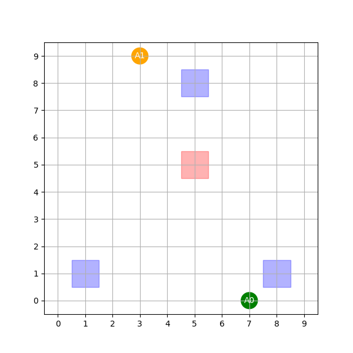

倉庫問題を何度もトライしていましたが、うまくいきませんでした。

これまで使っていたアルゴリズムはQMIXというものでしたが、アルゴリズムをHASACに変更したところ何とか協調学習の上、タスクを解決させようという動作を行うように学習が出来てきました。

これまで見つけた課題からHASACを導入するまでをまとめます。

## 課題の考察
### 現象

QMIXを使っている際に以下の現象が起きていました。

1. 両方のエージェントが協調しない

学習が進んでもお互いに協調を行いません。片方のエージェントのみが動作するような現象が起きていました。

2. 有効に機能する動作をしない

報酬を見直してじっと止まっているだけだとペナルティがかかるようにしました。
すると動作はするが、意味のない動きを繰り返すようになりました。

### 原因と考えられること

__1. 「怠惰なエージェント（Lazy Agent）」問題__

片方のエージェントのみが動作する現象は、MARL（マルチエージェント強化学習）における **「Lazy Agent Problem」** と呼ばれます。

* **原因:** QMIXは「チーム全体のQ値（ $Q_{tot}$ ）」を最大化しようとします。学習の初期段階で、エージェントAが偶然荷物を運び、エージェントBが何もしなかったとします。このとき、チーム全体の報酬はプラスになります。
* **負の連鎖:** ニューラルネットワークは効率を重視するため、「Aが頑張ればチーム報酬が増えるが、Bが動くとAの邪魔をして報酬を減らすリスクがある」と判断すると、 **Bに「じっとしていろ」という方策を固定** させてしまいます。Bが動かない方が全体のQ値が安定して高くなるという「局所解」に陥ったのが原因です。

__2. 厳格な単調性制約（Monotonicity Constraint）の弊害__

QMIXの核心である「個人のQ値が増えれば全体のQ値も増える」という制約が、逆に仇となった可能性があります。

* **原因:** 倉庫問題では、一人が道を開けるために遠回りをしたり、待機したりといった「一時的に個人の評価が下がるが、全体にはプラス」という行動が必要になります。
* **制約の罠:** QMIXはこの「譲り合い」を数学的に表現するのが苦手です。「自分がマイナスになる行動（道を譲る）」が「全体のプラス」に直結するという非単調な関係を、QMIXのミキシングネットワークがうまく処理できず、結果として**「お互いに干渉しない（片方だけが動く）」という極端に単純な戦略**を選んでしまったと考えられます。

__3. 「意味のない動き」＝ 局所解への逃避__

ペナルティを課した後に「意味のない動き（その場での往復など）」を繰り返したのは、報酬設計と探索能力のミスマッチが原因です。

* **原因:** 止まっていることにペナルティを与えたことで、エージェントは「何もしない」という選択肢を失いました。しかし、QMIXの $\epsilon$ -greedy法による探索では、「正解（荷物を届ける）」までの複雑な手順を自発的に見つけるのが難しかったのです。
* **結果:** エージェントは**「ペナルティを回避しつつ、リスク（衝突や迷子）を最小限にする最小限の動き」**として、意味のない往復運動を選択しました。これは、強化学習における「報酬ハック（Reward Hacking）」の一種で、設計者が意図しない方法でペナルティを回避する行動が定着した状態です。

### 改善の方向性

QMIXで失敗していた主な原因は、「QMIXの構造的な制約（単調性）」が倉庫問題の複雑な譲り合いに対応できなかったことと、「$\epsilon$-greedy探索」ではペナルティを回避してゴールに辿り着くための十分な試行錯誤ができなかったことにあります。

そこで探索に強力に作用するHSACを試行しました。

## HASACの活用

### HASACが今回ワークする理由

1. 強力な探索能力（最大エントロピー理論）
 
QMIXの $\epsilon$-greedy 探索は単なる「サイコロ振り」ですが、HASACは **「できるだけ予測できない多様な動きをすること自体に報酬を与える」** 仕組みを持っています。
 
- 無意味な往復の打破: QMIXでは「止まるとペナルティ、動くと衝突リスク」という状況で、リスクの少ない往復運動に固執しました。HASACは「同じ動きを繰り返すとエントロピー（多様性）が下がる」と判断し、自発的に新しい経路やアクションを試すため、結果として正解のルートを発見しやすくなります。
- デッドロックの自然解消: 確率的な方策（Stochastic Policy）を持つため、エージェントが鉢合わせした際も「片方が少し右にズレ、もう片方が待つ」といった偶然の成功を、エントロピー報酬を維持しながら高頻度で試行できます。

2. 「怠惰なエージェント」を防ぐアドバンテージ分解

QMIXは「チーム全体の合計」しか見ていないため、一人が頑張ればもう一人はサボっても評価（$Q_{tot}$）が上がってしまいました。

- 個別の貢献度を評価: HASACは、各エージェントが独立した Actor（方策）を持ちます。数学的な「アドバンテージ分解補題」により、 **「そのエージェントが動いたことで、チーム全体の期待値がどれだけ増えたか」** を個別に計算します。
- 「サボり」を許さない: 自分が動かないことが全体のプラスにならない場合、そのエージェントの Actor は「もっと貢献できる動きを探せ」と直接指導を受けるため、片方だけが動作するという現象が起きにくくなります。

3. 不均一性（Heterogeneity）への対応

QMIXは全エージェントでパラメータを共有することが一般的ですが、HASACはその名の通り「不均一（Heterogeneous）」なエージェントを前提としています。

- 役割分担の固定化: 倉庫問題では、エージェントAが「左側の棚」、エージェントBが「右側の棚」といった役割を分担したほうが効率的です。HASACは各エージェントが独自のネットワーク重みを持つため、「自分専用の得意な動き」を他者に引きずられずに磨き上げることができます。

### HASACの実装

1. ネットワークの構成
 
エージェントごとに独立したネットワークを用意します。QMIXと異なり、パラメータ共有を行わない（または役割ごとに分ける）のが一般的です。

- Actor (Policy) $\pi_{\theta_i}(a_i | o_i)$: 各エージェント $i$ が、自分の観測 $o_i$ から行動の確率分布（離散ならSoftmax値）を出力します。
- Critic (Q-function) $Q_{\phi}(s, a_1, a_2, ..., a_n)$: 中央集中型Criticです。
- 全エージェントの状態 $s$ と、全エージェントの行動集合を入力として受け取り、チーム全体の期待報酬を予測します。

2. データの収集 (Experience Replay)
 
リプレイバッファには、各ステップで以下のデータを保存します。

- 全エージェントの観測 $(o_1, o_2, ...)$
- グローバル状態 $(s)$
- 実行された行動 $(a_1, a_2, ...)$
- 報酬 $(r)$ ※チーム共通報酬、または個別報酬
- 次ステップの状態 $(s')$ と終了フラグ

3. Critic（評価役）の更新

ターゲットネットワークを用いて、TD誤差を最小化します。

- Target: $y = r + \gamma \left( Q_{\bar{\phi}}(s', a'_1, ..., a'_n) - \alpha \sum \log \pi(a'_k | o'_k) \right)$
- Loss: $(Q_{\phi}(s, a_1, ..., a_n) - y)^2$ を最小化。

4. Actor（実行役）の逐次更新 (Sequential Update)
 
HASACの核心部分です。エージェントを $1$ から $n$ まで順番に更新します。

- エージェント $i$ を更新する際、他のエージェントのアクションは現在の最新の方策からサンプリングしたものに置き換えます。
- Objective: $J(\theta_i) = \mathbb{E} [ Q_{\phi}(s, a_1, ..., a_i, ..., a_n) - \alpha \log \pi_{\theta_i}(a_i | o_i) ]$ を最大化。この「一人ずつ更新」することで、理論的にチーム全体のパフォーマンスが改善（Policy Improvement）することが保証されます。

5. 自動温度調整 ($\alpha$ の更新)

エントロピーの重み $\alpha$ を自動調整します。探索が十分なら $\alpha$ を下げ、不足（行動が偏る）なら $\alpha$ を上げるよう学習させます。

これにより、倉庫問題での「最初は活発に動き、慣れたら最短ルートを通る」という切り替えが自動で行われます。

実際の実装は以下レポジトリの "multi-agent" - "src" - "exe-2"を参考下さい。

[Reinforce-Learning-Study](https://github.com/Shinichi0713/Reinforce-Learning-Study)

### 学習後のエージェントの動作

未だ完全ではありませんが、以下のように動作することが確認されました。

