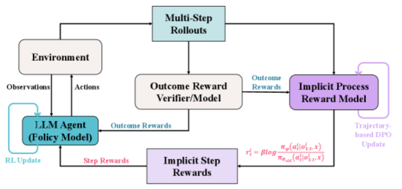
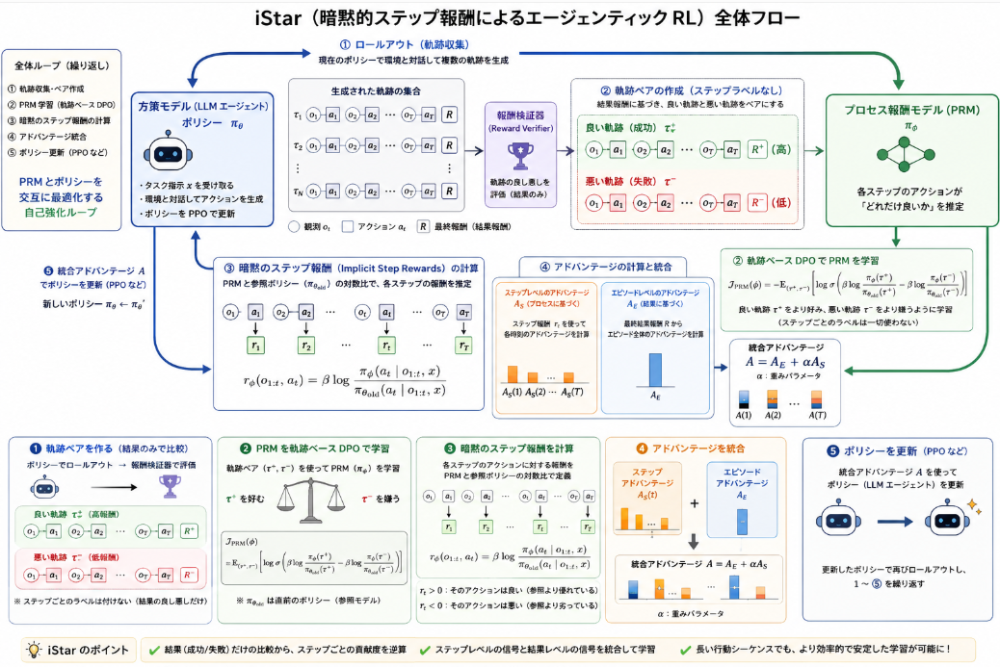

LLMを行動の計画や目標とのチェックに使って、一連のタスク群をこなし目標達成を満たすLLMはご存じエージェンティックLLMです。
このエージェンティックを行う能力を高めるということについて調べてみました。

本日テーマ：

>エージェンティック能力向上を行うエージェンティックRL

## 概要

**エージェンティックRL（Agentic RL）** は、**LLM を「自律的なエージェント」として扱い、環境と対話しながら長期的な目標を達成する能力を強化学習で高める** という新しいパラダイムです[Zenn](https://zenn.dev/kuto5046/articles/agentic_rl_2025)。

### 1. 従来の RLHF との違い

__従来の RLHF の限界__
- **結果主義**：最終テキストに対する評価（報酬）に基づくため、  
  - プロセスが非効率でも「たまたま正解」した場合に学習が歪む  
  - どのステップが良かったか悪かったかが分かりにくい  
- **報酬のスパース性**：  
  - 数百ステップの行動の末に「成功／失敗」だけでは、クレジットアサインメントが困難  
- **環境相互作用の欠如**：  
  - 静的なデータセット上の選好学習が中心で、動的な環境（コード実行、API 応答など）からのフィードバックを活かしにくい  

__Agentic RL の視点__
- LLM を**静的なテキスト生成器**ではなく、  
  - **ツールを使う**  
  - **検索する**  
  - **コードを実行する**  
  といった**環境と相互作用するエージェント**として扱う[note（wandb）](https://note.com/wandb_jp/n/n971e3fdf9e7d)。

### 2. Agentic RL の代表的な技術

__(1) iStar（Implicit Step Rewards for Agentic RL）__
- DeepMind 系の研究で提案された**プロセス報酬モデル（PRM）** の一種[Gemini 3 Flash と Agentic RL（PDF）](https://yorozuipsc.com/uploads/1/3/2/5/132566344/91fbcaec9d782c372225.pdf)。
- 特徴：
  - **明示的なステップごとのラベル付けなし**で、  
    - 成功した軌跡と失敗した軌跡を比較し、  
    - **各ステップの貢献度（暗黙のステップ報酬）** を推定する。
  - PRM と方策モデルを交互に最適化することで、  
    - 「どの中間ステップが成功に寄与したか」を学習する。
- これにより、**長いエージェント行動のクレジットアサインメント**を効率化します。

__(2) AgentRL（スケーラブルなエージェントRLフレームワーク）__
- **マルチターン・マルチタスク**のエージェント RL 訓練を目的としたフレームワーク[ChatPaper](https://chatpaper.com/ja/paper/196053)。
- 特徴：
  - インフラ面で、  
    - 多数のエージェントを並列に走らせる  
    - ログを集約して RL 学習に使う  
    といった**スケーラブルな訓練基盤**を提供。
  - エージェントがツール・API・環境と対話しながら、  
    - 探索  
    - 失敗からの学習  
    を繰り返す。

__(3) SeeUPO（収束保証付きシーケンスレベル Agentic RL）__
- **シーケンスレベル（軌跡全体）** の報酬を扱いつつ、  
  - 収束保証を持つ RL アルゴリズムを提案[AlphaXiv](https://www.alphaxiv.org/ja/overview/2602.06554v1)。
- LLM トレーニング文脈での主流 RL アルゴリズム（PPO など）を理論的に分析し、  
  - **エージェントの行動シーケンスに対する安定な最適化**を目指す。

### 3. Agentic RL の全体像

__目的__
- LLM を単なる「テキスト生成器」から、  
  - **自律的にタスクを遂行するエージェント**へと進化させる。
- 具体的には：
  - 検索・ツール利用・コード実行・マルチターン推論などを含む**長い行動シーケンス**を  
  - **強化学習で最適化**する。

__学習の流れ__
1. **エージェントが環境と対話**  
   - 例：ブラウザ検索 → コード実行 → エラーメッセージを読む → 修正
2. **軌跡（trajectory）全体に報酬を付与**  
   - 成功／失敗、あるいはスコア（例：テストケース通過率）
3. **PRM や iStar のような仕組みで、各ステップの貢献度を推定**  
4. **方策を更新**  
   - PPO, GRPO, GSPO などの RL アルゴリズムで LLM のポリシーを更新[note（wandb）](https://note.com/wandb_jp/n/n971e3fdf9e7d)

### 4. エージェンティックRL

- **エージェンティックRL（Agentic RL）** は、  
  - LLM を**環境と対話するエージェント**として扱い、  
  - **長期的なタスク遂行能力**を強化学習で高める新しいパラダイム。
- 従来の RLHF が「最終テキストの好み」に基づくのに対し、  
  - Agentic RL は**プロセス（中間ステップ）** と**環境フィードバック**を重視する。
- iStar, AgentRL, SeeUPO などの技術により、  
  - 明示的なステップラベルなしで  
  - 長い行動シーケンスのクレジットアサインメントを実現し、  
  - LLM エージェントの**自律的な改善**を目指しています。

## よく知られる手法

エージェンティックRL（Agentic RL）の文脈で、**最近よく知られている代表的な手法**は、主に以下のようなものです。

### 1. iStar（Implicit Step Rewards for Agentic RL）

- **目的**：  
  - 長いエージェント行動シーケンス（数百ステップ）に対して、  
    **ステップごとの貢献度（報酬）を明示的なラベルなしで推定**する。
- **アイデア**：  
  - **プロセス報酬モデル（PRM）** と**方策モデル**を交互に最適化し、  
    - 成功した軌跡と失敗した軌跡を比較することで、  
    - **暗黙のステップ報酬（implicit step rewards）** を推定する[arXiv](https://arxiv.org/html/2509.19199v3)。
- **特徴**：  
  - 追加ロールアウトや明示的なステップラベルなしで、  
    - 標準的な RL アルゴリズム（PPO など）に統合可能。  
  - WebShop, VisualSokoban, SOTOPIA などのエージェントベンチマークで、  
    - バニラ RL やトークンレベル PRM より**サンプル効率と安定性が高い**と報告[arXiv](https://arxiv.org/html/2509.19199v3)。

### 2. AgentRL（Scaling Agentic Reinforcement Learning）

- **目的**：  
  - **マルチターン・マルチタスク**のエージェント RL 訓練を**スケーラブル**に行うためのフレームワーク[arXiv](https://arxiv.org/abs/2510.04206)。
- **特徴**：  
  - **インフラ＋アルゴリズム＋評価プロトコル**を一体化した設計。  
  - 非同期訓練、マルチタスク環境オーケストレーション、高度な探索、安定な最適化をサポート。  
  - GRPO などの RL アルゴリズムと組み合わせて、  
    - 多数のエージェントを並列に走らせ、  
    - ログを集約して学習する仕組み[GitHub](https://github.com/THUDM/AgentRL)。
- **結果**：  
  - 5 つのエージェントタスクで、GPT‑5 や Claude‑Sonnet‑4 などの LLM エージェントを上回る性能を報告[Semantic Scholar](https://www.semanticscholar.org/paper/AgentRL%3A-Scaling-Agentic-Reinforcement-Learning-a-Zhang-Liu/c4060d004efb85967d6c3f3fd38de437589ce2af)。

### 3. SeeUPO（Sequence-level Agentic RL with Convergence Guarantees）

- **目的**：  
  - **シーケンスレベル（軌跡全体）**の報酬を扱いつつ、  
    **収束保証を持つエージェンティックRLアルゴリズム**を提供[AlphaXiv](https://www.alphaxiv.org/ja/overview/2602.06554v1)。
- **特徴**：  
  - LLM トレーニング文脈で主流の RL アルゴリズム（PPO など）を理論的に分析し、  
    - エージェントの行動シーケンスに対する**安定な最適化**を目指す。  
  - シーケンスレベルの報酬設計とクレジットアサインメントを統合。

### 4. Agent-RRM（Agentic Reasoning Reward Model）

- **目的**：  
  - Agentic RL で一般的な**スパース報酬・二値フィードバック**の問題を緩和するため、  
    **エージェントの推論プロセス（reasoning process）** を評価する報酬モデルを提案[知乎](https://zhuanlan.zhihu.com/p/2002520714729776828)。
- **特徴**：  
  - 結果ベースの報酬だけでなく、  
    - 中間推論ステップの質を評価する**プロセス報酬**を導入。  
  - ルール・モデル報酬・環境フィードバックを組み合わせた**ハイブリッド報酬**設計。

### 5. AgentGym-RL / AgentGym 系フレームワーク

- **目的**：  
  - LLM エージェントを**マルチターン決定タスク**で訓練するための**オープンソースフレームワーク**[Substack](https://cameronrwolfe.substack.com/p/agentic-rl)。
- **特徴**：  
  - TextWorld, ALFWorld などのインタラクティブテキスト環境で、  
    - マルチターン RL の設計・実装・評価を一括提供。  
  - 環境スケーリング、報酬設計、モデル事前知識の影響などを体系的に分析。

## iSTarの例

実際のエージェンティックRLの詳細ループを確認しようと思います。
ここではiSTarを例として挙げていきます。

iStarは、**明示的なステップラベルなしで、各ステップの貢献度（暗黙のステップ報酬）を推定し、それをポリシー更新に統合する**手法です[arXiv](https://arxiv.org/html/2509.19199v3)。

以下、アルゴリズムの実現法を順に説明します。

### 1. 全体のループ構造

iStar の学習ループは、以下の 2 つを**交互に最適化**します。

1. **暗黙的プロセス報酬モデル（PRM）**  
   - 各ステップのアクションに対する「どれだけ良いか」を表す報酬を推定するモデル。
2. **方策モデル（LLM エージェント）**  
   - PRM が与えるステップ報酬と、タスクの結果報酬を使って更新されるポリシー。

このループを繰り返すことで、**自己強化的な訓練ループ**を形成します[arXiv](https://arxiv.org/html/2509.19199v3)。

### 2. PRM の学習：軌跡ベース DPO 目的関数

__(1) 軌跡ペアの作成__

- 現在のポリシー（LLM エージェント）が環境と対話し、複数の**軌跡（trajectory）** を生成します。
- 各軌跡は  
  $$
  \tau = (o_1, a_1, o_2, a_2, \dots, o_T, a_T, R)
  $$
  のように、観測 $o_t$、アクション $a_t$、最終報酬 $R$ のシーケンスです。
- 外部の**報酬検証器（reward verifier）** で軌跡をランク付けし、  
  - **良い軌跡** $\tau^+$（成功・高報酬）  
  - **悪い軌跡** $\tau^-$（失敗・低報酬）  
  のペア $(\tau^+, \tau^-)$ を作成します。

ここで重要なのは、**ステップごとのラベルは一切付けない**ことです。あくまで「軌跡全体」の良し悪しだけが分かっている状態です。

__(2) PRM の目的関数（軌跡ベース DPO）__

PRM（パラメータ $\phi$）は、軌跡ペア $(\tau^+, \tau^-)$ に対して、以下の **DPO 風の目的関数**で学習されます[arXiv](https://arxiv.org/html/2509.19199v3)：

$$
\mathcal{J}_{\text{PRM}}(\phi) = -\mathbb{E}_{(\tau^+, \tau^-)} \left[ \log \sigma\Big( \beta \log \frac{\pi_\phi(\tau^+)}{\pi_{\theta_{\text{old}}}(\tau^+)} - \beta \log \frac{\pi_\phi(\tau^-)}{\pi_{\theta_{\text{old}}}(\tau^-)} \Big) \right]
$$

ここで：

- $\pi_\phi(\tau)$：PRM が「軌跡 $\tau$ がどれだけ好ましいか」を表す**擬似的な確率**（対数尤度）  
- $\pi_{\theta_{\text{old}}}(\tau)$：**直前のポリシーのスナップショット**（参照モデル）  
- $\beta$：温度パラメータ  
- $\sigma$：シグモイド関数

この目的関数は、

- 「良い軌跡 $\tau^+$ は、直前のポリシーよりも PRM によって**より好まれる**」  
- 「悪い軌跡 $\tau^-$ は、直前のポリシーよりも PRM によって**より嫌われる**」

ように PRM を訓練します。  
つまり、**軌跡全体の良し悪しから、各ステップの「好みの差」を逆算する**ような役割です。

### 3. ステップ報酬の推定（Implicit Step Rewards）

学習された PRM $\pi_\phi$ を使って、**各ステップのアクションに対する報酬**を定義します[arXiv](https://arxiv.org/html/2509.19199v3)：

$$
r_\phi(o_{1:t}, a_t) = \beta \log \frac{\pi_\phi(a_t \mid o_{1:t}, x)}{\pi_{\theta_{\text{old}}}(a_t \mid o_{1:t}, x)}
$$

ここで：

- $o_{1:t}$：時刻 $t$ までの観測履歴  
- $a_t$：時刻 $t$ のアクション  
- $x$：タスクの指示（プロンプト）  
- $\pi_\phi(a_t \mid \cdots)$：PRM が「そのアクションがどれだけ好ましいか」を表す条件付き確率  
- $\pi_{\theta_{\text{old}}}(a_t \mid \cdots)$：直前のポリシー（参照モデル）の条件付き確率

この $r_\phi(o_{1:t}, a_t)$ が、**暗黙のステップ報酬（Implicit Step Reward）**です。

- 値が正：PRM が「このアクションは直前のポリシーよりも良い」と判断  
- 値が負：PRM が「このアクションは直前のポリシーよりも悪い」と判断

このように、**ステップごとの明示ラベルなしに、軌跡レベルの比較からステップ報酬を逆算**している点が iStar の核心です。

### 4. 報酬の統合：ステップレベル＋エピソードレベル

__(1) ステップレベルのアドバンテージ $A_S$__

- 上記のステップ報酬 $r_\phi(o_{1:t}, a_t)$ を用いて、  
  - 各ステップの**アドバンテージ** $A_S(t)$ を計算します（標準的な RL の方法で、将来報酬の期待値からベースラインを引く形）。

__(2) エピソードレベルのアドバンテージ $A_E$__

- タスクの**結果報酬（outcome reward）** $R$ から、  
  - エピソード全体に対するアドバンテージ $A_E$ を計算します（PPO などと同じ）。

__(3) 統合アドバンテージ $A$__

最終的に、ポリシー更新に使うアドバンテージは、以下のように**ステップレベルとエピソードレベルを線形結合**します[arXiv](https://arxiv.org/html/2509.19199v3)：

$$
A = A_E + \alpha A_S
$$

ここで $\alpha$ は重みパラメータです。

- $A_E$：タスクの成功／失敗という**結果**に基づく信号  
- $A_S$：各ステップのアクションがどれだけ成功に寄与したかという**プロセス**に基づく信号

この統合により、

- 結果が同じでも、**プロセスが非効率な軌跡**は $A_S$ が低くなり、  
- 結果が悪くても、**一部のステップが良い軌跡**は $A_S$ を通じて部分的に評価される

という形で、**クレジットアサインメントが細かく行われる**ようになります。

### 5. ポリシー更新

- 統合アドバンテージ $A$ を用いて、標準的な RL アルゴリズム（PPO など）で**方策モデル（LLM エージェント）**を更新します。
- その後、更新されたポリシーで新たなロールアウトを生成し、  
  - 再び PRM を更新  
  - ステップ報酬を再推定  
  - ポリシーを更新  
  というループを繰り返します。

### 6. フロー

1. **軌跡ペア $(\tau^+, \tau^-)$ を作る**  
   - 結果報酬に基づき、成功軌跡と失敗軌跡をペアにする。

2. **軌跡ベース DPO で PRM を学習**  
   - 良い軌跡をより好み、悪い軌跡をより嫌うように PRM を訓練する。

3. **ステップ報酬を PRM と参照ポリシーの対数比で定義**  
   - $r_\phi(o_{1:t}, a_t) = \beta \log \frac{\pi_\phi(a_t|\cdots)}{\pi_{\theta_{\text{old}}}(a_t|\cdots)}$  
   - これが**暗黙のステップ報酬**。

4. **ステップレベルとエピソードレベルのアドバンテージを統合**  
   - $A = A_E + \alpha A_S$ でポリシー更新を行う。

5. **PRM とポリシーを交互に最適化**  
   - 自己強化的なループで、明示ラベルなしに**プロセス報酬**を学習する。

この仕組みにより、iStar は WebShop, VisualSokoban, SOTOPIA などの**長いエージェント行動シーケンス**において、  
- バニラ RL  
- トークンレベル PRM  
よりも**サンプル効率と安定性が高い**ことが示されています[arXiv](https://arxiv.org/html/2509.19199v3)。

## 結論

エージェンティックRL（Agentic RL）は、**「LLM を単なるテキスト生成器ではなく、環境と対話する自律エージェントとして扱い、その行動シーケンス全体を強化学習で最適化する」** という**新しいパラダイム／手法群**と位置づけられます[Zenn](https://zenn.dev/kuto5046/articles/agentic_rl_2025)[note（wandb）](https://note.com/wandb_jp/n/n971e3fdf9e7d)。

他の手法と比較して、以下のように総括できます。

### 1. 従来の RLHF との違い

- **RLHF**：  
  - 主に「**最終テキストの好み**」に基づく  
  - 静的なデータセット上の選好学習が中心  
  - プロセス（中間ステップ）や環境フィードバックをあまり活用しない  
- **エージェンティックRL**：  
  - LLM を**環境と対話するエージェント**として扱う  
  - ツール利用・検索・コード実行・マルチターン推論を含む**長い行動シーケンス**を対象  
  - **プロセス報酬**や**環境からのフィードバック**を重視[Gemini 3 Flash と Agentic RL（PDF）](https://yorozuipsc.com/uploads/1/3/2/5/132566344/91fbcaec9d782c372225.pdf)

### 2. 代表的な技術的特徴

__(1) プロセス報酬（Process Rewards）の導入__

- iStar や Agent-RRM などが典型例で、  
  - **結果報酬（成功／失敗）** だけでなく、  
  - **中間ステップの質**を評価する報酬を導入[arXiv](https://arxiv.org/html/2509.19199v3)[知乎](https://zhuanlan.zhihu.com/p/2002520714729776828)。
- これにより、  
  - 長いシーケンスの**クレジットアサインメント**が改善し、  
  - サンプル効率と安定性が向上。

__(2) マルチターン・マルチタスク環境でのスケーリング__

- AgentRL や AgentGym-RL などは、  
  - **マルチターン・マルチタスク**のエージェント RL 訓練を  
  - スケーラブルなインフラとアルゴリズムで実現[arXiv](https://arxiv.org/abs/2510.04206)[Substack](https://cameronrwolfe.substack.com/p/agentic-rl)。
- 多数のエージェントを並列に走らせ、  
  - 環境スケーリング  
  - タスク多様性  
 を通じて、**汎用的なエージェント知能**を目指す。

__(3) 収束保証と安定な最適化__

- SeeUPO などは、  
  - **シーケンスレベル報酬**を扱いつつ、  
  - LLM トレーニング文脈での RL アルゴリズムを理論的に分析し、  
  - **収束保証付きのエージェンティックRL**を提案[AlphaXiv](https://www.alphaxiv.org/ja/overview/2602.06554v1)。

### 3. 他の手法との位置づけ

- **従来の RLHF / DPO**：  
  - 「**静的なテキスト選好**」に基づく  
  - エージェント的な振る舞い（ツール利用・長い推論）には不十分  
- **オフライン RL / SFT ベースの自己修正**：  
  - 分布不一致・行動崩壊が起きやすく、  
  - 実際のエージェント行動とのギャップが大きい  
- **エージェンティックRL**：  
  - **オンライン**で環境と対話しながら  
  - **プロセス報酬**と**結果報酬**を統合し、  
  - LLM を**自律エージェント**として直接訓練する手法群

### 4. 総括

エージェンティックRL は、

- **「LLM をエージェントとして扱う」** という視点の転換と、  
- **プロセス報酬・マルチターン・環境スケーリング・収束保証**といった技術的要素を組み合わせた、  
- **次世代の LLM アライメント／能力向上手法**

と位置づけられます。

単なる「テキスト生成の好み合わせ」から、  
**「環境と対話しながら長期的な目標を達成するエージェントとしての LLM を RL で育てる」**  
という方向にシフトした、総合的なアプローチと言えるでしょう。
