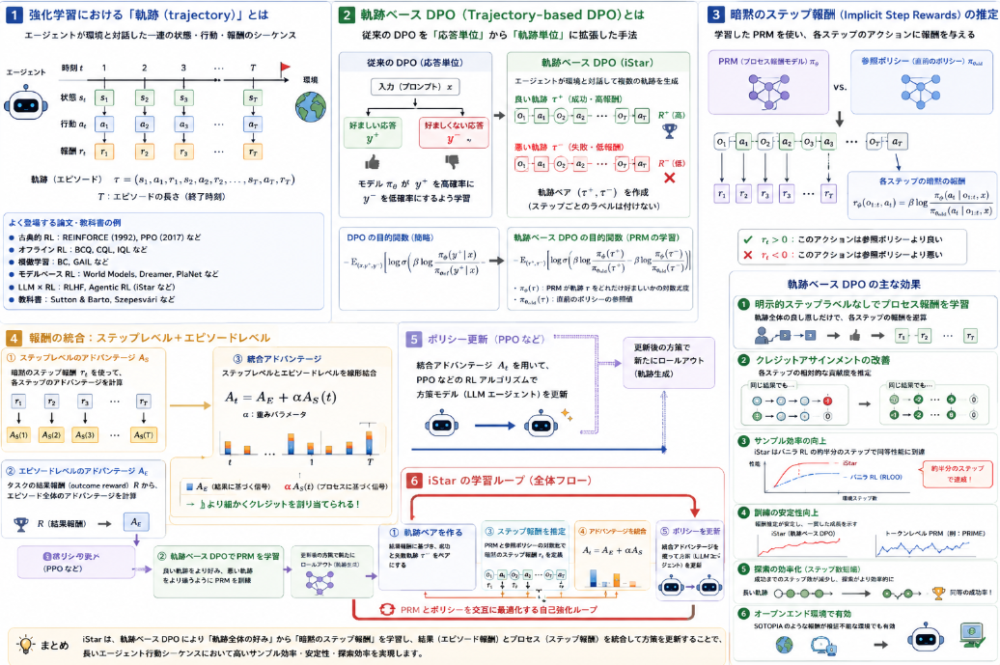

エージェンティックLLMを強化学習する際に何を評価すべきか、どのように学習すべきかはなかなか斬新なテーマです。
その中で行動プロセスに焦点を当てて学習を進めていく手法である軌跡DPOについて説明していきます。

本日テーマ：
>エージェンティックLLMの能力向上を行う軌跡DPOについて説明してみた

## 強化学習における軌跡とは

「軌跡（trajectory）」は、**強化学習における基本的な用語**で、  
エージェントが環境と対話した**一連の状態・行動・報酬のシーケンス**を指します。

### 1. 軌跡の一般的な定義

強化学習では、エージェントが環境と対話した**履歴**を「軌跡」または「エピソード（episode）」と呼びます。

典型的には、以下のような形で表されます：

$$
\tau = (s_1, a_1, r_1, s_2, a_2, r_2, \dots, s_T, a_T, r_T)
$$

- $s_t$：時刻 $t$ の状態（state）  
- $a_t$：時刻 $t$ の行動（action）  
- $r_t$：時刻 $t$ の報酬（reward）  
- $T$：軌跡の長さ（エピソード終了時刻）

「軌跡」という言葉は、**ほぼすべての RL アルゴリズム・教科書・論文**で共通に使われる基本概念です。

### 2. どのような論文で出てくるか（代表例）

__(1) 古典的 RL アルゴリズムの論文__

- **REINFORCE**（Williams, 1992）  
  - 「policy gradient を軌跡サンプルから推定する」という文脈で、  
    - 軌跡（trajectory）やエピソード（episode）という言葉が頻出します。
- **PPO（Proximal Policy Optimization）**（Schulman et al., 2017）  
  - 「複数の軌跡をサンプリングし、それらから方策勾配を計算する」という形で、  
    - 軌跡ベースのサンプリングが前提になっています[arXiv](https://arxiv.org/abs/1707.06347)。

__(2) オフライン RL（Offline RL）の論文__

- **BCQ, CQL, IQL** など  
  - オフラインデータセットを「軌跡の集合」として扱い、  
    - 既存の軌跡から方策を学習する、という文脈で使われます。
- 例：  
  - “We consider a dataset of trajectories collected by some behavior policy.”  
    （ある行動方策によって収集された軌跡のデータセットを考える）

__(3) 模倣学習（Imitation Learning）の論文__

- **Behavioral Cloning（BC）**, **GAIL（Generative Adversarial Imitation Learning）** など  
  - 専門家のデモンストレーションを「軌跡」として扱い、  
    - その軌跡を模倣するように方策を学習します。

__(4) モデルベース RL（Model-based RL）の論文__

- **World Models**, **PlaNet**, **Dreamer** など  
  - 環境モデルを学習する際に、  
    - 実際の軌跡データを入力として使います。

__(5) LLM × RL の文脈__

- **RLHF（Reinforcement Learning from Human Feedback）**  
  - 人間のフィードバック付きの「応答軌跡」を扱うことがあります。
- **Agentic RL** 関連（iStar, AgentRL, AgentGym-RL など）  
  - LLM エージェントがツール利用・検索・コード実行を含む**長い行動シーケンス**を「軌跡」として扱います[arXiv](https://arxiv.org/html/2509.19199v3)[arXiv](https://arxiv.org/abs/2510.04206)。

### 3. 教科書での扱い

- **Sutton & Barto, “Reinforcement Learning: An Introduction”**  
  - エピソード（episode）や軌跡（trajectory）という言葉が頻繁に登場し、  
    - サンプル効率、探索、価値推定などの議論の基礎になっています。
- **Szepesvári, “Algorithms for Reinforcement Learning”**  
  - 軌跡サンプリングに基づくアルゴリズム（REINFORCE, Actor-Critic など）が解説されています。

## 軌跡ベースDPO

軌跡ベース DPO（trajectory-based DPO）は、**従来の DPO（Direct Preference Optimization）を「応答単位」から「軌跡（trajectory）単位」に拡張した手法**です。

### 1. 従来の DPO（応答単位）

通常の DPO は、以下のような設定です。

- **入力**：プロンプト $x$  
- **応答ペア**：$(y^+, y^-)$  
  - $y^+$：好ましい応答  
  - $y^-$：好ましくない応答  
- **目的**：  
  - モデル $\pi_\theta$ が、  
    - $y^+$ をより高確率で生成し、  
    - $y^-$ をより低確率で生成するように学習する。

数式的には、以下のような目的関数で学習します（簡略化）：

$$
\mathcal{J}_{\text{DPO}}(\theta) = -\mathbb{E}_{(x, y^+, y^-)} \left[ \log \sigma\Big( \beta \log \frac{\pi_\theta(y^+ \mid x)}{\pi_{\text{ref}}(y^+ \mid x)} - \beta \log \frac{\pi_\theta(y^- \mid x)}{\pi_{\text{ref}}(y^- \mid x)} \Big) \right]
$$

ここで：

- $\pi_{\text{ref}}$：参照モデル（SFT 済みモデルなど）  
- $\beta$：温度パラメータ  
- $\sigma$：シグモイド関数

### 2. 軌跡ベース DPO（trajectory-based DPO）

iStar では、これを**軌跡（trajectory）単位**に拡張しています[arXiv](https://arxiv.org/html/2509.19199v3)。

__(1) 軌跡とは__

- エージェントが環境と対話した**一連の行動シーケンス**を指します。
- 例：  
  $$
  \tau = (o_1, a_1, o_2, a_2, \dots, o_T, a_T, R)
  $$
  - $o_t$：時刻 $t$ の観測  
  - $a_t$：時刻 $t$ のアクション  
  - $R$：最終報酬（成功／失敗など）

__(2) 軌跡ペア $(\tau^+, \tau^-)$__

- **良い軌跡** $\tau^+$：成功・高報酬の軌跡  
- **悪い軌跡** $\tau^-$：失敗・低報酬の軌跡

__(3) PRM の目的関数（軌跡ベース DPO）__

iStar では、**プロセス報酬モデル（PRM）** $\pi_\phi$ を、以下の目的関数で学習します[arXiv](https://arxiv.org/html/2509.19199v3)：

$$
\mathcal{J}_{\text{PRM}}(\phi) = -\mathbb{E}_{(\tau^+, \tau^-)} \left[ \log \sigma\Big( \beta \log \frac{\pi_\phi(\tau^+)}{\pi_{\theta_{\text{old}}}(\tau^+)} - \beta \log \frac{\pi_\phi(\tau^-)}{\pi_{\theta_{\text{old}}}(\tau^-)} \Big) \right]
$$

ここで：

- $\pi_\phi(\tau)$：PRM が「軌跡 $\tau$ がどれだけ好ましいか」を表す**擬似的な確率**（対数尤度）  
- $\pi_{\theta_{\text{old}}}(\tau)$：**直前のポリシーのスナップショット**（参照モデル）  
- $\beta$：温度パラメータ  
- $\sigma$：シグモイド関数

### 3. 軌跡ベース DPO の役割

__(1) ステップ報酬の「逆算」__

- 通常の DPO は「応答 $y$」に対する好みを学習しますが、  
- 軌跡ベース DPO は「**軌跡 $\tau$**」に対する好みを学習します。
- その結果、PRM は  
  - 良い軌跡 $\tau^+$ をより好み、  
  - 悪い軌跡 $\tau^-$ をより嫌うようになります。
- この「軌跡全体の好み」から、**各ステップのアクションに対する報酬（暗黙のステップ報酬）**を逆算できるようになります。

__(2) 暗黙のステップ報酬の定義__

iStar では、PRM が学習された後、**ステップ報酬**を以下のように定義します[arXiv](https://arxiv.org/html/2509.19199v3)：

$$
r_\phi(o_{1:t}, a_t) = \beta \log \frac{\pi_\phi(a_t \mid o_{1:t}, x)}{\pi_{\theta_{\text{old}}}(a_t \mid o_{1:t}, x)}
$$

- これは、PRM と参照ポリシーの**条件付き確率の対数比**であり、  
  - 「このアクションがどれだけ好ましいか」を表す**暗黙のステップ報酬**となります。

## 軌跡ベースDPOの効果

軌跡ベース DPO（trajectory-based DPO）を用いることで、**長いエージェント行動シーケンス**に対する強化学習において、以下のような効果が得られます。

### 1. 明示的なステップラベルなしでのプロセス報酬学習

- 通常、各ステップのアクションに対して「良い／悪い」という**明示的なラベル**を付けるのはコストが高く、現実的ではありません。
- 軌跡ベース DPO は、  
  - **軌跡全体の良し悪し（成功／失敗）**だけを外部から与え、  
  - その比較から**各ステップのアクションに対する暗黙の報酬**を逆算します[arXiv](https://arxiv.org/html/2509.19199v3)。
- これにより、**人間や外部モデルによる細かいステップ評価なしに、プロセス報酬を学習**できます。

### 2. クレジットアサインメントの改善

- 長い行動シーケンスでは、  
  - 「どのステップが成功に寄与したか」を特定する**クレジットアサインメント**が困難です。
- 軌跡ベース DPO は、  
  - 成功軌跡と失敗軌跡を比較することで、  
  - **各ステップの相対的な貢献度**を推定します。
- その結果、  
  - 結果が同じでもプロセスが非効率な軌跡  
  - 結果が悪くても一部のステップが良い軌跡  
  を区別できるようになり、**より細かい学習信号**が得られます[arXiv](https://arxiv.org/html/2509.19199v3)。

### 3. サンプル効率の向上

- iStar の実験では、  
  - バニラ RL（RLOO）がピーク性能に達するまでに必要なステップ数に対し、  
  - 軌跡ベース DPO を用いた iStar は**約半分（105 ステップ）** で同じ性能に到達しています[arXiv](https://arxiv.org/html/2509.19199v3)。
- これは、**軌跡全体の比較からステップ報酬を推定する**ことで、  
  - 各サンプルからより多くの情報を引き出せるためです。

### 4. 訓練の安定性向上

- トークンレベル PRM（PRIME など）は、  
  - 報酬推定が不安定で、**訓練曲線が急激に振動**しやすい傾向があります。
- 一方、軌跡ベース DPO は、  
  - **軌跡単位で好みを学習**するため、  
  - 報酬推定がより安定し、**一貫した成長**を示すことが報告されています[arXiv](https://arxiv.org/html/2509.19199v3)。

### 5. 探索行動の効率化（ステップ数短縮）

- 軌跡ベース DPO で学習された**暗黙のステップ報酬**は、  
  - エピソード報酬よりも**早く改善**し始める傾向があります。
- その結果、  
  - **成功に至るまでのステップ数が減少**（軌跡が短くなる）  
  - 性能を落とさずに、**探索がより効率的**になる  
  という効果が観察されています[arXiv](https://arxiv.org/html/2509.19199v3)。

### 6. オープンエンド環境での有効性

- SOTOPIA のような**報酬が検証不能（unverifiable）なオープンエンド環境**でも、  
  - 軌跡ベース DPO によるプロセス報酬学習が有効であることが示されています[arXiv](https://arxiv.org/html/2509.19199v3)。
- これは、**結果報酬だけに頼らず、プロセスを通じた学習**が可能であることを意味します。

## 総括

本日の話をまとめていきます。

### 1. 強化学習における「軌跡」の要点

- **定義**：  
  - エージェントが環境と対話した**一連の状態・行動・報酬のシーケンス**  
  - 例：$\tau = (s_1, a_1, r_1, s_2, a_2, r_2, \dots, s_T, a_T, r_T)$
- **位置づけ**：  
  - 強化学習の**基本概念**であり、  
  - REINFORCE, PPO, オフライン RL, 模倣学習, モデルベース RL, RLHF, Agentic RL など、  
    **ほぼすべての RL 関連の論文・教科書で共通に使われる用語**です。

### 2. 軌跡ベース DPO の要点

__(1) 何を拡張した手法か__
- **従来の DPO**：  
  - 応答ペア $(y^+, y^-)$ から、**応答レベルの好み**を学習。
- **軌跡ベース DPO**：  
  - 軌跡ペア $(\tau^+, \tau^-)$ から、**軌跡レベルの好み**を学習。  
  - ここで $\tau^+$ は成功軌跡、$\tau^-$ は失敗軌跡。

__(2) 目的関数（PRM の学習）__
- PRM（プロセス報酬モデル）$\pi_\phi$ を、以下の DPO 風目的関数で学習：
  $$
  \mathcal{J}_{\text{PRM}}(\phi) = -\mathbb{E}_{(\tau^+, \tau^-)} \left[ \log \sigma\Big( \beta \log \frac{\pi_\phi(\tau^+)}{\pi_{\theta_{\text{old}}}(\tau^+)} - \beta \log \frac{\pi_\phi(\tau^-)}{\pi_{\theta_{\text{old}}}(\tau^-)} \Big) \right]
  $$
- これにより、  
  - 良い軌跡をより好み、悪い軌跡をより嫌う PRM が得られる。

__(3) 暗黙のステップ報酬の定義__
- 学習された PRM を使って、各ステップのアクションに対する報酬を定義：
  $$
  r_\phi(o_{1:t}, a_t) = \beta \log \frac{\pi_\phi(a_t \mid o_{1:t}, x)}{\pi_{\theta_{\text{old}}}(a_t \mid o_{1:t}, x)}
  $$
- これは、**PRM と参照ポリシーの条件付き確率の対数比**であり、  
  - 明示的なステップラベルなしに、**各ステップの貢献度（暗黙のステップ報酬）** を逆算したもの。

### 3. 軌跡ベース DPO の効果の要点

1. **明示ラベルなしのプロセス報酬学習**  
   - 軌跡全体の成功／失敗だけから、**各ステップの報酬を推定**できる。

2. **クレジットアサインメントの改善**  
   - 成功軌跡と失敗軌跡の比較により、  
     - どのステップが成功に寄与したかを**相対的に推定**できる。

3. **サンプル効率の向上**  
   - iStar では、バニラ RL の約半分のステップでピーク性能に到達（約 2 倍の効率）[arXiv](https://arxiv.org/html/2509.19199v3)。

4. **訓練の安定性向上**  
   - トークンレベル PRM より安定した報酬推定・訓練曲線。

5. **探索の効率化**  
   - ステップ報酬が早く改善し、**成功までのステップ数が短縮**される。

6. **オープンエンド環境での有効性**  
   - 報酬が検証不能な環境でも、プロセスを通じた学習が可能。

