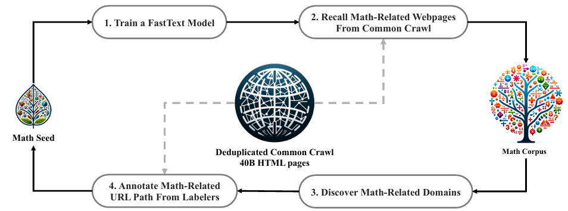
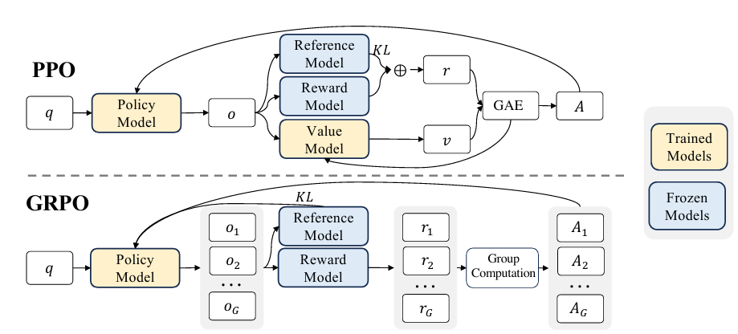

近年のLLMは指示学習した後に、[強化学習により回答の質を向上するという学習法](https://yoshishinnze.hatenablog.com/entry/2026/08/13/043000)が主流になっています。
ですが、強化学習の手法としてメインで使われいた手法もDPOから別の手法が主流となってきています。
その現在主流となりつつある強化学習法が2024年にDeepSeekから発表された方法GRPOです。

本日テーマ：
>GRPOについて説明

## GRPOとは
GRPO（Group Relative Policy Optimization）は、**大規模言語モデル（LLM）の強化学習（RL）を効率的に行うためのポリシー最適化アルゴリズム**です。DeepSeekなどのモデル学習で採用され、広く知られるようになりました。

### 報告論文
2024年に発表されたGRPOの原論文である **DeepSeekMath (arXiv:2402.03300)** には、清華大学と北京大学の研究者が**核心貢献者（Core contributors）** として名を連ねています。

__該当論文の明細__

| 項目 | 内容 |
|------|------|
| **タイトル** | DeepSeekMath: Pushing the Limits of Mathematical Reasoning in Open Language Models |
| **arXiv** | [2402.03300](https://arxiv.org/abs/2402.03300) |
| **初版投稿日** | 2024年2月5日 |
| **最終版** | v3（2024年4月27日） |

__核心貢献者__

| 著者 | 所属 | 役割 |
|------|------|------|
| **Zhihong Shao**（シャオ・ジホン） | DeepSeek-AI / **清華大学** | 核心貢献者（共著） |
| **Peiyi Wang**（ワン・ペイイ） | DeepSeek-AI / **北京大学** | 核心貢献者（共著） |
| **Qihao Zhu**（ジュー・チーハオ） | DeepSeek-AI / **北京大学** | 核心貢献者（共著） |

※ この3名は論文中で「Core contributors（核心貢献者）」として明示されており、GRPOのアルゴリズム設計と実験に中心的な役割を果たしました。また、いずれもDeepSeek-AIでの**インターンシップ中**に本研究を行ったことが注記されています。


### GRPOの基本アイデア

従来の[PPO（Proximal Policy Optimization）](https://yoshishinnze.hatenablog.com/entry/2026/08/10/043000)では、**価値関数（Value Function / Critic）** を別途学習し、それを基準にして各サンプルの良さ（アドバンテージ）を計算します。しかし、LLMでは：

- CriticもLLMと同等の巨大なモデルになり、**メモリと計算コストが2倍**になる
- 生成テキストの価値を正確に推定するのが**非常に困難**

GRPOはこの問題を、**「同じ問題に対して複数の回答を生成し、それら同士で相対評価をする」** ことで解決します。



### 仕組み（3ステップ）

__1. グループサンプリング__

1つの質問（プロンプト）に対し、現在の[ポリシー](https://yoshishinnze.hatenablog.com/entry/2026/08/03/043000)から**G個の異なる回答をグループとして生成**します。

__2. 相対的報酬の正規化__

生成されたG個の回答それぞれに報酬を与え、**グループ内での相対位置**で正規化します。

```
正規化報酬 = (報酬 - グループ平均) / グループ標準偏差
```

これにより、Criticなしで「この回答はグループ内で平均より良いか悪いか」を直接計算できます。

__3. ポリシー更新__

正規化された報酬を使い、PPOと同様のクリップ付き目的関数でポリシーを更新します。高報酬の回答の生成確率を上げ、低報酬の回答の確率を下げます。

### PPOとの比較

| 項目 | PPO | GRPO |
|------|-----|------|
| **Critic（価値関数）** | 必要（別モデル） | **不要** |
| **メモリ使用量** | ポリシー + Criticの2倍 | ポリシーのみで済む |
| **報酬の基準** | Criticが推定した期待値 | グループ内の相対評価 |
| **サンプル効率** | 1プロンプトあたり1回答 | 1プロンプトあたりG回答 |
| **計算コスト** | 高い | **大幅に低減** |



### なぜLLMに適しているか

- **Critic不要**: テキスト生成の価値推定は本質的に難しく、相対評価の方が安定する
- **メモリ効率**: 巨大なLLMを2つ載せる必要がなく、同じGPUで大きなモデルを学習可能
- **報酬モデルの多様性に強い**: 絶対スコアではなく相対比較なので、報酬モデルのバイアスに頑健

### 一言でまとめると

> **「同じ問題に対する複数回答をグループで生成し、互いの相対評価でCriticなしにポリシーを更新する、LLM向けの軽量・効率的な強化学習アルゴリズム」**

これがGRPOです。

## 解決しようとした課題

GRPOが解決しようとした課題は、**大規模言語モデル（LLM）に従来のPPO（Proximal Policy Optimization）を適用した際に生じる3つの根本的な問題**です。

### 課題1：Criticモデルの巨大なメモリ・計算コスト

PPOでは、ポリシーモデル（Actor）と別に**価値関数を推定するCriticモデル**が必要です。

- LLMの場合、CriticもActorと**同等の巨大なモデル**になる
- 結果、**GPUメモリが2倍**必要になり、大規模モデルの学習が現実的でなくなる
- 学習時の計算コストも2倍に近く増大

GRPOは**Criticを完全に排除**し、グループ内の相対評価で代用することで、この問題を解決しました。

### 課題2：LLMにおける「価値推定」の本質的困難さ

Criticの役割は「現在の状態（プロンプト）から、どの程度の報酬が期待できるか」を推定することですが、**テキスト生成タスクではこれが極めて困難**です。

- 1つのプロンプトに対し、**正解は無数に存在**する（数学問題でも複数の導出経路がありうる）
- 部分生成列の価値を正確に見積もるのは、人間にも困困難な曖昧な問題
- Criticの推定誤差がそのままポリシー更新のノイズになる

GRPOは「絶対的な価値推定」を放棄し、**同じ問題に対する複数回答の相対比較**に置き換えることで、この困難を回避しました。

### 課題3：報酬モデルのバイアスとスケーリングの不安定さ

PPOではCriticが絶対的な基準を提供しますが、実際には：

- 報酬モデル（人間の好みを学習したモデル）には**バイアスや誤差**が含まれる
- 絶対スコアで学習すると、報酬モデルの傾向に**過度に適合（over-optimize）** するリスクがある
- スコアの絶対値が変動しても、Criticの基準との相対差が重要になるため、**スケーリングの調整が難しい**

GRPOはグループ内で**平均ゼロ・分散1に正規化**するため、報酬モデルの絶対的な傾向やスケールに頑健になります。

### GRPOが解決したこと

| 従来PPOの問題 | GRPOの解決策 |
|-------------|------------|
| Criticモデルがメモリ・計算を2倍にする | **Criticを廃止** |
| テキスト生成の価値推定が本質的に困難 | **相対評価に置き換え** |
| 報酬モデルのバイアス・スケールに敏感 | **グループ内正規化で頑健化** |

> **一言でまとめると**：「LLMの強化学習において、巨大なCriticモデルを使わずに、安定して効率的にポリシーを改善する方法」をGRPOは提示しました。

## GRPOの原理

GRPOがなぜうまくいくのか、原理について説明していきます。

### 1. 原理：GRPOは「同じ問題の複数回答を、互いに採点し合う」

__具体例__

数学の問題「1+1=？」に対し、モデルが5つの回答を生成したとします。

| 回答 | 内容 | 報酬 |
|------|------|------|
| A | 「1+1=2。なぜなら…」 | 0.9 |
| B | 「1+1=2」 | 0.8 |
| C | 「1+1=3」 | 0.1 |
| D | 「2」 | 0.7 |
| E | 「答えは2です」 | 0.85 |

**PPOの場合**: Criticが「この問題に対する期待報酬は0.67です」と予測し、各回答がそれより良いか悪いかを個別に評価。しかしCriticも巨大なLLMで、予測に誤差が入りやすい。

**GRPOの場合**: 「このグループの平均報酬は0.67、標準偏差は0.3です」という**統計量だけ**を使い、各回答を相対評価。

```
Aの相対スコア = (0.9 - 0.67) / 0.3 = +0.77  ← 良い回答
Cの相対スコア = (0.1 - 0.67) / 0.3 = -1.9   ← 悪い回答
```

そして、**良い回答（A, B, E）の生成確率を上げ、悪い回答（C）の確率を下げる**ようにポリシーを更新します。

### 2. なぜうまくいくのか：3つの理由

__理由①：「比較」は「絶対値予測」より遥かに簡単__

人間にも当てはまりますが、**「この絵画の価値はいくらか？」** と聞かれるより、**「AとBの絵画、どちらが良いか？」** と聞かれる方が、はるかに正確に答えられます。

PPOのCriticは「絶対的な価値」を予測しようとしますが、これはLLMの生成空間では本質的に困難です。GRPOは **「どちらが良いか」という相対的な順序だけ** を使うため、評価の信頼性が飛躍的に高まります。

__理由②：報酬モデルの「傾き」や「バイアス」を自動的に打ち消す__

報酬モデルは完璧ではなく、以下のような偏りを持つことがあります。

- **全体的に厳しい採点者**: 全回答のスコアが0.1〜0.3に偏る
- **全体的に甘い採点者**: 全回答のスコアが0.8〜0.9に偏る
- **特定の文体を好む**: 「ですます調」を高評価しがち

GRPOは**グループ内で平均を引き、標準偏差で割る**ため：

```
平均 0.2、標準偏差 0.05 の分布 → 正規化後は平均0、分散1
平均 0.8、標準偏差 0.05 の分布 → 正規化後も平均0、分散1
```

**採点者の絶対的な基準や傾きが消え、純粋に「このグループ内での相対的な良さ」だけ**が残ります。これが、報酬モデルのバイアスに対する強い頑健性を生み出します。

__理由③：グループ内比較が「自然な勾配の分散削減」を生む__

GRPOのポリシーグラディエントは、数学的に見ると**U-statistic**（一種の「ペア比較の平均」）になっています。

直感的には、**1つのサンプルではなくG個のサンプルを同時に比較することで、モンテカルロ推定の分散が自然に小さくなる**のです。これは「1回の試行で得る情報量が増える」ことと同じで、より安定した学習が可能になります。

### 3. 理論的な裏付け：GRPOの「本質」

最近の研究で明らかになった重要な性質として、以下の2つがあります。

__Oracle Property（神託的性質）__

GRPOの推定対象である「最適な比較関数G*」を使うと、**ポリシーの更新が「もし真の環境ダイナミクスを完全に知っていた場合」と同じ方向・同じスケールで進む**ことが証明されています。

つまり、GRPOは「不完全な情報から、統計学的に最適な方法で学習している」ということです。

__U-statisticとしての性質__

GRPOの勾配は、すべての回答ペアの比較を含む**U-statistic**です。これにより：

- **サンプル効率が高い**: 同じデータから最大限の情報を引き出す
- **漸近的に最適な収束**: データが増えると、真の勾配に確実に近づく

### 4. 直感的なまとめ：GRPOの「コツ」

GRPOの成功を一言で表すと：

> **「絶対的な正解を予測しようとするのではなく、同じ条件での複数試行を『内部で相対評価』することで、評価者のバイアスを排除し、安定した学習信号を得る」**

これは人間の学習にも通じます。生徒が「自分の答案が100点満点で何点か？」を毎回正確に予測するのは難しいですが、「同じ問題を解いた5人の中で自分は上位か下位か？」を感じ取る方が、はるかに正確で、かつ役立つフィードバックになります。GRPOはまさにこの「相対的フィードバック」の力を、数学的に洗練させたアルゴリズムです。

## 実験

GRPOの論文（主に **DeepSeekMath** (Shao et al., 2024) と **DeepSeek-R1** (Guo et al., 2025)）で報告されている実験設定と結果をまとめます。

### 実験設定

__モデルとデータ__

| 項目 | DeepSeekMath | DeepSeek-R1-Zero |
|------|-------------|------------------|
| **ベースモデル** | DeepSeek-Coder-Base-v1.5 7B | DeepSeek-V3-Base |
| **モデルサイズ** | 7B | 671B（MoE） |
| **訓練データ** | 英語インストラクションチューニングデータのサブセット | 推論タスク向けプロンプト（SFTなし） |
| **事前学習** | 120B数学トークンで継続事前学習済み | 一般事前学習済み |

__GRPOのハイパーパラメータ__

| パラメータ | 設定値 |
|-----------|--------|
| **グループサイズ（G）** | 64（各プロンプトに対して64個の回答を生成） |
| **KL係数** | 0.01程度（ポリシーが参照モデルから大きく逸脱しないよう制約） |
| **報酬設計** | 回答の正解/不正解によるバイナリ報酬（数学問題） |
| **最適化** | AdamW、学習率はモデルサイズに応じて調整 |
| **学習ステップ** | 数千〜数万ステップ |

__比較手法__

- **PPO**: 従来のActor-Critic型（Criticモデルあり）
- **RFT (Rejection Sampling Fine-Tuning)**: 高報酬サンプルでの教師あり学習
- **DPO (Direct Preference Optimization)**: ペアワイズ比較による学習
- **SFTのみ**: 教師ありファインチューニング（ベースライン）

### 実験結果

__1. DeepSeekMath 7B の GRPO 適用結果__

英語・中国語の数学ベンチマークで、**同じインストラクションチューニングデータを使ったSFTモデルに対し、GRPOを追加適用**した結果：

| ベンチマーク | SFTのみ (Instruct) | SFT + GRPO | 改善幅 |
|------------|-------------------|-----------|--------|
| **GSM8K**（小學算術） | 82.9% | **88.2%** | +5.3% |
| **MATH**（競技数学） | 46.8% | **51.7%** | +4.9% |
| **CMATH**（中国語算術） | 84.6% | **88.8%** | +4.2% |
| **SAT-Math** | 84.1% | **88.2%** | +4.1% |
| **MMLU-STEM** | 58.1% | **60.6%** | +2.5% |

**ポイント**: 追加データなしで、**既存のSFTモデルをGRPOだけで大幅に改善**。特に競技レベルのMATHベンチマークで51.7%は、当時のオープンモデルで最高クラス。

__2. DeepSeek-R1-Zero（純粋RL）の結果__

**SFTを一切使わず、ベースモデルに直接GRPOを適用**した場合：

| ベンチマーク | 初期 | GRPO適用後 | 改善幅 |
|------------|------|-----------|--------|
| **AIME 2024** (pass@1) | 15.6% | **71.0%** | +55.4% |
| **AIME 2024** ( majority vote@64) | — | **86.7%** | — |
| **MATH-500** | — | **約90%以上** | — |

**驚くべき発見**: 数千ステップのRLだけで、モデルは**自己検証（self-verification）** や**反思（reflection）** といった複雑な推論行動を**自然に獲得**しました。これは「教師なしで推論能力が湧き出る」ことを示しました。

__3. PPO vs GRPO の比較__

| 指標 | PPO | GRPO |
|------|-----|------|
| **メモリ使用量** | ポリシー + Criticで約2倍 | **ポリシーのみで済む** |
| **GSM8K精度** | 約85%程度 | **88.2%** |
| **学習安定性** | Criticの価値推定誤差で不安定になりやすい | **グループ内相対評価で安定** |
| **訓練時間** | 長い | **短い（Critic学習が不要）** |

__4. 追加実験：学習パラダイムの比較__

DeepSeekMath論文では、以下の実験も行われています：

| 実験 | 結論 |
|------|------|
| **Online vs Offline** | Online（生成と学習を繰り返す）の方がOffline（固定データ）より高精度 |
| **Outcome vs Process Supervision** | 最終回答の正解だけを報酬とするOutcome supervisionで十分。過程まで監督する必要なし |
| **Single-turn vs Iterative RL** | 反復的なRL（複数ラウンド）でさらに改善の余地あり |
| **GRPO vs DPO** | GRPOが数学推論でDPOを上回る。DPOはペアデータが必要だがGRPOは不要 |

### 実験が示唆すること

| 主張 | 実験的証拠 |
|------|----------|
| **Critic不要でも高精度** | GRPOがPPOと同等以上の精度で、メモリ半分 |
| **SFTなしで推論能力が湧く** | DeepSeek-R1-ZeroがRLだけでAIME 71%達成 |
| **汎化性能も向上** | 英語で学習したGRPOが中国語数学（CMATH）も改善 |
| **報酬設計はシンプルで十分** | 正解/不正解のバイナリ報酬だけで強力な推論が学習可能 |

