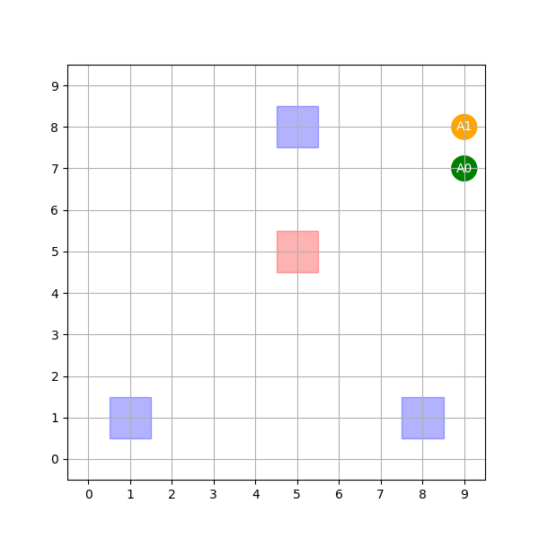

QMIXによる倉庫問題、学習コードがようやく完成しました。
結果は今一つでしたが。

今後の改善点を整理していきます。

## どんな実装を行ったか

メインはQMIXです。

→個々のエージェントと、集中管理のエージェントを用意して、強化学習。

```python
class RNNAgent(nn.Module):
    def __init__(self, input_shape, hidden_dim, n_actions):
        super().__init__()
        self.hidden_dim = hidden_dim
        self.n_actions = n_actions

        # 観測を入力とする線形層
        self.fc1 = nn.Linear(input_shape, hidden_dim)
        # 履歴を扱うGRUセル
        self.rnn = nn.GRUCell(hidden_dim, hidden_dim)
        # 隠れ状態から行動のQ値を出力する線形層
        self.fc2 = nn.Linear(hidden_dim, n_actions)

    def init_hidden(self):
        # 隠れ状態をゼロで初期化
        return self.fc1.weight.new_zeros(1, self.hidden_dim)

    def forward(self, inputs, hidden_state):
        # inputs: 局所的な観測 (obs_i)
        # hidden_state: 前ステップの隠れ状態 (h_t-1)

        x = F.relu(self.fc1(inputs))
        # GRUによる隠れ状態の更新
        h_in = hidden_state.reshape(-1, self.hidden_dim)
        h = self.rnn(x, h_in)
        # Q値の出力
        q = self.fc2(h)
        return q, h # Q値と新しい隠れ状態を返す
```

```python
class QMixer(nn.Module):
    def __init__(self, n_agents, state_shape, mixing_embed_dim, hypernet_embed_dim):
        super().__init__()
        self.n_agents = n_agents
        self.mixing_embed_dim = mixing_embed_dim
        # 1. ハイパーネットワークの定義
        # 環境状態 (state) を入力とし、Mixing Networkの重みW1を生成
        self.hyper_w1 = nn.Sequential(
            nn.Linear(state_shape, hypernet_embed_dim),
            nn.ReLU(),
            nn.Linear(hypernet_embed_dim, mixing_embed_dim * n_agents)
        )

        # バイアスb1も環境状態から生成
        self.hyper_b1 = nn.Linear(state_shape, mixing_embed_dim)

        # W2 (Mixing Networkの2層目の重み) を生成
        self.hyper_w2 = nn.Sequential(
            nn.Linear(state_shape, hypernet_embed_dim),
            nn.ReLU(),
            nn.Linear(hypernet_embed_dim, mixing_embed_dim)
        )

        # バイアスb2 (最終出力層のバイアス) を環境状態から生成
        self.hyper_b2 = nn.Sequential(
            nn.Linear(state_shape, hypernet_embed_dim),
            nn.ReLU(),
            nn.Linear(hypernet_embed_dim, 1)
        )

        # 2. 最終出力層（ダミー）
        # 実際にはハイパーネットワークが生成した重みで演算するが、サイズ調整のために定義
        self.V = nn.Sequential(nn.Linear(state_shape, mixing_embed_dim), nn.ReLU(), nn.Linear(mixing_embed_dim, 1))

    def forward(self, agent_qs, states):
        # agent_qs: 全エージェントのQ値 (batch_size, n_agents)
        # states: 環境の全体状態 (batch_size, state_shape)

        bs = agent_qs.size(0)

        # 1. 隠れ層 W1 の計算 (重みの生成と非負制約)
        W1 = self.hyper_w1(states).view(bs, self.n_agents, self.mixing_embed_dim)
        # 非負制約: 重みをReLUに通す
        W1 = F.relu(W1)

        # 2. 隠れ層 B1 (バイアス) の計算
        B1 = self.hyper_b1(states).view(bs, 1, self.mixing_embed_dim)

        # 3. 第1層の計算: (Q_i * W1) + B1
        # agent_qs: (bs, 1, n_agents), W1: (bs, n_agents, mixing_embed_dim)
        hidden = torch.bmm(agent_qs.unsqueeze(1), W1)
        # hidden: (bs, 1, mixing_embed_dim)
        hidden = F.relu(hidden + B1)

        # 4. 出力層 W2 の計算 (重みの生成と非負制約)
        W2 = self.hyper_w2(states).view(bs, self.mixing_embed_dim, 1)
        # 非負制約: 重みをReLUに通す
        W2 = F.relu(W2)

        # 5. 出力層 B2 (バイアス) の計算
        B2 = self.hyper_b2(states).view(bs, 1, 1)

        # 6. 第2層の計算: (hidden * W2) + B2
        # V(s)項 (全エージェントに共通のバイアス項)
        v = self.V(states).view(bs, 1, 1)

        # 最終的なQ_totの出力
        q_tot = torch.bmm(hidden, W2) + B2 + v
        # q_tot: (batch_size, 1, 1)
        return q_tot.squeeze()
```

```python
# QMixAgentの学習ロジックを統合するクラス
class IntegratedQMixAgent:
    def __init__(self, env: WarehouseEnv, obs_shape: int, state_shape: int, n_actions: int, lr=5e-4, gamma=0.99, mixing_embed_dim=32):
        self.env = env
        self.n_agents = env.num_agents
        self.n_actions = n_actions
        self.gamma = gamma
        self.device = torch.device("cuda" if torch.cuda.is_available() else "cpu")

        # RNNの隠れ状態をエージェントごとに保持
        self.hidden_states = {i: None for i in range(self.n_agents)}

        # ネットワークの初期化
        self.agent_net = RNNAgent(obs_shape, hidden_dim=64, n_actions=n_actions).to(self.device)
        self.mixer_net = QMixer(self.n_agents, state_shape, mixing_embed_dim, hypernet_embed_dim=64).to(self.device)

        self.target_agent_net = RNNAgent(obs_shape, hidden_dim=64, n_actions=n_actions).to(self.device)
        self.target_mixer_net = QMixer(self.n_agents, state_shape, mixing_embed_dim, hypernet_embed_dim=64).to(self.device)

        self.target_agent_net.load_state_dict(self.agent_net.state_dict())
        self.target_mixer_net.load_state_dict(self.mixer_net.state_dict())

        params = list(self.agent_net.parameters()) + list(self.mixer_net.parameters())
        self.optimizer = torch.optim.Adam(params, lr=lr)

    def init_hidden(self):
        """エピソード開始時に隠れ状態を初期化"""
        for i in range(self.n_agents):
            self.hidden_states[i] = self.agent_net.init_hidden().to(self.device)

    def _obs_to_tensor(self, obs: Dict[int, Tuple], is_state: bool = False):
        """環境の観測/状態をPyTorchテンソルに変換"""
        if is_state:
            # 全体状態 (全エージェントの位置 + 残り注文)
            state_vec = []
            for i in range(self.n_agents):
                state_vec.extend(list(obs[i][0])) # Agent i の位置 (x, y)
                state_vec.append(1.0 if obs[i][1] else 0.0) # Agent i が荷物を持っているか

            # 残り注文のOne-Hotエンコーディング (簡略化)
            remaining_orders_set = set(obs[0][2])
            for order_idx in range(NUM_ORDERS):
                state_vec.append(1.0 if order_idx in remaining_orders_set else 0.0)

            return torch.FloatTensor(state_vec).to(self.device).unsqueeze(0)
        else:
            # 局所観測 (Agent i の位置, 荷物持ち)
            tensors = {}
            for i in range(self.n_agents):
                obs_i = list(obs[i][0]) # 位置 (x, y)
                obs_i.append(1.0 if obs[i][1] else 0.0) # 荷物持ち

                # 敵エージェントの位置や状態も観測に入れる場合はここで拡張するが、ここでは局所観測のみ

                tensors[i] = torch.FloatTensor(obs_i).to(self.device).unsqueeze(0)
            return tensors

    def get_actions(self, obs: Dict[int, Tuple], epsilon: float) -> Dict[int, int]:
        """epsilon-greedy法で行動を選択し、隠れ状態を更新"""
        actions = {}
        if random.random() < epsilon:
            # 探索 (Exploration)
            for i in range(self.n_agents):
                actions[i] = random.randint(0, self.n_actions - 1)
        else:
            # 活用 (Exploitation)
            agent_obs_tensors = self._obs_to_tensor(obs, is_state=False)
            with torch.no_grad():
                for i in range(self.n_agents):
                    q_values, h_new = self.agent_net(agent_obs_tensors[i], self.hidden_states[i])
                    self.hidden_states[i] = h_new # 隠れ状態を更新
                    actions[i] = q_values.max(dim=-1)[1].item()
        return actions

    def learn(self, batch, target_update_interval):
        """バッチからサンプリングし、QMIX損失で学習"""

        # --- データ変換 ---
        # NOTE: 実際の学習では、リプレイバッファに格納する際にRNNの履歴（隠れ状態）も格納するのが一般的ですが、
        # ここでは簡略化し、バッチ内の各ステップを独立したトランジションとして扱います。

        current_state = torch.cat([self._obs_to_tensor(t[0], is_state=True) for t in batch], dim=0)
        next_state = torch.cat([self._obs_to_tensor(t[3], is_state=True) for t in batch], dim=0)
        rewards = torch.FloatTensor([sum(t[2].values()) for t in batch]).to(self.device) # チーム合計報酬
        terminated = torch.FloatTensor([all(t[4].values()) for t in batch]).to(self.device) # 終了フラグ

        # エージェントごとのアクション、観測をバッチ化
        actions_batch = torch.LongTensor([[t[1][i] for i in range(self.n_agents)] for t in batch]).to(self.device)
        obs_batch = [torch.cat([self._obs_to_tensor(t[0], is_state=False)[i] for t in batch], dim=0) for i in range(self.n_agents)]
        next_obs_batch = [torch.cat([self._obs_to_tensor(t[3], is_state=False)[i] for t in batch], dim=0) for i in range(self.n_agents)]

        # 1. 現在のQ_totの計算 (Hidden Stateはここではゼロ初期化)
        agent_qs = []
        for i in range(self.n_agents):
            # Q値を計算
            q_vals, _ = self.agent_net(obs_batch[i], self.agent_net.init_hidden().expand(len(batch), -1))
            # 実行されたアクションのQ値を選択
            chosen_q = torch.gather(q_vals, dim=1, index=actions_batch[:, i].unsqueeze(1))
            agent_qs.append(chosen_q)

        agent_qs = torch.cat(agent_qs, dim=1) # (batch_size, n_agents)
        q_tot = self.mixer_net(agent_qs, current_state)

        # 2. TDターゲットの計算 (Target Q_tot)
        target_agent_qs = []
        with torch.no_grad():
            for i in range(self.n_agents):
                target_q_vals, _ = self.target_agent_net(next_obs_batch[i], self.target_agent_net.init_hidden().expand(len(batch), -1))
                # 最大Q値を選択
                target_max_q = target_q_vals.max(dim=1)[0].unsqueeze(1)
                target_agent_qs.append(target_max_q)

            target_agent_qs = torch.cat(target_agent_qs, dim=1)
            target_q_tot = self.target_mixer_net(target_agent_qs, next_state)

        # ターゲット値: R + gamma * max Q_next * (1 - done)
        td_target = rewards.unsqueeze(1) + self.gamma * target_q_tot * (1 - terminated.unsqueeze(1))

        # 3. 損失の計算と最適化
        loss = F.mse_loss(q_tot, td_target.detach())

        self.optimizer.zero_grad()
        loss.backward()
        self.optimizer.step()

        return loss.item()

    def update_target_networks(self):
        """ターゲットネットワークの重みを更新"""
        self.target_agent_net.load_state_dict(self.agent_net.state_dict())
        self.target_mixer_net.load_state_dict(self.mixer_net.state_dict())
```

エージェントは行動価値ではなく、行動をそのまま出力させています。
これ以外は通常のQMixに準拠で学習させました。

エージェントは初期位置付近をうろうろしているパターンで方向性なく、という感じです。
報酬を得られなかったケースが考えられます。。。
この学習の難しい点です。。。



