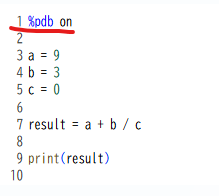
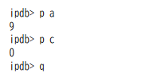
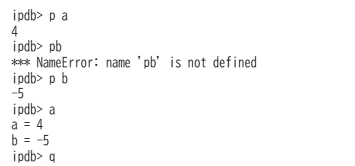
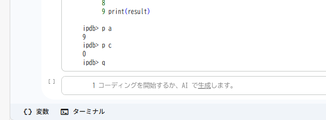
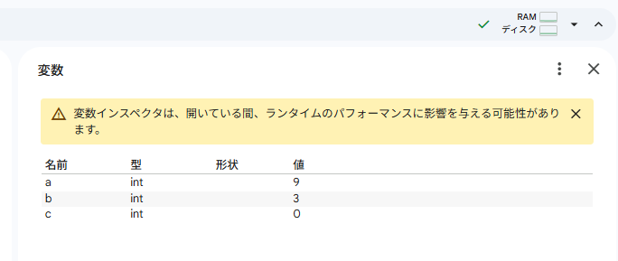

# Google Colabのデバッグ
google colabでデバッグに困ったため、インターネットの情報を基に調べてみました。
個人的に感触が良かったものを記載します。

## 1. マジックコマンド `%debug` を使う

コードがエラーで止まってしまった直後に、**「なぜ止まったのか」**を調べるのに最適です。

* **使い方:**
1. エラーが発生したセルの直後に、新しいセルを作り **`%debug`** とだけ入力して実行します。


2. ipdbという対話型デバッガが起動します。
3. 入力欄に変数名を入れるとその時の値が表示され、`u`（上へ移動）や `d`（下へ移動）でエラー箇所の前後の状況を確認できます。
* **終了方法:** `q`（quit）を入力して実行します。

デバッグ時のコマンドは以下を使います

- h [command]：ヘルプを出す
- p [expression]：式を評価して出力する
- n：次の行へ
- c：次のブレークポイントへ
- q：その場で終了する

お試しで以下を実行してみます。
0除算があるためエラーとなり、デバッグが起動します。

```python
%pdb on

a = 9
b = 3
c = 0

result = a + b / c

print(result)
```

デバッグモードでaやcの値を確認して、cによる0除算を確認出来ます。




## 2. `breakpoint()` 関数を使う（標準的な方法）

特定の場所でプログラムを一時停止させたい時に便利です。Python 3.7以降の標準機能です。

* **使い方:**
  **Python**

  ```
  def calculate_sum(a, b):
      result = a + b
      breakpoint()  # ここで実行が止まり、デバッグモードに入る
      return result
  ```
* **実行:** これを書いたセルを実行すると、その行で停止し、変数の値を確認できるプロンプトが表示されます。

```python
def calculate_sum(a, b):
    result = a + b
    breakpoint()  # ここで実行が止まり、デバッグモードに入る
    return result

calculate_sum(4, -5)
```



## 3. 変数インスペクタ

エラーが起きタイミングで現在の変数がどうなっているかを確認する方法です。

1. 画面下の"変数"を押す



2. 変数インスペクタ画面で変数の値を確認する




## 4. ログ出力（printデバッグ）の強化

デバッガを使うまでもない時は、`print()` を使いますが、Colab（Jupyter）では以下のツールも便利です。

* **`logging` モジュール:** 処理の経過を記録する。
* **`ic()` (icecream):** `pip install icecream` で利用可能。`ic(variable)` と書くだけで、変数名と値を綺麗に表示してくれるので、`print` よりも効率的です。


## おすすめの使い分け
以下がおすすめです。

* **「エラーが出た原因をすぐ見たい」** → 1の `%debug`。
* **「特定のループの中を確認したい」** → 2の `breakpoint()`。
* **「どこがおかしいか全く不明」** → 3の変数インスペクタを使う。


