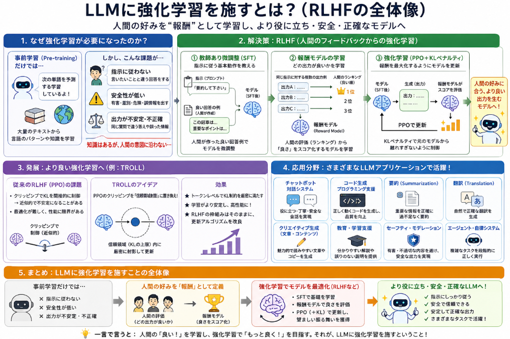

最近LLMの学習の定番は事前学習→教師あり学習→選好学習の流れです。
選好学習はLLMに強化学習を施して、知識文章だけでは学習できない経験知を学ばせる必要性から始められました。
今日はそんな **LLMに強化学習を施す** ということについて話していきたいと思います。

## そもそもの経緯
「LLMを強化学習する」という行為が**本格的に広まったのは、2022年前後**です。  
特に、**OpenAIのInstructGPT（2022年）** でRLHF（Reinforcement Learning from Human Feedback）が大規模に適用されたことが、大きな転換点とされています。

### 1. 代表的な起点：InstructGPT（2022年）

- **論文**：  
  *Training language models to follow instructions with human feedback*（InstructGPT）  
  arXiv:2203.02155（2022年3月投稿）[arXiv](https://arxiv.org/abs/2203.02155)
- **内容**：
  - GPT-3をベースに、**人間のフィードバックを用いた強化学習（RLHF）**でファインチューニング。
  - 人間が好む回答を報酬として学習し、**指示追従性・安全性・有用性**を向上。
- **意義**：
  - 「**LLM＋強化学習（RLHF）**」という組み合わせが、**実用的な規模で初めて大々的に示された**とされています[TuringPost](https://www.turingpost.com/p/rlhf)。

この論文以降、RLHFはChatGPTなど多くのLLMの「アライメント（人間の意図への適合）」手法として標準化されていきました。

### 2. それ以前の動き（2010年代後半〜2021年）

- **強化学習＋言語モデル**の組み合わせ自体は、2010年代後半から研究されていましたが、
  - モデル規模が小さく、
  - タスクも限定的（対話エージェント、テキストゲームなど）でした。
- **RLHFの概念**は、もともと強化学習の分野で「人間のフィードバックから報酬を学習する」手法として提案されていましたが、
  - **大規模言語モデルに適用されるようになったのは2020年頃から**です。
- 2021年頃には、**小規模な実験やプロトタイプ**でRLHFが試され始めましたが、**InstructGPT（2022）で一気に主流化**しました。

### 3. 2022年以降の広がり

- InstructGPT以降、RLHFは
  - **ChatGPT**
  - **AnthropicのClaude**
  - **GoogleのBard / Gemini系モデル**
  など、多くの商用LLMで採用されるようになりました[IBM](https://www.ibm.com/think/topics/rlhf)。
- また、**RLAIF（Reinforcement Learning from AI Feedback）** のように、人間の代わりに別のLLMが評価する手法も提案され、**LLMの強化学習のバリエーション**が増えています。

## 解決したい課題

LLMに強化学習が必要となった背景には、**事前学習（Pre-training）だけでは解決できない課題**がいくつかあります。主な課題感は以下の通りです。

### 1. 事前学習だけでは「指示に従うモデル」にならない

- LLMは巨大なテキストコーパスから**次の単語を予測する**ように学習されます。
- その結果、
  - 「**言語の統計的パターン**」は非常に詳しくなりますが、
  - 「**ユーザーの意図に沿って、役に立つ回答をする**」という能力は**直接学習されていません**。
- したがって、
  - ユーザーが「要約して」「コードを書いて」と指示しても、
  - モデルは**単に「それっぽい文章」を生成するだけ**で、**必ずしも指示通りには動かない**という問題があります。

**課題感**：  
「**言語モデルは知識は豊富だが、ユーザーの意図に沿って動くとは限らない**」

### 2. 安全性・有害性のコントロールが難しい

- 事前学習データには、**有害・偏見・誤情報を含むテキスト**も含まれます。
- そのまま使うと、
  - **差別的な発言**
  - **危険なアドバイス**
  - **誤った情報の生成**
  などが起こり得ます。
- 事前学習だけでは、「**どの出力が望ましくないか**」を**明示的に教えていない**ため、モデル自身は「悪い出力」を避けることができません。

**課題感**：  
「**モデルは有害な内容も平然と生成する。安全性を担保する仕組みが必要**」

### 3. 一貫性・信頼性の不足

- 事前学習モデルは、
  - **同じ質問に対して異なる回答**をすることがあります。
  - **事実と異なる内容（ハルシネーション）** を生成することもあります。
- これは、モデルが「**正しさ」や「一貫性」を直接最適化していない**ためです。

**課題感**：  
「**モデルの出力が不安定で、信頼できるツールとして使いにくい**」

### 4. 「望ましい振る舞い」を定義し、最適化する必要がある

- 上記の課題を解決するには、
  - **どのような出力が「良い」のか**
  - **どのような出力が「悪い」のか**
  を**明示的に定義**し、
  - モデルが**それを最大化（あるいは最小化）するように学習**する必要があります。
- しかし、これは**教師あり学習だけでは難しい**です。
  - なぜなら、「良い回答」の正解ラベルを**すべての入力に対して人手で付与するのは現実的ではない**からです。

**課題感**：  
「**人手で全データにラベルを付けるのは不可能。『良い／悪い』を効率的に教える方法が必要**」

### 5. 強化学習（特にRLHF）が解決しようとしたこと

強化学習、特に**RLHF（Reinforcement Learning from Human Feedback）** は、上記の課題に対して以下のようにアプローチします。

__(1) 報酬関数で「望ましさ」を定義__
- **人間の評価（ランキングやスコア）** から**報酬モデル**を学習し、
  - 「**人間が好む出力**」に高い報酬を与えるようにします。
- これにより、
  - **指示に従う**
  - **安全である**
  - **役に立つ**
  といった「望ましい振る舞い」を**報酬として定義**できます。

__(2) 強化学習で報酬を最大化__
- 報酬モデルを使って、**強化学習（PPOなど）** でモデルを更新します。
- これにより、
  - モデルは**報酬を最大化する方向に出力を調整**し、
  - **望ましい振る舞いを自ら探索・学習**します。

__(3) 人手ラベルの効率化__
- すべての出力に正解ラベルを付ける代わりに、
  - **一部の出力に対して人間がランキングや評価を行う**だけで済みます。
- 報酬モデルがその評価を学習し、**強化学習でモデル全体を改善**するため、**効率的にアライメント**が可能になります。

### 6. まとめ：LLMに強化学習が必要となった課題感

- **事前学習だけでは**：
  - 指示に従わない
  - 安全性が担保されない
  - 出力が不安定・不正確
- **これを解決するには**：
  - 「望ましい振る舞い」を**報酬として定義**し、
  - **強化学習でその報酬を最大化する**必要がある
- **RLHFなどの強化学習手法は**：
  - 人間のフィードバックから報酬を学習し、
  - モデルを「より役に立ち、安全で、指示に従う」方向に**自動で調整**する

というのが、LLMに強化学習が必要となった背景の課題感です。

## 解決手法

LLMの課題（指示に従わない・安全性が低い・出力が不安定など）に対して提案された代表的な手法は、**[RLHF（Reinforcement Learning from Human Feedback）](https://yoshishinnze.hatenablog.com/entry/2025/12/31/082922)**を中心とする**アライメント手法**です。

もう少し分解すると、以下のような流れで手法が提案・発展してきました。

### 1. RLHF（Reinforcement Learning from Human Feedback）

RLHFは、**人間のフィードバックから報酬を学習し、強化学習でモデルを調整する**手法です。  
代表的な実装（InstructGPT / ChatGPT など）では、以下の3ステップで行われます。

__(1) 教師あり微調整（Supervised Fine-Tuning, SFT）__
- **目的**：モデルに「指示に従う」という基本動作を教える。
- **方法**：
  - 人間が書いた「良い回答の例」をデータとして用意。
  - それを使って**教師あり学習**でモデルを微調整。
- **効果**：  
  モデルが**指示に応じた出力をある程度できるようになる**。

__(2) 報酬モデルの学習（Reward Model Training）__
- **目的**：どの出力が「良い」かを**自動で評価するモデル**を作る。
- **方法**：
  - 同じプロンプトに対する複数のモデル出力を人間が**ランキング（どちらが良いか）** する。
  - そのランキングデータから、**報酬モデル（Reward Model）** を学習。
- **効果**：  
  人間の好みを**報酬として近似**し、強化学習で使えるようにする。

__(3) 強化学習による微調整（RL Fine-Tuning）__
- **目的**：報酬モデルを使って、モデルを「より良い方向」に調整する。
- **方法**：
  - PPO（Proximal Policy Optimization）などの**強化学習アルゴリズム**を使用。
  - 報酬モデルが高いスコアを出す出力を**より生成しやすく**する。
  - 同時に、**KLペナルティ**をかけて、元のモデルから大きく離れすぎないように制御。
- **効果**：  
  モデルが**人間の好みに沿った出力**を**自ら探索して学習**する。

### 2. PPO＋KLペナルティ（標準的なRLHF）

- **PPO**：  
  ポリシー更新を安定させるための強化学習アルゴリズム。  
  LLMのRLHFでは、**PPOが事実上の標準**として使われています。
- **KLペナルティ**：  
  強化学習で報酬を最大化しすぎると、モデルが**元の言語能力を失ったり、出力が壊れたり**するため、  
  **元のモデルとのKLダイバージェンスにペナルティ**をかけ、**変化を抑える**手法です。

これが、**InstructGPT（2022）以降の多くのLLMアライメント**で採用されている基本形です。

### 3. その他のアライメント手法の発展

RLHF以外にも、以下のような手法が提案されています。

__(1) DPO（Direct Preference Optimization）__
- RLHFでは「報酬モデル→強化学習」という2段階が必要ですが、
- **[DPO](https://yoshishinnze.hatenablog.com/entry/2026/03/28/182456)** は、**報酬モデルを明示的に学習せず、直接「好ましい出力」を最適化**する手法です。
- 計算コストや実装の複雑さを減らしつつ、RLHFに近い性能を目指します。

__(2) RLAIF（Reinforcement Learning from AI Feedback）__
- 人間の代わりに**別のLLMが評価を行う**手法。
- 人間の負担を減らしつつ、RLHFと同等の効果を目指します。

__(3) 安全特化のアライメント__
- **有害な出力を避ける**ための追加の報酬設計や、
- **安全チェックモデル**との組み合わせなど、安全性に特化した手法も提案されています。

### 4. 発展手法
近年もこの分野は研究されていて例えばTROLLという手法が研究・提案されています。

- TROLL は、**上記のRLHFの「強化学習部分（PPO）」を改良する手法**です。
- 具体的には、
  - **PPOのクリッピング目的関数**を、
  - **離散トークン空間における信頼領域射影（TROLL）** に置き換えることで、
  - **より安定で高性能な強化学習**を実現しようとしています。
- つまり、
  - 「**RLHFの枠組みはそのままに、更新アルゴリズムそのものを信頼領域最適化で置き換える**」
  という提案です。

## 応用分野

RLHF（Reinforcement Learning from Human Feedback）などの「選好学習」は、現在、**LLMを使ったさまざまな実用アプリケーション**で応用されています。代表的な分野は以下の通りです。

### 1. チャットボット・対話システム

- **例**：ChatGPT, Claude, Bard などの**対話型AI**。
- **目的**：
  - ユーザーの質問に**役に立つ・安全・丁寧な回答**をする。
  - 有害な内容や不適切な発言を避ける。
- **選好学習の役割**：
  - 人間の評価（「この回答は良い／悪い」）から報酬モデルを学習し、
  - 強化学習で**会話の質を向上**させる[IBM](https://www.ibm.com/think/topics/rlhf)。

### 2. コード生成・プログラミング支援

- **例**：GitHub Copilot, Code Llama, ChatGPT のコード生成機能。
- **目的**：
  - 自然言語の仕様から**正しく動作するコード**を生成する。
  - バグが少なく、読みやすいコードを書く。
- **選好学習の役割**：
  - テストケースの通過率や人間の評価を報酬とし、
  - **コードの正しさ・品質**を強化学習で改善する。

### 3. 要約（Summarization）

- **例**：ニュース記事の要約、長文ドキュメントの要約。
- **目的**：
  - 重要な情報を**過不足なく**まとめる。
  - 事実に基づいた要約（ハルシネーションを減らす）。
- **選好学習の役割**：
  - 人間が「どの要約が良いか」を評価し、
  - 報酬モデルを通じて**要約の質**を最適化する[SuperAnnotate](https://www.superannotate.com/blog/rlhf-for-llm)。

### 4. 翻訳（Translation）

- **例**：ニューラル機械翻訳システムの品質向上。
- **目的**：
  - 自然で正確な翻訳。
  - 文化的なニュアンスや専門用語の適切な扱い。
- **選好学習の役割**：
  - 人間が翻訳の質を評価し、
  - 報酬モデルを使って**翻訳の自然さ・正確さ**を改善する。

### 5. クリエイティブライティング・コンテンツ生成

- **例**：ブログ記事、マーケティングコピー、ストーリー生成。
- **目的**：
  - 読みやすく、魅力的な文章を生成。
  - ブランドのトーンやスタイルに合わせる。
- **選好学習の役割**：
  - 人間が「どの文章が良いか」を評価し、
  - **文体・トーン・面白さ**を強化学習で調整する[Spark NLP](https://sparknlp.org/docs/en/tasks/text_generation)。

### 6. 教育・学習支援

- **例**：AIチューター、問題解説、レポート添削。
- **目的**：
  - 学習者に**分かりやすい説明**をする。
  - 誤った情報を教えない。
- **選好学習の役割**：
  - 教育者の評価から報酬モデルを学習し、
  - **教育的な価値の高い出力**を優先する[PMC](https://pmc.ncbi.nlm.nih.gov/articles/PMC11893184)。

### 7. 研究・学術支援

- **例**：論文の要約、関連研究の探索、アイデア出し。
- **目的**：
  - 正確で信頼できる情報提供。
  - 学術的な規範に沿った出力。
- **選好学習の役割**：
  - 研究者のフィードバックから報酬を学習し、
  - **学術的な正確性・信頼性**を高める。

### 8. セーフティ・モデレーション

- **例**：有害コンテンツの検出、不適切な発言の抑制。
- **目的**：
  - ユーザーを守るための**安全な出力**。
- **選好学習の役割**：
  - 「どの出力が危険か」を人間が評価し、
  - 報酬モデルを通じて**有害な出力を避ける**ように学習する[IBM](https://www.ibm.com/think/topics/rlhf)。

### 9. エージェント・自律システム

- **例**：ツールを使うエージェント、マルチステップ推論エージェント。
- **目的**：
  - 複雑なタスクを**段階的に正しく実行**する。
- **選好学習の役割**：
  - タスクの成功・失敗や人間の評価を報酬とし、
  - **エージェントの行動方針（ポリシー）**　を強化学習で改善する。

## 総括

本日扱ったLLMに強化学習を施すということについて総括していきます。

### 1. 背景：なぜLLMに強化学習が必要になったか

- LLMは**事前学習（Pre-training）** で「次の単語予測」を学ぶが、
  - **指示に従う**
  - **安全である**
  - **役に立つ**
  といった「**望ましい振る舞い**」は**直接学習されていない**。
- その結果、
  - 指示に従わない
  - 有害・誤情報を出す
  - 出力が不安定・不正確
  という課題が顕在化。

**→ 事前学習だけでは「良いモデル」にならないため、追加の学習ステップが必要。**

### 2. 解決策：RLHF（Reinforcement Learning from Human Feedback）

- **教師あり微調整（SFT）**：  
  人間の良い回答例で「指示に従う」基本動作を教える。
- **報酬モデル学習**：  
  人間のランキングから「どの出力が良いか」を学習し、**報酬として定義**。
- **強化学習（PPO＋KLペナルティ）**：  
  報酬を最大化するようにモデルを更新し、**望ましい振る舞いを自ら探索**。

**→ 人間の好みを報酬として定義し、強化学習でモデルを「より良い方向」に調整。**

### 3. 発展：TROLLなどの改良手法

- PPOの**クリッピング目的関数**は、**KL制約を間接的に近似するヒューリスティック**であり、不安定さや性能限界がある。
- **TROLL**は、PPOのクリッピングを**離散トークン空間における信頼領域射影**に置き換え、
  - **トークンレベルで厳密なKL制約**を課すことで、
  - **より安定で高性能な強化学習**を実現しようとする。

**→ RLHFの枠組みはそのままに、更新アルゴリズムそのものを信頼領域最適化で改良。**

### 4. 応用：どこで使われているか

- **チャットボット**（ChatGPT, Claude, Bard など）
- **コード生成**（GitHub Copilot など）
- **要約・翻訳・クリエイティブライティング**
- **教育・研究支援**
- **セーフティ・モデレーション**
- **エージェント・自律システム**

**→ ほぼすべてのLLM応用で、「人間が好む出力」を学ばせるために選好学習（RLHFなど）が使われている。**

### 5. 一言で総括

- **LLMは事前学習だけでは「知識はあるが、人間の意図に沿わない」。**
- **そこで、人間の好みを報酬として定義し、強化学習でモデルを「より役に立ち・安全・正確」な方向に調整する（RLHFなど）。**
- **TROLLのような改良手法は、その強化学習部分をより安定・高性能にするための研究。**

これが、LLMに強化学習を施すことの「全体像」と考えてます。

