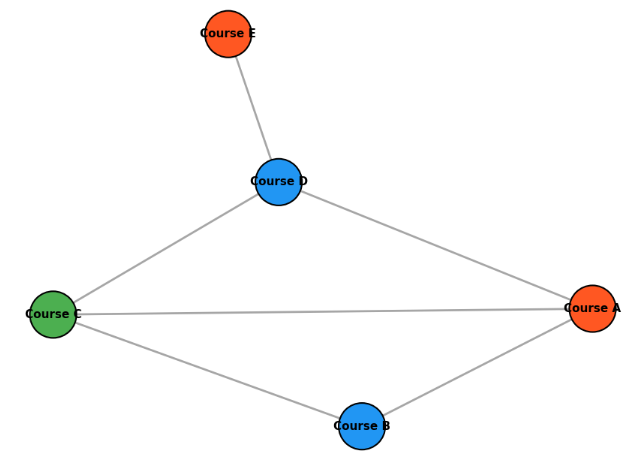
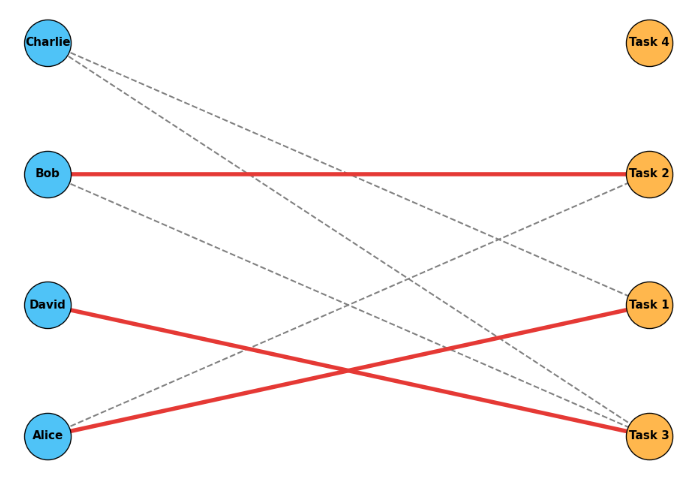
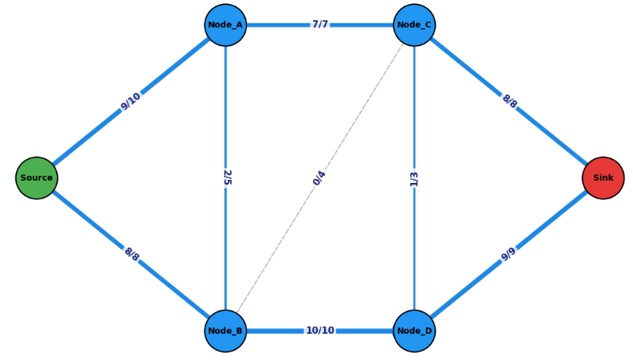
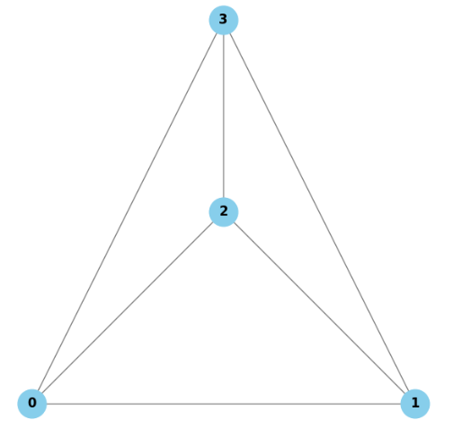
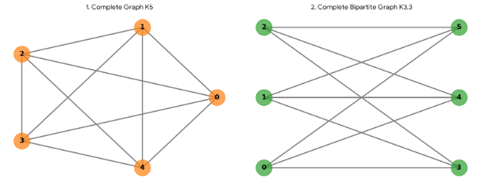
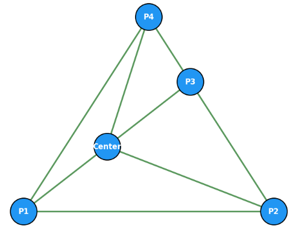
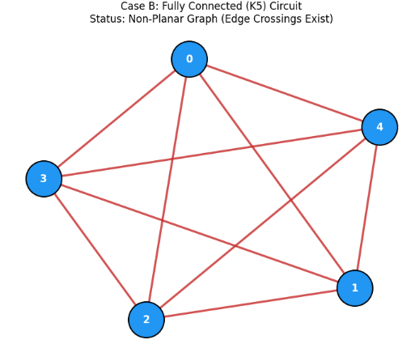

## グラフ理論が使われる理由

グラフ理論が必要となる理由は、**「関係性」や「つながり」を数学的に扱うための共通言語**だからです。  
現実世界の多くの問題は「もの」と「ものの関係」で成り立っていますが、それをうまく扱うためにグラフ理論が使われます。

### 1. 現実世界の「つながり」を扱うため

多くの問題は、単体のデータよりも「関係」が重要です。

- **SNSの友達関係**  
  → 誰が誰とつながっているかで、情報の広がり方や影響力が決まる。
- **交通網・物流**  
  → 駅や道路のつながり方で、最短経路や混雑が決まる。
- **Webページのリンク構造**  
  → どのページがどのページを参照しているかで、重要度（PageRankなど）が決まる。
- **分子構造・タンパク質相互作用**  
  → 原子や分子の結合パターンで、性質や機能が決まる。

これらはすべて「頂点（もの）」と「辺（関係）」で表せるため、**グラフとして扱うと一貫した方法で解析できる**ようになります。

### 2. 計算・アルゴリズム設計のため

グラフ理論は、**効率的な計算方法（アルゴリズム）を設計する基盤**になります。

- **最短経路問題**（Dijkstra法など）  
  → 地図アプリのルート検索、物流の配送計画
- **連結性の判定**  
  → ネットワークが分断されていないか、クラスタリング
- **最小全域木**  
  → 通信網や配電網のコスト最小設計
- **マッチング・フロー**  
  → 人員配置、資源配分、スケジューリング

これらは、グラフという抽象化があるからこそ、汎用的なアルゴリズムとして再利用できます。

### 3. ニューラルネットワークとの関連で見ると

ニューラルネットワークも「計算ユニットのつながり」です。

- **通常のニューラルネットワーク（MLPなど）**  
  → 層状のグラフとして理解できる。
- **グラフニューラルネットワーク（GNN）**  
  → 入力データ自体がグラフ（例：分子グラフ、ソーシャルグラフ）。

ここでグラフ理論が役立つのは：

1. **ネットワーク構造の設計**  
   - どのような結合パターンが表現力や学習効率に影響するかを考える。
2. **情報の流れの解析**  
   - どの経路で情報が伝播するか、ボトルネックはどこかを理解する。
3. **GNNの理論的基礎**  
   - グラフの性質（連結成分、中心性、コミュニティ構造など）を活かしたモデル設計ができる。

### 4. まとめ：なぜグラフ理論が必要か

- **共通言語として**：さまざまな分野の「つながり」を同じ枠組みで扱える。
- **効率的な計算のため**：グラフとして抽象化することで、汎用的なアルゴリズムが使える。
- **モデル設計のため**：ニューラルネットワークやGNNなど、ネットワーク型のモデルを理解・設計する基盤になる。

つまり、**「関係性が重要な問題」を数学的に扱い、効率的に解くために、グラフ理論が必要になる**と言えます。

## ノードと辺

グラフは、**「ノード（頂点）」と「辺（エッジ）」** という2つの要素から成り立っています。  
これらを理解すると、グラフが何を表しているのかがとても分かりやすくなります。

### 1. ノード（頂点、Vertex）

__定義__
- グラフの中で **「もの」や「対象」** を表す点のことです。
- 数学的には「頂点（vertex）」とも呼ばれます。

__役割__
- 現実世界の**実体**を抽象化したもの。
- 例：
  - SNSなら「ユーザー」
  - 路線図なら「駅」
  - Webなら「ページ」
  - 分子なら「原子」
  - ニューラルネットワークなら「ニューロン」

__特徴__
- ノードには**ラベル**や**属性（特徴量）** を持たせることができます。
  - 例：ユーザーの年齢、駅の乗降客数、ページのカテゴリなど。
- ノード同士は**辺**によって結ばれます。

### 2. 辺（エッジ、Edge）

__定義__
- ノードとノードの間の **「関係」や「つながり」** を表す線のことです。
- 数学的には「辺（edge）」と呼ばれます。

__役割__
- どのノードとどのノードが**関係しているか**を示します。
- 例：
  - SNSなら「友達関係」「フォロー」
  - 路線図なら「路線」
  - Webなら「リンク」
  - 分子なら「化学結合」
  - ニューラルネットワークなら「結合（重み付きの接続）」

__種類__

辺にも種類があります。方向性を持つものと、方向性のないもの、線自身につながりの強さの情報を持つものです。

- **無向辺**：方向がない（例：友達関係）
- **有向辺**：方向がある（例：フォロー、リンク）
- **重み付き辺**：距離・コスト・強さなどを表す数値が付く（例：道路の距離、結合の重み）

### 3. ノードと辺の関係

- グラフは、**ノードの集合**と**辺の集合**から成り立っています。
- 辺は必ず**2つのノードを結びます**（自己ループの場合は同じノードを2回結ぶ）。
- ノードだけがあっても「関係」は表せません。  
  → 辺があることで、「誰が誰とつながっているか」が表現されます。

### 4. ニューラルネットワークとの対応

ニューラルネットワークをグラフとして見ると：

- **ノード**：ニューロン（ユニット）
- **辺**：ニューロン間の結合（重み付きの有向辺）

例：多層パーセプトロン（MLP）
- 入力層・隠れ層・出力層の各ニューロンがノード
- 層間の結合が辺（通常は有向：前の層から次の層へ）
- 各辺には「重み」と「バイアス」が付いている

GNN（グラフニューラルネットワーク）では：
- 入力データ自体がグラフ（例：分子グラフ、ソーシャルグラフ）
- ノード＝対象（原子、ユーザー）
- 辺＝関係（結合、友達関係）
- モデルはこの構造を保ったまま学習する

グラフを絵で記載すると以下のようになります。
水色の部分がノード、ノード同士を接続する線が辺です。


## 有向グラフと無向グラフ

グラフ理論における「有向グラフ」と「無向グラフ」は、**辺（エッジ）に「方向」があるかどうか**で区別されます。

### 1. 無向グラフ（Undirected Graph）

__定義__
- 辺に**方向がない**グラフです。
- 頂点 A と B の間に辺がある場合、  
  「A と B は互いに結ばれている」という**対称的な関係**を表します。

__イメージ__
- 線に矢印が付いていない、ただの線で結ばれた図。
- 「友達関係」「道路（双方向通行）」「協力関係」など、**行き来が両方向に成り立つもの**に適しています。

__例__
- SNSの「友達」関係  
  → A が B の友達なら、B も A の友達。
- 路線図（双方向に走る路線）  
  → A駅からB駅へ行けるなら、B駅からA駅にも行ける。
- 分子の結合（共有結合）  
  → 原子Aと原子Bが結合しているなら、その関係は対称。

無向グラフは以下のようなものです。
ノードを結合する辺には方向がありません。各ノードは方向を持たない辺で結合されている訳です。


### 2. 有向グラフ（Directed Graph）

__定義__
- 辺に**方向がある**グラフです。
- 頂点 A から B への辺がある場合、  
  「A → B という一方向の関係」を表します。
- A → B の辺があっても、B → A の辺があるとは限りません。

__イメージ__
- 線に矢印が付いている図。
- 「フォロー」「リンク」「依存関係」など、**一方向の関係**を表すのに適しています。

__例__
- Twitterのフォロー関係  
  → A が B をフォローしていても、B が A をフォローしているとは限らない。
- Webページのリンク  
  → ページAからページBへのリンクがあっても、逆はないかもしれない。
- タスクの依存関係  
  → 「タスクBはタスクAが終わらないと開始できない」といった順序関係。

ぱっと見の無向グラフとの違いは辺に矢印があるかないかです。


### 3. 両者の違いのまとめ

| 項目 | 無向グラフ | 向グラフ |
|------|------------|----------|
| 辺の方向 | なし（双方向） | あり（一方向） |
| 関係の性質 | 対称的（A-B なら B-A） | 非対称（A→B でも B→A とは限らない） |
| 例 | 友達関係、道路（双方向） | フォロー、リンク、依存関係 |

### 4. ニューラルネットワークとの関連で見ると

- **通常のニューラルネットワーク（MLPなど）**  
  → 層間の結合は「入力層 → 隠れ層 → 出力層」という**向グラフ**として見ることが多いです。
- **双方向RNN（Bi-RNN）**  
  → 時間方向に前向き・後ろ向きの2つの向グラフが並んでいるイメージ。
- **GNN（グラフニューラルネットワーク）**  
  → 入力グラフが無向か有向かによって、情報の伝播の仕方を設計し分けることがあります。

## 次数

グラフ理論における**次数（degree）** は、**ある頂点（ノード）に接続している辺（エッジ）の数**を表す指標です。  
「その頂点がどれだけ多くの他の頂点とつながっているか」を数値化したもの、と考えると分かりやすいです。

### 1. 無向グラフでの次数

無向グラフでは、次数は単純に「その頂点に接続している辺の本数」です。

__例__
- 頂点 A に辺が3本つながっている → 次数 = 3
- 孤立した頂点（辺が0本） → 次数 = 0

__イメージ__
- SNSの友達数：あるユーザーが何人と友達か
- 駅の路線数：ある駅に何本の路線が通っているか

### 2. 有向グラフでの次数

有向グラフでは、辺に方向があるため、次数は2つに分かれます。

__(1) 入次数（In-degree）__
- その頂点**に向かってくる**辺の数
- 例：Twitterで「フォローされている数」

__(2) 出次数（Out-degree）__
- その頂点**から出ていく**辺の数
- 例：Twitterで「フォローしている数」

__例__
- 頂点 A に「B→A」「C→A」の2本の辺が入ってきて、  
  「A→D」の1本の辺が出ていく場合：
  - 入次数 = 2
  - 出次数 = 1
  - 総次数（入次数＋出次数） = 3

### 3. 次数の性質

- **次数の合計**  
  無向グラフでは、すべての頂点の次数の合計は「辺の本数 × 2」になります（1本の辺が2つの頂点の次数に寄与するため）。
- **平均次数**  
  グラフ全体の「つながりの密さ」を表す指標として使われます。
- **次数分布**  
  どの程度の次数を持つ頂点が多いか（例：多くの頂点が次数1〜2か、一部の頂点が非常に高い次数を持つか）を調べると、ネットワークの特徴（スケールフリー性など）が分かります。

### 4. ニューラルネットワークとの関連

ニューラルネットワークをグラフとして見ると：

- **ノード**：ニューロン
- **辺**：結合（重み付きの有向辺）

このとき、あるニューロンの**入次数**は「入力結合の数」、**出次数**は「出力結合の数」に対応します。

- 入次数が大きいニューロン：多くの情報を受け取る「集約ポイント」
- 出次数が大きいニューロン：多くのニューロンに情報を送る「分配ポイント」

GNN（グラフニューラルネットワーク）では、各ノードの次数を考慮して「近傍からどれだけ情報を集約するか」を設計することがあります。

### 5. 次数を考える理由

次数を考える理由は、**「その頂点がネットワーク内でどれだけ重要か・どのような役割を担っているか」を手軽に測るため**です。

- **重要度の指標**：次数が高い頂点は、情報のハブや交通の要所になりやすい。
- **ネットワーク構造の理解**：次数分布を見ると、密か疎か、ハブの有無などが分かる。
- **アルゴリズム設計**：最短経路・拡散・コミュニティ検出などで、次数が挙動に影響する。
- **ニューラルネットワーク設計**：入出力の集約・分配の観点から、次数を考慮した設計ができる。

つまり、**「つながりの数」という単純な指標から、ネットワークの性質や挙動に関する多くの情報が得られる**ため、次数を考える必要があります。

## パス

グラフ理論における**パス（path）** は、**「ある頂点から別の頂点へ、辺をたどって移動する経路」** のことです。  
「どのようにたどり着くか」という**移動の道筋**を表す概念です。

### 1. パスの定義

- **頂点の列**：  
  例：`A → B → C → D`
- **辺の列**：  
  例：`(A,B), (B,C), (C,D)`
- 条件：
  - 隣り合う頂点の間に辺が存在する
  - 通常は**同じ頂点を2回以上通らない**（単純パス）

__例__
- 路線図で「A駅 → B駅 → C駅」と乗り換える経路
- Webページのリンクをたどって「ページA → ページB → ページC」と移動する経路

### 2. パスの種類

__(1) 単純パス（Simple Path）__
- 同じ頂点を2回以上通らないパス
- 例：`A → B → C`（A,B,Cはすべて異なる）

__(2) ウォーク（Walk）__
- 同じ頂点や辺を繰り返し通ってもよい、より緩い概念
- 例：`A → B → A → C`

__(3) 閉路（Cycle）__
- 始点と終点が同じパス
- 例：`A → B → C → A`

### 3. パスが重要な理由

__(1) 到達可能性の判定__
- ある頂点から別の頂点へ**たどり着けるかどうか**を調べる。
- 例：ネットワークが分断されていないか、通信が可能か。

__(2) 最短経路問題__
- パスの中でも**辺の数や重みの合計が最小**のものを求める。
- 例：地図アプリの最短ルート検索、物流の配送計画。

__(3) 情報の伝播・拡散__
- パスを通じて情報や影響が伝わる経路を理解する。
- 例：SNSでの情報拡散経路、感染症の感染経路。

### 4. ニューラルネットワークとの関連

ニューラルネットワークをグラフとして見ると：

- **パス**：入力から出力まで、ニューロンと結合をたどる**情報の流れの経路**
- 例：入力層 → 隠れ層1 → 隠れ層2 → 出力層

ここでパスを考えると：

- **どの経路で情報が伝わるか**（ボトルネックの特定）
- **深いネットワークでの勾配の伝播**（バックプロパゲーションの経路）
- **GNNでの近傍情報の集約**（何ステップ先の情報まで届くか）

といった点が理解しやすくなります。

### 5. 必要性

パスという概念が必要なのは、**「どこからどこへ、どのようにたどり着くか」という移動や伝播の道筋を数学的に扱うため**です。

- **到達可能性**：ある頂点から別の頂点へ行けるかどうかを判定する。
- **最短経路・効率化**：どの道を通るのが一番良いか（最短・最小コスト）を求める。
- **伝播・拡散**：情報や影響がどの経路で広がるかを解析する。
- **ニューラルネットワーク**：入力から出力までの情報の流れや勾配の伝播経路を理解する。

つまり、**「つながり」だけでなく「動き」や「流れ」を扱うために、パスという概念が不可欠**です。

__例題:__ 

ここで例題を挟んでみようと思います。

NetworkX と可視化ライブラリ Matplotlib を使うことで、グラフの構築とノード間パスの可視化を簡単に実装できます。

ランダムなグラフを生成し、指定したスタートノードからゴールノードまでの「最短パス」をハイライトするコードを実装してみようと思います。

```python
import matplotlib.pyplot as plt
import networkx as nx

# 1. グラフの構築（ランダムグラフの生成、または手動での追加）
# ここでは10個のノードを持つランダムなグラフ（Erdős-Rényiモデル）を作成します
G = nx.erdos_renyi_graph(n=10, p=0.3, seed=42)

# ノード間の接続が担保されていない場合に備えて連結成分を確認
if not nx.is_connected(G):
    # 最大の連結成分を取得して再構築
    largest_cc = max(nx.connected_components(G), key=len)
    G = G.subgraph(largest_cc).copy()

# 2. パスを探すスタートとゴールのノードを指定
start_node = list(G.nodes())[0]
target_node = list(G.nodes())[-1]

# 最短パス（Shortest Path）の計算
path = nx.shortest_path(G, source=start_node, target=target_node)
print(f"探索されたパス: {path}")

# 3. パスに含まれるエッジ（辺）のリストを作成
path_edges = list(zip(path[:-1], path[1:]))

# 4. 可視化の設定
plt.figure(figsize=(8, 6))

# ノードの配置（レイアウト）を決める
pos = nx.spring_layout(G, seed=42)

# --- 基本のグラフを描画 ---
# 全体のノードを描画
nx.draw_networkx_nodes(G, pos, node_color="lightblue", node_size=700)
# 全体のエッジを描画
nx.draw_networkx_edges(G, pos, edge_color="gray", width=1.5, alpha=0.6)
# ノードのラベルを描画
nx.draw_networkx_labels(G, pos, font_size=12, font_family="sans-serif")

# --- パス（通過ルート）をハイライト描画 ---
# パス上のノードを強調
nx.draw_networkx_nodes(
    G, pos, nodelist=path, node_color="orange", node_size=800
)
# スタートとゴールをさらに強調
nx.draw_networkx_nodes(
    G, pos, nodelist=[start_node], node_color="green", node_size=900
)
nx.draw_networkx_nodes(
    G, pos, nodelist=[target_node], node_color="red", node_size=900
)

# パス上のエッジを強調
nx.draw_networkx_edges(
    G, pos, edgelist=path_edges, edge_color="red", width=3.5
)

# 凡例・タイトルの設定
plt.title(
    f"Graph Path Visualization ({start_node} -> {target_node})", fontsize=14
)
plt.axis("off")  # 軸を非表示にする
plt.tight_layout()

# 表示
plt.show()
```

出力は以下のようになります。
因みに、グラフ自体はランダムに作成しているので実行する度に形状が変わることになります。


## サイクル

グラフ理論における**サイクル（cycle）** は、**「始点と終点が同じで、同じ頂点を2回以上通らない閉じた経路」** のことです。  
「一周して元に戻るループ」を数学的に表したもの、と考えると分かりやすいです。

### 1. サイクルの定義

- **頂点の列**：  
  例：`A → B → C → A`
- **辺の列**：  
  例：`(A,B), (B,C), (C,A)`
- 条件：
  - 始点と終点が同じ頂点
  - 途中の頂点はすべて異なる（同じ頂点を2回通らない）
  - 辺も重複しない（単純サイクル）

__例__
- 路線図で「A駅 → B駅 → C駅 → A駅」と一周して戻るルート
- 分子構造で「原子A–原子B–原子C–原子A」と環状に結合した構造

### 2. サイクルの種類

__(1) 単純サイクル（Simple Cycle）__
- 同じ頂点・辺を繰り返さないサイクル
- 例：`A → B → C → A`

__(2) 偶サイクル・奇サイクル__
- サイクルに含まれる**辺の数が偶数か奇数か**で分類
- 例：三角形（3辺）は奇サイクル、四角形（4辺）は偶サイクル

__(3) ハミルトンサイクル__
- グラフの**すべての頂点を1回ずつ通る**サイクル
- 例：すべての都市を1回ずつ訪れて出発点に戻る旅行ルート

### 3. サイクルが重要な理由

__(1) グラフの性質の判定__
- **木（ツリー）** はサイクルを持たないグラフです。
- サイクルの有無で、「木かどうか」「ループがあるか」を判定できます。

__(2) ネットワークの安定性・冗長性__
- サイクルがあると、ある経路が壊れても別の経路で迂回できる可能性があります。
- 例：道路網や通信網で、迂回路があるかどうか。

__(3) アルゴリズム設計__
- 最短経路探索で、サイクルがあると無限ループに陥る可能性があるため、適切に扱う必要があります。
- トポロジカルソート（順序付け）は、**サイクルがない有向グラフ**に対して定義されます。

### 4. ニューラルネットワークとの関連

ニューラルネットワークをグラフとして見ると：

- **フィードフォワードネットワーク（MLPなど）**  
  → サイクルがない有向グラフ（DAG）。情報が一方向に流れる。
- **リカレントニューラルネットワーク（RNN）**  
  → 時間方向にサイクルを持つ（自己ループやフィードバック）。過去の情報を再利用する。

サイクルを考えることで：

- **情報の循環**（過去の状態が未来に影響するか）
- **勾配の伝播**（サイクルがあると勾配が発散・消失しやすい）
- **安定性の解析**（ループがあるシステムの挙動）

といった点が理解しやすくなります。

### 5. サイクルの必要性

サイクルという概念が必要なのは、**「ループの有無」や「循環の構造」がネットワークの性質や挙動に大きく影響するため**です。

- **グラフの性質判定**：サイクルがない＝木（ツリー）、サイクルがある＝迂回路や冗長性がある。
- **ネットワークの安定性・冗長性**：サイクルがあると、別経路で迂回できる可能性が高まる。
- **アルゴリズム設計**：最短経路・順序付け・デッドロック検出などで、サイクルの有無が挙動に影響する。
- **ニューラルネットワーク**：RNNなどで過去の情報を再利用する「循環」を理解するために重要。

つまり、**ループの有無がネットワークの性質や挙動を左右するため、サイクルという概念が不可欠**です。

__例題:__


サイクルをPythonを使ってイメージしてみようと思います。

> **【問題設定：物流・配送ルートの循環・拠点巡回チェック】**
> あなたは広域の配送ネットワークを管理しています。拠点（ノード）同士が配送ルート（エッジ）で結ばれています。
> ある商品・車両が **「スタートした拠点に再び戻ってくるような循環ルート（サイクル）」が存在するかどうかを特定し、その巡回ルートを現場のドライバーに分かりやすく提示したい** と考えています。

__実装コード（Python）__

無向グラフからシンプルなサイクル（基底サイクル）を自動検出し、見つかったサイクルのうち1つをハイライトして描画します。

```python
import matplotlib.pyplot as plt
import networkx as nx

# 1. 配送ネットワーク（グラフ）の構築
G = nx.Graph()

# 拠店（ノード）とルート（エッジ）の定義
edges = [
    ("Tokyo", "Saitama"),
    ("Saitama", "Gunma"),
    ("Gunma", "Tochigi"),
    ("Tochigi", "Ibaraki"),
    ("Ibaraki", "Saitama"),  # ここでサイクルが形成される (Saitama-Gunma-Tochigi-Ibaraki-Saitama)
    ("Tokyo", "Chiba"),
    ("Chiba", "Ibaraki"),  # ここでも別のサイクルが形成される
    ("Tokyo", "Kanagawa"),  # サイクルに含まれない枝ルート
]

G.add_edges_from(edges)

# 2. サイクル（閉路）の検出
# nx.cycle_basis は無向グラフの基底サイクル（最小単位のサイクルの組）を返します
cycles = nx.cycle_basis(G)

print(f"検出されたサイクルの数: {len(cycles)}")
for i, c in enumerate(cycles):
    # 見やすさのために先頭のノードを末尾にも追加して表示 (例: A -> B -> C -> A)
    cycle_path = c + [c[0]]
    print(f"  サイクル {i + 1}: {' -> '.join(cycle_path)}")

# 可視化対象とするサイクルを1つ選択（ここでは最初のサイクル）
target_cycle = cycles[0] if cycles else []

# サイクルに含まれるエッジ（辺）のペアリストを作成
cycle_edges = []
if target_cycle:
    cycle_nodes_seq = target_cycle + [target_cycle[0]]
    cycle_edges = list(zip(cycle_nodes_seq[:-1], cycle_nodes_seq[1:]))

# 3. 可視化の設定
plt.figure(figsize=(9, 7))

# レイアウトの固定（表示の再現性を保つためにseedを設定）
pos = nx.spring_layout(G, seed=15)

# --- A. 背景となる全体のグラフを描画 ---
# 通常のノード
nx.draw_networkx_nodes(
    G, pos, node_color="#E0E0E0", node_size=1200, edgecolors="gray"
)
# 通常のエッジ
nx.draw_networkx_edges(
    G, pos, edge_color="#B0B0B0", width=1.5, style="dashed"
)
# ノードラベル（拠点名）
nx.draw_networkx_labels(
    G, pos, font_size=10, font_family="sans-serif", font_weight="bold"
)

# --- B. 検出されたサイクルを強烈にハイライト ---
if target_cycle:
    # サイクルを構成するノードを強調（鮮やかなオレンジ）
    nx.draw_networkx_nodes(
        G,
        pos,
        nodelist=target_cycle,
        node_color="#FF9800",
        node_size=1400,
        edgecolors="#E65100",
        linewidths=2,
    )

    # サイクルを構成するエッジを強調（太い赤線）
    nx.draw_networkx_edges(
        G, pos, edgelist=cycle_edges, edge_color="#D32F2F", width=4.0
    )

# グラフタイトル・描画設定
plt.title(
    "Delivery Network: Cycle Detection Visualization",
    fontsize=14,
    pad=15,
)
plt.axis("off")
plt.tight_layout()

plt.show()

```

__可視化の工夫とポイント__

* **非サイクルの枝要素との対比**:
* サイクルに関係のないノードやエッジ（`Kanagawa` など）は**グレーの破線**にしてトーンを落としています。


* **巡回ルートの際立たせ**:
* サイクルを形成している拠点（`Saitama`, `Gunma`, `Tochigi`, `Ibaraki` など）を**オレンジ色の大きめノード**にし、エッジを**太い赤実線**で描画することで、一目で閉路と識別できるようにしています。


* **有向グラフ（Directed Graph）の場合**:
* 一方通行があるルート（`nx.DiGraph`）でサイクルを探す場合は、`nx.simple_cycles(G)` を使うと矢印の向きに沿った正確な閉路が検出できます。


## 木

グラフ理論における**木（tree）** は、**「サイクルを持たない連結なグラフ」** のことです。  
「枝分かれはするが、ループがない一本の木」のような構造、とイメージすると分かりやすいです。

### 1. 木の定義

木は、以下のいずれかの条件を満たすグラフです。

1. **サイクルを持たない連結グラフ**
2. 任意の2頂点間に**唯一の経路**が存在するグラフ
3. 辺を1本取り除くと連結でなくなる（**最小の連結グラフ**）

__例__
- 組織図（社長 → 部長 → 課長 → 社員）
- 家系図（祖先 → 親 → 子）
- ファイルシステムのディレクトリ構造（ルート → フォルダ → ファイル）


### 2. 木の特徴

__(1) サイクルがない__
- どこからスタートしても、**同じ頂点を2回通らずに元に戻る経路は存在しない**。
- 例：家系図で「親 → 子 → 親」と戻る経路はない。

__(2) 連結である__
- どの頂点からどの頂点へも、**少なくとも1本の経路が存在**する。
- 孤立した頂点や分断された部分がない。

__(3) 辺の数__
- 頂点数を $n$ とすると、木の辺の数は常に $n-1$ 本です。
- 例：頂点3個の木は辺が2本、頂点4個の木は辺が3本。

__(4) 任意の2頂点間に唯一の経路__
- 2つの頂点を結ぶ経路は**1通りしかない**。
- 例：組織図で「社長 → 特定の社員」への経路は1つ。

### 3. 木の種類（例）

- **根付き木（Rooted Tree）**：  
  特定の頂点を「根（root）」として定めた木。組織図や家系図のように、上から下への階層構造を表現する。
- **二分木（Binary Tree）**：  
  各頂点が最大2つの子を持つ木。データ構造や探索アルゴリズムでよく使われる。
- **全域木（Spanning Tree）**：  
  元のグラフのすべての頂点を含み、木である部分グラフ。ネットワーク設計で「最小コストで全地点をつなぐ」場合などに使われる。

### 4. ニューラルネットワークとの関連

ニューラルネットワークをグラフとして見ると：

- **フィードフォワードネットワーク（MLPなど）**  
  → 通常は**サイクルがない有向グラフ**（DAG）であり、木に近い構造を持つことが多い。
  - 入力層 → 隠れ層 → 出力層という一方向の流れ
  - 情報がループせず、一度通った経路は二度と通らない

- **決定木（Decision Tree）**  
  → その名の通り木構造を持ち、条件分岐に基づいてデータを分類する。

木の性質（サイクルがない・経路が一意）は、**情報の流れが単純で予測しやすい**という利点があります。

### 5. 木の概念が必要な理由

木がグラフ理論で重要な理由は、**「サイクルがなく、構造がシンプルで扱いやすい」ため、多くのアルゴリズムやデータ構造の基礎になる**からです。

- **構造がシンプル**：サイクルがなく、任意の2頂点間に唯一の経路が存在。
- **アルゴリズムの基礎**：最短経路・探索・最小全域木・データ構造（二分木など）に広く使われる。
- **ネットワーク設計に有用**：最小コストで全地点をつなぐ（最小全域木）、ループ回避に役立つ。
- **ニューラルネットワーク設計**：フィードフォワード構造や決定木など、多くのモデルが木に近い性質を持つ。

つまり、**「最小かつシンプルな連結構造」として、理論と応用の両方で土台になっている**ため、木は重要です。


## 連結性

グラフ理論における**連結性（connectivity）** は、**「グラフのすべての頂点が互いにたどり着けるかどうか」** を表す性質です。  
「ネットワークが一つにつながっているか、バラバラに分断されているか」を判定する概念です。

### 1. 連結グラフ（Connected Graph）

__定義__
- 無向グラフにおいて、**任意の2頂点の間にパスが存在する**とき、そのグラフは連結であるといいます。
- つまり、どの頂点からどの頂点へも、辺をたどって移動できる状態です。

__例__
- 一つの島にある道路網（どの地点からでも別の地点へ行ける）
- 一つのSNSコミュニティ内の友達関係（どのユーザーからでも別のユーザーへ友達関係をたどって到達できる）

__イメージ__
- グラフが「ひとつのかたまり」になっている状態。

### 2. 非連結グラフ（Disconnected Graph）

__定義__
- 無向グラフにおいて、**パスが存在しない頂点の組が少なくとも1つある**とき、そのグラフは非連結です。
- グラフは複数の「連結成分」に分かれています。

__例__
- 離島と本土の道路網（島内では行き来できるが、島と本土の間には道路がない）
- 別々のSNSコミュニティ（グループA内では友達関係でつながっているが、グループBとはつながっていない）

__連結成分（Connected Component）__
- グラフの中で、**互いに連結している頂点の最大集合**です。
- 非連結グラフは、複数の連結成分から成り立っています。

### 3. 有向グラフでの連結性

有向グラフでは、辺に方向があるため、連結性は2種類に分かれます。

__(1) 弱連結（Weakly Connected）__
- 辺の向きを無視して無向グラフと見たとき、連結であること。
- 例：A→B→C という有向辺だけがあるグラフは弱連結。

__(2) 強連結（Strongly Connected）__
- 任意の2頂点の間に、**有向パスが双方向に存在**すること。
- 例：A→B→C→A というサイクルがあるグラフは強連結。

### 4. 連結性が重要な理由

__(1) 到達可能性の判定__
- 連結であれば、どの頂点からでも別の頂点へたどり着ける。
- 非連結であれば、一部の頂点には到達できない。

__(2) ネットワークの頑健性__
- 連結グラフは、一部の辺が壊れても全体が分断されにくい（冗長性がある）。
- 非連結グラフは、もともと分断されているため、一部が壊れても影響が限定的な場合がある。

__(3) アルゴリズム設計__
- 最短経路探索や拡散過程は、連結成分ごとに独立して考えることが多い。
- 連結成分の数を数えることで、ネットワークの分断度合いを評価できる。

### 5. ニューラルネットワークとの関連

ニューラルネットワークをグラフとして見ると：

- **連結性**：入力から出力まで、情報が伝わる経路が存在するかどうか。
- 非連結なネットワークは、一部のニューロンが孤立しており、学習や推論に参加しない可能性があります。
- GNN（グラフニューラルネットワーク）では、各連結成分ごとに情報が集約されるため、**連結成分の大きさや数**がモデルの挙動に影響します。

### 6. 連結性の必要性

連結の概念が必要な理由は、**「ネットワークが一つにつながっているか、バラバラか」という基本的な性質が、到達可能性・頑健性・アルゴリズム設計に直結するため**です。

__1. 到達可能性を判定するため__

- 連結であれば：どの頂点からでも別の頂点へたどり着ける。
- 非連結であれば：一部の頂点には到達できない。
- 例：道路網で「A地点からB地点へ行けるか」、通信網で「端末同士が通信できるか」。

連結性は、**「行けるかどうか」という最も基本的な問い**に答えます。

__2. ネットワークの頑健性・分断度合いを評価するため__

- 連結グラフ：一部の辺が壊れても、全体がすぐに分断されにくい（冗長性がある）。
- 非連結グラフ：もともと分断されているため、一部が壊れても影響が限定的な場合がある。
- 連結成分の数や大きさを見ることで、**ネットワークの分断度合いや脆弱性**を評価できます。

__3. アルゴリズム設計のため__

- 最短経路探索・拡散過程・コミュニティ検出などは、**連結成分ごとに独立して考える**ことが多いです。
- 非連結グラフでは、全体を一度に扱うのではなく、各部分ごとに処理する方が効率的です。
- 連結性を意識することで、**アルゴリズムの正しさや効率**を保証できます。

__4. ニューラルネットワークとの関連__

ニューラルネットワークをグラフとして見ると：

- 連結性は「入力から出力まで情報が伝わる経路が存在するか」を表します。
- 非連結なネットワークは、一部のニューロンが孤立しており、学習や推論に参加しない可能性があります。
- GNNでは、各連結成分ごとに情報が集約されるため、**連結成分の大きさや数**がモデルの挙動に影響します。

## 彩色数

グラフ理論における**彩色数（chromatic number）** は、**「隣接する頂点同士が同じ色にならないようにグラフを塗り分けるとき、必要な最小の色の数」** です。  
「衝突を避けながら、どれだけ少ない色で塗り分けられるか」を表す指標です。

### 1. 頂点彩色（Vertex Coloring）の定義

- **頂点彩色**：各頂点に色を割り当てることで、**隣接する頂点が異なる色になるようにする**こと。
- **彩色数 $\chi(G)$**：グラフ $G$ を頂点彩色するために必要な最小の色数。

__条件__
- 同じ色の頂点同士は**辺で結ばれていない**（隣接していない）。
- 色の数が**できるだけ少ない**ことが目標。

### 2. 具体例

__例1：完全グラフ $K_n$__
- すべての頂点が互いに隣接しているグラフ。
- 彩色数：$\chi(K_n) = n$（頂点数と同じ）
- 理由：どの2頂点も隣接するため、すべて別の色が必要。

__例2：二部グラフ（Bipartite Graph）__
- 頂点集合を2つのグループに分け、同じグループ内では辺がないグラフ。
- 彩色数：$\chi(G) = 2$
- 理由：2色で塗り分け可能（グループAを赤、グループBを青など）。

__例3：木（Tree）__
- サイクルを持たない連結グラフ。
- 彩色数：$\chi(G) = 2$
- 理由：根から交互に色を塗れば2色で済む。

__例4：奇サイクル（奇数長のサイクル）__
- 頂点数が奇数のサイクル（例：三角形、五角形）。
- 彩色数：$\chi(G) = 3$
- 理由：2色では塗り分けられない（端で矛盾が生じる）。

### 3. 彩色数が重要な理由

__(1) スケジューリング問題__
- 例：試験時間割の作成
  - 頂点：科目
  - 辺：同じ時間に実施できない科目の組（同じ学生が受講するなど）
  - 彩色数：必要な最小の時間帯の数
- 彩色数が $k$ なら、$k$ 個の時間帯で衝突なくスケジューリング可能。

__(2) 資源割り当て__
- 例：周波数割り当て
  - 頂点：無線局
  - 辺：互いに干渉する局の組
  - 彩色数：必要な最小の周波数の種類数

__(3) レジスタ割り当て（コンパイラ最適化）__
- 頂点：変数
- 辺：同時に生きている（同時に使われる）変数の組
- 彩色数：必要な最小のレジスタ数

### 4. ニューラルネットワークとの関連

直接的な応用は少ないですが、概念的には：

- **グラフの構造的複雑さ**を測る指標として、彩色数は「どれだけ密に結合しているか」を表します。
- GNNなどでグラフの特徴を抽出する際、彩色数や彩色可能性に関する性質が、グラフの表現力や学習の難しさに間接的に関わることがあります。

### 5. 彩色数の必要性

彩色数の概念が必要な理由は、**「衝突を避けながら、どれだけ少ない資源（色）で物事を割り当てられるか」という最適化問題を数学的に扱うため**です。

- **資源の最小化**：時間帯・周波数・レジスタなど、衝突を避けつつ必要な最小数を求める。
- **構造的複雑さの指標**：彩色数が大きい＝グラフが密で複雑、小さい＝構造がシンプル。
- **アルゴリズム設計**：彩色問題はNP困難の代表例であり、組合せ最適化や計算複雑性の研究に役立つ。
- **ニューラルネットワーク設計**：グラフの構造的制約や表現力の理解に間接的に役立つ。

つまり、**「同じグループに属せないものを、どれだけ少ないグループに分けられるか」を定量的に評価するために、彩色数が不可欠**です。

__例題:__

彩色数に関する例題を扱ってみます。

彩色数を厳密に求める問題（Graph Coloring Problem）はNP困難な問題として知られているため、大規模なグラフでは近似アルゴリズム（ウェルチ・パウエル法などの貪欲法）がよく使われます。

__例題の設定__

* **問題設定：テスト日程の重複回避（タイムスロット割当）**
* **背景**: ある大学で5つの講義（A, B, C, D, E）の定期試験を行います。いくつかの講義は受講学生が重複しているため、同じ時間帯（タイムスロット）に試験を実施することができません。
* **条件（重複関係）**:
* 講義 A は B, C, D と重複
* 講義 B は A, C と重複
* 講義 C は A, B, D と重複
* 講義 D は A, C, E と重複
* 講義 E は D と重複


* **目的**: 受講生のバッティングを避けつつ、試験を実施する最小の時間帯数（＝彩色数）を求め、どの講義をどの時間帯（色）に割り振るかを可視化します。


__2. Pythonコード__

NetworkXの `greedy_color` を使用してノードの彩色を行い、必要となった色数（彩色数）を求めて描画します。

```python
import matplotlib.pyplot as plt
import networkx as nx

# 1. グラフの構築（講義間の重複関係）
G = nx.Graph()

# 講義ノードの追加
courses = ["Course A", "Course B", "Course C", "Course D", "Course E"]
G.add_nodes_from(courses)

# 受講生が重複している講義間にエッジを張る
conflicts = [
    ("Course A", "Course B"),
    ("Course A", "Course C"),
    ("Course A", "Course D"),
    ("Course B", "Course C"),
    ("Course C", "Course D"),
    ("Course D", "Course E"),
]
G.add_edges_from(conflicts)

# 2. 貪欲法（Greedy Algorithm）による彩色と彩色数の算出
# DSATUR戦略などを使用することで、適切な彩色を試みます
coloring = nx.greedy_color(G, strategy="largest_first")

# 使用された色の種類数（＝彩色数 \chi(G)）
chromatic_number = max(coloring.values()) + 1

print(f"算出された彩色数 (Chromatic Number): {chromatic_number}")
print("各ノードの割り当て（色ID）:")
for node, color_id in sorted(coloring.items()):
    print(f"  - {node}: タイムスロット {color_id + 1}")

# 3. 可視化の準備
# カラーマップを設定（色IDを実際のHTMLカラーコードにマッピング）
palette = ["#FF5722", "#4CAF50", "#2196F3", "#FFEB3B", "#9C27B0"]
node_colors = [palette[coloring[node] % len(palette)] for node in G.nodes()]

# 4. グラフの描画
plt.figure(figsize=(9, 7))

# レイアウトの計算
pos = nx.spring_layout(G, seed=42)

# エッジ（競合関係）の描画
nx.draw_networkx_edges(G, pos, edge_color="gray", width=2, alpha=0.7)

# ノード（講義）の描画（彩色結果に基づいた色をセット）
nx.draw_networkx_nodes(
    G,
    pos,
    node_color=node_colors,
    node_size=2000,
    edgecolors="black",
    linewidths=1.5,
)

# ノードラベルの描画
nx.draw_networkx_labels(
    G, pos, font_size=11, font_family="sans-serif", font_weight="bold"
)

# タイトルと説明の描画
plt.title(
    f"Graph Coloring Example (Chromatic Number $\\chi(G)$ = {chromatic_number})",
    fontsize=14,
    pad=15,
)
plt.axis("off")
plt.tight_layout()

# 表示
plt.show()

```

__3. ポイントと解説__

実行すると以下の画像が得られます。




* **塗り分けのルール**
* 隣接している（線で結ばれている）ノード同士は、絶対に異なる色（＝別々の時間帯）に塗り分けられます。
* この例題のグラフ（Course A, B, C の部分が完全グラフ $K_3$ を形成している）では、最低でも **3色** 必要となるため、彩色数 $\chi(G) = 3$ となります。


* **アルゴリズム（`nx.greedy_color`）**
* NetworkX の `greedy_color` 関数は、度数（接続しているエッジの数）が大きいノードから優先的に色を割り当てる貪欲アルゴリズム（Welsh-Powell法に近いアプローチ）などを選択して手軽に試せます。
* 厳密解を求める場合は、小規模グラフであれば全探索（バックトラック法）や混合整数計画法（MIP）を用いることも可能です。

## マッチング

グラフ理論における**マッチング（matching）** は、**「どの辺も共通の頂点を持たないように選んだ辺の集合」** のことです。  
「一対一のペアリング」をグラフ上で行うイメージです。

### 1. マッチングの定義

- グラフ $G = (V, E)$ に対して、辺集合 $M \subseteq E$ がマッチングであるとは：
  - $M$ に属するどの2本の辺も**共通の頂点を持たない**こと。
- 言い換えると：
  - 各頂点は、**高々1本のマッチング辺にしか接続されない**。

__例__
- 頂点：A, B, C, D
- 辺：A–B, C–D, A–C
- マッチングの例：$\{A\text{–}B, C\text{–}D\}$
  - AはBとだけ、CはDとだけペアになっている。
  - 辺A–Cは使わない（AとCが別のペアに属するため）。

### 2. マッチングの種類

__(1) 最大マッチング（Maximum Matching）__
- 辺の数が**最大**になるマッチング。
- これ以上辺を追加すると、マッチングの条件（共通頂点なし）を満たさなくなる。

__(2) 完全マッチング（Perfect Matching）__
- すべての頂点がマッチング辺に接続されているマッチング。
- 頂点数が偶数のときのみ存在し得ます。
- 例：男女のペアを全員組む（誰も残さない）。

__(3) 最大重みマッチング（Maximum Weight Matching）__
- 辺に重み（コスト・利益）が付いている場合、**重みの合計が最大**になるマッチング。
- 例：人と仕事の適性スコアを最大化する割り当て。

### 3. マッチングが重要な理由

__(1) 割り当て問題（Assignment Problem）__
- 頂点を2つのグループ（例：人と仕事、男と女）に分け、辺で「可能な組み合わせ」を表す。
- マッチングは「誰と誰を組ませるか」の選択に対応。
- 最大マッチング：できるだけ多くのペアを作る。
- 完全マッチング：全員を組ませる（可能なら）。

__(2) 資源の公平な配分__
- 例：臓器移植のドナーとレシピエントのマッチング、学生と研究室の配属など。
- マッチングアルゴリズム（ハンガリー法など）で最適な割り当てを求める。

__(3) ネットワーク設計__
- 通信網やスイッチングネットワークで、同時に通信できるペアを最大化するなど。

### 4. ニューラルネットワークとの関連

直接的な応用は限られますが、概念的には：

- マッチングは「一対一の対応」を表すため、**注意機構（Attention）** や**アラインメント問題**（例：文と文の対応付け）と関連することがあります。
- GNNなどで、ノード間の類似度に基づいてペアを選ぶようなタスクでは、マッチング的な考え方が背景にあります。

### 5. まとめ

- **マッチング**：共通の頂点を持たない辺の集合（一対一のペアリング）。
- **最大マッチング**：辺の数が最大のマッチング。
- **完全マッチング**：すべての頂点がマッチング辺に接続されているマッチング。
- **応用**：割り当て問題、資源配分、ネットワーク設計など。

「誰と誰を組ませるか」をグラフ上で数学的に扱うのがマッチング、と考えると分かりやすいです。

__例題:__

マッチングの概念を理解するために例題を解いてみます。

マッチングの概念を最も直感的に理解できる典型例が、**「二部グラフ（Bipartite Graph）におけるマッチング」**（割り当て問題・婚活問題など）です。

今回も、実生活のイメージと結びつきやすい**具体例題**を設定し、NetworkXとMatplotlibを用いて最大マッチング（Maximum Matching）を求め、可視化するPythonコードを作成しました。

__1. 例題の設定__

* **問題設定：ジョブ割り当て問題（Job Assignment Problem）**
* **背景**: あるIT開発チームに4人のエンジニア（Alice, Bob, Charlie, David）がおり、4つのプロジェクトタスク（Task 1, 2, 3, 4）があります。
* **条件（スキル適性）**:
* 各エンジニアは、自身のスキルに合った特定のタスクのみを担当できます（適性のあるペアのみエッジを張る）。
* 1人のエンジニアが担当できるタスクは**最大1つ**まで。
* 1つのタスクに割り当てられるエンジニアも**最大1人**まで。


* **目的**: チーム全体として「同時に実行できる最大数のタスク割り当て（最大マッチング）」を求め、どのエンジニアがどのタスクを担当するかを可視化します。

__2. Pythonコード__

二部グラフの最大マッチングアルゴリズム（Hopcroft-Karp法など）を提供する `nx.bipartite.maximum_matching` を使用して計算・描画します。

```python
import matplotlib.pyplot as plt
import networkx as nx

# 1. 二部グラフの構築
G = nx.Graph()

# ノードの定義 (エンジニアグループ と タスクグループ)
engineers = ["Alice", "Bob", "Charlie", "David"]
tasks = ["Task 1", "Task 2", "Task 3", "Task 4"]

# ノードを追加（bipartite属性を設定して左右のグループを区別）
G.add_nodes_from(engineers, bipartite=0)
G.add_nodes_from(tasks, bipartite=1)

# 適性・割り当て可能な候補ペア（エッジ）を追加
possible_edges = [
    ("Alice", "Task 1"),
    ("Alice", "Task 2"),
    ("Bob", "Task 2"),
    ("Bob", "Task 3"),
    ("Charlie", "Task 1"),
    ("Charlie", "Task 3"),
    ("David", "Task 3"),
]
G.add_edges_from(possible_edges)

# 2. 最大マッチング（Maximum Matching）の計算
# Hopcroft-Karp アルゴリズムなどで最大数を求めます
matching = nx.bipartite.maximum_matching(G, top_nodes=engineers)

# マッチング結果から重複を除いたエッジペアを抽出
matched_edges = [
    (u, v) for u, v in matching.items() if u in engineers
]  # 片方向のみ抽出
num_matches = len(matched_edges)

print(f"最大マッチング数 (Maximum Matching Size): {num_matches}")
print("確定した割り当てペア:")
for eng, task in matched_edges:
    print(f"  - {eng}  <--->  {task}")

# 3. 可視化の設定
plt.figure(figsize=(10, 7))

# 二部グラフ用の左右配置レイアウト（bipartite_layout）
pos = nx.bipartite_layout(G, engineers)

# --- A. 全体の描画（背景） ---
# ノード描画（エンジニア: 水色, タスク: オレンジ）
nx.draw_networkx_nodes(
    G,
    pos,
    nodelist=engineers,
    node_color="#4FC3F7",
    node_size=2000,
    edgecolors="black",
)
nx.draw_networkx_nodes(
    G,
    pos,
    nodelist=tasks,
    node_color="#FFB74D",
    node_size=2000,
    edgecolors="black",
)

# 候補エッジの描画（グレーの点線）
nx.draw_networkx_edges(
    G, pos, edgelist=possible_edges, edge_color="gray", style="dashed", width=1.5
)

# ラベル描画
nx.draw_networkx_labels(
    G, pos, font_size=11, font_family="sans-serif", font_weight="bold"
)

# --- B. マッチング成功ペア（エッジ）のハイライト ---
nx.draw_networkx_edges(
    G, pos, edgelist=matched_edges, edge_color="#E53935", width=4.0
)

# 4. タイトルと表示設定
plt.title(
    f"Bipartite Matching Example: Job Assignment (Max Matches = {num_matches})",
    fontsize=14,
    pad=15,
)
plt.axis("off")
plt.tight_layout()

# 表示
plt.show()

```

__3. ポイントと解説__

実行した結果は以下のようになります。

```
確定した割り当てペア:
  - Alice  <--->  Task 1
  - David  <--->  Task 3
  - Bob  <--->  Task 2
```



* **二部グラフ（Bipartite Graph）**
* ノード集合を2つの独立したグループ（この例では「エンジニア」と「タスク」）に分割でき、同じグループ内にはエッジが存在しないグラフです。


* **マッチングの制約ルール**
* 選択された赤線のエッジ同士は、**端点（ノード）を共有してはいけません**。これは「1人は1つのタスクしか掛け持ちできず、1つのタスクは1人にしか割り当てられない」という条件を自然に表現しています。


* **完全マッチング（Perfect Matching）との違い**
* この例では、Task 4 を担当できるエンジニアがおらず、エッジが存在しないため、全員・全タスクを埋める「完全マッチング」は不可能です。しかしアルゴリズムにより、同時に達成できる最大数である3つのペア（最大マッチング）が求められています。

## フロー

グラフ理論における**フロー（flow）** は、**「ネットワーク上を流れるもの（水・交通・情報など）の量」** を数学的に表したものです。  
特に、**「始点（ソース）から終点（シンク）へどれだけ流せるか」** を考える**最大フロー問題**が有名です。

### 1. フローの定義

__ネットワークの設定__
- **有向グラフ** $G = (V, E)$
- **容量関数** $c: E \to \mathbb{R}_{\ge 0}$（各辺に流せる最大量）
- **ソース** $s \in V$：流れの出発点
- **シンク** $t \in V$：流れの到着点

__フロー関数 $f: E \to \mathbb{R}_{\ge 0}$__
フローは以下の条件を満たします。

1. **容量制約**：  
   各辺 $e$ について、$0 \le f(e) \le c(e)$  
   → 辺の容量を超えて流せない。

2. **流量保存則**（ソースとシンク以外の頂点で）：  
   各頂点 $v \neq s, t$ について、  
   「$v$ に入ってくるフローの合計」＝「$v$ から出ていくフローの合計」  
   → 途中で増えたり減ったりしない（保存される）。

3. **ソースとシンク**：  
   - ソース $s$ から出ていくフローの合計が、ネットワーク全体のフロー量。
   - シンク $t$ に入ってくるフローの合計も同じ値。

### 2. 具体例

__例：水道管ネットワーク__
- 頂点：貯水タンク・分岐点・家庭
- 辺：水道管
- 容量：管の太さ（流せる最大水量）
- ソース：貯水池
- シンク：ある家庭

フローは「貯水池からその家庭へ流せる水の最大量」を表します。

### 3. 最大フロー問題

**最大フロー問題**は、ソース $s$ からシンク $t$ へ流せるフローの**最大値**を求める問題です。

- 目的：$\max \text{フロー量}$
- 制約：容量制約・流量保存則

__アルゴリズムの例__
- **Ford–Fulkerson法**：残余グラフを用いて増加パスを探す。
- **Edmonds–Karp法**：BFSで最短の増加パスを選ぶバージョン。

### 4. 最大フロー最小カット定理

最大フロー問題と深く関連する概念が**カット（cut）** です。

- **カット**：頂点集合 $V$ を $S$ と $T = V \setminus S$ に分割し、$s \in S, t \in T$ とする。
- **カット容量**：$S$ から $T$ に向かう辺の容量の合計。

**最大フロー最小カット定理**：
- 「最大フロー量」＝「最小カット容量」
- ネットワークの**ボトルネック**は、最小カットに対応する辺の集合です。

### 5. 応用

- **交通ネットワーク**：道路の容量制限下での最大交通量。
- **通信ネットワーク**：リンク容量制限下での最大データ転送量。
- **資源配分**：供給元から需要元への最大供給量。
- **マッチング問題の一般化**：二部グラフの最大マッチングは、フロー問題に変換して解ける。

### 6. ニューラルネットワークとの関連

直接的な応用は少ないですが、概念的には：

- フローは「情報の流れ」や「勾配の伝播」をネットワーク上で考える際の比喩として使われることがあります。
- GNNなどで、ノード間を「流れる」情報量を制御するような設計と関連付けて考えることもできます。

### 7. まとめ

- **フロー**：ネットワーク上を流れるものの量（容量制約と流量保存則を満たす）。
- **最大フロー問題**：ソースからシンクへ流せる最大量を求める。
- **最大フロー最小カット定理**：最大フロー量は最小カット容量と等しい。
- **応用**：交通・通信・資源配分など、ネットワーク上の流量最適化に広く使われる。

「どれだけ多くのものを、ボトルネックを超えて送り出せるか」を数学的に扱うのがフロー理論です。

__例題:__

グラフ理論における**フロー（Flow）**、特に最大フロー問題（Maximum Flow Problem）は、ネットワーク上で「ある地点（ソース）から別の地点（シンク）へ、各経路の容量制限を守りながら単位時間あたりにどれだけの量（データ・物資・水など）を流せるか」を求める重要な問題です。

代表的なアルゴリズムである **Ford-Fulkerson** や **Edmonds-Karp** などの考え方を体験できるよう、例題としてみます。

__1. 例題の設定__

* **問題設定：データセンター間のデータ転送ネットワーク**
* **背景**: あるクラウドサービス事業者（またはネットワーク管理者）が、西日本のデータセンター（Source）から東日本のデータセンター（Sink）へ大量の大規模言語モデル（LLM）の学習データを転送しようとしています。
* **ネットワーク構造**: 途中に複数の中継サーバ（中継ノード A, B, C, D）が存在し、各通信回線には帯域幅の制限（容量: Capacity）が設定されています。
* **目的**: 回線の帯域制限を超えないように通信経路を分散させたとき、「全体で同時に最大何 Gbps のデータを送れるか（最大フロー）」を計算し、各回線ごとの帯域利用状況（フロー量 / 容量）を視覚的に表示します。

__2. Pythonコード__

NetworkX の `nx.maximum_flow` (Edmonds-Karp アルゴリズム等) を使用して最大フローを求め、エッジ上に `フロー量 / 容量` をラベル表示します。また、フローが流れている回線を太い青色でハイライトします。

```python
import matplotlib.pyplot as plt
import networkx as nx

# 1. 有向グラフ（DiGraph）の構築
G = nx.DiGraph()

# ノード定義
# Source (S): 西日本データセンター
# Sink (T)  : 東日本データセンター
# A, B, C, D: 中継サーバ
nodes = ["Source", "Node_A", "Node_B", "Node_C", "Node_D", "Sink"]
G.add_nodes_from(nodes)

# エッジ（通信回線）と容量（Capacity: Gbps）の追加
# (送信元, 送信先, 容量)
capacities = [
    ("Source", "Node_A", 10),
    ("Source", "Node_B", 8),
    ("Node_A", "Node_B", 5),
    ("Node_A", "Node_C", 7),
    ("Node_B", "Node_D", 10),
    ("Node_C", "Node_B", 4),
    ("Node_C", "Sink", 8),
    ("Node_D", "Node_C", 3),
    ("Node_D", "Sink", 9),
]

for u, v, cap in capacities:
    G.add_edge(u, v, capacity=cap)

# 2. 最大フロー（Maximum Flow）の計算
# Edmonds-Karp アルゴリズム等を用いて計算されます
flow_value, flow_dict = nx.maximum_flow(G, "Source", "Sink")

print(f"==========================================")
print(f"最大フロー量 (Max Flow Value): {flow_value} Gbps")
print(f"==========================================")
print("各回線ごとの転送データ量 (フロー量 / 容量):")
for u in flow_dict:
    for v, flow in flow_dict[u].items():
        if flow > 0:
            cap = G[u][v]["capacity"]
            print(f"  - {u} -> {v}: {flow} / {cap} Gbps")

# 3. 可視化の準備
plt.figure(figsize=(11, 7))

# 階層的な配置にするためレイアウトを固定（左から右へ流れるイメージ）
pos = {
    "Source": (0, 1),
    "Node_A": (1, 2),
    "Node_B": (1, 0),
    "Node_C": (2, 2),
    "Node_D": (2, 0),
    "Sink": (3, 1),
}

# エッジごとの描画属性を作成
active_edges = []
inactive_edges = []
edge_labels = {}
edge_widths = []

for u, v, data in G.edges(data=True):
    cap = data["capacity"]
    flow = flow_dict[u][v]
    edge_labels[(u, v)] = f"{flow}/{cap}"  # ラベル表示（フロー量/容量）

    if flow > 0:
        active_edges.append((u, v))
    else:
        inactive_edges.append((u, v))

# 4. 描画処理
# --- A. ノードの描画 ---
# Source/Sink と 中継ノードで色を分ける
node_colors = []
for node in G.nodes():
    if node == "Source":
        node_colors.append("#4CAF50")  # スタート: 緑
    elif node == "Sink":
        node_colors.append("#E53935")  # ゴール: 赤
    else:
        node_colors.append("#2196F3")  # 中継: 青

nx.draw_networkx_nodes(
    G,
    pos,
    node_color=node_colors,
    node_size=2500,
    edgecolors="black",
    linewidths=1.5,
)
nx.draw_networkx_labels(
    G, pos, font_size=10, font_family="sans-serif", font_weight="bold"
)

# --- B. エッジ（回線）の描画 ---
# フローが流れていない回線（グレーの破線）
nx.draw_networkx_edges(
    G,
    pos,
    edgelist=inactive_edges,
    edge_color="#BDBDBD",
    style="dashed",
    width=1.5,
    arrowsize=15,
)

# フローが流れている回線（太い青実線）
# 実際に流れているフロー量に応じて線を少し太くします
for u, v in active_edges:
    flow = flow_dict[u][v]
    nx.draw_networkx_edges(
        G,
        pos,
        edgelist=[(u, v)],
        edge_color="#1E88E5",
        width=2.0 + (flow * 0.4),  # フロー量に応じた太さ
        arrowsize=20,
    )

# --- C. エッジラベル（フロー量/容量）の描画 ---
nx.draw_networkx_edge_labels(
    G,
    pos,
    edge_labels=edge_labels,
    font_color="#1A237E",
    font_size=11,
    font_weight="bold",
    bbox=dict(boxstyle="round,pad=0.2", fc="white", ec="none", alpha=0.8),
)

# 5. タイトルと表示
plt.title(
    f"Network Max Flow Visualization (Total Max Flow = {flow_value} Gbps)\n"
    f"Label format on edges: [ Actual Flow / Capacity ]",
    fontsize=13,
    pad=15,
)
plt.axis("off")
plt.tight_layout()

# 表示
plt.show()

```

__3. フロー概念のポイント__

実行すると以下のような結果が得られます。

```
==========================================
最大フロー量 (Max Flow Value): 17 Gbps
==========================================
各回線ごとの転送データ量 (フロー量 / 容量):
  - Source -> Node_A: 9 / 10 Gbps
  - Source -> Node_B: 8 / 8 Gbps
  - Node_A -> Node_B: 2 / 5 Gbps
  - Node_A -> Node_C: 7 / 7 Gbps
  - Node_B -> Node_D: 10 / 10 Gbps
  - Node_C -> Sink: 8 / 8 Gbps
  - Node_D -> Node_C: 1 / 3 Gbps
  - Node_D -> Sink: 9 / 9 Gbps
```




* **容量制約（Capacity Constraint）**
* エッジラベルの右側 `[ Flow / Capacity ]` の数字です。たとえば `Node_A -> Node_C` は容量が `7` ですが、実際に流れている量は `5` となり、容量の上限（`5 <= 7`）を守っていることが一目でわかります。


* **フロー保存則（Conservation of Flow）**
* 「Source（湧き出し口）」と「Sink（吸い込み口）」以外のすべての中継ノードにおいて、**流入する合計フロー量と流出する合計フロー量が等しくなる**というルールです。
* 例：`Node_A` に着目すると、Source から `10` 入ってきて、`Node_B` へ `5`、`Node_C` へ `5` と合計 `10` 流出しており、バランスが保たれていることがわかります。


* **ボトルネックと最大フロー（最大フロー・最小カット定理）**
* ネットワーク全体として同時に流せる上限値（この例では **17 Gbps**）は、ボトルネックとなる回線の組み合わせ（最小カット）によって決まるという特性を可視化しています。


## 平面グラフ

**平面グラフ（planar graph）** は、**「辺が交差しないように平面上に描けるグラフ」** のことです。  
「紙の上に、線が交わらないように描けるグラフ」と考えると分かりやすいです。

### 1. 平面グラフの定義

- グラフ $G$ が平面グラフであるとは：
  - 頂点を平面上の点として、
  - 辺をそれらを結ぶ曲線として描いたとき、
  - **どの2本の辺も、端点以外で交差しないように配置できる**こと。

__例__
- **木（ツリー）**：サイクルがないので、必ず平面グラフです。
- **格子グラフ**：碁盤の目のようなグラフは平面グラフです。
- **完全グラフ $K_4$**：4頂点の完全グラフは平面グラフです。
- **完全グラフ $K_5$**：5頂点の完全グラフは**平面グラフではありません**（どう描いても辺が交差する）。

平面グラフはこのようなグラフです。ノードを結ぶ辺は交差していません。



逆に平面グラフではないグラフの例は以下のようなものです。ノードを結ぶ辺が交差するものが存在します。



### 2. 平面グラフでないグラフの例

- **完全グラフ $K_5$**：5頂点がすべて互いに隣接するグラフ。
- **完全二部グラフ $K_{3,3}$**：3頂点のグループがもう一方の3頂点のグループのすべてと隣接するグラフ。

これらは**どう描いても辺が交差する**ため、平面グラフではありません。  
実は、平面グラフかどうかを判定するための重要な基準（Kuratowskiの定理）に関わります。

### 3. 平面グラフの性質：オイラーの公式

グラフ理論における**オイラーの公式（Euler's formula）** は、**「連結な平面グラフについて、頂点数・辺数・面数の間に成り立つ関係式」** です。  
平面グラフを描いたときにできる「領域の数」も含めて数えることで、美しい関係が現れます。

__1. オイラーの公式の内容__

連結な平面グラフ $G$ について、次の式が成り立ちます。

$$
v - e + f = 2
$$

- $v$：頂点数（vertices）
- $e$：辺数（edges）
- $f$：面数（faces）  
  （グラフによって平面が分割される領域の数。**外側の無限領域も1つと数える**）

この式は、**頂点数から辺数を引き、面数を足すと常に 2 になる**ことを表します。

__2. 具体例__

__例1：三角形（3頂点・3辺）__
- 頂点数 $v = 3$
- 辺数 $e = 3$
- 面数 $f = 2$（三角形の内側と外側の2つの領域）
- $3 - 3 + 2 = 2$ → オイラーの公式を満たす。

__例2：四角形（4頂点・4辺）__
- 頂点数 $v = 4$
- 辺数 $e = 4$
- 面数 $f = 2$（四角形の内側と外側）
- $4 - 4 + 2 = 2$

__例3：木（ツリー）__
- 木はサイクルを持たないので、**面が1つだけ**（外側の無限領域のみ）。
- 頂点数 $v$、辺数 $e = v - 1$、面数 $f = 1$
- $v - (v - 1) + 1 = 2$ → やはり成り立つ。

__3. オイラーの公式が重要な理由__

__(1) 平面グラフの性質の解析__
- オイラーの公式から、平面グラフの**辺数の上限**などが導かれます。
- 例：頂点数 $v \ge 3$ の連結単純平面グラフでは、$e \le 3v - 6$ が成り立つ。
- これを用いて、$K_5$ や $K_{3,3}$ が平面グラフでないことを証明できます。

__(2) 地図の彩色問題への応用__
- 平面グラフの双対グラフを考えると、地図の国と国との隣接関係がグラフで表せます。
- オイラーの公式を用いて、**四色定理**（平面グラフは4色で彩色可能）の証明の一部が構成されます。

__(3) 多面体との関係__
- 凸多面体は、その頂点と辺をグラフと見なすと平面グラフになります。
- オイラーの公式は、もともと凸多面体の頂点・辺・面の数について発見されたものです。
- 例：立方体（頂点8, 辺12, 面6） → $8 - 12 + 6 = 2$

__4. ニューラルネットワークとの関連__

直接的な応用は少ないですが、概念的には：

- オイラーの公式は、**グラフのトポロジカルな性質（頂点・辺・面の関係）** を表します。
- GNNなどで、グラフの構造的複雑さ（面の数やサイクルの多さ）がモデルの表現力に影響することがあり、その背景としてオイラーの公式的な考え方が間接的に関わることがあります。

>__トポロジカル__  
>**トポロジカル（Topological）** とは、一言で言うと **「長さや角度などの細かい形を無視し、曲げたり伸ばしたりしても保たれる『繋がり方』や『穴の数』などの連続的な性質」** を指す言葉です。
>数学の位相幾何学（トポロジー）に由来する言葉で、よく「ゴムの上の幾何学」とも例えられます。
>__わかりやすい2つの具体例__  
>__1. ドーナツとコーヒーカップは「同じ形」__
トポロジカルな視点では、粘土で作った**ドーナツ**と**取っ手付きのコーヒーカップ**は「まったく同じもの（同相）」とみなします。
>* 粘土を切ったり、くっつけたりせずに、伸ばしたり変形させたりするだけで、ドーナツをコーヒーカップの形に変えられるためです。
>* 共通している本質的な性質は **「貫通した穴が1つ開いている」** という点です。
>
>__2. 路線図（地下鉄のマップ）__  
実際の地形や距離、線路の曲がり具合を正確に描いた地図ではなく、デフォルメされた**路線図**を想像してみてください。
>* 路線図では、実際の距離や方角はぐにゃりと歪められています。
>* しかし、「どの駅とどの駅が隣り合っているか」「どこで乗り換えられるか」という **接続情報（繋がり方）** は正しく保たれています。
>* この「繋がり方の構造」こそが、トポロジカルな性質です。


### 4. 平面グラフが重要な理由

平面グラフが必要になる理由は、主に **「辺の交差を避けたい」** という実用的な制約から来ています。  
「紙の上や回路基板上に、線が交わらないように描きたい」という場面で、平面グラフの理論が役立ちます。

__1. 地図・図面の描画（可視化）__

- 地図やネットワーク図を描くとき、**線が交差すると見づらく、誤解を招く**ことがあります。
- 平面グラフであれば、**交差なしで描ける**ので、可視化がしやすくなります。
- 例：
  - 道路ネットワークの図
  - 組織図、依存関係図
  - 分子構造の図（ただし実際の分子グラフは必ずしも平面とは限らない）

__2. 回路設計・配線設計（VLSI・プリント基板）__

- 電子回路の配線では、**導線同士が交差すると短絡（ショート）の原因**になります。
- プリント基板や集積回路（VLSI）では、**配線層が限られている**ため、できるだけ交差を避ける必要があります。
- 平面グラフかどうかは：
  - 「1層だけで配線できるか」
  - 「何層必要か」
  を判断するための重要な基準になります。

__3. 地図の彩色問題（四色定理）__

- 地図の国と国との隣接関係は、平面グラフ（またはその双対グラフ）で表せます。
- 平面グラフの性質（オイラーの公式など）を使って、
  - 「どの地図も4色で塗り分けられる」（四色定理）
  といった結果が証明されます。
- 実際の地図作成や塗り分けアルゴリズムの設計に応用されます。

__4. ネットワーク設計・トポロジー__

- 通信ネットワークや交通ネットワークの設計では、**物理的な交差を避ける**ことが重要です。
- 平面グラフは：
  - 交差が少ない（またはゼロ）トポロジー
  - 構造が比較的単純
  という特徴があり、設計や解析がしやすくなります。

__5. アルゴリズム設計・計算量__

- 平面グラフは一般のグラフより**構造が制約されている**ため：
  - 多くの問題が**多項式時間で解ける**（一般グラフではNP困難な問題も、平面グラフでは効率的に解けることがある）。
  - 例：最大カット、一部の彩色問題、一部のマッチング問題など。
- そのため、平面グラフに限定することで、**効率的なアルゴリズム**を設計しやすくなります。

__6. ニューラルネットワークとの関連__

- GNNなどでは、入力グラフが平面かどうか自体はあまり直接扱いませんが、
  - 「交差の少ない構造」は可視化や解釈性の面で有利
  - 平面グラフの理論は、グラフの**トポロジカルな複雑さ**を測る一つの指標として間接的に参考になります。


### 5. ニューラルネットワークとの関連

直接的な応用は限られますが、概念的には：

- 平面グラフは「構造が比較的シンプル」なグラフの一種です。
- GNNなどで、グラフの**トポロジカルな複雑さ**（交差の有無など）がモデルの表現力や学習の難しさに影響することがあります。


__例題:__

平面グラフを理解するうえで最も有名かつ直感的な「クラトフスキーの定理」（$K_5$ や $K_{3,3}$ を含まないという定理）に触れつつ、平面グラフ判定と交差のない平面描画（Planar Layout）を体験できる例題を解いてみましょう。

__1. 例題の設定__

* **問題設定：プリント基板（PCB）の1層配線設計**
* **背景**: 電子回路の設計において、コスト削減のために基板を「1層（片面配線）」で仕上げたいと考えています。1層配線にするためには、配線同士が交差（ショート）してはならないため、回路が**平面グラフ**である必要があります。
* **比較検証**:
* **ケースA（可能な回路）**: 5つの部品を環状＋対角線で繋いだ回路（平面グラフ）。
* **ケースB（不可能な回路）**: 5つの部品すべてが互いに接続された完全グラフ $K_5$（非平面グラフ）。


* **目的**: 回路が平面グラフであるかをアルゴリズムで判定し、可能であれば「交差のないきれいな配線図（Planar Embedding）」として描画します。

__2. Pythonコード__

NetworkX の `nx.check_planarity()` を使用して平面性を判定し、平面グラフであれば `nx.planar_layout()` を使って**絶対にエッジが交差しないレイアウト**で可視化します。

```python
import matplotlib.pyplot as plt
import networkx as nx


def analyze_and_draw_circuit(G, title):
    # 1. 平面グラフ判定（Planarity Check）
    is_planar, P = nx.check_planarity(G)

    print(f"--- {title} ---")
    print(f"平面グラフですか？ : {'はい (1層配線可能)' if is_planar else 'いいえ (多層化が必要)'}")

    # 2. 描画の設定
    plt.figure(figsize=(7, 6))

    if is_planar:
        # 平面グラフの場合：エッジが絶対に交差しないレイアウトを自動計算
        pos = nx.planar_layout(G)
        edge_color = "#2E7D32"  # 成功：緑色
        status_text = "Planar Graph (No Edge Crossings)"
    else:
        # 非平面グラフの場合：通常のレイアウト（交差が発生する）
        pos = nx.spring_layout(G, seed=42)
        edge_color = "#C62828"  # 失敗：赤色
        status_text = "Non-Planar Graph (Edge Crossings Exist)"

    # 3. 可視化
    # ノード（部品）の描画
    nx.draw_networkx_nodes(
        G,
        pos,
        node_color="#2196F3",
        node_size=1800,
        edgecolors="black",
        linewidths=1.5,
    )

    # エッジ（配線）の描画
    nx.draw_networkx_edges(G, pos, edge_color=edge_color, width=2.5, alpha=0.8)

    # ラベルの描画
    nx.draw_networkx_labels(
        G, pos, font_size=12, font_color="white", font_weight="bold"
    )

    # タイトル
    plt.title(f"{title}\nStatus: {status_text}", fontsize=12, pad=12)
    plt.axis("off")
    plt.tight_layout()
    plt.show()


# ==========================================
# 実行部分
# ==========================================

# ケースA: 平面グラフになる回路（5ノードの車輪グラフ Wheel Graph）
G_planar = nx.wheel_graph(5)
# ノード名をわかりやすく変更
G_planar = nx.relabel_nodes(
    G_planar, {0: "Center", 1: "P1", 2: "P2", 3: "P3", 4: "P4"}
)
analyze_and_draw_circuit(G_planar, "Case A: Standard Circuit")

# ケースB: 非平面グラフになる回路（5ノードの完全グラフ K5）
G_non_planar = nx.complete_graph(5)
analyze_and_draw_circuit(G_non_planar, "Case B: Fully Connected (K5) Circuit")

```

__3. ポイントと解説__

実行すると以下の結果が得られます。

平面グラフ例



平面グラフではない例



* **オイラーの多面体公式**
平面グラフには、頂点数 $V$、辺数 $E$、面数 $F$（外側の領域含む）の間に以下の関係が必ず成り立ちます。
 $$V - E + F = 2$$
回路の層数計算や網目（メッシュ）解析の基礎となる重要な性質です。


* **`nx.planar_layout()` の役割**
通常の `spring_layout` などで描画すると、平面的に描画可能なグラフであってもエッジが交差して描かれてしまうことがあります。
`nx.planar_layout()` は、Boyer-Myrvold などのアルゴリズムを用いて「絶対に線が交差しない配置」を数学的に計算して配置してくれます。


* **クラトフスキーの定理（Kuratowski's Theorem）**
  グラフが平面グラフにならない本質的な理由は、構造の中に **完全グラフ $K_5$**（5個の全結合）または **完全二部グラフ $K_{3,3}$**（3対3の全結合、別名：三軒の家と三つのインフラ設備問題）のいずれかと同相な部分が含まれているためです。ケースBで $K_5$ を描画すると、どう配置を変えても1箇所は線が交差してしまうことが体験できます。
