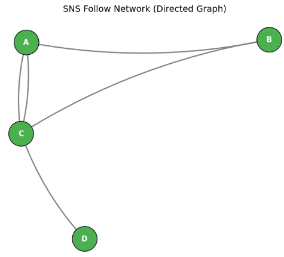

## 線形代数を用いる意味

「グラフ理論と線形代数する」とは、**グラフの構造を行列やベクトルで表現し、線形代数の手法を使って解析・計算すること**を指します。  
グラフは「点と線」の幾何的なイメージですが、**行列として表すことで、計算機で扱いやすくなり、多くの数学的性質が明らかになります。**

### 1. グラフを行列で表す

__(1) 隣接行列（Adjacency Matrix）__
- 頂点数 $n$ のグラフに対して、$n \times n$ の行列 $A$ を定義します。
- $A_{ij} = 1$（頂点 $i$ と $j$ が隣接）、$0$（隣接しない）
- 有向グラフの場合は、$A_{ij} = 1$ が「$i \to j$」の辺を表します。

**利点**：
- グラフの構造が数値データとして扱える。
- 行列の累乗 $A^k$ が「長さ $k$ のパスの数」を表すなど、代数的に解析できる。

__(2) 次数行列（Degree Matrix）__
- 対角行列 $D$ で、$D_{ii}$ が頂点 $i$ の次数を表します。

__(3) ラプラシアン行列（Laplacian Matrix）__
- $L = D - A$
- グラフの「拡散」や「振動」を表す演算子として使われます。
- 固有値・固有ベクトルが、グラフの連結性やコミュニティ構造に関連します。

### 2. 線形代数で何ができるか

__(1) 固有値・固有ベクトルによる解析__
- ラプラシアン $L$ の**最小固有値が 0**で、その個数が連結成分の数に対応します。
- 固有ベクトルを使うと、グラフの**コミュニティ構造**や**ノードの重要度**を抽出できます（スペクトルクラスタリングなど）。

__(2) 行列の累乗とパス数__
- 隣接行列 $A$ の $k$ 乗 $A^k$ の $(i,j)$ 成分は、頂点 $i$ から $j$ への**長さ $k$ のパスの数**を表します。
- これにより、情報の伝播や到達可能性を代数的に解析できます。

__(3) 線形方程式・最適化__
- グラフ上の拡散方程式や電位分布は、線形方程式 $Lx = b$ として定式化できます。
- 最小二乗法や最適化手法を使って、グラフ上の問題を解くことができます。

### 3. ニューラルネットワークとの関連

ニューラルネットワーク、特にGNN（グラフニューラルネットワーク）では、**グラフを行列として扱い、線形代数の操作で特徴を変換する**ことが基本です。

- **隣接行列 $A$**：どのノードがどのノードと結合しているか
- **特徴行列 $X$**：各ノードの特徴ベクトルを並べた行列
- **伝播ルール**：  
  $X' = \sigma(AXW)$ のような形で、近傍の情報を集約しつつ線形変換を行う

ここで、$W$ は学習される重み行列、$\sigma$ は活性化関数です。  
線形代数を使うことで、**グラフ構造を保ったまま、ノード特徴を効率的に更新する**ことができます。

## 線形代数を適用する流れ
詳細な要素は後述します。まずはざっくりと大枠の流れについて説明していきます。
グラフ理論に線形代数を適用する流れは、おおまかに以下の4ステップです。

### ステップ1：グラフを行列で表現する

まず、グラフの構造を行列として数値化します。

__(1) 隣接行列（Adjacency Matrix）$A$__
- 頂点数 $n$ のグラフに対し、$n \times n$ の行列を定義。
- $A_{ij} = 1$（頂点 $i$ と $j$ が隣接）、$0$（隣接しない）。
- 有向グラフの場合は、$i \to j$ の辺があるとき $A_{ij} = 1$。

__(2) 次数行列（Degree Matrix）$D$__
- 対角行列で、$D_{ii}$ が頂点 $i$ の次数を表す。

__(3) ラプラシアン行列（Laplacian Matrix）$L$__
- $L = D - A$
- グラフの「拡散」や「振動」を表す演算子として使われる。

### ステップ2：行列の性質を解析する

次に、これらの行列に対して線形代数の手法を適用します。

__(1) 固有値・固有ベクトル__
- ラプラシアン $L$ の固有値・固有ベクトルを求める。
- 最小固有値が 0 で、その個数が連結成分の数に対応。
- 固有ベクトルを使うと、グラフの**コミュニティ構造**や**ノードの重要度**を抽出できる（スペクトルクラスタリングなど）。

__(2) 行列の累乗__
- 隣接行列 $A$ の $k$ 乗 $A^k$ の $(i,j)$ 成分は、頂点 $i$ から $j$ への**長さ $k$ のパスの数**を表す。
- これにより、情報の伝播や到達可能性を代数的に解析できる。

__(3) 線形方程式・最適化__
- グラフ上の拡散方程式や電位分布は、$Lx = b$ のような線形方程式として定式化できる。
- 最小二乗法や最適化手法を用いて、グラフ上の問題を解く。

### ステップ3：結果をグラフの性質として解釈する

得られた数値的な結果を、グラフの性質として読み替えます。

- 固有値の分布 → 連結性・コミュニティ構造
- 固有ベクトル → ノードのクラスタリング・重要度
- 行列の累乗 → パス数・情報伝播のしやすさ
- 線形方程式の解 → 拡散の定常状態・電位分布など

### ステップ4：応用（特にニューラルネットワーク）

最後に、これらの線形代数的手法を応用します。

__GNN（グラフニューラルネットワーク）での例__
- 隣接行列 $A$ とノード特徴行列 $X$ を用いて、  
  $X' = \sigma(AXW)$ のような伝播ルールを定義。
- ここで $W$ は学習される重み行列、$\sigma$ は活性化関数。
- 線形代数の操作（行列積）によって、**グラフ構造を保ったままノード特徴を更新**する。

### まとめ

グラフ理論に線形代数を適用する流れは：

1. **グラフを行列で表現**（隣接行列・ラプラシアンなど）
2. **行列の性質を解析**（固有値・固有ベクトル、行列の累乗、線形方程式）
3. **結果をグラフの性質として解釈**（連結性、コミュニティ、伝播など）
4. **応用**（GNNなどでグラフ構造を活かした計算）

というステップです。  
これにより、**グラフの幾何的な構造を、線形代数という強力な道具で数値的に解析・計算する**ことができます。


## 隣接行列

**隣接行列（adjacency matrix）** は、**グラフの頂点間の隣接関係を行列で表したもの**です。  
グラフをコンピュータで扱うときや、線形代数の手法を適用するときに非常に便利な表現です。

### 1. 隣接行列の定義

__無向グラフの場合__

頂点数 $n$ のグラフ $G$ に対し、$n \times n$ の行列 $A$ を次のように定義します。

$$
A_{ij} = 
\begin{cases}
1 & \text{頂点 } i \text{ と } j \text{ が隣接（辺で結ばれている）とき} \\
0 & \text{それ以外}
\end{cases}
$$

- 無向グラフでは $A_{ij} = A_{ji}$ なので、**対称行列**になります。
- 自己ループがない場合、対角成分はすべて 0 です。

__有向グラフの場合__

有向グラフでは、辺の向きを考慮します。

$$
A_{ij} = 
\begin{cases}
1 & \text{頂点 } i \text{ から } j \text{ への有向辺があるとき} \\
0 & \text{それ以外}
\end{cases}
$$

- 一般には $A_{ij} \ne A_{ji}$ なので、**非対称行列**になります。

__重み付きグラフの場合__

辺に重み（距離、容量、強度など）がある場合は、1 の代わりに重みを入れます。

$$
A_{ij} = \text{頂点 } i \text{ から } j \text{ への辺の重み}
$$

### 2. 具体例

__例1：三角形（3頂点の無向グラフ）__

頂点1–2, 2–3, 3–1 がすべて辺で結ばれているとします。

隣接行列 $A$：

$$
A = 
\begin{bmatrix}
0 & 1 & 1 \\
1 & 0 & 1 \\
1 & 1 & 0
\end{bmatrix}
$$

- 対角成分は 0（自己ループなし）
- 対称行列（無向グラフ）

__例2：有向グラフ__

頂点1→2, 2→3, 3→1 の有向辺があるとします。

$$
A = 
\begin{bmatrix}
0 & 1 & 0 \\
0 & 0 & 1 \\
1 & 0 & 0
\end{bmatrix}
$$

- 非対称（有向グラフ）
- 各行の1の数が「出次数」、各列の1の数が「入次数」に対応します。

### 3. 隣接行列の性質と使い道

__(1) パス長の計算__

隣接行列 $A$ の $k$ 乗 $A^k$ の $(i,j)$ 成分は、**頂点 $i$ から $j$ への長さ $k$ のパスの本数**を表します。

- $A^2$：長さ2のパスの数
- $A^3$：長さ3のパスの数
- これにより、**到達可能性**や**最短経路の長さ**を調べるのに使えます。

__(2) 次数の計算__

- 無向グラフの場合：
  - 行 $i$ の和 = 頂点 $i$ の次数
  - 列 $i$ の和も同じ（対称なので）
- 有向グラフの場合：
  - 行 $i$ の和 = 頂点 $i$ の出次数
  - 列 $i$ の和 = 頂点 $i$ の入次数

__(3) グラフのスペクトル（固有値・固有ベクトル）__

- 隣接行列の固有値・固有ベクトルを**グラフスペクトル**と呼びます。
- グラフの**連結性**、**正則性**、**クラスタリング構造**などの特徴を反映します。
- GNN（Graph Neural Networks）では、隣接行列の固有分解を用いて**グラフフィルタ**を設計することがあります。

__(4) コンピュータでの扱いやすさ__

- 密グラフ（辺が多いグラフ）では、隣接行列はメモリを多く消費しますが、**行列演算が高速**です。
- 疎グラフ（辺が少ないグラフ）では、**疎行列（sparse matrix）** として圧縮して扱うことが多いです。

### 4. ニューラルネットワーク（特にGNN）との関連

- GNNでは、**隣接行列 $A$** と**ノード特徴行列 $X$** を組み合わせて、  
  $$
  H = f(A, X)
  $$
  のような形でノードの表現を更新します。
- 隣接行列を使うことで：
  - 各ノードが「どのノードと隣接しているか」を一度に扱える
  - 行列積で隣接ノードの情報を集約できる
- これにより、**局所的な構造情報**をニューラルネットワークに取り込むことができます。

__例題:__

隣接行列（Adjacency Matrix）の概念を直感的に理解するための例題を作成しました。

__SNSの「フォロー関係」を隣接行列で表現__

ある小さなSNSコミュニティに、**Aさん、Bさん、Cさん、Dさん** の4人がいます。
彼らのフォロー関係（誰が誰をフォローしているか）は以下のようになっています。

* **Aさん**: BさんとCさんをフォローしている。
* **Bさん**: Cさんのみをフォローしている。
* **Cさん**: AさんとDさんをフォローしている。
* **Dさん**: 誰もフォローしていない。

1. このフォロー関係を表す**有向グラフの隣接行列 $M$**（$4 \times 4$ の行列）を作成してください。
* 行・列の順序は **[A, B, C, D]** とします。
* 「行 $i$ から 列 $j$ へのフォロー（矢印）」が存在する場合は `1`、存在しない場合は `0` としてください。


2. **【発展問題】**
作成した隣接行列 $M$ を2乗した行列 $M^2$（$M \times M$）を計算すると、$M^2$ の (A行, D列) の要素（行0・列3）の値はいくつになりますか？また、その数字は**グラフ理論的にどのような意味**を持つでしょうか？

__1. 隣接行列 $M$ の解答__

各人が「誰をフォローしているか」を行ごとにあてはめて作成します。

$$M = \begin{pmatrix} 0 & 1 & 1 & 0 \\ 0 & 0 & 1 & 0 \\ 1 & 0 & 0 & 1 \\ 0 & 0 & 0 & 0 \end{pmatrix}$$

* **1行目 (A)**: BとCをフォロー $\rightarrow$ `[0, 1, 1, 0]`
* **2行目 (B)**: Cをフォロー $\rightarrow$ `[0, 0, 1, 0]`
* **3行目 (C)**: AとDをフォロー $\rightarrow$ `[1, 0, 0, 1]`
* **4行目 (D)**: 誰もフォローしていない $\rightarrow$ `[0, 0, 0, 0]`

__2. 発展問題の解答と解説__

行列の掛け算 $M^2 = M \times M$ を計算すると以下のようになります。

$$M^2 = \begin{pmatrix} 1 & 0 & 1 & 1 \\ 1 & 0 & 0 & 1 \\ 0 & 1 & 1 & 0 \\ 0 & 0 & 0 & 0 \end{pmatrix}$$

* **(A行, D列) の値**: **`1`**

**【グラフ理論的な意味】**
隣接行列を $k$ 乗した行列 $M^k$ の $(i, j)$ 要素は、「ノード $i$ からノード $j$ へ至る長さ $k$ のパス（経路）の総数」を表します。

今回の場合、$M^2$ の (A, D) が `1` であることは、**「AからDへ 2ステップ（間接フォロー）で到達できるルートが1つ存在する」**（具体的には **A $\rightarrow$ C $\rightarrow$ D** のルート）ことを意味しています。

__Pythonによる確認・可視化コード__

この問題のグラフ構造と隣接行列の性質をPython（NumPy / NetworkX）で確認するコードです。

```python
import matplotlib.pyplot as plt
import networkx as nx
import numpy as np

# 1. 隣接行列の定義 (4x4)
# A:0, B:1, C:2, D:3
M = np.array(
    [
        [0, 1, 1, 0],  # A
        [0, 0, 1, 0],  # B
        [1, 0, 0, 1],  # C
        [0, 0, 0, 0],  # D
    ]
)

print("--- 隣接行列 M ---")
print(M)

# 2. 行列の2乗を計算 (長さ2のパスを検出)
M_squared = np.linalg.matrix_power(M, 2)
print("\n--- 隣接行列の2乗 M^2 ---")
print(M_squared)
print(
    f"\nAからDへの長さ2のパスの数 (M^2[0, 3]): {M_squared[0, 3]}"
)  # 1が表示される

# 3. NetworkXで有向グラフ化して可視化
labels = {0: "A", 1: "B", 2: "C", 3: "D"}
G = nx.from_numpy_array(M, create_using=nx.DiGraph)
G = nx.relabel_nodes(G, labels)

plt.figure(figsize=(7, 6))
pos = nx.spring_layout(G, seed=7)

# ノードとエッジの描画
nx.draw_networkx_nodes(
    G, pos, node_color="#4CAF50", node_size=1600, edgecolors="black"
)
nx.draw_networkx_edges(
    G, pos, edge_color="gray", width=2, arrowsize=20, connectionstyle="arc3,rad=0.1"
)
nx.draw_networkx_labels(
    G, pos, font_size=12, font_color="white", font_weight="bold"
)

plt.title("SNS Follow Network (Directed Graph)", fontsize=14, pad=12)
plt.axis("off")
plt.tight_layout()
plt.show()

```

__出力結果__

隣接行列の結果を可視化した結果、以下のようになります。

```
--- 隣接行列 M ---
[[0 1 1 0]
 [0 0 1 0]
 [1 0 0 1]
 [0 0 0 0]]

--- 隣接行列の2乗 M^2 ---
[[1 0 1 1]
 [1 0 0 1]
 [0 1 1 0]
 [0 0 0 0]]
```




## 次数行列

**次数行列（degree matrix）** は、**各頂点の次数（degree）を対角成分に並べた対角行列**です。  
グラフの「各頂点がどれだけ多くの辺に接しているか」という情報だけを抜き出した行列と言えます。

### 1. 次数行列の定義

頂点数 $n$ のグラフ $G$ に対し、$n \times n$ の行列 $D$ を次のように定義します。

$$
D_{ij} = 
\begin{cases}
d_i & \text{（ } i = j \text{ のとき、頂点 } i \text{ の次数）} \\
0 & \text{（ } i \ne j \text{ のとき）}
\end{cases}
$$

- $d_i$：頂点 $i$ の次数（無向グラフでは接続する辺の数、有向グラフでは入次数＋出次数など定義による）
- 非対角成分はすべて 0 → **対角行列**

__無向グラフの場合__
- 各頂点 $i$ について、隣接する辺の本数が $d_i$ です。
- 自己ループは通常、次数に2としてカウントします（両端が同じ頂点に接続されるため）。

__有向グラフの場合__
- 入次数と出次数を区別する場合もありますが、多くの場合、**総次数（入次数＋出次数）** を対角に置くことが多いです。
- 文脈によっては、入次数だけ・出次数だけを対角に置くこともあります。

### 2. 具体例

__例1：無向グラフ（3頂点）__

頂点1–2, 2–3 の辺があるとします。

- 頂点1の次数：1
- 頂点2の次数：2
- 頂点3の次数：1

次数行列 $D$：

$$
D = 
\begin{bmatrix}
1 & 0 & 0 \\
0 & 2 & 0 \\
0 & 0 & 1
\end{bmatrix}
$$

__例2：有向グラフ（3頂点）__

頂点1→2, 2→3, 3→1 の有向辺があるとします。

- 各頂点の入次数＝1、出次数＝1 → 総次数＝2

$$
D = 
\begin{bmatrix}
2 & 0 & 0 \\
0 & 2 & 0 \\
0 & 0 & 2
\end{bmatrix}
$$

この例では、すべての頂点の次数が同じ（2-正則）なので、対角成分がすべて同じ値になります。

### 3. 次数行列の役割

__(1) ラプラシアン行列の構成__

次数行列は、**グラフラプラシアン（Graph Laplacian）** を定義するために使われます。

- **組み合わせラプラシアン**：
  $$
  L = D - A
  $$
  - $A$：隣接行列
  - $D$：次数行列
- **正規化ラプラシアン**：
  $$
  L_{\text{sym}} = I - D^{-1/2} A D^{-1/2}
  $$
  など、次数行列で正規化します。

ラプラシアンは、グラフの**連結性**、**スペクトルクラスタリング**、**拡散過程**などに使われます。

__(2) 正規化（ノーマライゼーション）__

- GNNなどで隣接行列 $A$ を使うとき、**次数で正規化**することが多いです。
- 例：  
  $$
  \tilde{A} = D^{-1/2} A D^{-1/2}
  $$
  とすると、各ノードの影響が次数に応じて均等化され、学習が安定しやすくなります。

__(3) 確率過程・ランダムウォーク__

- ランダムウォークでは、隣接行列 $A$ と次数行列 $D$ を使って、**遷移確率行列** $P = D^{-1}A$ を定義します。
- 各行の和が1になるように正規化するために $D^{-1}$ を掛けます。

### 4. ニューラルネットワーク（特にGNN）との関連

- GNNでは、隣接行列 $A$ と次数行列 $D$ を組み合わせて、**メッセージ伝播（message passing）** を設計します。
- 例：グラフ畳み込みネットワーク（GCN）では、
  $$
  H^{(l+1)} = \sigma\left( \tilde{A} H^{(l)} W^{(l)} \right)
  $$
  ここで $\tilde{A} = D^{-1/2} A D^{-1/2}$ とし、次数で正規化します。
- 次数行列を使うことで：
  - 次数の大きいノードが過度に影響を与えるのを防ぐ
  - グラフのスケールに依存しない表現を得る
  といった効果があります。

__例題:__

次数行列（Degree Matrix）の概念を直感的に捉えるための例題を作成しました。

あるオフィス内に **R1, R2, R3, R4** の4台のルーター（ノード）があり、LANケーブル（無向エッジ）で以下のように接続されています。

* **R1**: R2, R3 と接続されている。
* **R2**: R1, R3, R4 と接続されている。
* **R3**: R1, R2 と接続されている。
* **R4**: R2 のみと接続されている。

1. 各ルーター（R1〜R4）の次数（Degree：接続されているケーブルの数）をそれぞれ求めてください。
2. このネットワークの**次数行列 $D$**（$4 \times 4$ の対角行列）を作成してください。
* 行・列の順序は **[R1, R2, R3, R4]** とします。
* 対角成分 $(i, i)$ にノード $i$ の次数を配置し、それ以外の非対角成分 $(i, j) \quad (i \neq j)$ はすべて `0` としてください。

3. **【発展問題】**
前回の隣接行列を $A$、今回の次数行列を $D$ としたとき、**$L = D - A$** という行列を定義できます。この行列 $L$ はグラフ理論で**何と呼ばれる行列**でしょうか？（知っている・聞いたことがあればお答えください）

__1. 各ノードの次数__

それぞれのノードから伸びているエッジ（ケーブル）の数を数えます。

* **R1の次数**: 2 （R2, R3）
* **R2の次数**: 3 （R1, R3, R4）
* **R3の次数**: 2 （R1, R2）
* **R4の次数**: 1 （R2）

__2. 次数行列 $D$ の解答__

対角成分に各ノードの次数を並べた対角行列になります。

$$D = \begin{pmatrix} 2 & 0 & 0 & 0 \\ 0 & 3 & 0 & 0 \\ 0 & 0 & 2 & 0 \\ 0 & 0 & 0 & 1 \end{pmatrix}$$

* 次数行列は「各ノードがどれくらい他のノードと連結しているか（ハブとしての重要性や影響力）」を対角成分のみで非常にシンプルに表す行列です。

__3. 発展問題の解答__

$L = D - A$ は「グラフラプラシアン（Graph Laplacian / ラプラシアン行列）」と呼ばれます。

グラフ上の拡散プロセス（情報の伝搬、熱伝導など）や、クラスタリング（スペクトラルクラスタリング）、グラフニューラルネットワーク（GNN）などで中心的な役割を果たす超重要行列です。

__Pythonによる確認・可視化コード__

次数行列の生成と、グラフラプラシアン $L = D - A$ の計算を行うPythonコードです。

```python
import matplotlib.pyplot as plt
import networkx as nx
import numpy as np

# 1. グラフの構築（無向グラフ）
G = nx.Graph()
edges = [("R1", "R2"), ("R1", "R3"), ("R2", "R3"), ("R2", "R4")]
G.add_edges_from(edges)

# ノード順序の固定
nodes = ["R1", "R2", "R3", "R4"]

# 2. 隣接行列 A と 次数行列 D の計算
A = nx.to_numpy_array(G, nodelist=nodes)

# 次数（各ノードの接続数）を計算し、対角行列化する
degrees = [G.degree(n) for n in nodes]
D = np.diag(degrees)

# グラフラプラシアン L = D - A
L = D - A

print("--- 次数配列 ---")
for n, deg in zip(nodes, degrees):
    print(f"  {n}: {deg}")

print("\n--- 次数行列 D ---")
print(D)

print("\n--- グラフラプラシアン L (D - A) ---")
print(L)

# 3. 可視化
plt.figure(figsize=(7, 6))
pos = nx.spring_layout(G, seed=42)

# ノードのサイズを次数に応じて大きくする（次数の可視化）
node_sizes = [deg * 1000 for deg in degrees]

nx.draw_networkx_nodes(
    G,
    pos,
    node_color="#FF9800",
    node_size=node_sizes,
    edgecolors="black",
    linewidths=1.5,
)
nx.draw_networkx_edges(G, pos, edge_color="gray", width=2)
nx.draw_networkx_labels(
    G, pos, font_size=12, font_color="white", font_weight="bold"
)

plt.title("Router Network (Node size proportional to Degree)", fontsize=13)
plt.axis("off")
plt.tight_layout()
plt.show()

```

__出力結果__

次数行列に基づいてノードの大きさを表現したグラフは以下のようになります。
次数が大きくなるR2が大きいとわかります。

```
--- 次数配列 ---
  R1: 2
  R2: 3
  R3: 2
  R4: 1

--- 次数行列 D ---
[[2 0 0 0]
 [0 3 0 0]
 [0 0 2 0]
 [0 0 0 1]]

--- グラフラプラシアン L (D - A) ---
[[ 2. -1. -1.  0.]
 [-1.  3. -1. -1.]
 [-1. -1.  2.  0.]
 [ 0. -1.  0.  1.]]
```


## ラプラシアン行列

**ラプラシアン行列（Laplacian matrix）**は、**グラフの構造を表し、その上での「なめらかさ」や「拡散のしやすさ」を測るための行列**です。  
物理学のラプラス演算子（微分演算子）をグラフ上に離散化したもの、と考えるとイメージしやすいです。

### 1. ラプラシアン行列の定義

主に3つの形があります。

__(1) 組み合わせラプラシアン（Combinatorial Laplacian）__

$$
L = D - A
$$

- $A$：隣接行列（adjacency matrix）
- $D$：次数行列（degree matrix）
- 無向グラフでは対称行列になります。

__(2) 正規化ラプラシアン（Normalized Laplacian）__

$$
L_{\text{sym}} = I - D^{-1/2} A D^{-1/2}
$$

- $I$：単位行列
- 対称行列で、固有値が $[0, 2]$ の範囲に収まることが知られています。

__(3) ランダムウォークラプラシアン（Random walk Laplacian）__

$$
L_{\text{rw}} = I - D^{-1} A
$$

- ランダムウォークの遷移確率行列 $P = D^{-1}A$ を使った定義です。

### 2. ラプラシアン行列の直感的な意味

__(1) 「なめらかさ」を測る演算子__

関数 $f$ を頂点上の実数値関数（例：各ノードの温度、スコアなど）とします。  
このとき、ラプラシアン $L$ を $f$ に作用させると：

$$
(L f)_i = \sum_{j \sim i} (f_i - f_j)
$$

- $j \sim i$：頂点 $i$ に隣接する頂点 $j$
- 隣接ノードとの値の差の和 → **「そのノードの値が周囲とどれだけ違うか」** を表します。
- 値が小さいほど、そのノードの値は周囲と近く「なめらか」であることを意味します。

__(2) 拡散・熱伝導のモデル__

- 熱伝導方程式の離散版：
  $$
  \frac{df}{dt} = -L f
  $$
- 時間が経つと、値の差が大きいところから小さいところへ「熱」が流れ、全体が均一になっていきます。
- ラプラシアンは、**グラフ上での拡散の速さ・しやすさ**を表します。

### 3. ラプラシアン行列の性質

__(1) 固有値・固有ベクトル（スペクトル）__

- 最小固有値は 0 で、対応する固有ベクトルは定数ベクトル（すべての成分が同じ）です。
- 0 以外の最小固有値（**代数的連結度**）は、グラフの**連結性の強さ**を表します。
  - 値が大きいほど、グラフは「つながりが強い」「拡散しやすい」。
- 固有ベクトルは、グラフの**クラスタ構造**や**低次元埋め込み**に使われます（スペクトルクラスタリングなど）。

__(2) 正定値性__

- 組み合わせラプラシアン $L$ は半正定値行列です。
- すべての固有値が 0 以上 → 二次形式 $f^\top L f \ge 0$。

### 4. ラプラシアン行列の応用

__(1) スペクトルクラスタリング__

- ラプラシアンの固有ベクトルを使って、グラフを**自然なクラスタ**に分割します。
- 隣接するノードが同じクラスタに属しやすくなるように分割できます。

__(2) グラフの埋め込み（Graph Embedding）__

- ラプラシアンの固有ベクトルをノードの特徴量として使うことで、**低次元空間にグラフを埋め込む**ことができます。
- これにより、ノード間の類似度や距離を測りやすくなります。

__(3) グラフ信号処理（Graph Signal Processing）__

- グラフ上で定義された信号（各ノードの値）を、ラプラシアンの固有ベクトル基底で表現し、**フィルタリング**や**圧縮**を行います。
- 画像処理のフーリエ変換をグラフ版に拡張したような考え方です。

__(4) ニューラルネットワーク（GNN）との関連__

- GNN、特に**グラフ畳み込みネットワーク（GCN）** では、正規化ラプラシアン $L_{\text{sym}}$ やその変形を使って、**隣接ノードからの情報の集約**を行います。
- ラプラシアンを使うことで：
  - 隣接ノードの情報を「なめらかに」混ぜ合わせる
  - 次数の大きいノードが支配的になるのを防ぐ
  といった効果があります。

### 5. ラプラシアン行列の必要性

ラプラシアン行列が必要な理由は、**「グラフの構造を数学的に扱いやすくし、さまざまな解析・アルゴリズム・機械学習手法の基礎を与えるため」** です。  
具体的には、次のような役割があります。

__1. グラフの「なめらかさ」や「拡散」を定式化するため__

- ラプラシアンは、グラフ上での**関数の変化量**や**隣接ノードとの差**を測る演算子です。
- これにより：
  - グラフ上での熱伝導・拡散過程をモデル化できる
  - ノードの値が周囲とどれだけ違うか（なめらかさ）を定量化できる
- 例：ネットワーク上の情報拡散、熱の伝わり方、確率過程（ランダムウォーク）など。

__2. グラフの連結性・クラスタ構造を解析するため__

- ラプラシアンの**固有値・固有ベクトル（スペクトル）** は、グラフの構造的特徴を反映します。
- 特に：
  - **最小固有値 0**：グラフが連結であることと対応
  - **2番目に小さい固有値（代数的連結度）**：グラフの「つながりの強さ」や「分割のしにくさ」を表す
  - 固有ベクトル：自然なクラスタ境界を示す
- これを使って、**スペクトルクラスタリング**などが可能になります。

__3. グラフ信号処理の基礎として__

- 画像や音声の信号処理では、フーリエ変換を使って周波数成分を解析します。
- グラフ上では、ラプラシアンの固有ベクトルが **「グラフ版の周波数基底」** になります。
- これにより：
  - グラフ信号のフィルタリング
  - ノイズ除去
  - 圧縮
  などが行えます。

__4. グラフ埋め込み・次元削減のため__

- ラプラシアンの固有ベクトルを使って、ノードを低次元空間に埋め込むことができます。
- これにより：
  - ノード間の類似度を測りやすくなる
  - クラスタリングや可視化がしやすくなる
- 例：Laplacian Eigenmaps、スペクトル埋め込みなど。

__5. グラフニューラルネットワーク（GNN）の設計のため__

- GNN、特に**グラフ畳み込みネットワーク（GCN）** では、ラプラシアン（またはその正規化版）を使って**隣接ノードからの情報の集約**を行います。
- ラプラシアンを使うことで：
  - 隣接ノードの情報を「なめらかに」混ぜ合わせる
  - 次数の大きいノードが支配的になるのを防ぐ（正規化）
  - 学習が安定し、汎化性能が向上しやすくなる
- つまり、**グラフ構造をニューラルネットワークにうまく組み込むための数学的な道具**として必要です。

__6. 最適化・物理モデルとの対応のため__

- 多くの最適化問題（例：グラフカット最小化）は、ラプラシアンを使った二次形式の最小化問題として定式化できます。
- 物理モデル（拡散方程式、波動方程式など）の離散版としてもラプラシアンが現れます。
- これにより、グラフ上の現象を**連続的な物理・数学の理論と結びつけて解析**できます。

__例題:__

例題のテーマは、ネットワーク上の「温度拡散（熱伝導）」をシミュレーションです。

直列に繋がった 3つのセンサーノード **[Node 0] --- [Node 1] --- [Node 2]** からなるライン状のネットワークを考えます。

* ノード 0 と ノード 1、ノード 1 と ノード 2 の間がエッジで接続されています。
* 各ノードの時刻 $t$ における「温度（あるいは情報量）」をベクトル $\boldsymbol{f}(t) = \begin{pmatrix} f_0 \\ f_1 \\ f_2 \end{pmatrix}$ とします。

初期状態（$t=0$）において、**Node 0 だけが高熱状態**にあります。

* $\boldsymbol{f}(0) = \begin{pmatrix} 100 \\ 0 \\ 0 \end{pmatrix}$

物理的な熱拡散の法則によれば、時刻 $t$ における各ノードの温度変化率 $\frac{d\boldsymbol{f}}{dt}$ は、ラプラシアン行列 $L$ を用いて次のように表されます。

$$\frac{d\boldsymbol{f}}{dt} = -L \boldsymbol{f}(t)$$


1. この 3 ノードのライングラフにおける**隣接行列 $A$**、**次数行列 $D$**、および**ラプラシアン行列 $L = D - A$** を求めてください。
2. 初期状態 $\boldsymbol{f}(0) = \begin{pmatrix} 100 \\ 0 \\ 0 \end{pmatrix}$ の直後（微小時間経過時）における、各ノードの**温度変化の方向（符号）と変化率 $\frac{d\boldsymbol{f}}{dt}$** を計算してください。
3. **【考察】** 十分に時間が経過したとき（$t \to \infty$）、各ノードの温度 $\boldsymbol{f}(\infty)$ は最終的にどのような値に収束すると予想されますか？

__1. 各行列の導出__

* **隣接行列 $A$**:

$$A = \begin{pmatrix}   0 & 1 & 0 \\   1 & 0 & 1 \\   0 & 1 & 0   \end{pmatrix}$$


* **次数行列 $D$**: Node 1 の次数が 2、Node 0 と 2 の次数が 1 なので、

$$D = \begin{pmatrix}   1 & 0 & 0 \\   0 & 2 & 0 \\   0 & 0 & 1   \end{pmatrix}$$


* **ラプラシアン行列 $L = D - A$**:

$$L = \begin{pmatrix}   1 & -1 & 0 \\   -1 & 2 & -1 \\   0 & -1 & 1   \end{pmatrix}$$

__2. 微小時間における温度変化率 $\frac{d\boldsymbol{f}}{dt}$__

微分方程式 $\frac{d\boldsymbol{f}}{dt} = -L \boldsymbol{f}(0)$ に初期値を代入して計算します。

$$\frac{d\boldsymbol{f}}{dt} = - \begin{pmatrix} 1 & -1 & 0 \\ -1 & 2 & -1 \\ 0 & -1 & 1 \end{pmatrix} \begin{pmatrix} 100 \\ 0 \\ 0 \end{pmatrix} = \begin{pmatrix} -100 \\ 100 \\ 0 \end{pmatrix}$$

* **物理的な意味**:
* Node 0: $\frac{df_0}{dt} = -100$ （高温の Node 0 から熱が奪われ、急速に冷める）
* Node 1: $\frac{df_1}{dt} = +100$ （Node 0 から熱が流入し、温度が上昇する）
* Node 2: $\frac{df_2}{dt} = 0$ （Node 1 とまだ温度差がないため、この瞬間は変化なし）


ラプラシアン行列に状態ベクトルを掛け合わせることで、**「隣接ノードとの状態差」に基づいた流出入**が自然に表現されます。

__3. 十分に時間が経過したときの収束値__

グラフ全体で熱が伝搬して平均化（平衡状態）に達するため、総熱量 $100 + 0 + 0 = 100$ が 3 つのノードに均等に分散されます。

$$\boldsymbol{f}(\infty) = \begin{pmatrix} 100/3 \\ 100/3 \\ 100/3 \end{pmatrix} \approx \begin{pmatrix} 33.3 \\ 33.3 \\ 33.3 \end{pmatrix}$$

__補足：ラプラシアン行列の固有値と「スペクトラル・グラフトライアル」__

ラプラシアン行列 $L$ の最小固有値は常に **$0$** であり、その固有ベクトルは定数ベクトル $\begin{pmatrix} 1 \\ 1 \\ 1 \end{pmatrix}$（全ノードが等しい状態＝平衡状態）に対応します。
また、2番目に小さな固有値（**代数的接続度 / Fiedler値**）は、グラフの「繋がりやすさ」や「切り離しやすさ（グラフカット/スペクトラルクラスタリング）」の指標として広く用いられています。

__Pythonによる時間変化シミュレーションコード__

上記の熱拡散プロセスを数値的に解き、温度が平坦化していく挙動をグラフ描画するコードです。

```python
import matplotlib.pyplot as plt
import networkx as nx
import numpy as np
from scipy.integrate import solve_ivp

# 1. 3ノードのライングラフの作成
G = nx.path_graph(3)

# 2. ラプラシアン行列 L の計算
# NetworkX の laplacian_matrix は sparse matrix を返すため numpy array に変換
L = nx.laplacian_matrix(G).toarray()
print("--- ラプラシアン行列 L ---")
print(L)

# 3. 熱拡散の微分方程式 ( df/dt = -L * f )
def heat_diffusion(t, f):
    return -L @ f

# 初期状態: f(0) = [100, 0, 0]
f0 = [100.0, 0.0, 0.0]
t_span = (0, 5)  # 時刻 t=0 から t=5 まで
t_eval = np.linspace(0, 5, 200)

# 微分方程式の数値解法
sol = solve_ivp(heat_diffusion, t_span, f0, t_eval=t_eval)

# 4. 可視化: 時間変化プロット
plt.figure(figsize=(10, 5))

plt.subplot(1, 2, 1)
pos = {0: (0, 0), 1: (1, 0), 2: (2, 0)}
nx.draw_networkx_nodes(G, pos, node_color="#4CAF50", node_size=1200)
nx.draw_networkx_edges(G, pos, width=2)
nx.draw_networkx_labels(
    G, pos, labels={0: "Node 0\n(100)", 1: "Node 1\n(0)", 2: "Node 2\n(0)"}, font_weight="bold"
)
plt.title("Initial Graph State (t = 0)")
plt.axis("off")

plt.subplot(1, 2, 2)
for i in range(3):
    plt.plot(sol.t, sol.y[i], label=f"Node {i}", linewidth=2.5)

plt.axhline(100 / 3, color="gray", linestyle="--", alpha=0.7, label="Equilibrium (33.3)")
plt.xlabel("Time $t$")
plt.ylabel("Temperature / State Value")
plt.title("Heat Diffusion over Graph (df/dt = -L * f)")
plt.grid(True, linestyle=":", alpha=0.6)
plt.legend()

plt.tight_layout()
plt.show()

```

__出力の結果__

まず与えられるグラフ構造は以下の通りです。


```
--- ラプラシアン行列 L ---
[[ 1 -1  0]
 [-1  2 -1]
 [ 0 -1  1]]
```

シミュレーションの結果は以下です。
グラフ構造（トポロジー）に応じた伝播のタイムラグが確認されます。

1. Node 1（隣接ノード）の挙動:
   Node 0 と直接エッジで繋がっているため、$t=0$ の直後から急激に値が上昇し、最初にピークを迎えます。
2. Node 2（2ステップ先のノード）の挙動:
   Node 0 と直接繋がっていないため、$t=0$ 直後の変化率はほぼ $0$ です（立ち上がりが遅れる）。Node 1 の値が高まってから徐々に追従して上昇します。
3. 構造の反映:
   ラプラシアン行列による微分方程式は、「エッジで繋がっているノード間のみでしか直接の情報・熱の移動が起きない」というグラフの接続関係（トポロジー）を正確に表現しています。


## 接続行列

接続行列（incidence matrix）は、**グラフの「頂点」と「辺」の接続関係**を行列で表したものです。  
隣接行列が「頂点同士の関係」を表すのに対し、接続行列は「頂点と辺の関係」を表す点が大きな違いです。

以下、順を追ってご説明いたします。

### 1. 無向グラフの接続行列

__定義__

頂点集合を $V = \{v_1, v_2, \dots, v_n\}$、辺集合を $E = \{e_1, e_2, \dots, e_m\}$ とするとき、接続行列 $B$ は $n \times m$ の行列で、その成分 $B_{ij}$ は

$$
B_{ij} = 
\begin{cases}
1 & \text{頂点 } v_i \text{ が辺 } e_j \text{ に接続しているとき} \\
0 & \text{それ以外}
\end{cases}
$$

となります。

**ポイント**
- 行：頂点
- 列：辺
- 各列にはちょうど2つの1が現れます（その辺の両端点に対応）

__例__

頂点 $\{1,2,3\}$、辺が  
- $e_1$：頂点1–2  
- $e_2$：頂点2–3  

のグラフを考えます。

このとき接続行列は

$$
B = 
\begin{bmatrix}
1 & 0 \\
1 & 1 \\
0 & 1
\end{bmatrix}
$$

となります（行：頂点1,2,3、列：辺 $e_1, e_2$）。

### 2. 有向グラフの接続行列

__定義__

有向グラフでは、辺に「向き」があるため、接続行列の成分に符号をつけて定義します。

頂点集合 $V = \{v_1, \dots, v_n\}$、  
有向辺集合 $E = \{e_1, \dots, e_m\}$ とするとき、  
接続行列 $B$ の成分 $B_{ij}$ は

$$
B_{ij} = 
\begin{cases}
+1 & \text{頂点 } v_i \text{ が辺 } e_j \text{ の始点のとき} \\
-1 & \text{頂点 } v_i \text{ が辺 } e_j \text{ の終点のとき} \\
0 & \text{それ以外}
\end{cases}
$$

と定義されることが多いです。

**ポイント**
- 各列には $+1$ と $-1$ が1つずつ現れます（その辺の始点と終点）。
- 無向グラフの接続行列を「向き付き」にしたものと見なせます。

__例__

頂点 $\{1,2,3\}$、有向辺が  
- $e_1$：1 → 2  
- $e_2$：2 → 3  

のグラフを考えます。

このとき接続行列は

$$
B = 
\begin{bmatrix}
+1 & 0 \\
-1 & +1 \\
0 & -1
\end{bmatrix}
$$

となります。

### 3. 重み付きグラフの接続行列

重み付きグラフでは、辺に重み（コスト・容量など）が付きます。  
接続行列は、**符号付きの重み**として定義されることがあります。

たとえば、有向グラフで辺 $e_j$ の重みが $w_j$ のとき、

$$
B_{ij} = 
\begin{cases}
+w_j & \text{頂点 } v_i \text{ が辺 } e_j \text{ の始点} \\
-w_j & \text{頂点 } v_i \text{ が辺 } e_j \text{ の終点} \\
0 & \text{それ以外}
\end{cases}
$$

と定義できます。

### 4. 接続行列の性質と用途

__(1) ラプラシアン行列との関係__

無向グラフの場合、**ラプラシアン行列** $L$ は接続行列 $B$ を用いて

$$
L = B B^\top
$$

と表せます（ここで $B^\top$ は転置行列）。  
これは、グラフの構造を線形代数の言葉で表現する重要な関係です。

__(2) グラフの線形代数化__

接続行列を使うと、グラフを**線形写像**として扱うことができます。

- 頂点空間：$\mathbb{R}^n$（各頂点に対応するベクトル空間）
- 辺空間：$\mathbb{R}^m$（各辺に対応するベクトル空間）

とすると、接続行列 $B$ は

$$
B : \mathbb{R}^m \to \mathbb{R}^n
$$

という線形写像を表します。  
たとえば、有向グラフの場合、辺上の「流量」を頂点上の「流入・流出の差」に変換する役割を持ちます。

__(3) ネットワーク・電気回路などへの応用__

- **ネットワークフロー**：接続行列は、辺上のフローと頂点での保存則（流入＝流出）を線形方程式で表すのに使われます。
- **電気回路**：キルヒホッフの電流則・電圧則を接続行列で表現できます。
- **構造解析**：トラス構造などの力の釣り合いを線形代数で扱う際にも用いられます。


### 5. 接続行列の必要性

グラフを表現する際に、隣接行列だけでなく接続行列が必要になる理由は、**「頂点同士の関係」だけでなく「頂点と辺の関係」を直接扱う必要がある場面**がたくさんあるからです。

隣接行列と接続行列は、**表している情報の種類が本質的に異なる**ため、用途によっては片方だけでは不十分になります。

以下、具体的に整理いたします。

__1. 隣接行列と接続行列の「表現できる情報」の違い__

__隣接行列（adjacency matrix）__

- **何を表すか**：頂点同士の隣接関係（「どの頂点とどの頂点が辺で結ばれているか」）
- **行列の形**：$n \times n$（頂点数×頂点数）
- **主な用途**：
  - グラフの構造（連結性、直径など）
  - ランダムウォーク、マルコフ連鎖
  - スペクトルグラフ理論（固有値でグラフの性質を調べる）

__接続行列（incidence matrix）__

- **何を表すか**：頂点と辺の接続関係（「どの頂点がどの辺に接続しているか」）
- **行列の形**：$n \times m$（頂点数×辺数）
- **主な用途**：
  - ネットワークフロー（辺上の流量と頂点での保存則）
  - 電気回路（キルヒホッフの法則）
  - ラプラシアン行列の表現
  - 構造解析（力の釣り合い）

**重要なポイント**  
隣接行列は「頂点同士の関係」しか表せませんが、接続行列は「辺そのもの」を明示的に扱うことができます。  
そのため、**辺に情報が乗っている問題**（流量・電流・力など）では、接続行列が本質的に必要になります。

__2. 接続行列が本質的に必要になる典型的な場面__

__(1) ネットワークフロー（有向グラフ）__

ネットワークフローでは、各辺 $e_j$ に「流量 $f_j$」が乗ります。  
このとき、各頂点での**流量保存則**（流入＝流出）を線形方程式で表すと、

$$
B \mathbf{f} = \mathbf{0}
$$

という形になります（ここで $B$ は有向グラフの接続行列、$\mathbf{f}$ は辺上の流量ベクトル）。

- 隣接行列だけでは、**辺上の流量と頂点での保存則**を直接結びつけることができません。
- 接続行列は「どの辺がどの頂点に入り・出るか」を符号付きで表すため、この種の保存則を自然に表現できます。

__(2) 電気回路（キルヒホッフの法則）__

電気回路もグラフとしてモデル化できます（頂点＝節点、辺＝素子）。

- **キルヒホッフの電流則（KCL）**：各節点での電流の和が0  
  → 接続行列 $B$ を使って $B \mathbf{i} = \mathbf{0}$ と書けます（$\mathbf{i}$ は辺上の電流ベクトル）。
- **キルヒホッフの電圧則（KVL）**：閉路に沿った電圧の和が0  
  → 接続行列の「閉路空間（サイクル空間）」と関連します。

ここでも、**辺上の電流・電圧**を扱う必要があるため、接続行列が本質的です。

__(3) ラプラシアン行列の表現__

無向グラフの**ラプラシアン行列** $L$ は、接続行列 $B$ を用いて

$$
L = B B^\top
$$

と表せます。

- 隣接行列 $A$ と次数行列 $D$ を使っても $L = D - A$ と書けますが、  
  これは「頂点同士の関係」から間接的にラプラシアンを定義したものです。
- 一方、$L = B B^\top$ は「頂点と辺の接続関係」から直接ラプラシアンを導く表現であり、  
  グラフの線形代数化やスペクトルグラフ理論において、より自然な見方を与えます。

__(4) 構造解析（トラス構造など）__

トラス構造（骨組み構造）では、各辺（部材）に「力」が働きます。  
このとき、各節点での力の釣り合いを表す方程式は、接続行列を使って

$$
B \mathbf{f} = \mathbf{p}
$$

のように書けます（$\mathbf{f}$ は辺上の力ベクトル、$\mathbf{p}$ は節点にかかる外力ベクトル）。

ここでも、**辺上の力**を直接扱う必要があるため、接続行列が不可欠です。

__3. なぜ隣接行列だけでは不十分なのか__

隣接行列は「頂点同士の関係」を表す優れた道具ですが、次のような情報は直接表現できません。

- **辺そのものの情報**（流量・電流・力・重みなど）
- **辺の向き**（有向グラフでの始点・終点の区別）
- **頂点と辺の接続関係**（どの頂点がどの辺に接続しているか）

これらを扱うには、**辺を明示的に列として持つ行列**、すなわち接続行列が必要になります。

__例題:__

接続行列は、行列の**行に「ノード（頂点）」** 、列に「エッジ（辺）」を配置し、どのノードとどのエッジが接しているか（接続関係）を表す行列です。回路のキルヒホッフの法則や構造解析、ネットワークのフロー解析などで中心的な役割を果たします。

__例題：都市間の高速道路（エッジ）と料金所（ノード）の接続関係__

ある地域に **4つの都市（Node A, B, C, D）** があり、それらを繋ぐ **5つの双方向高速道路（Edge e1, e2, e3, e4, e5）** が建設されました。

各道路の接続関係は以下の通りです。

* **e1**: Node A と Node B を接続
* **e2**: Node B と Node C を接続
* **e3**: Node C と Node D を接続
* **e4**: Node D と Node A を接続
* **e5**: Node A と Node C を接続（対角線上のバイパス道路）

※ここでは向きを持たない無向グラフとして考えます。

__問題__

1. このネットワークにおける**無向グラフの接続行列 $B$**（$4 \times 5$ の行列）を作成してください。
* 行の順序: **[Node A, Node B, Node C, Node D]**
* 列の順序: **[e1, e2, e3, e4, e5]**
* ノード $v_i$ がエッジ $e_j$ の端点である場合は `1`、そうでない場合は `0` としてください。


2. **【性質の確認】**
作成した接続行列 $B$ の「各列の和（縦方向の合計）」は常にいくつになるでしょうか？また、それはなぜでしょうか？
3. **【発展問題（隣接行列・次数行列との関係）】**
接続行列 $B$ とその転置行列 $B^T$ を掛け合わせた行列 $B B^T$（$4 \times 4$ の行列）を計算すると、対角成分と非対角成分にはそれぞれどのような情報が現れるでしょうか？

__1. 接続行列 $B$ の解答__

行がノード（A〜D）、列がエッジ（e1〜e5）に対応します。

$$B = \begin{pmatrix} 1 & 0 & 0 & 1 & 1 \\ 1 & 1 & 0 & 0 & 0 \\ 0 & 1 & 1 & 0 & 1 \\ 0 & 0 & 1 & 1 & 0 \end{pmatrix}$$

* **1行目 (A)**: e1, e4, e5 に接続 $\rightarrow$ `[1, 0, 0, 1, 1]`
* **2行目 (B)**: e1, e2 に接続 $\rightarrow$ `[1, 1, 0, 0, 0]`
* **3行目 (C)**: e2, e3, e5 に接続 $\rightarrow$ `[0, 1, 1, 0, 1]`
* **4行目 (D)**: e3, e4 に接続 $\rightarrow$ `[0, 0, 1, 1, 0]`

__2. 性質の確認の解答__

* **各列の和**: 常に **`2`** になります。
* **理由**: 1つのエッジ（辺）は必ず **2つのノード（両端点）を接続する** ため、各列には必ず `1` が 2つだけ存在し、残りはすべて `0` になるからです。

__3. 発展問題の解答（$B B^T$ の意味）__

接続行列 $B$ とその転置行列 $B^T$ の積を計算すると、以下の関係が成り立ちます。

$$B B^T = D + A$$

* **対角成分 $(i, i)$**: ノード $i$ の次数（Degree）が現れます（次数行列 $D$ の成分）。
* **非対角成分 $(i, j)$**: ノード $i$ と ノード $j$ の間に存在する**エッジの数**が現れます（隣接行列 $A$ の成分）。

※有向グラフとして接続行列（始点を `-1`、終点を `+1`）を定義した場合は、$B B^T$ は先ほど学んだ**グラフラプラシアン $L = D - A$** と一致します。

__Pythonコード：接続行列の生成とグラフの可視化__

NetworkX では `nx.incidence_matrix()` を使用して接続行列を取得できます。エッジにID（e1〜e5）を明示的に割り当てて可視化するコードです。

```python
import matplotlib.pyplot as plt
import networkx as nx
import numpy as np

# 1. 無向グラフの構築
G = nx.Graph()

# ノードの追加
nodes = ["A", "B", "C", "D"]
G.add_nodes_from(nodes)

# エッジとラベル（e1〜e5）の定義
edges_with_labels = [
    ("A", "B", "e1"),
    ("B", "C", "e2"),
    ("C", "D", "e3"),
    ("D", "A", "e4"),
    ("A", "C", "e5"),  # バイパス
]

for u, v, label in edges_with_labels:
    G.add_edge(u, v, key=label)

# 2. 接続行列（Incidence Matrix）の取得
# (NetworkX の incidence_matrix は scipy sparse matrix を返すため toarray() で変換)
B = nx.incidence_matrix(G, nodelist=nodes, oriented=False).toarray().astype(int)

print("--- ノード一覧 ---")
print(nodes)

print("\n--- エッジ一覧 ---")
edge_list = [f"{u}-{v} ({data['key']})" for u, v, data in G.edges(data=True)]
print(edge_list)

print("\n--- 無向接続行列 B (Nodes x Edges) ---")
print(B)

print("\n--- B * B^T (D + A) ---")
print(B @ B.T)

# 3. 可視化処理
plt.figure(figsize=(8, 7))

# ノード配置の決定
pos = {
    "A": (0, 1),
    "B": (1, 1),
    "C": (1, 0),
    "D": (0, 0),
}

# ノードの描画
nx.draw_networkx_nodes(
    G, pos, node_color="#9C27B0", node_size=1800, edgecolors="black", linewidths=1.5
)
nx.draw_networkx_labels(
    G, pos, font_size=12, font_color="white", font_weight="bold"
)

# エッジの描画
nx.draw_networkx_edges(G, pos, edge_color="gray", width=2.5)

# エッジラベル（e1〜e5）の描画
edge_labels = {(u, v): data["key"] for u, v, data in G.edges(data=True)}
nx.draw_networkx_edge_labels(
    G,
    pos,
    edge_labels=edge_labels,
    font_color="#D81B60",
    font_size=12,
    font_weight="bold",
    bbox=dict(boxstyle="round,pad=0.3", fc="white", ec="gray", alpha=0.9),
)

plt.title("Incidence Matrix Example (Nodes: A-D, Edges: e1-e5)", fontsize=13, pad=15)
plt.axis("off")
plt.tight_layout()
plt.show()

```

__出力結果__

コードを実行すると、以下のターミナル出力が得られます。

```text
--- ノード一覧 ---
['A', 'B', 'C', 'D']

--- エッジ一覧 ---
['A-B (e1)', 'B-C (e2)', 'C-D (e3)', 'D-A (e4)', 'A-C (e5)']

--- 無向接続行列 B (Nodes x Edges) ---
[[1 0 0 1 1]
 [1 1 0 0 0]
 [0 1 1 0 1]
 [0 0 1 1 0]]

--- B * B^T (D + A) ---
[[3 1 1 1]
 [1 2 1 0]
 [1 1 3 1]
 [1 0 1 2]]

```

この各出力データに対する詳細な分析は以下の通りです。

__1. 無向接続行列 `B` の出力結果分析__

出力された `4 × 5` の行列（行：A, B, C, D / 列：e1, e2, e3, e4, e5）に注目します。

$$B = \begin{pmatrix} 1 & 0 & 0 & 1 & 1 \\ 1 & 1 & 0 & 0 & 0 \\ 0 & 1 & 1 & 0 & 1 \\ 0 & 0 & 1 & 1 & 0 \end{pmatrix}$$

* **縦方向（列）のチェック**:
* `e1`列（1列目）: A と B に `1` が立っています（`A-B` 間のエッジ）。
* `e2`列（2列目）: B と C に `1` が立っています（`B-C` 間のエッジ）。
* `e3`列（3列目）: C と D に `1` が立っています（`C-D` 間のエッジ）。
* `e4`列（4列目）: D と A に `1` が立っています（`D-A` 間のエッジ）。
* `e5`列（5列目）: A と C に `1` が立っています（バイパス `A-C` 間のエッジ）。
* **分析**: すべての列において `1` の個数が正確に **2個** であり、残りが `0` になっています。これはプログラムがネットワークのトポロジー（端点関係）を正確に読み取れていることを示します。


* **横方向（行）のチェック**:
* A行の和: `1 + 0 + 0 + 1 + 1 = 3`
* B行の和: `1 + 1 + 0 + 0 + 0 = 2`
* C行の和: `0 + 1 + 1 + 0 + 1 = 3`
* D行の和: `0 + 0 + 1 + 1 + 0 = 2`
* **分析**: 各行の和がノード A, B, C, D の持つ枝の数（次数）と一致しています。

__2. 行列積 `B @ B.T`（`B * B^T`）の出力結果分析__

コード内で計算された `B @ B.T`（`4 × 4` 行列）の出力結果です。

$$B B^T = \begin{pmatrix} 3 & 1 & 1 & 1 \\ 1 & 2 & 1 & 0 \\ 1 & 1 & 3 & 1 \\ 1 & 0 & 1 & 2 \end{pmatrix}$$

この行列は、**「次数行列 $D$」と「隣接行列 $A$」が合体した数値**になっています。

* **対角成分 `[3, 2, 3, 2]` の分析**:
* `(0,0)`成分 = `3`（Node A の次数）
* `(1,1)`成分 = `2`（Node B の次数）
* `(2,2)`成分 = `3`（Node C の次数）
* `(3,3)`成分 = `2`（Node D の次数）
* **分析**: 対角成分を見るだけで、どのノードが何本の線と接続されているか（ハブ性）が一目で分かります。


* **非対角成分の分析**:
* `(1,3)` および `(3,1)` 成分が **`0`** になっています。これは **Node B と Node D の間に直接のエッジが存在しない** ことを数値として正確に捉えています。
* その他の非対角成分（例: `(0,1)` や `(0,2)` など）はすべて **`1`** となっており、互いに 1 本のエッジで結ばれていることを示しています。

__3. 可視化画像（`plt.show()`）の出力結果分析__

描画コードによって出力される画像レイアウトの分析です。

* **ノードの配置**: `pos` で正方形の各頂点（A:左上, B:右上, C:右下, D:左下）に配置され、中心を横切るようにバイパス `e5`（A-C）が描画されます。
* **エッジラベルの位置**: 各線の中央に `e1`〜`e5` のピンク色のラベルが付与され、接続行列 `B` の「列番号」と視覚的に 1 対 1 で対応付けられています。これにより、行列のどの要素が画面上のどの配線に対応しているかを直感的に確認できます。


## 固有値分析

グラフ理論における固有値分析は、**「グラフの構造を、行列の固有値・固有ベクトルで調べる」** という考え方です。  
主に次の2つの行列に対して行います。

1. **隣接行列（adjacency matrix）**  
2. **ラプラシアン行列（Laplacian matrix）**

以下、順を追って数学的に整理いたします。

### 1. 隣接行列の固有値分析

__(1) 隣接行列の定義（無向グラフ）__

頂点集合 $V = \{v_1, \dots, v_n\}$ のグラフに対し、隣接行列 $A$ は

$$
A_{ij} = 
\begin{cases}
1 & \text{頂点 } i \text{ と } j \text{ が隣接しているとき} \\
0 & \text{それ以外}
\end{cases}
$$

で定義される $n \times n$ の行列です。

__(2) 固有値・固有ベクトルの意味__

隣接行列 $A$ の固有値 $\lambda$ と固有ベクトル $\mathbf{v}$ は、

$$
A \mathbf{v} = \lambda \mathbf{v}
$$

を満たします。

**直感的な解釈**  
- $\mathbf{v}$ は「各頂点に数値を割り当てたベクトル」です。  
- $A \mathbf{v}$ は「各頂点の隣接頂点の値の和」を表します。  
- したがって、固有値方程式 $A \mathbf{v} = \lambda \mathbf{v}$ は、  
  「隣接頂点の値の和が、その頂点自身の値の $\lambda$ 倍になっている」  
  というバランス条件を表します。

__(3) 隣接行列固有値の性質（無向グラフ）__

- $A$ は実対称行列なので、**固有値はすべて実数**です。
- 最大固有値 $\lambda_{\max}$ は、グラフの「つながりの強さ」と関係します。
  - 正則グラフ（すべての頂点の次数が同じ）の場合、最大固有値は次数に等しくなります。
- 固有値の分布（スペクトル）は、グラフの「ランダム性」「規則性」などを反映します。

### 2. ラプラシアン行列の固有値分析

__(1) ラプラシアン行列の定義__

無向グラフのラプラシアン行列 $L$ は

$$
L = D - A
$$

で定義されます。ここで  
- $D$：次数行列（対角成分が各頂点の次数）  
- $A$：隣接行列

あるいは、接続行列 $B$ を用いて

$$
L = B B^\top
$$

とも書けます。

__(2) ラプラシアンの固有値の性質__

- $L$ も実対称行列なので、**固有値はすべて実数**です。
- さらに半正定値（固有値 $\ge 0$）です。
- 固有値を小さい順に並べると

$$
0 = \mu_1 \le \mu_2 \le \dots \le \mu_n
$$

となります。

__ゼロ固有値の個数と連結成分__

- **ゼロ固有値の個数** ＝ **グラフの連結成分の個数**
- 特に、グラフが連結ならば $\mu_1 = 0$ かつ $\mu_2 > 0$ です。

__2番目に小さい固有値 $\mu_2$（代数的連結度）__

- $\mu_2$ は「代数的連結度（algebraic connectivity）」と呼ばれ、  
  グラフの「つながりの強さ」や「分割のしやすさ」を表します。
- $\mu_2$ が大きいほど、グラフは「よくつながっていて、切り離しにくい」。
- $\mu_2$ が小さいほど、グラフは「弱くつながっていて、切り離しやすい」。

__(3) 固有ベクトルの幾何的な意味__

ラプラシアン $L$ の固有ベクトルは、**グラフ上の「滑らかな関数」**と見なせます。

- 第1固有ベクトル（$\mu_1 = 0$ に対応）は定数ベクトルです。
- 第2固有ベクトル（$\mu_2$ に対応）は、**グラフを2つに分ける「自然な分割」**を与えることが多いです。  
  これが**スペクトルクラスタリング**の基礎になります。

### 3. 固有値分析の応用例

__(1) スペクトルクラスタリング__

- ラプラシアンの第2固有ベクトル（Fiedlerベクトル）の符号に基づいて、  
  グラフを2つのクラスタに分割します。
- より一般には、小さい方から $k$ 個の固有ベクトルを使って $k$ 個のクラスタに分割します。

__(2) グラフの連結性・頑健性の評価__

- $\mu_2$ の大きさで、グラフがどれだけ「つながりが強いか」を評価します。
- 通信ネットワークや交通ネットワークの「壊れにくさ」の指標として使われます。

__(3) ランダムウォーク・拡散過程__

- ラプラシアンは「拡散演算子」と見なせます。
- 固有値が小さいほど、そのモードはゆっくり減衰し、長く残ります。
- これにより、グラフ上の拡散の速さや平衡状態への収束速度を評価できます。

### 4. 数学的なポイントのまとめ

1. **隣接行列**  
   - 頂点同士の隣接関係を表す。  
   - 固有値はグラフの「つながりの強さ」「規則性」などを反映。

2. **ラプラシアン行列**  
   - 頂点の次数と隣接関係を組み合わせた「拡散演算子」。  
   - 固有値は $0 = \mu_1 \le \mu_2 \le \dots \le \mu_n$。  
   - ゼロ固有値の個数＝連結成分の個数。  
   - $\mu_2$（代数的連結度）はグラフの「つながりの強さ」を表す。

3. **固有ベクトル**  
   - グラフ上の「滑らかな関数」として解釈できる。  
   - 特にラプラシアンの第2固有ベクトルは、グラフの自然な分割を与える。

### 5. 直感的なイメージ

- グラフを「ばねでつながった質点の集まり」と想像すると、  
  ラプラシアンは「ばねの力」を表す行列になります。
- 固有値は「振動モードの周波数」、固有ベクトルは「どの質点がどのように揺れるか」に対応します。
- ゼロ固有値は「全体の平行移動」、小さな固有値は「グラフ全体がゆっくり揺れるモード」、  
  大きな固有値は「局所的に激しく揺れるモード」と解釈できます。

このように、固有値分析を使うと、**グラフの構造を「振動モード」のような形で分解して理解できる**のが大きな利点です。


__例題:__

グラフ理論における固有値分析（特にグラフラプラシアンのスペクトル解析）の考え方を直感的に捉えられるよう、「2つのコミュニティが細い橋で繋がっているSNSの派閥構造」をテーマにした例題を作成しました。

この構造（2つの密なグループ＋1本の弱い接続）は、**「Fiedlerベクトル（第2固有ベクトル）による2分割」** や **「固有値による振動モードの解釈」** が最も鮮明に現れる典型例です。

__1. 例題の設定：2つのグループと1つの橋__

あるSNS上に **6人のユーザー（Node 0〜5）** がおり、以下のような2つのグループを形成しています。

* **グループA（左側）**: Node 0, 1, 2（互いに密に接続）
* **グループB（右側）**: Node 3, 4, 5（互いに密に接続）
* **グループ間の橋（Bridge）**: Node 2 と Node 3 を結ぶ1本のエッジ

```text
  [Group A]             [Group B]
   (0)---(1)             (4)---(5)
    | \ / |               | \ / |
    |  X  |               |  X  |
    | / \ |               | / \ |
   (2)----+--------------(3)
           (Bridge: e_23)

```

__2. 問題__

このグラフのラプラシアン行列 $L$ に対して固有値分析を行います。

1. **ゼロ固有値 $\mu_1 = 0$**
対応する第1固有ベクトル $\boldsymbol{v}_1 = (1, 1, 1, 1, 1, 1)^\top$ は、グラフのどのような「動き（物理的イメージ）」を表しているでしょうか？
2. **代数的連結度 $\mu_2$ と Fiedlerベクトル $\boldsymbol{v}_2$**
計算により、第2固有値（$\mu_2 \approx 0.438$）に対応する固有ベクトル $\boldsymbol{v}_2$ は概ね以下のようになります。

$$\boldsymbol{v}_2 \approx (-0.46, -0.46, -0.26, \quad 0.26, 0.46, 0.46)^\top$$


* このベクトルの「各成分の符号（正負）」に注目すると、グラフのどのような構造が読み取れるでしょうか？
* バネと質点の物理的イメージ（振動モード）で考えると、この固有ベクトルはどのような「揺れ方」に対応しているでしょうか？

__ 3. 解答と解説__

__(1) ゼロ固有値 $\mu_1 = 0$ の意味__

* **物理的イメージ**: 全部の質点（ノード）が **「同じ方向に、同じ距離だけ動く（全体の平行移動）」** モードです。
* **直感的解釈**: バネ（エッジ）が一切伸び縮みしないため、エネルギー（周波数）はゼロです。これはグラフが「1つの繋がった物体（1つの連結成分）」であることを示しています。

__(2) 代数的連結度 $\mu_2$ と Fiedlerベクトル $\boldsymbol{v}_2$ の意味__

* **符号によるクラスタリング**:
* Node 0, 1, 2 の成分値は **負（`-`）**
* Node 3, 4, 5 の成分値は **正（`+`）**
* ゼロを境界線としてグループを分けるだけで、自動的に **グループA（負）とグループB（正）へ綺麗に分割（スペクトルクラスタリング）** できます。


* **物理的イメージ（揺れ方）**:
* グループAとグループBが **「互いに逆方向（位相が180度反対）へゆっくり揺れる」** モードです。
* 密なグループ内（0-1-2 や 3-4-5）のバネはあまり伸び縮みせず、グループ間を繋ぐ「Node 2-3 の細いバネ」だけが大きく引き伸ばされます。


* **$\mu_2$ の小ささ（$\mu_2 \approx 0.438$）**:
* 橋が1本しかないため全体の「まとまり（切り離しにくさ）」が弱く、非常に小さなエネルギー（低い周波数）でこの逆相振動が起こることを意味しています。


__4. Pythonコード（固有値・固有ベクトルの計算と可視化）__

以下のコードを実行すると、ラプラシアン行列の固有値分解を行い、第2固有ベクトル（Fiedlerベクトル）の符号でノードを2色に塗り分けて可視化します。

```python
import matplotlib.pyplot as plt
import networkx as nx
import numpy as np

# 1. 2つのグループと1つの橋を持つグラフの構築
G = nx.Graph()

# グループA (0, 1, 2) の完全グラフ
edges_A = [(0, 1), (1, 2), (2, 0)]
# グループB (3, 4, 5) の完全グラフ
edges_B = [(3, 4), (4, 5), (5, 3)]
# 2つのグループを繋ぐ橋
bridge = [(2, 3)]

G.add_edges_from(edges_A + edges_B + bridge)

# 2. ラプラシアン行列 L の作成と固有値分解
L = nx.laplacian_matrix(G).toarray()

# 固有値・固有ベクトルの計算 (エルミート/実対称行列用)
eigenvalues, eigenvectors = np.linalg.eigh(L)

print("--- ラプラシアン行列 L ---")
print(L)

print("\n--- 固有値 (昇順) ---")
for i, val in enumerate(eigenvalues):
    print(f"  μ_{i+1}: {val:.4f}")

# 第2固有ベクトル (Fiedler Vector)
fiedler_vector = eigenvectors[:, 1]
print("\n--- 第2固有ベクトル v_2 (Fiedler Vector) ---")
for node_idx, val in enumerate(fiedler_vector):
    print(f"  Node {node_idx}: {val: .4f}")

# 3. 可視化：第2固有ベクトルの符号でグループ分け
# 負の値を青、正の値を赤に色分け
node_colors = ["#2196F3" if val < 0 else "#FF5722" for val in fiedler_vector]

plt.figure(figsize=(9, 5))

# 2グループが分かりやすい固定配置
pos = {
    0: (0, 1),
    1: (0.8, 0.5),
    2: (0, 0),  # Group A
    3: (2, 0),
    4: (1.2, 0.5),
    5: (2, 1),  # Group B
}

# ノードの描画 (サイズと色は Fiedler ベクトルに基づく)
nx.draw_networkx_nodes(
    G, pos, node_color=node_colors, node_size=1500, edgecolors="black"
)

# エッジの描画 (橋の部分を強調)
edge_colors = [
    "red" if (u == 2 and v == 3) or (u == 3 and v == 2) else "gray"
    for u, v in G.edges()
]
edge_widths = [
    3.0 if (u == 2 and v == 3) or (u == 3 and v == 2) else 1.5
    for u, v in G.edges()
]

nx.draw_networkx_edges(G, pos, edge_color=edge_colors, width=edge_widths)

# ラベル描画（ノード番号と Fiedler ベクトルの値）
labels = {i: f"N{i}\n({fiedler_vector[i]:.2f})" for i in G.nodes()}
nx.draw_networkx_labels(
    G, pos, labels=labels, font_size=9, font_color="white", font_weight="bold"
)

plt.title(
    f"Spectral Clustering using Fiedler Vector (μ_2 = {eigenvalues[1]:.3f})",
    fontsize=13,
    pad=15,
)
plt.axis("off")
plt.tight_layout()

plt.show()

```


