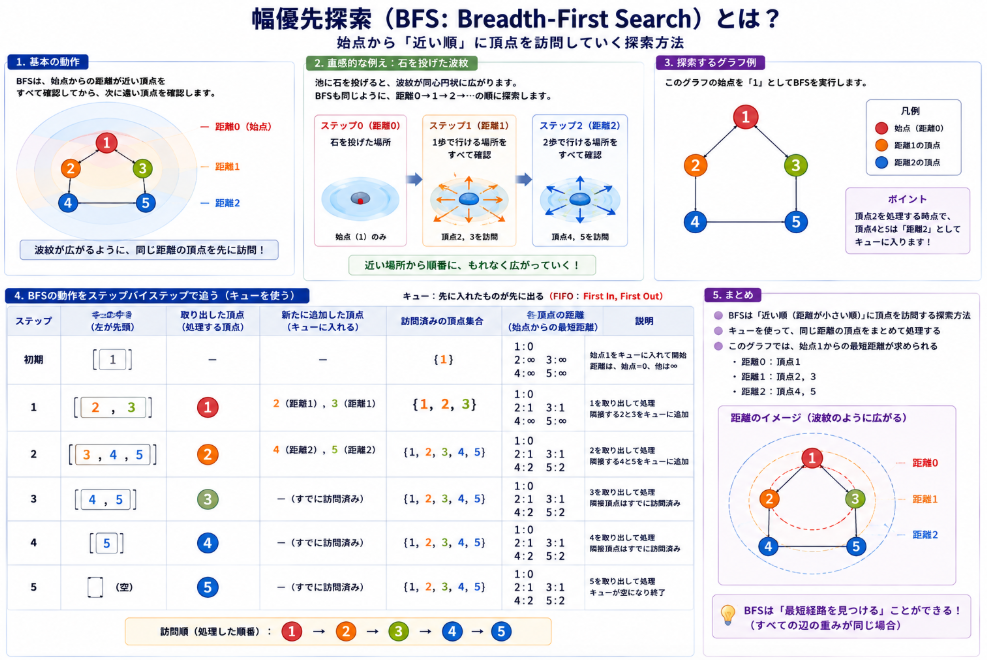

# グラフ探索

## グラフ探索について
グラフ上の探索と伝統的アルゴリズムについて、わかりやすく説明いたします。

### 1. 基本的な考え

**グラフ上の探索**とは、頂点（ノード）と辺（エッジ）で構成される構造の中から、特定の目標を達成するための「道」を見つける手順のことです。
**伝統的アルゴリズム**とは、現代の機械学習とは別に、数学的・論理的に設計された古典的な探索・最適化手法（BFS、DFS、ダイクストラ法など）を指します。

### 2. 直感的な例え：地下鉄の路線図

駅を「頂点」、路線を「辺」と考えてください。

- **幅優先探索（BFS）**：今いる駅から**1本で行ける駅すべて**を確認し、次に2本で行ける駅を確認する
- **深さ優先探索（DFS）**：とにかく**終点まで突き進む**。行き止まりになったら戻って別の道を試す
- **ダイクストラ法（Dijkstra）**：**所要時間が最短**の経路を見つける（各駅間の所要時間が異なる場合）
- **A*（Aスター）**：ダイクストラ法に「あとどれくらいかかりそうか」という**予測（ヒューリスティック）** を加えて、より速く目的駅を探す

### 3. 代表的なアルゴリズムの仕組み

__幅優先探索（BFS: Breadth-First Search）__
- **特徴**：始点からの**距離（ステップ数）が短い順**に探索する
- **使い道**：最短ステップ数を求める（例：SNSでの「友達の友達の距離」）
- **データ構造**：キュー（FIFO）を使用

__深さ優先探索（DFS: Depth-First Search）__
- **特徴**：**奥へ奥へ**進み、行き止まりで戻る（バックトラック）
- **使い道**：迷路の解探索、サイクル検出、トポロジカルソート
- **データ構造**：スタック（LIFO）または再帰を使用

__ダイクストラ法（Dijkstra's Algorithm）__
- **特徴**：辺に**重み（コスト）** があるグラフで、**始点からの最短コスト**を確定していく
- **使い道**：道案内（GPS）、ネットワークルーティング
- **注意**：辺の重みが負の場合は使えない

__A*（A-star）__
- **特徴**：ダイクストラ法に**ヒューリスティック関数 h(n)** を加えたもの
- **式**：f(n) = g(n) + h(n)
  - g(n)：始点から現在地点までの実コスト
  - h(n)：現在地点から目標までの推定コスト
- **使い道**：ゲームAIの経路探索、ロボットナビゲーション

### 4. どう使い分けるか？

| 状況 | 適したアルゴリズム |
|------|------------------|
| 最短ステップ数が知りたい | BFS |
| 解が存在するか確認したい | DFS |
| 移動時間・コストの最小経路 | ダイクストラ法 |
| リアルタイムで速く経路を求めたい | A* |
| 辺のコストが負を含む | ベルマン・フォード法 |

## グラフ探索の経緯

グラフ上の探索アルゴリズムは、**数学の純理論から電話網の実用問題、そして人工知能へ**という流れで発展してきました。以下に時系列で整理して説明いたします。

### 1. 起源：オイラーと「ケーニヒスベルクの橋」（1736年）

グラフ理論の誕生は、スイスの数学者**レオンハルト・オイラー（Leonhard Euler）** による論文（1736年）に遡ります。<source-chip title="Mathlog" url="https://mathlog.info/articles/1944" />

プロイセンのケーニヒスベルク（現カリーニングラード）の町に架かる7本の橋を、**それぞれちょうど1回ずつ渡って元の場所に戻れるか**という問題を、オイラーは「陸地を点、橋を線」という大胆な抽象化で解決しました。これが「グラフ」という概念の始まりです。

> ただし、この時点ではまだ「探索アルゴリズム」という概念はなく、「そのような道は存在しない」という証明が中心でした。

### 2. 19世紀：迷路探索と深さ優先探索（DFS）の原型

グラフを「探索」する考え方は、**迷路の攻略法**として発展しました。<source-chip title="Documenta Mathematica" url="https://www.maths.tcd.ie/EMIS/journals/DMJDMV/vol-ismp/32_schrijver-alexander-sp.pdf" />

- **C.P. Trémaux**（1882年頃）：迷路で「行き止まりで戻る」方法を提案
- **G. Tarry**（1895年）：同様の手法を形式的に記述
- **Wiener**（1873年）：関連する経路探索の研究

これらが後の**深さ優先探索（DFS）** の基礎となりました。

### 3. 1940〜50年代：通信網が最短経路問題を加速

第二次世界大戦後、**電話網の自動化**が最短経路アルゴリズムの発展を大きく後押ししました。<source-chip title="Documenta Mathematica" url="https://www.maths.tcd.ie/EMIS/journals/DMJDMV/vol-ismp/32_schrijver-alexander-sp.pdf" />

長距離電話が自動化される中、「最短経路が混雑した場合の**代替経路（alternate routing）** を機械が自動で選ぶ必要がある」という実用的な問題が生まれました。

この時期に登場した重要な手法：

| 年 | 研究者 | 貢献 |
|----|--------|------|
| 1946-53 | Shimbel, Luce など | 行列法によるネットワーク分析（神経ネットワークや通信網の応用） |
| 1955 | Shimbel | 「min-sum algebra」を用いた最短経路の行列計算（Bellman-Ford法の原型） |
| 1956 | Ford | 最短経路問題の一般的な反復スキームを提案 |
| 1957 | Leyzorek ら | ダイクストラ法に類似した方法を開発 |
| 1958 | Bellman | 動的計画法に基づく最短経路アルゴリズムを体系化 |
| 1959 | Dijkstra | **ダイクストラ法**を発表（非負の重みを持つグラフの最短経路） |
| 1959 | Moore | **幅優先探索（BFS）** に相当する方法を提案 |

> 特筆すべきは、1950年代に入ると**複数の研究者が独立にほぼ同じ手法**を開発したことです。これは「問題が成熟した」証拠でもあります。

### 4. 1968年：A*アルゴリズムの誕生（AIとの融合）

1968年、**Peter Hart、Nils Nilsson、Bertram Raphael**（スタンフォード研究所）が論文 *"A Formal Basis for the Heuristic Determination of Minimum Cost Paths"* を発表し、**A*アルゴリズム**を提案しました。[Communications of the ACM](https://cacm.acm.org/opinion/a-search/)[Algorithm Hall of Fame](https://www.algorithmhalloffame.org/algorithms/a-star-search/)
このアルゴリズムは、**ダイクストラ法に「ヒューリスティック（推定値）」を組み合わせた**もので、ロボット「Shakey」の経路探索を目的に開発されました。

> A*の重要な性質：ヒューリスティックが「許容的（admissible）」であれば、**最短経路を保証しながら探索範囲を最小化できる**ことが数学的に証明されました。

### 5. 発展のまとめ：3つの波

グラフ探索アルゴリズムの歴史は、大きく3つの波に分けられます。

| 波 | 時期 | きっかけ | 代表的成果 |
|----|------|----------|------------|
| **第1波：数学的誕生** | 1736〜1900年 | 純粋数学の興味 | オイラーのグラフ理論、迷路探索 |
| **第2波：実用化** | 1940〜1960年 | 電話網・通信網・OR | BFS/DFSの体系化、Bellman-Ford法、ダイクストラ法 |
| **第3波：AI化** | 1960年〜 | ロボット・ゲーム・知能 | A*、IDA*、IDAなどの発展形 |

## 幅優先探索(BFS)

幅優先探索（BFS: Breadth-First Search）について、説明いたします。

### 1. 基本の動作

**幅優先探索とは、始点から「近い順」に頂点を訪問していく探索方法です。**
「1歩で行ける場所を全部確認してから、次に2歩で行ける場所を確認する」というイメージです。

### 2. 直感的な例え：石を投げた波紋

池に石を投げると、波紋が**同心円状に外側へ広がっていきます**よね。

BFSも全く同じです。始点からの距離が1の頂点を全部確認してから、距離2の頂点を確認し、次に距離3へ……と、波紋が広がるように順番に探索していきます。

### 3. 仕組み：ステップバイステップ

以下のグラフを使って、始点を頂点1としてBFSを追ってみます。

```
    1
   / \
  2   3
  | \ /
  4  5
```

BFSは**キュー（Queue）** というデータ構造を使います。キューは「先に入れたものが先に出る（FIFO）」待ち行列です。

| ステップ | キューの中身 | 取り出した頂点 | 訪問済み | 距離 |
|----------|-------------|---------------|----------|------|
| 初期 | [1] | — | {1} | 1:0 |
| 1 | [2, 3] | 1 | {1,2,3} | 2:1, 3:1 |
| 2 | [3, 4, 5] | 2 | {1,2,3,4,5} | 4:2, 5:2 |
| 3 | [4, 5] | 3 | (変化なし) | — |
| 4 | [5] | 4 | (変化なし) | — |
| 5 | [] | 5 | (変化なし) | — |

**訪問順：1 → 2 → 3 → 4 → 5**

ポイントは、**頂点2を処理する時点で、頂点4と5は「距離2」としてキューに入る**ことです。これにより、距離1の頂点（2, 3）をすべて処理し終えてから、距離2の頂点（4, 5）を処理する順序が保証されます。



__探索できる理由__

BFSが「近い順」に探索できる理由は、**キュー（FIFO）というデータ構造の性質**にあります。

__理由：キューの「順序保証」__

BFSが「距離の小さい順」に頂点を処理できるのは、以下の3つの仕組みが連動しているからです。

__1. 距離dの頂点を処理すると、距離d+1の頂点が「後ろ」に追加される__

```
処理中: 距離dの頂点
   ↓
隣接頂点（距離d+1）をキューの後ろに追加
```

__2. キューの「前」には、まだ処理されていない距離dの頂点が残っている__

キューはFIFO（先に入れたものが先に出る）なので：
- 距離dの頂点が先に入っている
- 距離d+1の頂点は後から入る
- **距離dの頂点がすべて出てから、初めて距離d+1の頂点が出てくる**

__3. 数学的帰納法で「距離順」が保証される__

| 距離 | いつキューに入る | いつ処理される |
|------|----------------|--------------|
| 距離0（始点） | 最初 | 最初 |
| 距離1 | 始点を処理した時 | 距離0の後 |
| 距離2 | 距離1の頂点を処理した時 | 距離1の後 |
| 距離d+1 | 距離dの頂点を処理した時 | 距離dの後 |

> つまり、「距離dの頂点がすべて処理されてから、距離d+1の頂点が処理される」という順序が、**キューのFIFO性によって機械的に保証される**のです。

__具体例で確認__

先ほどのグラフで、キューの中身を「距離」で色分けすると：

| ステップ | キューの中身 | 処理する距離 |
|----------|-------------|-------------|
| 初期 | [**1**] | 距離0 |
| 1 | [**2**, **3**] | 距離1 |
| 2 | [**3**, 4, 5] | 距離1（4,5はまだ） |
| 3 | [4, 5] | 距離2 |
| 4 | [5] | 距離2 |
| 5 | [] | 完了 |

**太字** = そのステップで処理する頂点

距離1の頂点（2, 3）が**キューからすべて出てから**、初めて距離2の頂点（4, 5）が処理されることが確認できます。

__もしキューでなく「スタック」を使うと？__

BFSと同じコードで、キューを**スタック（LIFO: 後入れ先出し）** に変えると、**深さ優先探索（DFS）** になります。

| データ構造 | 取り出し順 | 探索の性質 |
|-----------|-----------|-----------|
| **キュー（FIFO）** | 先に入れたものが先に出る | **BFS**（近い順） |
| **スタック（LIFO）** | 後に入れたものが先に出る | **DFS**（奥へ奥へ） |

つまり、BFSが「近い順」に探索できるのは、**「キュー」という道具を選んだこと**が直接の理由です。


### 4. BFSの特徴と計算量

| 項目 | 内容 |
|------|------|
| **データ構造** | キュー（FIFO） |
| **最短経路** | **辺の重みがすべて同じ**なら、始点からの最短ステップ数が保証される |
| **時間計算量** | O(V + E)（V=頂点数、E=辺数） |
| **空間計算量** | O(V)（訪問済み管理＋キュー） |
| **使いどころ** | 最短ステップ数の探索、SNSの友達関係、迷路の最短経路（重みなし） |

### 5. BFS vs DFS：どこが違う？

| 比較項目 | BFS（幅優先） | DFS（深さ優先） |
|----------|-------------|---------------|
| **探索の順序** | 近い順に同心円状 | 奥へ奥へ突き進む |
| **データ構造** | キュー | スタック（または再帰） |
| **最短ステップ数** | 保証される | 保証されない |
| **メモリ使用量** | 幅が広いグラフでは多くなる | 深さが浅ければ少なく済む |
| **使いどころ** | 最短経路、レベル順探索 | サイクル検出、トポロジカルソート、迷路の解探索 |

### 6. 実際の応用例

- **SNSの「友達の友達」検索**：自分から距離2のユーザーを探す
- **Webクローラー**：リンクを辿ってページを収集（近いページから順に）
- **迷路の最短経路**：各マスが頂点、隣接マスが辺と考える
- **感染の拡大シミュレーション**：感染者から「1日で感染する人→2日で感染する人」の順に広がる

__例題:__

以下のグラフで、始点をAとしてBFSを実行した場合、**訪問順は何になるでしょうか？**

```
    A
   / \
  B   C
   \ /
    D
```

BFS（幅優先探索）の訪問順は以下の通りです。

**訪問順: A → B → C → D**

__解説__
1. 始点 **A** をキューに入れ、訪問
2. Aの隣接ノード **B**、**C** を順にキューに追加
3. キューから **B** を取り出し訪問。Bの隣接Dをキューに追加
4. キューから **C** を取り出し訪問。Cの隣接Dは既に訪問予定なので無視
5. キューから **D** を取り出し訪問

__Python実装__

```python
from collections import deque
import networkx as nx

def bfs_networkx_manual(graph_dict, start):
    # networkxのグラフを作成
    G = nx.Graph()
    for node, neighbors in graph_dict.items():
        for neighbor in neighbors:
            G.add_edge(node, neighbor)
    
    visited = []
    queue = deque([start])
    seen = set([start])
    
    while queue:
        node = queue.popleft()
        visited.append(node)
        
        # networkxのneighbors()で隣接ノードを取得
        for neighbor in G.neighbors(node):
            if neighbor not in seen:
                seen.add(neighbor)
                queue.append(neighbor)
    
    return visited
```

__BFS例題の解説__

コードの実行結果をもとに、**なぜ訪問順が A → B → C → D になるのか**を詳しく説明します。

__1. このグラフの構造__

```
     A
    / \
   B   C
    \ /
     D
```

| 頂点 | 隣接する頂点 | 意味 |
|------|-------------|------|
| A | B, C | AからBとCに直接行ける |
| B | A, D | BからAに戻れて、Dにも行ける |
| C | A, D | CからAに戻れて、Dにも行ける |
| D | B, C | DからBとCに戻れる |

__2. ステップごとの動作__

**ステップ1：Aを処理**

| 項目 | 内容 |
|------|------|
| キューの状態 | [A] |
| 取り出す頂点 | **A** |
| Aの隣接 | B, C |
| キューに追加 | B, C |

Aを訪問し、隣接するBとCをキューに追加します。
**重要：Bが先に追加される**ため、BがCより先に処理されます。

**ステップ2：Bを処理**

| 項目 | 内容 |
|------|------|
| キューの状態 | [B, C] |
| 取り出す頂点 | **B**（先に入れたものが先に出る = FIFO） |
| Bの隣接 | A, D |
| キューに追加 | **D**（Aは訪問済みなので無視） |

Bを訪問し、隣接するAは「訪問済み」なので無視し、**Dをキューに追加**します。

**ステップ3：Cを処理**

| 項目 | 内容 |
|------|------|
| キューの状態 | [C, D] |
| 取り出す頂点 | **C** |
| Cの隣接 | A, D |
| キューに追加 | **なし**（AもDも訪問済み） |

Cを訪問しますが、Aは訪問済み、Dはステップ2で追加済みなので、**新しい頂点は追加されません**。

**ステップ4：Dを処理**

| 項目 | 内容 |
|------|------|
| キューの状態 | [D] |
| 取り出す頂点 | **D** |
| Dの隣接 | B, C |
| キューに追加 | **なし**（両方とも訪問済み） |

Dを訪問しますが、BとCはすでに訪問済みなので、新しい頂点は追加されません。
キューが空になり、**探索終了**です。

__3. なぜこの順序になるのか？__

__核心：「距離順」に処理される__

| 頂点 | 始点Aからの距離 | 処理ステップ |
|------|---------------|-------------|
| A | 0 | ステップ1 |
| B | 1 | ステップ2 |
| C | 1 | ステップ3 |
| D | 2 | ステップ4 |

- **距離0**：Aが最初に処理される
- **距離1**：BとCが次に処理される（Aの隣接）
- **距離2**：Dが最後に処理される（BまたはCの隣接）

__なぜBがCより先に処理されるのか？__

Aの隣接リストが `['B', 'C']` の順なので、**Bが先にキューに入ります**。
キューはFIFO（先入れ先出し）なので、Bが先に出てきます。

> もし `['C', 'B']` の順なら、訪問順は **A → C → B → D** になります。最短距離自体は変わりません。

__4. 「訪問済みチェック」の重要性__

各ステップで `if neighbor not in seen:` を確認しています。

- **Aの処理時**：B, Cを追加
- **Bの処理時**：Aは訪問済みなので無視、Dを追加
- **Cの処理時**：Aは訪問済みなので無視、Dは追加済みなので無視
- **Dの処理時**：B, Cともに訪問済みなので無視

このチェックがないと、**A↔B↔D↔C↔A と無限ループ**に陥る可能性があります。

__5. BFSの「波紋」のイメージ__

```
ステップ1:  [A]           ← 距離0
ステップ2:  [B, C]        ← 距離1（Aの隣接）
ステップ3:  [C, D]        ← Cは距離1、Dは距離2
ステップ4:  [D]           ← 距離2
```

まさに**池の波紋**のように、始点Aから同心円状に探索が広がっていきます。


## 深さ優先探索

グラフ理論における **深さ優先探索（Depth-First Search, DFS）** とは、**「行き止まりにぶつかるまで深く進み、戻って別の道を探す」** という戦略でグラフを巡回する基本的なアルゴリズムです。

以下に、動作原理、性質、用途を整理して説明いたします。

### 1. 基本の動作

迷路を探索する人を想像してください。

1. **分岐点**で道を1つ選び、**できるだけ深く進む**
2. **行き止まり or 訪問済みの場所**にぶつかったら、**直前の分岐点まで戻る**（バックトラック）
3. まだ未訪問の分岐があればそこから再開し、なければさらに戻る
4. すべての到達可能なノードを訪問するまで繰り返す

> **「広く」ではなく「深く」進む** のが DFS の特徴です。

### 2. アルゴリズムの仕組み

グラフ $G = (V, E)$ に対して、開始ノード $s$ から DFS を実行します。

__擬似コード__

```
DFS(グラフ G, 開始ノード s):
    visited[v] ← false（すべてのノード v ∈ V）
    stack ← 空のスタック
    stack.push(s)

    while stack が空でない:
        v ← stack.pop()
        if visited[v] == false:
            visited[v] ← true
            v を訪問済みとする（処理を実行）

            for v に隣接する各ノード u:
                if visited[u] == false:
                    stack.push(u)
```

__再帰による実装（より一般的）__

```
DFS(v):
    visited[v] ← true
    v を処理する

    for v に隣接する各ノード u:
        if visited[u] == false:
            DFS(u)
```

> **グラフの場合は「訪問済みフラグ（visited）」が必須**です。これがないと、閉路（サイクル）があるグラフで無限ループに陥ります。木の DFS では不要ですが、グラフでは絶対に必要です。

### 3. DFS が生成するもの：DFS 木（全域森）

DFS を実行すると、**「どのノードからどのノードへ初めて到達したか」** を記録することで、元のグラフの部分グラフとして **DFS 木（または DFS 全域森）** が得られます。

| 辺の種類 | 定義 |
|---------|------|
| **木辺（Tree Edge）** | DFS 木に含まれる辺（初めて未訪問ノードへ到達した辺） |
| **後退辺（Back Edge）** | 祖先ノードへ戻る辺（**サイクルの存在を示す**） |
| **前進辺（Forward Edge）** | 子孫ノードへ向かうが、木辺ではない辺 |
| **交差辺（Cross Edge）** | それ以外（兄弟サブツリー間などを結ぶ辺） |

特に **後退辺が存在するかどうか** は、有向グラフにおけるサイクル検出の重要な手がかりになります。

### 4. 計算量

| 項目 | 計算量 | 説明 |
|------|--------|------|
| **時間計算量** | $O(|V| + |E|)$ | 各ノードを1回、各辺を1回ずつ処理 |
| **空間計算量** | $O(|V|)$ | 訪問済みフラグ + 再帰スタック（最深部は $|V|$） |

### 5. 幅優先探索（BFS）との比較

| 項目 | DFS（深さ優先） | BFS（幅優先） |
|------|----------------|--------------|
| **探索順** | 深く進む | 近いノードから順に広がる |
| **データ構造** | スタック（または再帰） | キュー |
| **最短経路** | 保証しない | 非重みグラフでは保証する |
| **空間効率** | 分岐数に依存（通常 BFS より少ない） | フロンティア全体を保持（多い） |
| **用途** | サイクル検出、トポロジカルソート、強連結成分 | 最短経路、レベル順探索 |

### 6. 主な応用

DFS は単なる「全ノード巡回」以上の強力な性質を持ち、以下の問題を解く際の基盤となります。

__① 連結成分の分解（無向グラフ）__

すべてのノードに対して未訪問なら DFS を呼び出すことで、**連結成分ごとにグループ化**できます。

__② サイクル検出__

- **無向グラフ**：訪問済みの隣接ノード（直前の親を除く）が存在すればサイクルあり
- **有向グラフ**：後退辺（祖先へ戻る辺）が存在すればサイクルあり

__③ トポロジカルソート（有向非巡回グラフ：DAG）__

DFS の **帰りがけ順（post-order）** を記録し、**逆順に並べる**ことでトポロジカル順序が得られます。タスクの依存関係解決などに使われます。

__④ 強連結成分分解（SCC）__

**Kosaraju アルゴリズム** や **Tarjan アルゴリズム** は DFS を応用したもので、有向グラフの「強連結成分」を線形時間で求めます。

__⑤ 2辺連結成分・関節点検出__

**Tarjan のアルゴリズム** により、DFS 木上の到達可能な最小祖先情報（low-link 値）を管理することで、グラフを分断する「関節点」や「橋」を線形時間で検出できます。

## ダイクストラ法

ダイクストラ法（Dijkstra's algorithm）について、初心者にもわかりやすく説明いたします。

### 1. 一言で言うと

ダイクストラ法とは、**グラフ（点と線のネットワーク）の中で、ある地点から他のすべての地点への最短経路を求めるアルゴリズム**です。ただし、線（辺）の長さ（コスト）がすべてゼロか正の値である場合に限ります。

### 2. 直感的なイメージ：「墨を染み込ませる」

地面に複数の地点があり、地点同士を道で結んでいると想像してください。ある地点に墨を落としたら、道に沿って墨が染み込んでいきます。墨が最初に到達した地点ほど、その地点への最短距離が確定します。

この「墨が広がっていく」ように、スタート地点から近い順に「最短距離が確定した地点」を次々と決めていくのが、ダイクストラ法の本質です。

### 3. 具体的な仕組み（ステップバイステップ）

以下のようなグラフがあるとします。

```
    4
A ---- B
|      |
|2     |1
|      |
C ---- D
    3
```

地点Aから各地点への最短距離を求めます。

**準備：**
- 各地点に「現時点でわかっている最短距離」を記録します。最初はスタート地点Aを0、その他を「無限大（∞）」とします。
- 未確定の地点の集合を用意します。

**ステップ1：**
- 未確定の地点の中から、現時点で最短距離が最も小さい地点を選びます。最初はA（距離0）です。
- Aを「最短距離確定」とします。
- Aから直接つながっている地点を更新します。
  - A→B（コスト4）：Bの距離を∞→4に更新
  - A→C（コスト2）：Cの距離を∞→2に更新

**ステップ2：**
- 未確定の地点（B, C, D）の中で、最も小さい距離の地点はC（距離2）です。
- Cを「最短距離確定」とします。
- Cから直接つながっている地点を更新します。
  - C→D（コスト3）：Cの距離2 + 3 = 5なので、Dの距離を∞→5に更新

**ステップ3：**
- 未確定の地点（B, D）の中で、最も小さい距離の地点はB（距離4）です。
- Bを「最短距離確定」とします。
- Bから直接つながっている地点を更新します。
  - B→D（コスト1）：Bの距離4 + 1 = 5。現在のDの距離も5なので、更新しなくてもよい（同じ）。

**ステップ4：**
- 残るD（距離5）を確定します。

**結果：**
- AからA：0
- AからC：2
- AからB：4
- AからD：5（A→C→D または A→B→D）

### 4. 重要なポイントと限界

| 項目 | 内容 |
|------|------|
| **使える条件** | 辺のコストがすべて「0以上」の場合 |
| **使えない条件** | 負のコスト（負の辺）がある場合。負の辺がある場合はベルマン・フォード法（Bellman-Ford algorithm）を使います。 |
| **よくある誤解** | ダイクストラ法は「すべての地点間」の最短経路を求めるのが主目的ではなく、「1つの地点からすべての地点への」最短経路を求めるものです。 |

### 5. ダイクストラ法の例題

ダイクストラ法の「どうやって最短距離が確定していくか」がイメージできる、段階的な例題を作成しました。

__例題：駅からの最短時間__

次のような地下鉄の路線図があります。数字は駅間の移動時間（分）です。

```
        2
    A ---- B
    |      |
  4 |      | 1
    |      |
    C ---- D ---- E
        3      | 2
               F
```

**問題：** 駅Aから他のすべての駅（B, C, D, E, F）への最短移動時間を、ダイクストラ法を使って求めなさい。

__解答の進め方__

__準備__

各駅の「現時点でわかっている最短時間」を記録します。最初はAを0分、その他を「不明（∞）」とします。

| 駅 | A | B | C | D | E | F |
|---|---|---|---|---|---|---|
| 最短時間 | 0 | ∞ | ∞ | ∞ | ∞ | ∞ |

__ステップ1：駅Aを確定する__

未確定の駅の中で最短時間が最も小さいのは **A（0分）** です。Aを確定します。

Aから直接つながっている駅を更新します。

- A → B（2分）：Bの最短時間を ∞ → **2分** に更新
- A → C（4分）：Cの最短時間を ∞ → **4分** に更新

| 駅 | A | B | C | D | E | F |
|---|---|---|---|---|---|---|
| 最短時間 | **0（確定）** | 2 | 4 | ∞ | ∞ | ∞ |

__ステップ2：駅Bを確定する__

未確定の駅（B, C, D, E, F）の中で最短時間が最も小さいのは **B（2分）** です。Bを確定します。

Bから直接つながっている駅を更新します。

- B → D（1分）：Bの最短時間 2分 + 1分 = **3分**。Dの最短時間を ∞ → **3分** に更新

| 駅 | A | B | C | D | E | F |
|---|---|---|---|---|---|---|
| 最短時間 | 0（確定） | **2（確定）** | 4 | 3 | ∞ | ∞ |

__ステップ3：駅Dを確定する__

未確定の駅（C, D, E, F）の中で最短時間が最も小さいのは **D（3分）** です。Dを確定します。

Dから直接つながっている駅を更新します。

- D → C（3分）：Dの最短時間 3分 + 3分 = 6分。現在のCの最短時間は4分なので、**更新しない**
- D → E（2分）：Dの最短時間 3分 + 2分 = **5分**。Eの最短時間を ∞ → **5分** に更新

| 駅 | A | B | C | D | E | F |
|---|---|---|---|---|---|---|
| 最短時間 | 0（確定） | 2（確定） | 4 | **3（確定）** | 5 | ∞ |

__ステップ4：駅Cを確定する__

未確定の駅（C, E, F）の中で最短時間が最も小さいのは **C（4分）** です。Cを確定します。

Cから直接つながっている駅を更新します。

- C → A（4分）：Aはすでに確定しているので無視
- C → D（3分）：Dもすでに確定しているので無視

更新はありません。

| 駅 | A | B | C | D | E | F |
|---|---|---|---|---|---|---|
| 最短時間 | 0（確定） | 2（確定） | **4（確定）** | 3（確定） | 5 | ∞ |

__ステップ5：駅Eを確定する__

未確定の駅（E, F）の中で最短時間が最も小さいのは **E（5分）** です。Eを確定します。

Eから直接つながっている駅を更新します。

- E → D（2分）：Dはすでに確定しているので無視
- E → F（2分）：Eの最短時間 5分 + 2分 = **7分**。Fの最短時間を ∞ → **7分** に更新

| 駅 | A | B | C | D | E | F |
|---|---|---|---|---|---|---|
| 最短時間 | 0（確定） | 2（確定） | 4（確定） | 3（確定） | **5（確定）** | 7 |

__ステップ6：駅Fを確定する__

残る **F（7分）** を確定します。

| 駅 | A | B | C | D | E | F |
|---|---|---|---|---|---|---|
| 最短時間 | 0 | 2 | 4 | 3 | 5 | **7（確定）** |

__最終結果__

Aから各地点への最短移動時間は以下の通りです。

| 目的地 | 最短時間 | 最短経路 |
|---|---|---|
| B | 2分 | A → B |
| C | 4分 | A → C |
| D | 3分 | A → B → D |
| E | 5分 | A → B → D → E |
| F | 7分 | A → B → D → E → F |

__ポイントまとめ__

1. **毎回、未確定の中で最も小さい距離の地点を選ぶ**：これが「貪欲法（greedy）」と呼ばれる性質です。
2. **一度確定した地点の最短距離は変わらない**：これがダイクストラ法の核心です。負の辺があるとこの保証が崩れるため、ダイクストラ法は使えません。
3. **直接つながっていなくても最短経路が求まる**：AとDは直接つながっていませんが、A → B → D が最短経路として求まりました。

## PageRank


PageRank（ページランク）について、わかりやすく説明いたします。

### 1. 一言で言うと

PageRankとは、**グラフの各ノード（ウェブページなど）の「重要性」や「影響力」を、リンク（辺）の構造から数値として計算するアルゴリズム**です。Googleの創業者ラリー・ペイジとセルゲイ・ブリンによって開発されました。

### 2. 直感的なイメージ：「投票ゲーム」

あるクラスで「最も影響力のある生徒」を決めると想像してください。

- AさんがBさんを推薦したら、Bさんに1票入ります。
- でも、**推薦した人自身がどれだけ影響力があるか**も重要です。影響力の大きい人からの推薦は、たくさんの票を持つ人からの推薦より価値があるかもしれません。
- さらに、ある人がたくさんの人を推薦していたら、それぞれの推薦の価値は薄まります（票が分散する）。

PageRankも同じ考え方です。**「多くのページからリンクを受けている」かつ「重要なページからリンクを受けている」ページほど、高い評価を得ます。**

### 3. 具体的な仕組み

以下のような小さなウェブを考えます。矢印はリンク（A → B は「AがBにリンクしている」）を表します。

```
A ──→ B
↑   ↗ |
│  /  ↓
└───  C
```

**ルール：**
- 各ページは最初、同じ点数（例えば1.0）を持ちます。
- 各ページは自分の持ち点を、自分から出ているリンクの数で等分して、リンク先に分配します。
- この分配を繰り返し、点数が収束（変化しなくなる）するまで続けます。

**ステップ1（初期状態）：**
- A: 1.0, B: 1.0, C: 1.0

**ステップ2（1回目の分配）：**
- AはBにリンク（1本）：Bに1.0を渡す
- BはAとCにリンク（2本）：Aに0.5、Cに0.5を渡す
- CはAにリンク（1本）：Aに1.0を渡す

集計：
- Aが受け取る：0.5（Bから）+ 1.0（Cから）= **1.5**
- Bが受け取る：1.0（Aから）= **1.0**
- Cが受け取る：0.5（Bから）= **0.5**

**ステップ3（2回目の分配）：**
- A（1.5）→ Bに1.5
- B（1.0）→ Aに0.5、Cに0.5
- C（0.5）→ Aに0.5

集計：
- A：0.5 + 0.5 = **1.0**
- B：1.5 = **1.5**
- C：0.5 = **0.5**

この計算を数十回、数百回と繰り返すと、各ページの点数は一定の値に収束します。その収束した値がPageRankです。

### 4. 重要なポイントと限界

| 項目 | 内容 |
|------|------|
| **基本のアイデア** | 「重要なページからリンクを受けているページは重要」という再帰的な定義 |
| **計算方法** | 繰り返し計算（冪乘法）で、最終的に確率分布（合計が1になるように正規化）として求める |
| **対象** | 有向グラフ（ウェブページのリンクは一方通行だから） |
| **注意点** | リンクを出さないページ（行き止まり）や、閉じたループだけで循環するページ群があると計算が破綻しやすいため、実際には「確率dでリンク先に進み、確率(1-d)でランダムなページに飛ぶ」という補正（ダンピング係数）を入れます |
| **用途** | ウェブ検索のランキング、論文の引用ネットワーク分析、SNSでの影響力者の発見など |

### 5. 用途

PageRankの用途について、分野別に整理して説明いたします。

__1. 一言でまとめる__

PageRankは、**「リンクの構造からノードの重要性を評価したい」場面で、ウェブ以外のさまざまな分野にも応用されているアルゴリズム**です。本質的には「有向グラフのノードの重み付け」に使えます。

__2. 主な用途と具体例__

__ウェブ検索（本来の用途）__

Googleの創業期に検索結果のランキングに使われました。キーワードの一致度だけでなく、「どれだけ重要なページか」をPageRankで評価することで、検索の質が大きく向上しました。
- 例：權威ある大学や政府機関のサイトからリンクされているページは、個人ブログからリンクされているページより高く評価される。

__学術論文の評価（引用ネットワーク）__

__論文が他の論文から「引用」される関係は、ウェブのリンク構造と同じです。PageRankを使うと、単なる「被引用数」よりも、**権威ある論文から引用されているかどうか**を考慮した評価ができます。
- 例：ノーベル賞級の研究者の論文から引用されている論文は、それだけで高い学術的価値を持つ可能性がある。

__SNS・影響力者の発見__

SNSでの「フォロー」や「リツイート」の関係を有向グラフとして見ると、PageRankでユーザーの影響力を測定できます。単なるフォロワー数ではなく、**影響力のある人物からフォローされているか**を考慮します。
- 例：Twitter（X）での「TwitteRank」や、SNSマーケティングで本当に影響力のあるアカウントを選定する際に使われます。

__バイオインフォマティクス（遺伝子・タンパク質ネットワーク）__

細胞内では遺伝子やタンパク質が相互作用しています。このネットワークにPageRankを適用すると、**病気や生命活動に重要な遺伝子やタンパク質**を特定できます。
- 例：がんに関与する重要なタンパク質を、相互作用ネットワークから発見する研究に使われています。

__推薦システム__

ユーザーが商品を購入したり、映画を観たりする行動をグラフとして表現し、PageRankで「次に推薦すべき商品」を選ぶことができます。
- 例：「この商品を買った人はこの商品も買っている」という関係から、重要な商品を見つけ出す。

__スパム・不正検出__

ウェブのリンク構造を分析すると、スパムサイトが作った不自然なリンクの集まり（リンクファーム）を検出できます。PageRankの分布が不自然なサイト群はスパムの疑いがあります。
- 例：SEO目的で作られた相互リンクのネットワークを特定する。

__交通・都市計画__

道路ネットワークや公共交通網をグラフとして見たとき、PageRankで「交通上重要な地点」を特定できます。
- 例：道路ネットワークでPageRankの高い交差点は、交通の要所であり、渋滞の影響が大きい地点として特定できる。

__3. まとめ：PageRankが使える条件__

PageRankが使える場面は、以下の条件を満たすときです。

- 対象が**有向グラフ**として表現できる
- 「どのノードが重要か」を**リンクの構造だけで判断したい**
- 単なる「数（被リンク数・被引用数・フォロワー数）」ではなく、**「誰からリンクされているか」の質も考慮したい**

__4. 確認のための質問__

以下のケースのうち、PageRankを適用するのに最も適しているものはどれでしょうか？また、なぜそう思いますか？

1. 学校内の生徒間で「誰が人気者か」を調べたい（生徒Aが生徒Bを「好き」と答えたアンケート結果がある）
2. 図書館の本を「出版年」だけで並べ替えたい
3. レストランの料理を「カロリー」だけで評価したい

考えてみてください。わからなければ、一緒に考えていきましょう。

## A*
アクションRPGなどでNPCキャラクターが移動するときに、障害物をかわしながらプレーヤーを追いかけて来る動作を行うような場面があります。
こんな時にもちられているアルゴリズムがA*と呼ばれる探索アルゴリズムです。


### 1. 核心アイデア

A*は、ダイクストラ法に「ゴールまでの推定距離（ヒューリスティック）」を加えた探索アルゴリズムです。
「今までのコスト」と「あとどれくらいかかりそうか」の両方を考慮して、**最も有望な方向から先に探索する**ことで、無駄な探索を大幅に減らせます。

### 2. 直感的な例え：目的地までの道順を探す

暗い森の中で、懐中電灯を持って出口を探す状況を想像してください。

- **ダイクストラ法**：懐中電灯で周囲を照らしながら、**近い場所から順に**全方向に歩いて確認する
- **A***：出口の方角が分かっているので、**「出口に近そうな方向」を優先的に**進む。行き止まりになったら別の道を試す

A*は「出口の方角」というヒントを使って、無駄な探索を減らします。

### 3. 仕組み：f(n) = g(n) + h(n)

A*の核心は、各頂点に対して以下の値を計算することです。

| 記号 | 意味 | 説明 |
|------|------|------|
| **g(n)** | 実コスト | 始点から現在位置までの実際の移動コスト |
| **h(n)** | ヒューリスティック | 現在位置からゴールまでの**推定コスト** |
| **f(n)** | 評価値 | f(n) = g(n) + h(n)。この値が小さい順に探索する |

__ヒューリスティックの条件__

A*が**最短経路を保証する**ためには、ヒューリスティック h(n) が以下の条件を満たす必要があります。

- **許容的（Admissible）**：h(n) が**実際のコストを過大評価しない**こと
  - 例：マンハッタン距離（格子状の移動では実際の距離より短くなることがあるが、決して長くならない）

### 4. 実行結果の解説

グリッド：
```
  S . . . . . 
  . # # . # . 
  . . . . # . 
  . # # # # . 
  . . . . . G 
```

最短経路：S → (1,0) → (2,0) → (3,0) → (4,0) → (4,1) → (4,2) → (4,3) → (4,4) → G
総コスト：9
探索ステップ数：22

ポイントは、**すべてのステップで f値=9 が一定**になっていることです。

- 始点(0,0)の f = g(0) + h(9) = 9
- 終点(4,5)の f = g(9) + h(0) = 9

マンハッタン距離をヒューリスティックに使っているため、**f値は常に「最短経路の推定値」に一致**します。これがA*の「賢さ」の証拠です。

### 5. A* vs ダイクストラ法 vs BFS

| 比較項目 | BFS | ダイクストラ法 | A* |
|----------|-----|---------------|-----|
| **辺の重み** | 全て同じ | 異なる重みOK | 異なる重みOK |
| **ゴール情報** | 使わない | 使わない | **ヒューリスティックで活用** |
| **探索範囲** | 全方位に広がる | 全方位に広がる | **ゴール方向に集中** |
| **最短経路保証** | 保証される | 保証される | **ヒューリスティックが許容的なら保証** |
| **計算量** | O(V+E) | O((V+E)logV) | 状況次第（ヒューリスティック次第） |

__具体的な違いのイメージ__

同じ迷路でゴールを探す場合：

- **BFS/ダイクストラ法**：迷路全体をほぼ均等に探索する
- **A***：ゴールの方向を優先的に探索し、逆方向への無駄な探索を大幅に削減

### 6. ヒューリスティックの種類

| ヒューリスティック | 適用場面 | 特徴 |
|-------------------|----------|------|
| **マンハッタン距離** | 格子状の移動（上下左右のみ） | 許容的であることが保証される |
| **ユークリッド距離** | 自由な方向への移動 | 直線距離なので常に許容的 |
| **0（常に）** | — | A*がダイクストラ法と同等になる |

> ヒューリスティックが「0」だと、f(n) = g(n) となり、ダイクストラ法と全く同じ動作になります。

### 7. 実際の応用例

- **ゲームAIの経路探索**：NPCが障害物を避けて最短経路で移動する
- **ロボットナビゲーション**：ロボットが地図上で目的地までの経路を計画する
- **GPSナビゲーション**：道路網における最短時間経路の探索
- **ネットワークルーティング**：通信パケットの効率的な転送経路決定

### 確認の質問

以下のグリッドで、A*のヒューリスティックとして **「ユークリッド距離」** を使った場合と **「マンハッタン距離」** を使った場合、どちらがより「ゴール方向に集中して探索」しそうでしょうか？その理由は何でしょうか？

```
  S . . . G
  . # # # .
  . . . . .
```

回答：**マンハッタン距離の方が、よりゴール方向に集中して探索します。**

理由：

__1. ヒューリスティックの値の大きさが異なる__

同じ2点間でも、**マンハッタン距離はユークリッド距離より常に大きい（または等しい）** 値を返します。

このグリッドでは、ゴール G=(0,4) に対する各位置のヒューリスティック値を比較すると：

| 位置 | マンハッタン距離 | ユークリッド距離 |
|------|----------------|----------------|
| (0,0) S | 4 | 4.0 |
| (1,0) | 5 | ≈4.12 |
| (2,0) | 6 | ≈4.47 |
| (2,2) | 4 | ≈2.83 |

__2. A*の評価値 f = g + h における影響__

A*は **f値が小さいノードを優先的に探索**します。

- **h値（ヒューリスティック）が大きい** → ゴールから遠いと判断 → 優先度が下がる
- **h値が小さい** → ゴールに近いと判断 → 優先度が上がる

マンハッタン距離はユークリッド距離より大きな値を返すため、**ゴールから外れた方向（このグリッドでは下の行）に対してより強くペナルティを与えます**。結果として、ゴールに近い上の行のノードが相対的に高く優先されるため、ゴール方向への集中が強まります。

__3. このグリッドでの具体的な動作__

このグリッドでは、**上の行（行0）をそのまま右に進めば最短経路**（S→右→右→右→G、コスト4）に到達できます。

- **マンハッタン距離**：下の行に降りると「最短経路より遠回り」であることを厳密に評価し、上の行を強く優先
- **ユークリッド距離**：下の行への迂回をマイルドに評価（直線距離なので短く見積もりすぎるため）、結果としてゴール方向への集中がやや弱まる

__補足：ただしこのグリッドでは差は限定的__

このグリッドでは**行0がそのまま通れる**ため、A*はどちらのヒューリスティックを使っても「上の行を右に進む」という最短経路を自然に見つけます。

もし**行0の途中にも壁があって下に迂回を強いられる**ようなグリッドであれば、マンハッタン距離とユークリッド距離の差はより顕著に現れ、マンハッタン距離の方が「無駄な下方向への探索」をより早く諦めてゴール方向に集中できるという違いが明確になります。

__例題:__

A*アルゴリズムの学習用例題と解答を作成しました。Pythonで解いてみてください。


```
   0 1 2 3 4
0  S . # . . 
1  . # # . # 
2  . . . . . 
3  # . # # . 
4  . . . . G 
```

__解答__

| 問い | 答え |
|------|------|
| **1. 最短経路の長さ** | **8** |
| **2. 最短経路** | **(0,0) → (1,0) → (2,0) → (2,1) → (2,2) → (2,3) → (2,4) → (3,4) → (4,4)** |
| **3. 位置(2,2)のf値** | **8**（g=4, h=4） |

__探索結果の可視化__

```
   0 1 2 3 4
0  S + # . .     S = スタート, G = ゴール
1  * # # . #     * = 最短経路, + = 探索したセル
2  * * * * *     # = 壁
3  # + # # * 
4  . + + + G 
```

__Pythonコード__

```python
import heapq


def astar(grid, start, goal):
    """
    A*アルゴリズムで迷路の最短経路を探索する。

    Parameters:
        grid: 2次元リスト (0=通路, 1=壁)
        start: (行, 列) スタート位置
        goal:  (行, 列) ゴール位置

    Returns:
        path: 最短経路座標リスト
        cost: 総コスト
        explored_count: 探索したセル数
    """
    rows = len(grid)
    cols = len(grid[0])

    def heuristic(a, b):
        """マンハッタン距離（ヒューリスティック）"""
        return abs(a[0] - b[0]) + abs(a[1] - b[1])

    # 優先度付きキュー: (f値, g値, 位置)
    heap = []
    start_h = heuristic(start, goal)
    heapq.heappush(heap, (start_h, 0, start))

    g = {start: 0}        # 始点からの実コスト
    came_from = {}         # 経路復元用
    visited = set()        # 確定済みセル
    explored = []          # 探索順記録

    directions = [(-1, 0), (1, 0), (0, -1), (0, 1)]

    while heap:
        f, g_val, current = heapq.heappop(heap)

        if current in visited:
            continue
        visited.add(current)
        explored.append(current)

        if current == goal:
            # 経路復元
            path = []
            node = goal
            while node != start:
                path.append(node)
                node = came_from[node]
            path.append(start)
            path.reverse()
            return path, g_val, len(explored)

        for dr, dc in directions:
            nr, nc = current[0] + dr, current[1] + dc
            neighbor = (nr, nc)

            # 範囲外または壁ならスキップ
            if nr < 0 or nr >= rows or nc < 0 or nc >= cols:
                continue
            if grid[nr][nc] == 1:
                continue

            new_g = g_val + 1
            if neighbor not in g or new_g < g[neighbor]:
                g[neighbor] = new_g
                f_val = new_g + heuristic(neighbor, goal)
                heapq.heappush(heap, (f_val, new_g, neighbor))
                came_from[neighbor] = current

    return None, None, len(explored)


def print_grid(grid, path=None, explored=None, start=None, goal=None):
    """迷路を可視化して表示する"""
    rows = len(grid)
    cols = len(grid[0])

    print("   ", end="")
    for c in range(cols):
        print(f"{c} ", end="")
    print()

    for r in range(rows):
        print(f"{r}  ", end="")
        for c in range(cols):
            pos = (r, c)
            if start and pos == start:
                print("S ", end="")
            elif goal and pos == goal:
                print("G ", end="")
            elif path and pos in path:
                print("* ", end="")
            elif explored and pos in explored:
                print("+ ", end="")
            elif grid[r][c] == 1:
                print("# ", end="")
            else:
                print(". ", end="")
        print()


# ========== メイン処理 ==========
if __name__ == "__main__":
    # 迷路の定義 (0=通路, 1=壁)
    grid = [
        [0, 0, 0, 0, 0],
        [0, 0, 0, 0, 0],
        [0, 0, 1, 0, 0],
        [0, 0, 1, 0, 0],
        [0, 0, 1, 0, 0]
    ]

    start = (0, 0)
    goal = (4, 4)

    print("=" * 50)
    print("A* アルゴリズム 最短経路探索")
    print("=" * 50)
    print()
    print("【迷路】")
    print("   S = スタート, G = ゴール, # = 壁, . = 通路")
    print()
    print_grid(grid, start=start, goal=goal)
    print()

    # A*で最短経路を探索
    path, cost, explored_count = astar(grid, start, goal)

    print("【結果】")
    print(f"最短経路: {path}")
    print(f"経路の長さ（総コスト）: {cost}")
    print(f"探索したセル数: {explored_count}")
    print()

    print("【最短経路の可視化】")
    print("   * = 最短経路")
    print_grid(grid, path=path, start=start, goal=goal)

```


__解説__

__コードの解説__

A*のコードは、**7つのステップ**で作成しました。

| ステップ | 内容 | ポイント |
|----------|------|----------|
| **0** | A*の全体像を理解 | ダイクストラ法 + ヒューリスティック |
| **1** | 迷路データの表現 | 2次元リストで 0=通路、1=壁 |
| **2** | 位置の表現 | (行, 列)のタプル、4方向の移動ベクトル |
| **3** | ヒューリスティック関数 | マンハッタン距離 = abs(r1-r2) + abs(c1-c2) |
| **4** | 優先度付きキュー | heapqで「f値最小」を効率的に取り出す |
| **5** | メインループ | 取り出し→ゴール判定→隣接セル探索→ヒープ追加 |
| **6** | 経路復元 | came_from辞書で「どこから来たか」を記録 |
| **7** | 可視化 | 2重ループで迷路を描画、経路に*を付ける |


A*のコードは、**「ダイクストラ法のコードにヒューリスティックを足すだけ」** です。

```
ダイクストラ法:  ヒープに (g値, 位置) を入れる
A*:              ヒープに (g+h, g, 位置) を入れる
                 　　　　　↑ この「h」が追加されただけ
```

この「h」があることで、**ゴールに近い方向が自動的に優先される**ため、無駄な探索が大幅に減ります。


__なぜこの経路が選ばれたのか__

1. **S(0,0)から右へ進もうとすると壁(0,2)**があるため、下方向へ進む
2. **(1,0) → (2,0)と下に進み、行2に到達**
3. **行2は壁がない通路**なので、右に一直線に進む
4. **(2,4)から下に進み、(3,4) → G(4,4)へ**

__A*の効率性__

| 指標 | 値 |
|------|-----|
| 探索したセル数 | 14 |
| 全通路セル数 | 18 |
| 探索効率 | 約78% |

この迷路では**壁が多く、経路の選択肢が限られている**ため、A*でも比較的多くのセルを探索しています。もっと壁が少ない迷路では、A*の「ゴール方向への集中」という特性がより顕著に現れ、探索セル数が大幅に減ります。


