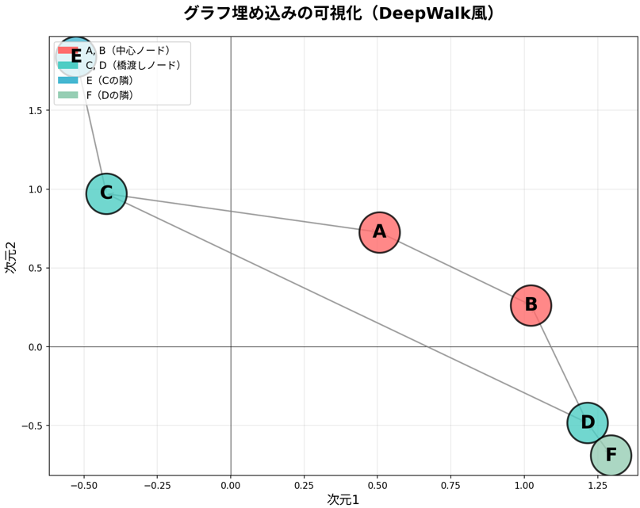

# グラフ埋め込み

## グラフ埋め込みとは

グラフ埋め込みとは、グラフの「頂点」や「辺」を**低次元のベクトル（数値の配列）に変換する技術**です。

### なぜ必要なのか

| 理由 | 説明 |
|------|------|
| 機械学習の入力にする | 機械学習モデルは数値ベクトルを受け取るため、グラフをそのまま入力できない |
| 類似度の計算 | ベクトル化すると「似ているノード」をコサイン類似度などで計算できる |
| 次元圧縮 | 100万ノードのグラフを100次元ベクトルに圧縮できる |
| 可視化 | 2次元や3次元に埋め込んで、グラフの構造を目で確認できる |

### 代表的な手法

| 手法 | 年 | 核心アイデア |
|------|:---:|:------------|
| DeepWalk | 2014 | ランダムウォークで「文」を生成し、Word2Vecでベクトル化 |
| node2vec | 2016 | DeepWalkを拡張。p, qパラメータでBFS/DFSバランスを調整 |
| LINE | 2015 | 1次近傍（直接のつながり）と2次近傍（共通の隣接ノード）を考慮 |
| GCN | 2016 | 畳み込みニューラルネットワークをグラフに拡張 |
| GraphSAGE | 2017 | 隣接ノードの特徴を集約してベクトルを生成。未学習ノードにも対応 |

### DeepWalkの仕組み（具体例）

**ステップ1：ランダムウォークで「文」を生成**

```
頂点Aから: A -> B -> A -> C -> A
頂点Bから: B -> A -> B -> A -> B
頂点Cから: C -> E -> C -> A -> B
...
```

**ステップ2：Skip-gramで学習**

「文の中で近い単語は似た意味を持つ」というWord2Vecの考え方をグラフに応用します。

**ステップ3：埋め込み結果**

```
各頂点の2次元ベクトル:
  A: [+0.5060, +0.7265]
  B: [+1.0228, +0.2635]
  C: [-0.4235, +0.9707]
  D: [+1.2152, -0.4838]
  E: [-0.5274, +1.8395]
  F: [+1.2955, -0.6900]
```

**コサイン類似度で「似ているノード」を発見：**

```
    A      B      C      D      E      F
A [1.000  +0.758  +0.524  +0.228  +0.631  +0.119]
B [+0.758  1.000  -0.159  +0.807  -0.027  +0.737]
C [+0.524  -0.159  1.000  -0.711  +0.991  -0.784]
...
```

- AとBの類似度が高い（0.758）→ 同じコミュニティ
- CとEの類似度が高い（0.991）→ 直接つながっている

### 可視化結果

ノード配置のイメージは以下のようなものとなります。

- **近いノード** = グラフ上で「似た位置」にあるノード
- **遠いノード** = グラフ上で「離れた位置」にあるノード



### 確認の質問

グラフ埋め込みの手法の中で、**node2vec**はDeepWalkからどのような拡張を行っているでしょうか？（ヒント：2つのパラメータ `p` と `q` の役割について考えてみてください）
