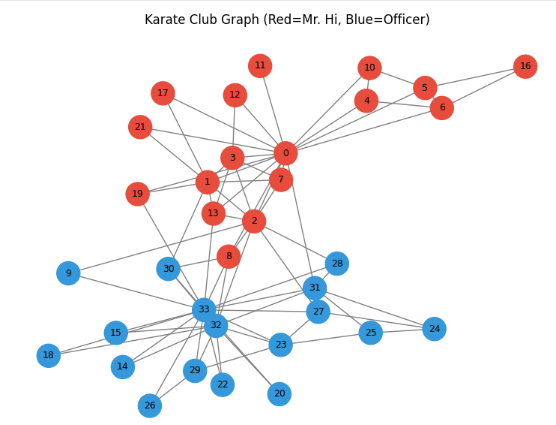
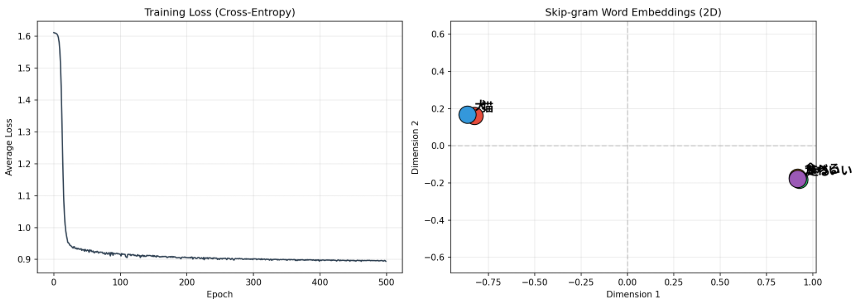
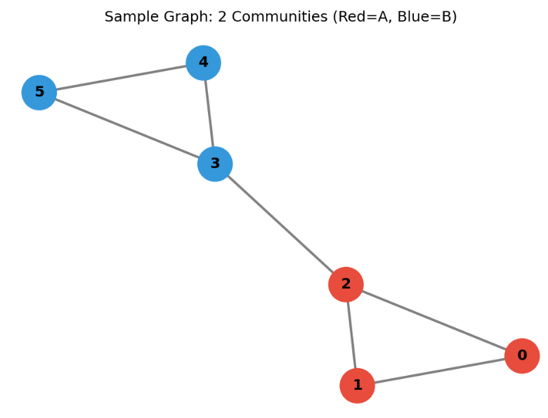
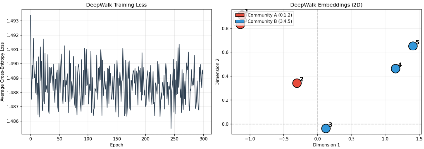

# グラフ埋め込み

## グラフ埋め込みとは

グラフ埋め込みとは、グラフの「頂点」や「辺」を**低次元のベクトル（数値の配列）に変換する技術**です。

### なぜ必要なのか

| 理由 | 説明 |
|------|------|
| 機械学習の入力にする | 機械学習モデルは数値ベクトルを受け取るため、グラフをそのまま入力できない |
| 類似度の計算 | ベクトル化すると「似ているノード」をコサイン類似度などで計算できる |
| 次元圧縮 | 100万ノードのグラフを100次元ベクトルに圧縮できる |
| 可視化 | 2次元や3次元に埋め込んで、グラフの構造を目で確認できる |

### 代表的な手法

| 手法 | 年 | 核心アイデア |
|------|:---:|:------------|
| DeepWalk | 2014 | ランダムウォークで「文」を生成し、Word2Vecでベクトル化 |
| node2vec | 2016 | DeepWalkを拡張。p, qパラメータでBFS/DFSバランスを調整 |
| LINE | 2015 | 1次近傍（直接のつながり）と2次近傍（共通の隣接ノード）を考慮 |
| GCN | 2016 | 畳み込みニューラルネットワークをグラフに拡張 |
| GraphSAGE | 2017 | 隣接ノードの特徴を集約してベクトルを生成。未学習ノードにも対応 |

### DeepWalkの仕組み（具体例）

**ステップ1：ランダムウォークで「文」を生成**

```
頂点Aから: A -> B -> A -> C -> A
頂点Bから: B -> A -> B -> A -> B
頂点Cから: C -> E -> C -> A -> B
...
```

**ステップ2：Skip-gramで学習**

「文の中で近い単語は似た意味を持つ」というWord2Vecの考え方をグラフに応用します。

**ステップ3：埋め込み結果**

```
各頂点の2次元ベクトル:
  A: [+0.5060, +0.7265]
  B: [+1.0228, +0.2635]
  C: [-0.4235, +0.9707]
  D: [+1.2152, -0.4838]
  E: [-0.5274, +1.8395]
  F: [+1.2955, -0.6900]
```

**コサイン類似度で「似ているノード」を発見：**

```
    A      B      C      D      E      F
A [1.000  +0.758  +0.524  +0.228  +0.631  +0.119]
B [+0.758  1.000  -0.159  +0.807  -0.027  +0.737]
C [+0.524  -0.159  1.000  -0.711  +0.991  -0.784]
...
```

- AとBの類似度が高い（0.758）→ 同じコミュニティ
- CとEの類似度が高い（0.991）→ 直接つながっている

### 可視化結果

ノード配置のイメージは以下のようなものとなります。

- **近いノード** = グラフ上で「似た位置」にあるノード
- **遠いノード** = グラフ上で「離れた位置」にあるノード


### 確認の質問

グラフ埋め込みの手法の中で、**node2vec**はDeepWalkからどのような拡張を行っているでしょうか？（ヒント：2つのパラメータ `p` と `q` の役割について考えてみてください）


## ランダムウォーク

### 核心アイデア

グラフ上のある頂点から始めて、「隣接する頂点をランダムに選んで次々に移動する」ことで生成される頂点の系列です。

**直感的な例え:** 酔っ払った人が交差点でランダムに道を選んで歩く様子

### 定義

グラフ $G = (V, E)$ 上のランダムウォークとは、頂点の列 $v_0, v_1, v_2, \dots$ であって、各ステップで以下のルールに従うものです。

1. 時刻 $t$ に頂点 $v_t$ にいるとする
2. $v_t$ の隣接頂点（隣接する頂点全体）の中から、一様に（または重みに応じて）次の頂点 $v_{t+1}$ を選ぶ
3. 選ばれた頂点に移動する

単純な無向グラフの場合、頂点 $u$ から隣接頂点 $v$ への遷移確率は

$$P(u \to v) = \frac{1}{\deg(u)}$$

となります。ここで $\deg(u)$ は頂点 $u$ の次数（接続する辺の数）です。

### なぜ重要か

ランダムウォークは、グラフの構造を確率的に探索する最も基本的な方法であり、以下の性質が理論的・実用的に重要です。

**1. マルコフ連鎖としての性質**
ランダムウォークは**マルコフ連鎖**（次の状態が現在の状態だけに依存する確率過程）です。したがって、定常分布・混合時間・再帰性など、マルコフ連鎖の豊富な理論がそのまま適用できます。

**2. 定常分布（Stationary Distribution）**
長時間ランダムウォークを続けると、訪問する頂点の分布が一定に収束することがあります。無向グラフでは、この定常分布 $\pi(v)$ は

$$\pi(v) = \frac{\deg(v)}{2|E|}$$

となり、次数の高い頂点ほど頻繁に訪問されます。正則グラフ（全頂点の次数が等しいグラフ）では、定常分布は一様分布になります。

**3. 混合時間（Mixing Time）**
定常分布に「十分近づく」までに必要なステップ数です。グラフの連結性や「ボトルネック」の有無を測る指標として使われます。

**4. カバー時間（Cover Time）**
グラフの**すべての頂点を少なくとも1回訪問する**までにかかる期待ステップ数です。

### 代表的な応用

| 応用分野 | 具体例 |
|---------|--------|
| **PageRank** | Googleの検索ランキングアルゴリズム。ウェブページを頂点、リンクを辺とするグラフ上でランダムウォークを行い、訪問頻度でページの重要性を定量化 |
| **グラフ埋め込み** | DeepWalk、Node2Vec など。ランダムウォークで頂点の「文脈」を生成し、自然言語処理の技術で頂点をベクトル化 |
| **コミュニティ検出** | ランダムウォークが特定の頂点集合内に長く留まる傾向を利用し、クラスタ構造を発見 |
| **ネットワークサンプリング** | 巨大なソーシャルネットワークなどで、ランダムウォークを使って公平な標本を取得 |
| **機械学習** | グラフニューラルネットワーク（GNN）におけるメッセージ伝播の理論的基盤 |


### なぜグラフ埋め込みで使うのか

| 理由 | 説明 |
|------|------|
| 構造情報の保存 | よくつながっている頂点同士は系列の中で近くに現れやすい |
| コミュニティの反映 | 同じコミュニティの頂点は同じ系列に現れやすい |
| Word2Vecへの適用 | 系列を「自然言語の文」と見なしてSkip-gramを適用できる |

### Python実装

```python
import random

def random_walk(graph, start, length, seed=None):
    if seed is not None:
        random.seed(seed)

    walk = [start]
    current = start

    for _ in range(length - 1):
        neighbors = graph[current]
        if not neighbors:
            break
        next_node = random.choice(neighbors)
        walk.append(next_node)
        current = next_node

    return walk
```

__実行結果__

```
始点 'A' から: A -> B -> A -> C -> A -> B -> A -> B -> A -> C
始点 'C' から: C -> E -> C -> A -> C -> A -> B -> A -> B -> A
始点 'E' から: E -> C -> A -> C -> A -> B -> A -> B -> A -> C
```


### node2vecとの関係

node2vecはこの「ランダムウォーク」を拡張し、**p（戻る確率）** と**q（探索バランス）** の2つのパラメータで歩き方を制御します。

| パラメータ | 小さい場合 | 大きい場合 |
|:---:|:---|:---|
| p | 来た頂点に戻りやすい（BFS的） | 戻りにくい（DFS的） |
| q | 外へ外へ進む（DFS的） | 近くを探索（BFS的） |

## Skip-Gram

### Word2Vec

Skip-Gramを理解する前にWord2Vecの理解が必要となります。
「Word2Vec」とは、本来は自然言語処理（NLP）の手法ですが、**グラフの頂点をベクトル（数値列）に変換する「グラフ埋め込み（Graph Embedding）」の手法群で応用**されています。

グラフ埋め込みの文脈では、Word2Vecは以下のような流れで使われます。

**1. ランダムウォークで「文章」を生成する**

グラフ上でランダムウォークを行い、訪問した頂点の列を得ます。
例: $v_1 \to v_3 \to v_7 \to v_2 \to \dots$

**2. 頂点を「単語」、頂点列を「文章」とみなす**

NLPでは「単語の列＝文章」をWord2Vecに入力しますが、グラフでは「**頂点の列＝ランダムウォーク**」を入力します。

**3. Word2Vecで頂点をベクトル化する**

ランダムウォークで得られた頂点列から、**周囲の頂点と関係性を予測する学習**を行い、各頂点を低次元のベクトルに変換します。

この結果、以下の性質を持つベクトル表現が得られます。

- **近い頂点は近いベクトル**: ランダムウォークで頻繁に共起する頂点は、ベクトル空間上でも近くなる
- **構造的類似性の反映**: コミュニティ構造や役割の類似性がベクトルに現れる

このアプローチの代表的手法が **DeepWalk**（2014）や **Node2Vec**（2016）です。[arXiv - DeepWalk](https://ar5iv.labs.arxiv.org/html/1403.6652) [arXiv - node2vec](https://arxiv.org/pdf/1607.00653)

__例題:__

グラフ理論におけるランダムウォークをイメージするため例題を出題しました。

__問題設定__

カラテクラブグラフ（34頂点、2コミュニティ）を題材に、以下の流れでグラフ上のWord2Vec（DeepWalk風）を実装し、グラフのコミュニティ構造がベクトル表現に反映されることを確認する。

__Step 1: グラフの可視化（元の構造確認）__
- networkxのkarate_club_graph()を使用
- 34人のメンバーが2つのグループ（Mr. Hi / Officer）に分かれている実データ
- 頂点を色分けして元のコミュニティ構造を可視化する

__Step 2: ランダムウォークの生成__
- 各頂点から出発し、隣接頂点を一様ランダムに選んで移動する
- 各頂点から80回、長さ10のランダムウォークを生成
- 合計 34頂点 × 80回 = 2,720個のウォークを得る
- ウォークはWord2Vecへの「文章（文）」に相当する

__Step 3: Word2Vec（Skip-gram）による頂点のベクトル化__
- ランダムウォークをWord2Vecに入力
- パラメータ: sg=1（Skip-gram）、vector_size=64、window=5、epochs=50
- 各頂点が64次元の実数ベクトルとして表現される

__Step 4: 頂点間の類似度計算__
- 学習したベクトル間のコサイン類似度を計算
- 頂点0（Mr. Hiグループ）と類似する頂点は同グループか？
- 頂点33（Officerグループ）と類似する頂点は同グループか？
- 異なるコミュニティの頂点間の類似度は低いか？

__Step 5: t-SNEによる2次元可視化__
- 64次元のベクトルをt-SNEで2次元に圧縮
- 元のグラフ構造と、埋め込み空間での配置を並べて比較
- 同じコミュニティの頂点が埋め込み空間でも近くに集まるか確認する

__完全なPythonコード__

```python
"""
============================================================
グラフ理論 × Word2Vec（DeepWalk風）例題
============================================================
【必要ライブラリ】
  pip install networkx gensim matplotlib scikit-learn numpy
============================================================
"""

import networkx as nx
import numpy as np
import matplotlib.pyplot as plt
from sklearn.manifold import TSNE
from gensim.models import Word2Vec
import random


# ------------------------------------------------------------
# Step 1: サンプルグラフの作成
# ------------------------------------------------------------
# カラテクラブグラフ: 34人のメンバーの交友関係
# 2つのグループ（Mr. Hi / Officer）に分かれている実データ
G = nx.karate_club_graph()

# ノードの色分け（Mr. Hi=赤、Officer=青）
node_colors = []
for n in G.nodes():
    if G.nodes[n]["club"] == "Mr. Hi":
        node_colors.append("#e74c3c")
    else:
        node_colors.append("#3498db")

# グラフの可視化
plt.figure(figsize=(8, 6))
plt.title("Karate Club Graph (Red=Mr. Hi, Blue=Officer)")
nx.draw(G, with_labels=True, node_color=node_colors, edge_color="gray",
        node_size=500, font_size=9)
plt.tight_layout()
plt.savefig("01_original_graph.png", dpi=150)
plt.show()

print(f"頂点数: {G.number_of_nodes()}, 辺数: {G.number_of_edges()}")


# ------------------------------------------------------------
# Step 2: ランダムウォークの実装
# ------------------------------------------------------------

def random_walk(graph, start_node, walk_length):
    """
    グラフ上でランダムウォークを行い、訪問した頂点のリストを返す。
    これがWord2Vecへの「文章（文）」に相当する。
    """
    walk = [start_node]
    current = start_node
    for _ in range(walk_length - 1):
        neighbors = list(graph.neighbors(current))
        if not neighbors:
            break
        current = random.choice(neighbors)
        walk.append(current)
    return walk


# 各頂点から出発するランダムウォークを複数生成
walks = []
num_walks_per_node = 80   # 各頂点から出発するウォーク数
walk_length = 10          # 1回のウォークで訪問する頂点数

random.seed(42)
np.random.seed(42)

for node in G.nodes():
    for _ in range(num_walks_per_node):
        walk = random_walk(G, node, walk_length)
        # Word2Vecは文字列のリストを受け取るので、頂点番号を文字列に変換
        walks.append([str(v) for v in walk])

print(f"生成したランダムウォークの総数: {len(walks)}")
print(f"例（最初のウォーク）: {walks[0]}")


# ------------------------------------------------------------
# Step 3: Word2Vec（Skip-gram）で頂点をベクトル化
# ------------------------------------------------------------
# パラメータ:
#   - sg=1: Skip-gramモデル（中心の頂点から周囲の頂点を予測）
#   - window=5: 周囲5個の頂点をコンテキストとして扱う
#   - vector_size=64: 各頂点を64次元ベクトルに変換
#   - min_count=1: 出現頻度1以上の頂点を対象

model = Word2Vec(
    sentences=walks,
    sg=1,               # Skip-gram
    vector_size=64,     # 埋め込み次元数
    window=5,           # コンテキストウィンドウサイズ
    min_count=1,
    workers=4,
    epochs=50,
    seed=42
)

# 頂点0のベクトル表現を確認
vec_node0 = model.wv["0"]
print(f"頂点0のベクトル（最初の10次元）: {vec_node0[:10]}")
print(f"ベクトル次数: {len(vec_node0)}")


# ------------------------------------------------------------
# Step 4: 頂点間の類似度を計算
# ------------------------------------------------------------
print("\n=== 頂点間の類似度（cosine similarity） ===")

# 頂点0と最も類似する頂点Top5
similar_to_0 = model.wv.most_similar("0", topn=5)
print("\n頂点0と最も類似する頂点:")
for node, score in similar_to_0:
    club = G.nodes[int(node)]["club"]
    print(f"  頂点{node:>2s} (グループ: {club:>10s}) -> 類似度: {score:.4f}")

# 頂点33と最も類似する頂点Top5
similar_to_33 = model.wv.most_similar("33", topn=5)
print("\n頂点33と最も類似する頂点:")
for node, score in similar_to_33:
    club = G.nodes[int(node)]["club"]
    print(f"  頂点{node:>2s} (グループ: {club:>10s}) -> 類似度: {score:.4f}")

# 2つの頂点間の類似度
sim_0_33 = model.wv.similarity("0", "33")
print(f"\n頂点0 と 頂点33 の類似度: {sim_0_33:.4f}")
print("（頂点0はMr. Hiグループ、頂点33はOfficerグループ → 異なるコミュニティなので類似度が低い）")


# ------------------------------------------------------------
# Step 5: t-SNEで2次元に圧縮して可視化
# ------------------------------------------------------------

# 全頂点のベクトルを取得
node_ids = [str(i) for i in G.nodes()]
embeddings = np.array([model.wv[nid] for nid in node_ids])

# t-SNEで2次元に圧縮
tsne = TSNE(n_components=2, random_state=42, perplexity=15)
embeddings_2d = tsne.fit_transform(embeddings)

# プロット
fig, axes = plt.subplots(1, 2, figsize=(14, 6))

# 左: 元のグラフ構造
ax1 = axes[0]
ax1.set_title("Original Graph Structure")
pos = nx.spring_layout(G, seed=42)
nx.draw(G, pos, ax=ax1, with_labels=True, node_color=node_colors,
        edge_color="gray", node_size=500, font_size=9)

# 右: Word2Vec埋め込みの2次元可視化
ax2 = axes[1]
ax2.set_title("Word2Vec Embeddings (t-SNE 2D)")
for i, nid in enumerate(node_ids):
    x, y = embeddings_2d[i]
    color = node_colors[i]
    ax2.scatter(x, y, c=color, s=200, edgecolors="black", linewidths=0.5, zorder=3)
    ax2.annotate(nid, (x, y), textcoords="offset points", xytext=(5, 5), fontsize=9)

# 凡例
from matplotlib.patches import Patch
legend_elements = [
    Patch(facecolor="#e74c3c", edgecolor="black", label="Mr. Hi"),
    Patch(facecolor="#3498db", edgecolor="black", label="Officer")
]
ax2.legend(handles=legend_elements)
ax2.set_xlabel("t-SNE Dimension 1")
ax2.set_ylabel("t-SNE Dimension 2")
ax2.grid(True, alpha=0.3)

plt.tight_layout()
plt.savefig("02_embedding_visualization.png", dpi=150)
plt.show()
```

__確認すべきポイント__

1. ランダムウォークで頻繁に共起する頂点ほど、Word2Vecのベクトルが近くなることを確認する
2. グラフのコミュニティ構造（Mr. Hi vs Officer）が、埋め込み空間上で自然に分離されることを確認する
3. Word2Vecがグラフの「構造的類似性」を数値ベクトルに変換できていることを理解する

__Word2Vecとグラフ理論の対応関係__

| 自然言語処理 | グラフ理論 |
|------------|-----------|
| 文章（単語の列） | ランダムウォーク（頂点の列） |
| 単語 | 頂点 |
| 単語の共起関係 | 頂点の隣接・近接関係 |
| 単語の分散表現 | 頂点の埋め込みベクトル |
| Skip-gram | 中心頂点から周囲頂点を予測 |

__実行結果__

今回対象のデータはこんな感じのものです。



同じコミュニティ内を歩きやすい: 
カラテクラブグラフでは、同じグループ（Mr. HiグループやOfficerグループ）内のノード同士が辺で密に接続されているため、ランダムウォークでも同じグループ内を歩く確率が高くなる。
結果、ランダムウォークした場合、同じグループのノードが共起しやすくなります。
ここから傾向をWord2Vecで学習すると、グループの傾向を持った意味ベクトルが出来上がるということになります。

```
頂0と最も類似する頂点:
  頂点 4 (グループ:     Mr. Hi) -> 類似度: 0.7303
  頂点10 (グループ:     Mr. Hi) -> 類似度: 0.7125
  頂点17 (グループ:     Mr. Hi) -> 類似度: 0.7019
  頂点 5 (グループ:     Mr. Hi) -> 類似度: 0.6798
  頂点 6 (グループ:     Mr. Hi) -> 類似度: 0.6655

頂点33と最も類似する頂点:
  頂点32 (グループ:    Officer) -> 類似度: 0.7635
  頂点20 (グループ:    Officer) -> 類似度: 0.7135
  頂点29 (グループ:    Officer) -> 類似度: 0.7016
  頂点15 (グループ:    Officer) -> 類似度: 0.6942
  頂点18 (グループ:    Officer) -> 類似度: 0.6886

頂点0 と 頂点33 の類似度: 0.1478
（頂点0はMr. Hiグループ、頂点33はOfficerグループ → 異なるコミュニティなので類似度が低い）
```

### Skip-gram

Skip-gramは、Word2Vecの**2つの学習アーキテクチャのうちの一つ**です。一言で表すと、

> **「中心の要素から、周囲の要素を予測する」** ニューラルネットワークモデル

です。

__構造としてはニューラルネットワーク__

Skip-gramは、以下の3層からなるフィードフォワードネットワークです。

- 入力層: 中心単語（one-hotベクトル）
- 隠れ層: 線形変換のみ（活性化関数なし）
- 出力層: 周囲の単語の出現確率（ソフトマックス、またはネガティブサンプリング時はシグモイド）

この意味では、確かにニューラルネットワークの一種です。

__直感的な理解__

文章の中のある単語（中心単語）に注目したとき、その前後にどんな単語が現れるかを予測しようとします。

```
文章:  [猫] が 道路 の 真ん中 で 寝転んで いる

中心単語: 「猫」
周囲の単語（コンテキスト）: 「が」「道路」「の」「真ん中」... など
```

Skip-gramは「猫」という入力から、「が」「道路」「の」「真ん中」などの周囲単語を予測するように学習します。これを大量の文章で繰り返すことで、**似た文脈で使われる単語は似たベクトルになる**という性質が生まれます。

__学習の仕組み__

Skip-gramの学習は以下の手順で行われます。

**1. ウィンドウサイズの設定**
例えばウィンドウサイズを2にすると、中心単語の前後2単語をコンテキストとして扱います。

```
文章:  The quick brown fox jumps over

「brown」を中心にウィンドウ2を取ると:
  入力（中心）: brown
  出力（予測対象）: The, quick, fox, jumps
```

**2. ニューラルネットワークの構造**
- **入力層**: 中心単語（one-hotベクトル）
- **隠れ層**: 線形変換（行列の乗算のみ、活性化関数なし）
- **出力層**: 周囲の各単語が出現する確率（ソフトマックス）

**3. 学習の結果**
学習が完了すると、出力層は不要になります。重要なのは**隠れ層の重み行列**です。この行列の各行が、各単語の分散表現（ベクトル）となります。

__CBOWとの違い__

Word2Vecにはもう一つ、**CBOW（Continuous Bag of Words）** というアーキテクチャがあります。

| | Skip-gram | CBOW |
|---|---|---|
| **予測の方向** | 中心 → 周囲 | 周囲 → 中心 |
| **直感的には** | 「猫から周囲を当てる」 | 「周囲から猫を当てる」 |
| **得意なもの** | レアな単語の表現 | 高頻度単語、高速な学習 |
| **グラフへの適合** | **適している** | やや不向き |

__なぜグラフ理論でSkip-gramが使われるか__

グラフ埋め込み（DeepWalk等）でSkip-gramが使われる理由は、**問題設定の構造が自然に合致する**からです。

**自然言語処理の場合:**
- 入力: 中心単語
- 予測: 周囲の単語（文章内の共起関係）

**グラフ理論の場合:**
- 入力: 中心頂点（ランダムウォーク上のある位置）
- 予測: 周囲の頂点（ランダムウォーク上の近傍）

ランダムウォークで得られた頂点の列を「文章」とみなすと、Skip-gramの構造がそのまま使えます。

```
ランダムウォーク:  [12] → 5 → 8 → 12 → 3 → 9

ウィンドウサイズ2で「12」を中心に取ると:
  入力（中心頂点）: 12
  予測（周囲頂点）: 5, 8, 3, 9
```

「頂点12が与えられたとき、周囲には5, 8, 3, 9が現れるはずだ」という予測を学習することで、**頂点12のベクトル表現**が得られます。

__なぜSkip-gramがグラフに向いているか__

**1. グラフには「順序」がない**
文章は左から右への順序がありますが、グラフの頂点には順序がありません。Skip-gramは中心から周囲への予測なので、**前後の区別があまり厳密でなくても機能します**。

**2. コミュニティ構造の反映**
同じコミュニティ内の頂点はランダムウォークで頻繁に共起します。Skip-gramはこの共起パターンを学習するため、**自然とコミュニティ構造がベクトルに反映されます**。

**3. スケーラビリティ**
Skip-gramは計算効率が良く、Negative Sampling（負例サンプリング）などの手法を使うことで、大規模なグラフ（数百万頂点）にも対応できます。

__まとめ__

Skip-gramとは、**「中心の要素から周囲の要素を予測する」ことで、各要素のベクトル表現を学習するニューラルネットワークアーキテクチャ**です。

- 自然言語処理では「単語」のベクトルを学習する
- グラフ理論では「頂点」のベクトルを学習する（ランダムウォークを文章とみなして）
- CBOWとは予測方向が逆で、グラフにはSkip-gramの方が適している

この「中心から周囲を予測する」というシンプルな仕組みが、単語の意味やグラフの構造を数値ベクトルに凝縮する強力な手法となっています。

### Skip-gramで学習するもの

Skip-gramで学習するものは、**「各要素（単語や頂点）を低次元の実数ベクトルに変換するための重み行列」** です。より具体的には、以下の2つのレベルで回答できます。

__1. 学習の結果として得られるもの__

**各単語（または各頂点）の分散表現ベクトル**

Skip-gramの学習が終わると、語彙の各要素に対して1本のベクトルが得られます。

- 自然言語処理の場合: 「猫」→ `[0.12, -0.45, 0.89, ...]`（例えば100次元）
- グラフ理論の場合: 「頂点12」→ `[-0.08, 0.23, -0.15, ...]`（例えば64次元）

このベクトルが、要素の**意味的・構造的な性質を数値化したもの**となります。

__2. ニューラルネットワーク内部で学習されるもの__

Skip-gramのニューラルネットワークには**2つの重み行列**が存在し、両方が学習過程で更新されます。

**入力重み行列（W_input）**
- サイズ: `語彙数 × ベクトル次元数`（例: 10,000語 × 100次元）
- 各行が1つの単語（または頂点）のベクトル表現に対応
- **学習後、この行列が「単語ベクトル」として抽出・使用される**

**出力重み行列（W_output）**
- サイズ: `ベクトル次元数 × 語彙数`（例: 100次元 × 10,000語）
- 各列が1つの単語（または頂点）の「コンテキスト側」のベクトル表現
- 学習中は予測に使用されるが、学習後は通常は破棄されることも多い

```
入力（one-hot） [1, 0, 0, ...]  →  W_input  →  隠れ層（ベクトル） →  W_output  →  出力（確率分布）
                （10,000語）      （10,000×100）   （100次元）         （100×10,000）  （10,000語の確率）
```

学習後に実際に使われるのは、**W_inputの各行**です。

__3. 概念的に学習しているもの（統計的な意味）__

Skip-gramは間接的に、以下の統計的情報を学習しています。

**共起確率の対数比（PMIの近似）**

理論的には、十分なデータで学習されたSkip-gramのベクトル間の内積は、

```
dot(v_wi, v_wj) ≈ log(P(wi, wj) / (P(wi) × P(wj)))
```

つまり、**2つの要素が一緒に現れる確率**を、ベクトルの幾何学的な距離（内積）として表現しています。

- 頻繁に共起する要素 → ベクトルが近い（内積が大きい）
- 独立に出現する要素 → ベクトルが直交する（内積が0に近い）
- 反共起する要素 → ベクトルが逆方向（内積が負）

__4. グラフ理論の文脈で学習しているもの__

グラフ埋め込み（DeepWalk等）の場合、Skip-gramは以下を学習します。

**ランダムウォークの共起統計の圧縮表現**

具体的には:

| 学習対象 | 内容 |
|---------|------|
| **構造的近接性** | ランダムウォークで短いステップ数で到達可能な頂点同士は近いベクトルになる |
| **コミュニティ所属** | 同じコミュニティ内の頂点は、ベクトル空間でクラスタを形成する |
| **頂点の役割** | 橋渡しノード（境界に位置する頂点）は、複数のコミュニティの間に配置される |
| **次数の影響** | 次数の高い頂点は多くのウォークに出現し、ベクトルの性質に影響する |

__例題:__

以下に、Skip-gramの学習について確認する例題を出題します。


__問題設定__

語彙5語（猫、犬、走る、食べる、かわいい）の小さなコーパスで、Skip-gramをスクラッチ実装し、**単語ベクトルが共起パターンを反映すること**を確認します。

__訓練データ__

ウィンドウサイズ1で生成した16ペアの訓練データです。

```
  猫 → かわいい
かわいい → 猫
  犬 → かわいい
かわいい → 犬
  猫 → 走る
  走る → 猫
  犬 → 走る
  走る → 犬
  猫 → 食べる
食べる → 猫
  犬 → 食べる
食べる → 犬
  ...（計16ペア）
```

__学習結果__

**学習後の単語ベクトル（2次元）:**

| 単語 | 次元1 | 次元2 |
|------|------|------|
| 猫 | -0.8246 | 0.1613 |
| 犬 | -0.8625 | 0.1689 |
| 走る | 0.9275 | -0.1819 |
| 食べる | 0.9167 | -0.1708 |
| かわいい | 0.9166 | -0.1775 |

**コサイン類似度行列:**

| | 猫 | 犬 | 走る | 食べる | かわいい |
|---|---|---|---|---|---|
| **猫** | 1.0000 | 1.0000 | -1.0000 | -1.0000 | -1.0000 |
| **犬** | 1.0000 | 1.0000 | -1.0000 | -1.0000 | -1.0000 |
| **走る** | -1.0000 | -1.0000 | 1.0000 | 1.0000 | 1.0000 |
| **食べる** | -1.0000 | -1.0000 | 1.0000 | 1.0000 | 1.0000 |
| **かわいい** | -1.0000 | -1.0000 | 1.0000 | 1.0000 | 1.0000 |

__pythonコード__

```python
"""
============================================================
Skip-gram 学習体験例題（クラッチ実装）
============================================================
【問題】
語彙5語（猫、犬、走る、食べる、かわいい）の小さなコーパスで、
Skip-gramの学習をスクラッチ実装し、単語ベクトルが共起パターンを
反映することを確認する。

【必要ライブラリ】
  pip install numpy matplotlib
============================================================
"""

import numpy as np
import matplotlib.pyplot as plt

# ------------------------------------------------------------
# 1. 語彙と訓練文章の定義
# ------------------------------------------------------------
vocab = ["猫", "犬", "走る", "食べる", "かわいい"]
word2idx = {w: i for i, w in enumerate(vocab)}
idx2word = {i: w for w, i in word2idx.items()}
V = len(vocab)

sentences = [
    ["猫", "かわいい"],
    ["犬", "かわいい"],
    ["猫", "走る"],
    ["犬", "走る"],
    ["猫", "食べる"],
    ["犬", "食べる"],
    ["かわいい", "猫"],
    ["かわいい", "犬"],
]

# ------------------------------------------------------------
# 2. Skip-gram訓練データの生成
# ------------------------------------------------------------
def generate_skipgram_data(sentences, window_size=1):
    data = []
    for sent in sentences:
        for i, center in enumerate(sent):
            for j in range(max(0, i - window_size), min(len(sent), i + window_size + 1)):
                if i != j:
                    data.append((word2idx[center], word2idx[sent[j]]))
    return data

training_data = generate_skipgram_data(sentences, window_size=1)
print("=== Skip-gram 訓練データ ===")
for c, t in training_data:
    print(f"  {idx2word[c]:>5s} → {idx2word[t]}")

# ------------------------------------------------------------
# 3. ネットワークの初期化
# ------------------------------------------------------------
EMB_DIM = 2
lr = 0.1
epochs = 500

np.random.seed(42)
W_in = np.random.randn(V, EMB_DIM) * 0.1
W_out = np.random.randn(EMB_DIM, V) * 0.1

def softmax(x):
    exp_x = np.exp(x - np.max(x))
    return exp_x / np.sum(exp_x)

# ------------------------------------------------------------
# 4. 学習ループ
# ------------------------------------------------------------
loss_history = []

for epoch in range(epochs):
    total_loss = 0
    np.random.shuffle(training_data)
    for center_idx, context_idx in training_data:
        # 順伝播
        h = W_in[center_idx]
        u = np.dot(W_out.T, h)
        y_pred = softmax(u)
        loss = -np.log(y_pred[context_idx] + 1e-8)
        total_loss += loss

        # 逆伝播
        e = y_pred.copy()
        e[context_idx] -= 1
        dW_out = np.outer(h, e)
        dW_in = np.dot(W_out, e)

        # 更新
        W_in[center_idx] -= lr * dW_in
        W_out -= lr * dW_out

    loss_history.append(total_loss / len(training_data))
    if epoch % 50 == 0:
        print(f"Epoch {epoch:>3d} | Loss: {loss_history[-1]:.4f}")

# ------------------------------------------------------------
# 5. 結果の表示
# ------------------------------------------------------------
print("\n=== 学習後の単語ベクトル ===")
for i, word in idx2word.items():
    print(f"  {word:>5s}: [{W_in[i][0]:>8.4f}, {W_in[i][1]:>8.4f}]")

# コサイン類似度
def cos_sim(v1, v2):
    return np.dot(v1, v2) / (np.linalg.norm(v1) * np.linalg.norm(v2) + 1e-8)

print("\n=== コサイン類似度行列 ===")
print(f"{'':>5s}", end="")
for w in vocab:
    print(f"{w:>10s}", end="")
print()
for w1 in vocab:
    print(f"{w1:>5s}", end="")
    for w2 in vocab:
        print(f"{cos_sim(W_in[word2idx[w1]], W_in[word2idx[w2]]):>10.4f}", end="")
    print()

# ------------------------------------------------------------
# 6. 可視化
# ------------------------------------------------------------
fig, axes = plt.subplots(1, 2, figsize=(14, 5))

axes[0].plot(loss_history, color="#2c3e50")
axes[0].set_title("Training Loss")
axes[0].set_xlabel("Epoch")
axes[0].set_ylabel("Cross-Entropy Loss")
axes[0].grid(True, alpha=0.3)

colors = {"猫": "#e74c3c", "犬": "#3498db", "走る": "#2ecc71",
          "食べる": "#f39c12", "かわいい": "#9b59b6"}
for i, word in idx2word.items():
    x, y = W_in[i]
    axes[1].scatter(x, y, c=colors[word], s=400, edgecolors="black", zorder=3)
    axes[1].annotate(word, (x, y), textcoords="offset points", xytext=(8, 5),
                     fontsize=14, fontweight="bold")
axes[1].set_title("Skip-gram Embeddings (2D)")
axes[1].axhline(0, color="gray", linestyle="--", alpha=0.3)
axes[1].axvline(0, color="gray", linestyle="--", alpha=0.3)
axes[1].grid(True, alpha=0.3)
axes[1].set_aspect("equal", adjustable="datalim")

plt.tight_layout()
plt.savefig("skipgram_result.png", dpi=150)
plt.show()
```

__結果の解釈__

以下は学習の結果生成されたベクトルの結果を以下に示す。



1. **「猫」と「犬」はほぼ同じベクトル位置に集まる**
   - 両方とも「走る」「食べる」「かわいい」と同じように共起するため
   - つまり「猫」と「犬」は**文脈上の役割が似ている**

2. **「走る」「食べる」「かわいい」は別のクラスタを形成する**
   - これらは「猫」「犬」と共起するが、互いに直接共起しない
   - したがって「猫・犬」とは反対側のベクトル空間に配置される

3. **損失（Loss）はエポックとともに減少する**
   - 初期: 1.6116 → 最終: 0.8941
   - ニューラルネットワークが共起パターンを学習している証拠

__この例題で学べること__

| 確認項目 | 結果 |
|---------|------|
| Skip-gramはニューラルネットワークか | **はい**（1隠れ層の浅いネットワーク） |
| 何を学習するか | **入力重み行列**（各行が単語ベクトル） |
| なぜ「猫」と「犬」が似るか | **共起パターンが同じ**（同じ単語と一緒に現れる） |
| ベクトルの幾何学的距離は何を表すか | **共起確率の統計的関係** |

## DeepWalk

### 概要
DeepWalkは、2014年に [Perozzi, Al-Rfou, Skiena](https://ar5iv.labs.arxiv.org/html/1403.6652) によって提案された、**グラフの頂点を低次元のベクトルに変換するグラフ埋め込み（Graph Embedding）手法**です。

一言で表すと、

> **「ランダムウォークでグラフから文章を生成し、Word2Vec（Skip-gram）で頂点をベクトル化する」**

手法です。

### なぜDeepWalkが生まれたか

グラフの頂点を機械学習に使いたい場合、頂点をそのまま数値として扱うことはできません。DeepWalk以前は、以下のような手作業による特徴量設計が必要でした。

- 頂点の次数
- クラスタリング係数
- 中心性（次数中心性、媒介中心性など）

しかし、これらは**人間が設計した特徴量**であり、グラフの構造の本質を捉えきれない場合がありました。DeepWalkは、自然言語処理のWord2Vecの成功に着目し、**「グラフ構造を学習によって自動的にベクトル化する」** ことを目指しました。

### DeepWalkの2ステップ

DeepWalkは以下の2つのステップで構成されています。

**ステップ1: ランダムウォークの生成**

グラフ上で、各頂点から出発してランダムに隣接頂点を移動するウォークを多数生成します。

- 各頂点から $\gamma$ 回、長さ $t$ のランダムウォークを生成
- 合計 $|\gamma V|$ 個のウォークが得られる

**ステップ2: Word2Vec（Skip-gram）による学習**

得られたウォークを「文章」、頂点を「単語」とみなして、Skip-gramで学習します。

- ウォーク内の各頂点を中心単語とし、ウィンドウ内の周囲の頂点を予測する
- 学習後、入力重み行列の各行が各頂点のベクトル表現になる

### DeepWalkの核心アイデア

DeepWalkの本質は、**「グラフのコミュニティ構造が、ランダムウォークの共起パターンとして現れる」** という洞察にあります。

**なぜこれが成立するのか**

- 同じコミュニティ内の頂点同士は辺が密なため、ランダムウォークでも同じコミュニティ内を歩く確率が高い
- したがって、同じコミュニティの頂点はランダムウォーク内で頻繁に共起する
- Skip-gramは「共起する単語は似たベクトルになる」と学習する
- 結果として、同じコミュニティの頂点はベクトル空間で近くに配置される

つまり、**グラフの構造的な近接性**が、**ベクトル空間の幾何学的な近接性**に変換されます。

### DeepWalkのパラメータ

| パラメータ | 意味 |
|-----------|------|
| $\gamma$ (walks per node) | 各頂点から出発するウォーク数 |
| $t$ (walk length) | 1回のウォークの長さ（ステップ数） |
| $d$ (embedding size) | 出力ベクトルの次元数 |
| $w$ (window size) | Skip-gramのコンテキストウィンドウサイズ |

### DeepWalkの特徴

**1. 教師なし学習**
ラベル情報を必要とせず、グラフの構造だけから学習できるため、ラベル付きデータが少ない場合にも有効です。

**2. スケーラビリティ**
ランダムウォークは並列化が容易で、大規模なグラフ（数百万頂点）にも対応できます。

**3. 汎用性**
学習したベクトルは、分類、クラスタリング、異常検知、リンク予測など、様々なダウンストリームタスクに使えます。

**4. 多言語・多ドメインへの適用**
ソーシャルネットワーク、論文引用ネットワーク、タンパク質相互作用ネットワークなど、様々なグラフに適用可能です。

### DeepWalkの限界と発展

DeepWalkはシンプルなランダムウォーク（一様ランダムに隣接頂点を選ぶ）を使用しますが、これには限界があります。

| 限界 | 内容 |
|------|------|
| **BFS vs DFSの制御がない** | 局所的な近傍（BFS）と大域的な構造（DFS）を区別できない |
| **重み付きグラフへの対応が限定的** | 辺の重みを考慮したウォークができない |

これらを解決するために、後続手法として以下が提案されました。

- **Node2Vec** (2016): BFSとDFSのバランスをパラメータ $p, q$ で制御する [Grover & Leskovec](https://arxiv.org/pdf/1607.00653)
- **LINE** (2015): 1次近傍と2次近傍を別々に最適化
- **SDNE** (2016): ディープオートエンコーダを使用した深層グラフ埋め込み

### 学習の数学的根拠

DeepWalkがランダムウォークでグラフの構造を学習できることには、**行列分解（Matrix Factorization）としての厳密な数学的定式化**が与えられています。最も重要な理論的裏付けは、Qiu et al. (2018) の論文 [Network Embedding as Matrix Factorization: Unifying DeepWalk, LINE, PTE, and node2vec](https://keg.cs.tsinghua.edu.cn/jietang/publications/WSDM18-Qiu-et-al-NetMF-network-embedding.pdf) によって確立されました。

__数学的根拠の概要__

DeepWalkの数学的根拠は、以下の3つの段階で構成されます。

__1. Skip-gram with Negative Sampling (SGNS) は行列分解である__

Levy & Goldberg (2014) の結果を基に、Skip-gram with Negative Sampling (SGNS) は、**暗黙的に以下の形の行列を分解している**ことが示されています。

$$M_{ij} = \log \frac{P(w_i, w_j)}{P(w_i) P(w_j)} - \log k$$

ここで $k$ は負例サンプリングの数です。つまり、SGNSは**単語対の共起確率の対数比（PMIの近似）を低ランク近似**しているのです。

__2. DeepWalkのランダムウォーク共起行列の形__

Qiu et al. (2018) は、DeepWalkにおける共起行列をグラフの構造から**閉形式（closed-form）** で導出しました。

グラフ $G = (V, E)$ に対し、隣接行列を $A$、次数行列を $D$（$D_{ii} = \deg(v_i)$）とします。ランダムウォークの遷移行列は $P = D^{-1}A$ です。

DeepWalkで生成されるランダムウォークの共起統計は、**ウィンドウサイズ $T$ を持つ Skip-gram** において、以下の行列を暗黙的に分解します。

$$M = \log \left( \frac{\text{vol}(G)}{T} \cdot \mathbf{D}^{-1} \sum_{r=1}^{T} \mathbf{P}^r \mathbf{D}^{-1} \right) - \log k$$

ここで：
- $\text{vol}(G) = \sum_{i} D_{ii}$ はグラフの体積（全次数の和）
- $\mathbf{P}^r$ は $r$ ステップ後の遷移確率行列
- $T$ はSkip-gramのウィンドウサイズ
- $k$ は負例サンプリング数

__3. この行列が何を表しているか__

上記の行列 $M$ は、**2つの頂点間のランダムウォークによる共起の対数確率比**を表しています。

特に重要なのは、$r$ ステップ後の遷移確率 $(P^r)_{ij}$ は「**頂点 $i$ から出発して $r$ ステップで頂点 $j$ に到達する確率**」です。したがって、$\sum_{r=1}^{T} P^r$ は「**ウィンドウサイズ $T$ 以内に頂点 $j$ に到達する確率**」を表します。

これは以下のグラフ構造の性質を反映しています。

| 性質 | 行列要素での表現 |
|------|---------------|
| **近接性** | 短い $r$ で $(P^r)_{ij}$ が大きい → 近い頂点 |
| **コミュニティ構造** | 同じコミュニティ内では $P^r$ が大きく、異なるコミュニティ間では小さい |
| **次数の影響** | $D^{-1}$ により次数の高い頂点の影響が正規化される |

__直感的な解釈__

__なぜランダムウォークでコミュニティ構造が捉えられるのか__

同じコミュニティ内の頂点 $i, j$ について考えます。

1. コミュニティ内の辺密度が高いため、ランダムウォークはコミュニティ内を長く徘徊します
2. したがって、$i$ から出発したウォークが $r$ ステップ以内に $j$ に到達する確率 $(P^r)_{ij}$ は高くなります
3. Skip-gramはこの共起パターンを学習し、$i$ と $j$ のベクトルを近づけます
4. 異なるコミュニティの頂点間では $(P^r)_{ij}$ は低いため、ベクトルは遠ざかります

これが、**「ランダムウォークの統計的性質 → ベクトル空間の幾何学的性質」** という対応の数学的根拠です。

__ラプラシアンとの関係__

さらに深い数学的繋がりとして、Chanpuriya & Musco (2020) の論文 [InfiniteWalk](https://arxiv.org/pdf/2006.00094) では、以下の結果が示されています。

ランダムウォークのステップ数 $T \to \infty$ の極限で、DeepWalkの共起統計は**グラフのラプラシアン**と深く関連します。

グラフの正規化ラプラシアンを $\mathcal{L} = I - D^{-1/2}AD^{-1/2}$ とすると、ランダムウォークの定常分布や混合時間はラプラシアンのスペクトル（固有値）によって支配されます。

つまり、DeepWalkは間接的に**グラフのラプラシアンのスペクトル構造**を学習しているとも解釈できます。これは、グラフのクラスタ構造（コミュニティ）がラプラシアンの固有ベクトル（Fiedler vector等）によって特徴づけられることと整合的です。

__収束性の保証__

Kloepfer et al. (2021) の論文 [Delving Into Deep Walkers](https://ar5iv.labs.arxiv.org/html/2107.10014) では、ランダムウォークの数を増やしたときの**埋め込みの収束**について数学的解析が行われています。

- ランダムウォークの本数 $\gamma \to \infty$ の極限で、経験的共起確率は真の共起確率に収束する（大数の法則）
- したがって、有限サンプルでのDeepWalk埋め込みは、**真の共起行列を分解した理想埋め込みに確率的に近づく**

__例題:__

以下に、DeepWalkの学習体験例題の完全版をまとめてご提示いたします。

__問題設定__

__グラフ__

6頂点のグラフを考えます。2つのコミュニティ（AとB）を持ちます。

- **コミュニティA**: 頂点 0, 1, 2（密に接続）
- **コミュニティB**: 頂点 3, 4, 5（密に接続）
- **橋渡し辺**: (2, 3) のみ（コミュニティ間は疎）

```
    0 --- 1         3 --- 4
     \\   /           \\   /
      \\ /             \\ /
       2 -------------- 5
```

__問い__

DeepWalk（ランダムウォーク + Skip-gram）で学習したベクトルにおいて、以下を確認せよ。

1. 同じコミュニティの頂点同士の類似度は高いか？
2. 異なるコミュニティの頂点間の類似度は低いか？
3. ランダムウォークの共起統計とベクトルの配置の関係を説明せよ。

__実行結果__

__Step 1: グラフの可視化__

以下絵をご確認ください。赤がコミュニティA、青がコミュニティBです。



__Step 2: ランダムウォークの生成__

各頂点から100回、長さ8のウォークを生成しました。

**頂点0を含むウォークでの共起統計:**
- 頂点2: 811回（最も共起）
- 頂点1: 651回
- 頂点3: 362回（橋渡し）
- 頂点5: 154回
- 頂点4: 147回

頂点0はコミュニティA内の頂点（1, 2）と頻繁に共起し、コミュニティBの頂点とは稀にしか共起しません。

__Step 3-4: Skip-gram学習後の結果__

**学習後の頂点ベクトル（2次元）:**

| 頂点 | コミュニティ | ベクトル |
|------|------------|---------|
| 0 | A | [-1.1422, 0.8348] |
| 1 | A | [-1.1189, 0.9106] |
| 2 | A | [-0.3054, 0.3441] |
| 3 | B | [0.1197, -0.0358] |
| 4 | B | [1.1496, 0.4631] |
| 5 | B | [1.4056, 0.6538] |

**コサイン類似度行列:**

| | 0 | 1 | 2 | 3 | 4 | 5 |
|---|---|---|---|---|---|---|
| **0** | 1.000 | **0.999** | **0.977** | -0.942 | -0.528 | -0.483 |
| **1** | **0.999** | 1.000 | **0.987** | -0.924 | -0.484 | -0.437 |
| **2** | **0.977** | **0.987** | 1.000 | -0.850 | -0.336 | -0.286 |
| **3** | -0.942 | -0.924 | -0.850 | 1.000 | **0.782** | **0.748** |
| **4** | -0.528 | -0.484 | -0.336 | **0.782** | 1.000 | **0.999** |
| **5** | -0.483 | -0.437 | -0.286 | **0.748** | **0.999** | 1.000 |

__確認事項__

1. **コミュニティA内（0, 1, 2）**: 類似度が 0.977〜0.999 と非常に高い
2. **コミュニティB内（3, 4, 5）**: 類似度が 0.748〜0.999 と高い
3. **コミュニティ間（A vs B）**: 類似度が負の値（-0.942〜-0.286）で、明確に分離

__Step 5: 可視化__

学習したモデルで分離を行った結果です。2次元埋め込み空間上で、コミュニティA（赤）とコミュニティB（青）が明確に分離していることが確認できます。



__解説__

この例題で確認できるDeepWalkの本質は以下の通りです。

**ランダムウォークの統計的性質 → ベクトル空間の幾何学的性質**

1. コミュニティA内は辺密度が高いため、ランダムウォークはA内を長く徘徊する
2. したがって、頂点0, 1, 2はランダムウォーク内で頻繁に共起する
3. Skip-gramは「共起する頂点は似たベクトルになる」と学習する
4. 結果として、コミュニティAの頂点はベクトル空間で近くに集まる
5. コミュニティ間は辺が疎なので共起確率が低く、ベクトルは遠ざかる

これが、DeepWalkがランダムウォークでグラフのコミュニティ構造を学習できる数学的根拠の直感的な証明となります。

__完全なPythonコード__

```python
"""
============================================================
DeepWalk 学習体験例題（スクラッチ実装）
============================================================
【問題】
6頂点のグラフ（2コミュニティ）で、DeepWalkをスクラッチ実装し、
同じコミュニティの頂点がベクトル空間で近くなることを確認する。

【必要ライブラリ】
  pip install numpy matplotlib networkx scikit-learn
============================================================
"""

import numpy as np
import matplotlib.pyplot as plt
import networkx as nx

np.random.seed(42)

# ------------------------------------------------------------
# Step 1: グラフの作成
# ------------------------------------------------------------
# コミュニティA(0,1,2): 密, コミュニティB(3,4,5): 密
# 橋渡し辺: (2,3) のみ

edges = [
    (0, 1), (0, 2), (1, 2),      # コミュニティA
    (3, 4), (3, 5), (4, 5),      # コミュニティB
    (2, 3),                       # 橋渡し
]
G = nx.Graph()
G.add_nodes_from(range(6))
G.add_edges_from(edges)

community = {0: "A", 1: "A", 2: "A", 3: "B", 4: "B", 5: "B"}
node_colors = ["#e74c3c" if community[n] == "A" else "#3498db" for n in G.nodes()]

# グラフの可視化
plt.figure(figsize=(7, 5))
plt.title("Sample Graph: 2 Communities")
pos = nx.spring_layout(G, seed=42)
nx.draw(G, pos, with_labels=True, node_color=node_colors, edge_color="gray",
        node_size=800, font_size=12, font_weight="bold")
plt.savefig("04_deepwalk_graph.png", dpi=150)
plt.show()

# ------------------------------------------------------------
# Step 2: ランダムウォーク
# ------------------------------------------------------------

def random_walk(graph, start, length):
    walk = [start]
    current = start
    for _ in range(length - 1):
        neighbors = list(graph.neighbors(current))
        current = np.random.choice(neighbors)
        walk.append(current)
    return walk

walks = []
for node in G.nodes():
    for _ in range(100):
        walk = random_walk(G, node, 8)
        walks.append([str(v) for v in walk])

# ------------------------------------------------------------
# Step 3: Skip-gram 学習
# ------------------------------------------------------------

V, EMB_DIM, lr, epochs = 6, 2, 0.1, 300
W_in = np.random.randn(V, EMB_DIM) * 0.5
W_out = np.random.randn(EMB_DIM, V) * 0.5

def softmax(x):
    exp_x = np.exp(x - np.max(x))
    return exp_x / np.sum(exp_x)

# 訓練データ生成（ウィンドウサイズ2）
training_data = []
for walk in walks:
    for i, c in enumerate(walk):
        for j in range(max(0, i - 2), min(len(walk), i + 3)):
            if i != j:
                training_data.append((int(c), int(walk[j])))

# 学習ループ
loss_history = []
for epoch in range(epochs):
    total_loss = 0
    np.random.shuffle(training_data)
    for c_idx, t_idx in training_data:
        h = W_in[c_idx]
        u = np.dot(W_out.T, h)
        y = softmax(u)
        loss = -np.log(y[t_idx] + 1e-8)
        total_loss += loss

        e = y.copy()
        e[t_idx] -= 1
        W_in[c_idx] -= lr * np.dot(W_out, e)
        W_out -= lr * np.outer(h, e)
    loss_history.append(total_loss / len(training_data))

# ------------------------------------------------------------
# Step 4: 結果の確認
# ------------------------------------------------------------

print("=== 学習後の頂点ベクトル ===")
for i in range(V):
    print(f"  頂点{i} (コミュニティ{community[i]}): [{W_in[i][0]:.4f}, {W_in[i][1]:.4f}]")

def cos_sim(v1, v2):
    return np.dot(v1, v2) / (np.linalg.norm(v1) * np.linalg.norm(v2) + 1e-8)

print("\n=== コサイン類似度行列 ===")
for i in range(V):
    print(f"頂点{i:>2d}: ", end="")
    for j in range(V):
        print(f"{cos_sim(W_in[i], W_in[j]):>7.3f}", end="")
    print()

# ------------------------------------------------------------
# Step 5: 可視化
# ------------------------------------------------------------
fig, axes = plt.subplots(1, 2, figsize=(14, 5))

axes[0].plot(loss_history, color="#2c3e50")
axes[0].set_title("Training Loss")
axes[0].set_xlabel("Epoch")
axes[0].set_ylabel("Loss")

for i in range(V):
    x, y = W_in[i]
    color = "#e74c3c" if community[i] == "A" else "#3498db"
    axes[1].scatter(x, y, c=color, s=400, edgecolors="black", zorder=3)
    axes[1].annotate(f"{i}", (x, y), textcoords="offset points",
                     xytext=(6, 4), fontsize=14, fontweight="bold")

axes[1].set_title("DeepWalk Embeddings (2D)")
axes[1].set_xlabel("Dimension 1")
axes[1].set_ylabel("Dimension 2")
axes[1].axhline(0, color="gray", linestyle="--", alpha=0.3)
axes[1].axvline(0, color="gray", linestyle="--", alpha=0.3)
axes[1].grid(True, alpha=0.3)

plt.tight_layout()
plt.savefig("05_deepwalk_result.png", dpi=150)
plt.show()
```

__確認すべきポイント__

| 確認項目 | 期待される結果 |
|---------|------------|
| コミュニティA内の類似度 | 0.97以上（非常に高い） |
| コミュニティB内の類似度 | 0.75以上（高い） |
| コミュニティ間の類似度 | 負の値（明確に分離） |
| 2次元可視化 | 赤と青のクラスタが分離している |

DeepWalkが「ランダムウォークの共起統計をSkip-gramで学習することで、グラフのコミュニティ構造をベクトル空間に反映する」ということが分かります。


