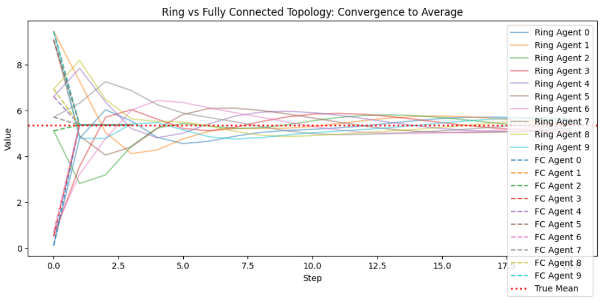

AI関係の話聞いていた時にマルチエージェント通信トポロジなるものが出てきて(!?)となりました。
マルチエージェントはLLMと強化学習でありますが、こんな言葉を聞いたことは初めてです。
ですが、よく使う言葉とのことでした。
内容を知るべきと考え、調べてみた次第です。

本日テーマ：
>マルチエージェント通信トポロジとは？

## マルチエージェントの通信トポロジとは
「マルチエージェントの通信トポロジー」とは、**複数のエージェントがどのような構造（ネットワーク構造）で互いに通信するか** を表す概念です。

もう少し分解すると、次のような意味になります。

### 1. 「マルチエージェント」とは
- 複数のエージェント（自律的に判断・行動する主体）が存在するシステムのことです。
- 例：複数のロボット、複数のAIエージェント、複数のサーバープロセスなど。

### 2. 「通信トポロジー」とは
- トポロジー（topology）は「接続の形・構造」を指します。
- 通信トポロジーは、「誰が誰と直接通信できるか」「どのような経路でメッセージが流れるか」といった**通信ネットワークの構造**を意味します。

### 3. マルチエージェントの通信トポロジーの例

よくあるパターンとしては、次のようなものがあります。

__(1) 完全結合（Fully Connected）__
- すべてのエージェントが、他のすべてのエージェントと直接通信できる構造です。
- 情報伝達は速い一方、エージェント数が増えると通信量が爆発的に増えます。

__(2) スター型（Star / Centralized）__
- 中央の1つのエージェント（コーディネータ、マネージャなど）が存在し、他のエージェントはその中央エージェントとのみ直接通信します。
- 中央がボトルネックになりやすいですが、制御や管理がしやすい構造です。

__(3) リング型（Ring）__
- エージェントがリング状につながり、隣接するエージェントとのみ通信します。
- メッセージはリングを一周して全員に伝わりますが、遅延が大きくなりやすいです。

__(4) グリッド／メッシュ型（Grid / Mesh）__
- 2次元や3次元の格子状にエージェントが並び、隣接ノードと通信します。
- ロボット群の位置制御や空間的なタスク分担に適した構造です。

__(5) 階層型（Hierarchical）__
- エージェントが階層構造を持ち、上位エージェントが下位エージェントを管理する形で通信します。
- 組織や大規模システムでよく見られる構造です。

__(6) ピアツーピア（P2P）__
- 中央の管理者がなく、エージェント同士が対等に通信します。
- 一部のエージェントが故障してもシステム全体への影響を小さくできます。

### 4. なぜ「通信トポロジー」が重要か

- **協調行動の効率**：どのトポロジーを選ぶかで、情報共有の速さや負荷が変わります。
- **信頼性・堅牢性**：一部のエージェントが故障したとき、システム全体がどの程度影響を受けるかがトポロジーに依存します。
- **設計のしやすさ**：スター型は制御しやすいがボトルネックになりやすく、P2Pは分散的だが設計が複雑になる、といったトレードオフがあります。

### 5. まとめ

「マルチエージェントの通信トポロジー」とは、

> 複数のエージェントが、どのようなネットワーク構造で互いにメッセージをやり取りするか  
> （誰が誰と直接通信でき、どのような経路で情報が流れるか）

を表す概念です。

どのトポロジーを選ぶかは、エージェントの数、タスクの性質、信頼性・スケーラビリティの要求などによって決まります。

## 影響範囲

マルチエージェントシステムにおける「通信トポロジー」は、単なる接続構造ではなく、**システム全体の性能・信頼性・設計のしやすさ・スケーラビリティ**に大きく影響します。主な影響を整理すると、以下のようになります。


### 1. 情報伝達の速度と効率
- **通信経路が短いほど**（例：完全結合、スター型の中心）  
  → 情報が早く伝わり、意思決定や協調が速くなる。
- **経路が長い・段階的**（例：リング、長いチェーン、深い木構造）  
  → 情報が伝わるまでに遅延が生じ、全体の反応速度が落ちる。


### 2. 信頼性・頑健性（ロバストネス）
- **冗長性の高いトポロジー**（例：メッシュ、完全結合）  
  → 一部のエージェントや通信路が故障しても、別経路で情報を回せるため、システムが壊れにくい。
- **単一ポイント依存**（例：スター型の中央エージェント、ハブ）  
  → 中央が故障すると全体が機能不全に陥りやすい。


### 3. スケーラビリティ（規模拡大のしやすさ）
- **スター型**  
  → エージェントを増やすと中央の負荷が増え、ボトルネックになりやすい。
- **分散型・ピアツーピア**（例：メッシュ、リング、木構造）  
  → エージェント数を増やしても、中央依存が少ないためスケールしやすい。


### 4. 通信コスト・オーバーヘッド
- **完全結合**  
  → エージェント数が増えると、通信リンク数が爆発的に増え、管理コストやメッセージ量が大きくなる。
- **スパースな接続**（例：リング、チェーン、木構造）  
  → 通信リンク数は少ないが、情報伝達に時間がかかるトレードオフがある。


### 5. 協調の質・意思決定の質
- **情報が偏るトポロジー**（例：スター型）  
  → 中央エージェントの情報や判断が全体に強く影響し、中央のバイアスが全体に波及しやすい。
- **分散した情報共有**（例：メッシュ、ピアツーピア）  
  → 多様な視点が反映されやすく、局所的な誤りが全体に直ちに波及しにくい。

### 6. 設計・制御のしやすさ
- **中央集権的なトポロジー**（例：スター）  
  → 設計・管理が比較的単純で、全体の挙動をコントロールしやすい。
- **分散的なトポロジー**（例：メッシュ、ランダムグラフ）  
  → 挙動予測が難しく、設計は複雑になるが、柔軟性や自律性は高くなる。


## 応用例

「マルチエージェントの通信トポロジー」という考え方は、**複数の自律的な主体が協調して動くシステム**で広く使われています。

代表的な例を分野ごとに挙げます。

### 1. ロボティクス・自律移動体

- **ロボット群（Swarm Robotics）**
  - 多数の小型ロボットが協調して作業する場合、リング型やグリッド型、P2P型などの通信トポロジーを設計します。
  - 例：災害現場での探索ロボット群、農業用ドローンの群れなど。

- **自律走行車（Autonomous Vehicles）**
  - 車両同士が通信して協調運転（隊列走行、交差点の協調制御など）を行う場合、どの車がどの車と通信するかをトポロジーとして設計します。

### 2. 分散AI・マルチエージェントAI

- **複数のAIエージェントによる協調**
  - 役割分担されたAIエージェント（例：検索エージェント、要約エージェント、推論エージェントなど）が協調してタスクをこなす場合、通信トポロジーを設計します。
  - 例：中央の「オーケストレータ」が各エージェントに指示を出すスター型、エージェント同士が直接やり取りするP2P型など。

- **強化学習のマルチエージェント環境**
  - 複数のエージェントが協力・競争する環境で、誰が誰の情報を見られるか（観測トポロジー）や、誰と通信できるか（通信トポロジー）を設計します。

### 3. 分散システム・クラウド・マイクロサービス

- **マイクロサービスアーキテクチャ**
  - 多数のサービスが互いにAPIを呼び合う構造は、一種のマルチエージェント通信トポロジーです。
  - サービス間の依存関係（誰が誰を呼ぶか）を設計する際に、トポロジーの考え方が使われます。

- **分散データベース・分散計算**
  - ノード間のレプリケーションやコンセンサスプロトコル（Paxos, Raftなど）では、どのノードがどのノードと通信するかが重要です。
  - リング型、スター型、P2P型など、さまざまなトポロジーが使われます。

### 4. センサーネットワーク・IoT

- **ワイヤレスセンサーネットワーク**
  - 多数のセンサーが協調して環境をモニタリングする場合、通信トポロジー（誰が誰にデータを送るか）を設計します。
  - 例：スター型（ゲートウェイ経由）、マルチホップ（中継を経由）など。

- **スマートホーム・スマートシティ**
  - 家電やインフラ機器が互いに通信して自動制御する場合、どの機器がどの機器と直接通信するかを決める必要があります。

### 5. ゲームAI・シミュレーション

- **マルチプレイヤーゲームのAI**
  - NPC（非プレイヤーキャラクター）同士が協調・連携する場合、誰が誰と通信して情報共有するかをトポロジーとして設計します。

- **軍事シミュレーション・群衆シミュレーション**
  - 多数のエージェント（兵士、市民など）が互いに情報を共有しながら行動する場合、通信トポロジーが重要になります。


## 実験
とはいえ、話だけでは何やねんという感じです。
そこで、Pythonで「マルチエージェントの通信トポロジーの違い」を体感できる例題を提示します。  
実行環境は、Python 3.x + NumPy を想定しています。

### 例題：情報共有シミュレーションでトポロジーの違いを体感する

__シナリオ__
- 10台のエージェント（ロボットやAIエージェント）が、それぞれ「局所的な観測値」を持っています。
- エージェント同士が通信して情報を共有し、**全員が同じ値（平均値）に近づく**ことを目指します。
- 通信トポロジーを変えることで、**収束の速さや通信の様子**がどう変わるかを観察します。

__1. 準備（NumPyのインポートと初期値）__

```python
import numpy as np

# エージェント数
N = 10

# 各エージェントの初期観測値（ランダム）
values = np.random.rand(N) * 10  # 0〜10の範囲でランダム
print("初期値:", values)
print("真の平均:", np.mean(values))
```

__2. スター型トポロジーでの情報共有__

- 中央のエージェント（index=0）が「ハブ」となり、全員の情報を集約して平均を計算し、各エージェントに配布します。

```python
def star_topology_update(values, steps=5):
    """
    スター型トポロジーでの情報共有シミュレーション
    - 中央エージェント(0番)が全員の値を集めて平均を計算
    - その平均値を全員に配布
    """
    N = len(values)
    history = [values.copy()]
    
    for step in range(steps):
        # 中央エージェントが全員の値を集めて平均を計算
        hub_value = np.mean(values)
        
        # 全員に同じ平均値を配布
        values[:] = hub_value
        
        history.append(values.copy())
        print(f"Step {step+1}: {values}")
    
    return np.array(history)

# 実行例
print("=== スター型トポロジー ===")
values_star = values.copy()
history_star = star_topology_update(values_star, steps=3)
```

**体感ポイント**  
- 1ステップで全員が同じ値（平均）になります。
- 中央エージェントの負荷が大きいが、収束は非常に速い。

__3. リング型トポロジーでの情報共有__

- 各エージェントは「隣のエージェント」とだけ情報を交換します。
- 自分の値と隣の値の平均を取る、という単純な更新を繰り返します。

```python
def ring_topology_update(values, steps=20):
    """
    リング型トポロジーでの情報共有シミュレーション
    - 各エージェントは自分の値と隣の値の平均を取る
    """
    N = len(values)
    history = [values.copy()]
    
    for step in range(steps):
        new_values = values.copy()
        for i in range(N):
            # 隣のエージェントのインデックス
            neighbor = (i + 1) % N
            # 自分の値と隣の値の平均
            new_values[i] = (values[i] + values[neighbor]) / 2
        
        values = new_values
        history.append(values.copy())
        if step % 5 == 0:
            print(f"Step {step+1}: {values}")
    
    return np.array(history)

# 実行例
print("=== リング型トポロジー ===")
values_ring = values.copy()
history_ring = ring_topology_update(values_ring, steps=20)
```

**体感ポイント**  
- 値が徐々に均一化していく様子が観察できます。
- 収束までに時間がかかり、情報がゆっくり伝播することがわかります。

__4. 完全結合トポロジーでの情報共有__

- 各ステップで、全エージェントが全員の値の平均を取る（＝完全に情報を共有する）と仮定します。

```python
def fully_connected_topology_update(values, steps=5):
    """
    完全結合トポロジーでの情報共有シミュレーション
    - 各ステップで全員が全員の値の平均を取る
    """
    N = len(values)
    history = [values.copy()]
    
    for step in range(steps):
        # 全員が全員の平均値を取得
        avg = np.mean(values)
        values[:] = avg
        
        history.append(values.copy())
        print(f"Step {step+1}: {values}")
    
    return np.array(history)

# 実行例
print("=== 完全結合トポロジー ===")
values_fc = values.copy()
history_fc = fully_connected_topology_update(values_fc, steps=3)
```

**体感ポイント**  
- スター型と同様、1ステップで全員が同じ値になります。
- ただし、現実には「全員が全員と直接通信する」ことはコストが高く、スター型に比べてリンク数が多くなります。


### 結果

まず期待される結果は以下です。
- スター型・完全結合型は、1ステップで全員が平均値にジャンプします。
- リング型は、ゆっくりと平均値に近づいていく様子が見えます。


```python
import matplotlib.pyplot as plt

# 例: リング型の収束過程をプロット
plt.figure(figsize=(10, 4))
for i in range(N):
    plt.plot(history_ring[:, i], label=f"Agent {i}", alpha=0.7)
plt.axhline(y=np.mean(values), color='red', linestyle='--', label="True Mean")
plt.xlabel("Step")
plt.ylabel("Value")
plt.title("Ring Topology: Convergence to Average")
plt.legend()
plt.show()
```

実際の結果はこんな感じになりました。
実線がリング型、点線はスター型です。

想定通りスターは初期から平均値に収束、他方リング型は徐々に平均値に収束していくことになりました。



このように、Pythonで簡単な情報共有シミュレーションを書くことで、  
- スター型：中央集権的で収束は速いが、中央がボトルネック・単一障害点  
- リング型：分散的で頑健だが、収束が遅い  
- 完全結合：理想的だが、現実にはコストが高い  

## 総括

「マルチエージェントの通信トポロジー」とは、**複数の自律エージェントが、どのようなネットワーク構造で情報をやり取りするか**を表す概念です。

- スター型・完全結合型は、**情報共有が速く、全体がすぐに同じ判断に収束**する一方、中央依存や通信コストが高くなりがちです。
- リング型・分散型は、**情報がゆっくり伝わるが、一部の故障に強く、スケールしやすい**という特徴があります。

つまり、通信トポロジーは「**どれだけ速く・どれだけ確実に・どれだけ効率的に**協調できるか」を決める設計上の核であり、  
タスクの性質（速度重視か、信頼性重視か、規模重視か）に応じて最適な形を選ぶ必要がある、というのが総括です。
