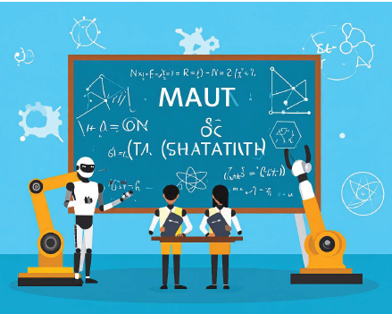

# 🔥 Reinforcement Learning Research Repository

## 🎯 Purpose

This repository exists to **study and experiment with reinforcement learning (RL)** through practical implementation.

Our goal is to build and apply RL techniques to intelligent self-control and self-discipline systems.

We explore a wide range of RL algorithms, environments, and control tasks — from Q-Learning to advanced transformer-based agents.

## My Codes

The repository of my scratch code is stored in next URL:

[Shinichi0713/Reinforce-Learning-Study: this is the codes which is in accordance with reinforcement-learning](https://github.com/Shinichi0713/Reinforce-Learning-Study)

On the other hand, I have LLM repository also.

[Shinichi0713/LLM-fundamental-study: this site is the fundamental page of LLM-mechanism](https://github.com/Shinichi0713/LLM-fundamental-study)

Please look.

# my work

I am writing a book on reinforcement learning.

The book is designed for beginners to learn reinforcement learning step by step, covering everything from the basics to practical applications.

It is published on Amazon Kindle, so please feel free to check it out if you are interested.

[Amazon.co.jp: 実践!強化学習入門: Pythonで動かしながら理解する AI学習書 (AI関係書籍) eBook : 3 Sons Lover: Kindleストア](https://www.amazon.co.jp/%E5%AE%9F%E8%B7%B5-%E5%BC%B7%E5%8C%96%E5%AD%A6%E7%BF%92%E5%85%A5%E9%96%80-Python%E3%81%A7%E5%8B%95%E3%81%8B%E3%81%97%E3%81%AA%E3%81%8C%E3%82%89%E7%90%86%E8%A7%A3%E3%81%99%E3%82%8B-AI%E5%AD%A6%E7%BF%92%E6%9B%B8-AI%E9%96%A2%E4%BF%82%E6%9B%B8%E7%B1%8D-ebook/dp/B0FH4VKHLJ)

## 📚 Contents

| Directory               | Description                                                            |
| ----------------------- | ---------------------------------------------------------------------- |
| **basic/**        | Fundamental reinforcement learning examples and core algorithm testing |
| **documents/**    | Notes and theory explanations for reinforcement learning               |
| **pole-problem/** | Code for pole-balancing experiments using RL                           |

### 🧠 Environments Used

* **OpenAI Gym**
* **Gymnasium / Classic Control environments**
* **Custom environments**

---

## 🚀 RL Projects & Experiments

### 🎾 Ball Catcher — Q-Learning Agent

Simple grid-based environment where a Q-Learning agent learns to catch a falling ball.

---

### 🤖 Cart-Pole — Deep Q Network (DQN)

Solving classical control with DQN.

---

### 🌀 Pendulum — Soft Actor-Critic (SAC)

Continuous-action control using SAC.

---

### 🚀 Lunar Lander — SAC vs DDPG

SAC succeeds; DDPG struggles in this task.

---

### 🦿 Robo-Walking — Actor-Critic

Walking behavior learned via Actor-Critic.

---

### 🏃 BipedalWalkerHardcore — SAC + Transformer Agent

#### ✓ SAC-based agent (MLP)

Works, but training is slow and exploration limited.

#### ✓ Transformer-based RL Agent

Transformer RL agent learns significantly faster — architecture matters!

---

### 📍 Traveling Salesman Problem (TSP)

PointerNet-based RL solver. Still experimental.

---

### 🏭 Job-Shop Scheduling Problem (JSSP)

Transformer + Actor-Critic to minimize job scheduling time.

---

### 🧪 Imitation Learning — Behavior Cloning

Evaluation of imitation learning effects; reward improves significantly with demonstrations.

---

### 🤝 Inverse RL — GAIL (Generative Adversarial Imitation Learning)

| Trial | Reward |
| ----- | ------ |
| 1     | 289.0  |
| 2     | 295.0  |
| 3     | 278.0  |

---

### 📦 Box Arrangement — DDQN

Deep Double Q-Learning to arrange objects in constrained space.

---

## ✍️ My Work — Reinforcement Learning Book

I published a beginner-friendly **practical reinforcement learning book** on Amazon Kindle.

It teaches RL step-by-step with Python code and real working examples.

👉 [Amazon Link](https://www.amazon.co.jp/%E5%AE%9F%E8%B7%B5-%E5%BC%B7%E5%8C%96%E5%AD%A6%E7%BF%92%E5%85%A5%E9%96%80-Python%E3%81%A7%E5%8B%95%E3%81%8B%E3%81%97%E3%81%AA%E3%81%8C%E3%82%89%E7%90%86%E8%A7%A3%E3%81%99%E3%82%8B-AI%E5%AD%A6%E7%BF%92%E6%9B%B8-AI%E9%96%A2%E4%BF%82%E6%9B%B8%E7%B1%8D-ebook/dp/B0FH4VKHLJ)

---

## 📎 Cited Projects

* **PyGame Learning Environment**

  [https://github.com/ntasfi/PyGame-Learning-Environment](https://github.com/ntasfi/PyGame-Learning-Environment)
* **DeepMind Research**

  [https://github.com/google-deepmind/deepmind-research](https://github.com/google-deepmind/deepmind-research)

## 🔗 References

Useful websites that supported learning and experimentation:

* AI-COMPASS — RL & AI insights

  [https://ai-compass.weeybrid.co.jp/](https://ai-compass.weeybrid.co.jp/)
* 星の本棚 — Reinforcement learning tips

  [https://yagami12.hatenablog.com/entry/2019/02/22/210608](https://yagami12.hatenablog.com/entry/2019/02/22/210608)
* 2025年のトレンド

  [強化学習のトレンド(2025年) | Reinforce-Learning-Study](https://shinichi0713.github.io/Reinforce-Learning-Study/trend_2025)
